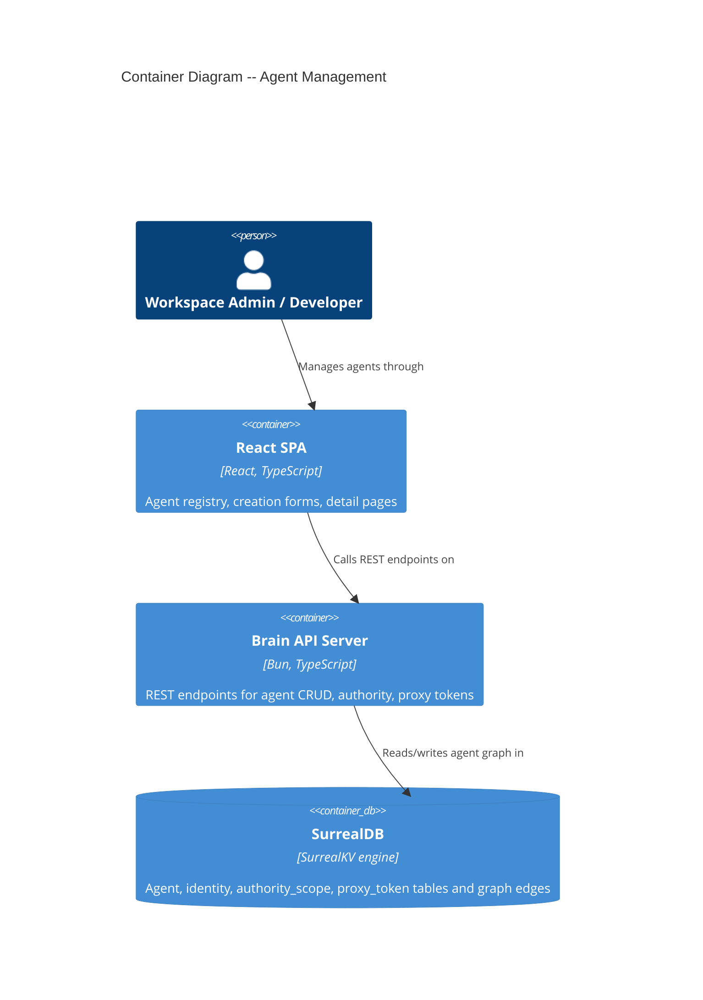

# Architecture Design: Agent Management

## System Context

The agent management feature adds a CRUD interface for workspace agents within the existing Osabio monolith. No new containers or external services are introduced. The feature extends the existing identity hub-spoke pattern, authority resolution, proxy token issuance, and SurrealDB graph schema.

### C4 System Context (L1)

```mermaid
C4Context
  title System Context -- Agent Management

  Person(admin, "Workspace Admin", "Manages agent fleet via web dashboard")
  Person(dev, "Developer", "Registers external agents, configures authority")

  System(osabio, "Osabio", "Knowledge graph operating system for autonomous organizations")

  System_Ext(ext_agent, "External Agent", "User-managed agent authenticating via proxy token")
  System_Ext(sandbox_env, "Sandbox Environment", "Isolated execution environment: local/e2b/daytona/docker")

  Rel(admin, osabio, "Creates, views, deletes agents via")
  Rel(dev, osabio, "Registers external agents, configures authority scopes via")
  Rel(brain, ext_agent, "Issues proxy tokens to")
  Rel(brain, sandbox_env, "Spawns sandbox sessions in")
```

### C4 Container (L2)



## Component Architecture

### New Backend Modules

All new code lives under `app/src/server/agents/` -- a new domain module following existing patterns (`learning/`, `policy/`, `objective/`).

| File | Responsibility |
|------|---------------|
| `agents/routes.ts` | Route handler factory: list, create, get, delete agent endpoints |
| `agents/queries.ts` | SurrealDB query functions: list agents, create transaction, delete transaction |
| `agents/types.ts` | Domain types: AgentRecord, CreateAgentInput, AgentListItem |

### New Frontend Modules

| File | Responsibility |
|------|---------------|
| `routes/agents-page.tsx` | Agent registry page with runtime grouping and filter tabs |
| `routes/agent-detail-page.tsx` | Agent detail: config, authority scopes, sessions |
| `routes/agent-create-page.tsx` | Multi-step creation form |
| `components/agent-card.tsx` | Agent card component (name, runtime badge, actions) |
| `components/authority-scope-form.tsx` | Action-permission matrix UI |
| `components/proxy-token-dialog.tsx` | One-time token display dialog |

### Modified Modules (Migration Impact)

| Module | File | Change |
|--------|------|--------|
| Schema | `surreal-schema.surql` | Add `runtime`, `name`, `sandbox_config` to agent; add `sandbox_provider` to workspace settings |
| Identity bootstrap | `workspace/identity-bootstrap.ts` | Set `runtime: "brain"` on template agents |
| Agent activator | `reactive/agent-activator.ts` | Query `runtime` instead of `agent_type` for agent matching |
| Authority resolution | `iam/authority.ts` | Resolve via `identity.role` (already works) + query by identity `authorized_to` edges (already works) |
| MCP auth | `mcp/auth.ts` | Replace `urn:osabio:agent_type` claim with `urn:osabio:role` or identity-based lookup |
| MCP token validation | `mcp/token-validation.ts` | Update claim type from `agent_type` to `role` |
| Auth config | `auth/config.ts` | Remove hardcoded `agent_type: "code_agent"` from token claims |
| Proxy policy evaluator | `proxy/policy-evaluator.ts` | Replace `agent_type` references with identity role lookup |
| Proxy route | `proxy/anthropic-proxy-route.ts` | Replace `agent_type` telemetry attribute with `agent_role` |
| Tools types | `tools/types.ts` | `AgentType` type remains as role alias during migration; no breaking change |
| Route registration | `runtime/start-server.ts` | Register agent CRUD routes |

## API Design

### Endpoints

All endpoints authenticated via Better Auth session (browser routes).

#### `GET /api/workspaces/:workspaceId/agents`

Lists all agents in workspace via graph traversal: `workspace <- member_of <- identity <- identity_agent -> agent`.

**Response**: `{ agents: AgentListItem[] }`

```
AgentListItem {
  id: string              // agent record ID
  name: string            // agent.name
  description?: string    // agent.description
  runtime: "brain" | "sandbox" | "external"
  model?: string          // agent.model
  identity_id: string     // linked identity ID
  created_at: string      // ISO datetime
}
```

#### `POST /api/workspaces/:workspaceId/agents`

Creates agent with atomic transaction. Returns created agent + proxy token (external only).

**Request body**:
```
{
  name: string
  description?: string
  runtime: "sandbox" | "external"       // "brain" rejected with 400
  model?: string
  sandbox_config?: {
    coding_agents?: string[]
    env_vars?: { key: string, value: string }[]
    image?: string        // cloud providers only; rejected for local provider
    snapshot?: string     // cloud providers only; rejected for local provider
  }
  authority_scopes?: { action: string, permission: "auto" | "propose" | "blocked" }[]
  // If omitted, all 11 actions default to "propose"
}
```

**Response** (201): `{ agent: AgentRecord, proxy_token?: string, workspace_id: string }`

The `proxy_token` field is present only for external agents and contains the raw token (shown once, `osp_` prefix). `workspace_id` is included so the UI can display connection instructions without a separate lookup.

**Error responses**:
- `400 { error: "invalid_runtime" }` — runtime is "brain" or invalid
- `400 { error: "sandbox_provider_not_configured" }` — sandbox agent but workspace has no provider
- `400 { error: "invalid_sandbox_config", message: "Image and snapshot are not supported for local provider" }` — local provider with image/snapshot fields
- `400 { error: "name_required" }` — empty or missing name
- `409 { error: "agent_name_not_unique" }` — name already exists in workspace

#### `GET /api/workspaces/:workspaceId/agents/check-name`

Pre-checks agent name availability for inline form validation.

**Query params**: `name` (string)

**Response**: `{ available: boolean }`

#### `GET /api/workspaces/:workspaceId/agents/:agentId`

Agent detail with linked identity, authority scopes, and session summary.

**Response**: `{ agent: AgentRecord, identity: IdentityRecord, authority_scopes: AuthorityScopeEntry[], sessions: SessionSummary[] }`

**R1 limitation**: The `sessions` list returns the 20 most recent sessions for the entire workspace (not filtered by agent), because `agent_session.agent` is currently a string field storing `agent_type`, not an agent record reference. Per-agent session filtering is deferred to R2 (US-08) when the `agent_session.agent` field is migrated. The UI should display sessions as "Recent workspace sessions" in R1, not "Sessions for this agent".

#### `DELETE /api/workspaces/:workspaceId/agents/:agentId`

Deletes agent, identity, and all edges in a transaction. Aborts active sessions first. Preserves session history (orphaned from agent).

**Request body**: `{ confirm_name: string }`

**Response**: `{ deleted: true, sessions_aborted: number }`

## Transaction Design: Atomic Agent Creation

SurrealDB transactions guarantee atomicity. The creation flow executes in a single `BEGIN TRANSACTION; ... COMMIT TRANSACTION;` block within one `.query()` call.

### Authority Scope Edge Mechanism

Custom agents do NOT use `authority_scope` seed data (those rows are keyed by `agent_type` for osabio agents only — see ADR-083). Instead, the `authorized_to` edges for custom agents store the permission directly on the edge, with `out` pointing to a synthetic scope identifier.

The 11 configurable actions (from the `authority_scope` schema ASSERT):
1. `create_decision` 2. `confirm_decision` 3. `create_task` 4. `complete_task`
5. `create_observation` 6. `acknowledge_observation` 7. `resolve_observation`
8. `create_question` 9. `create_suggestion` 10. `create_intent` 11. `submit_intent`

When no `authority_scopes` are provided in the request, the route handler defaults all 11 actions to `"propose"` (safe by default — agent suggests, human approves).

### Transaction Steps

```
BEGIN TRANSACTION;

-- 1. Validate name uniqueness within workspace
LET $existing = (SELECT id FROM agent WHERE name = $name AND id IN (
  SELECT VALUE out FROM identity_agent WHERE in IN (
    SELECT VALUE id FROM identity WHERE workspace = $ws
  )
));
IF array::len($existing) > 0 { THROW "agent_name_not_unique" };

-- 2. Validate sandbox provider (if runtime = "sandbox")
-- Application layer checks workspace.settings.sandbox_provider before entering transaction.
-- If not configured, return 400 { error: "sandbox_provider_not_configured" } before transaction.

-- 3. Validate sandbox_config fields (if runtime = "sandbox")
-- Application layer checks: if provider = "local", reject image/snapshot fields with
-- 400 { error: "invalid_sandbox_config", message: "Image and snapshot are not supported for local provider" }

-- 4. Create agent record
CREATE $agentRecord CONTENT {
  name: $name, runtime: $runtime, description: $description,
  model: $model, sandbox_config: $sandboxConfig, created_at: time::now()
};

-- 5. Create identity record
CREATE $identityRecord CONTENT {
  name: $name, type: "agent", role: "custom",
  identity_status: "active", workspace: $ws, created_at: time::now()
};

-- 6. Create identity_agent edge
RELATE $identityRecord -> identity_agent -> $agentRecord SET added_at = time::now();

-- 7. Create member_of edge
RELATE $identityRecord -> member_of -> $ws SET role = "agent", added_at = time::now();

-- 8. Create authorized_to edges (one per action-permission pair)
-- For each of the 11 actions with their configured permission:
RELATE $identityRecord -> authorized_to -> $scopeRecord
  SET permission = $perm, action = $action, created_at = time::now();
-- $scopeRecord: looked up from authority_scope by action (shared reference records).
-- The permission on the edge overrides any default on the target scope record.

-- 9. For external agents: generate and store proxy token (inside transaction)
-- Token is generated with crypto.randomBytes, hashed with SHA-256, stored in proxy_token table.
-- Including token creation in the transaction ensures no agent exists without credentials.
CREATE $proxyTokenRecord CONTENT {
  identity: $identityRecord, token_hash: $hash,
  created_at: time::now(), revoked: false
};

COMMIT TRANSACTION;
```

The proxy token plaintext is returned in the HTTP response (shown once). The hash is stored. Including the token write in the transaction ensures atomicity — if any step fails, neither the agent nor its credentials exist.

### Name Uniqueness Validation

Name uniqueness is enforced both at creation time (server-side, within the transaction) and as a pre-check for inline UI feedback:

- **Pre-check endpoint**: `GET /api/workspaces/:workspaceId/agents/check-name?name=...` — returns `{ available: boolean }`. Used by the creation form for inline validation as the user types.
- **Transaction enforcement**: The `IF array::len($existing) > 0 { THROW }` inside the transaction is the authoritative check, guarding against TOCTOU races between the pre-check and creation.
- **Error response**: If the transaction THROW fires, the route handler returns `409 Conflict` with `{ error: "agent_name_not_unique", message: "An agent named '...' already exists in this workspace" }`.

## Schema Design

### Migration 0081: Agent Runtime and Name Fields

```sql
BEGIN TRANSACTION;

-- Add runtime field (replaces agent_type)
DEFINE FIELD OVERWRITE runtime ON agent TYPE string
  ASSERT $value IN ['brain', 'sandbox', 'external'];

-- Add name field to agent
DEFINE FIELD OVERWRITE name ON agent TYPE string;

-- Add sandbox_config for sandbox agents
DEFINE FIELD OVERWRITE sandbox_config ON agent TYPE option<object>;
DEFINE FIELD OVERWRITE sandbox_config.coding_agents ON agent TYPE option<array<string>>;
DEFINE FIELD OVERWRITE sandbox_config.env_vars ON agent TYPE option<array<object>>;
DEFINE FIELD OVERWRITE sandbox_config.env_vars[*].key ON agent TYPE string;
DEFINE FIELD OVERWRITE sandbox_config.env_vars[*].value ON agent TYPE string;
DEFINE FIELD OVERWRITE sandbox_config.image ON agent TYPE option<string>;
DEFINE FIELD OVERWRITE sandbox_config.snapshot ON agent TYPE option<string>;
DEFINE FIELD OVERWRITE sandbox_config.model ON agent TYPE option<string>;

-- Add workspace-scoped name uniqueness index on agent
-- Note: uniqueness is enforced at the application level via graph traversal
-- (agent has no direct workspace field; workspace is resolved through identity edges)

-- Backfill runtime from agent_type
UPDATE agent SET runtime = IF agent_type IN ['code_agent', 'mcp'] THEN 'external'
  ELSE IF agent_type = 'observer' OR agent_type = 'chat_agent' OR agent_type = 'architect' OR agent_type = 'management' OR agent_type = 'design_partner' THEN 'brain'
  ELSE 'brain'
END;

-- Backfill name from identity (via identity_agent edge)
-- Osabio agents get their identity name
UPDATE agent SET name = (SELECT VALUE in.name FROM identity_agent WHERE out = $parent.id LIMIT 1)[0]
  WHERE name IS NONE OR name = '';

COMMIT TRANSACTION;
```

### Migration 0082: Workspace Sandbox Provider Setting

```sql
BEGIN TRANSACTION;

DEFINE FIELD OVERWRITE settings.sandbox_provider ON workspace TYPE option<string>
  ASSERT $value = NONE OR $value IN ['local', 'e2b', 'daytona', 'docker'];

COMMIT TRANSACTION;
```

### Migration 0083: Remove agent_type Field (deferred to R3)

This migration is intentionally deferred until all 8 consuming modules have been updated. During the transition period, both `agent_type` and `runtime` coexist. The `agent_type` field is kept with its ASSERT removed (made permissive) so existing code continues to function.

```sql
BEGIN TRANSACTION;

-- Make agent_type optional and permissive during transition
DEFINE FIELD OVERWRITE agent_type ON agent TYPE option<string>;

COMMIT TRANSACTION;
```

Final removal (post-R3):
```sql
BEGIN TRANSACTION;
REMOVE FIELD agent_type ON agent;
COMMIT TRANSACTION;
```

## Migration Strategy

The migration follows a parallel-write / incremental-read pattern across 3 releases:

### R1 (Walking Skeleton)
1. Migration 0081 adds `runtime`, `name`, `sandbox_config` fields
2. Migration 0082 adds workspace sandbox provider setting
3. Identity bootstrap writes both `agent_type` and `runtime` for osabio agents
4. New agent CRUD writes `runtime` only (no `agent_type` for custom agents)
5. Agent list endpoint reads `runtime` field
6. Authority resolution continues using `identity.role` + `authorized_to` edges (no change needed)

### R2 (Sandbox Agents)
1. Agent activator updated to query `runtime` instead of `agent_type`
2. MCP auth updated to use identity-based role lookup instead of `agent_type` claim
3. Proxy policy evaluator updated to use identity role

### R3 (Cleanup)
1. Migration 0083 makes `agent_type` optional
2. Auth config removes hardcoded `agent_type` from token claims
3. All 8 modules verified to use `runtime` or `identity.role`
4. Final migration removes `agent_type` field entirely

## Authority Model

Custom agents (sandbox/external) use the existing `authorized_to` relation edge system (ADR-020). The resolution path in `authority.ts` already supports this:

1. **Layer 1**: Check if identity type is "human" — bypass (no change)
2. **Layer 2**: Check `authorized_to` edges from identity — **this is where custom agent permissions live**
3. **Layer 3**: Check `authority_scope` by `identity.role` + workspace — for `role = "custom"`, no seed data exists, so this falls through
4. **Layer 4**: Check `authority_scope` by `agent_type` + workspace — custom agents have no `agent_type`, falls through
5. **Layer 5**: Check global `authority_scope` defaults — final fallback returns `"blocked"`

Custom agents get `identity.role = "custom"`. Their specific permissions come from `authorized_to` edges created during the creation transaction. Since Layer 2 is checked first, per-agent overrides take precedence. For any action without an explicit `authorized_to` edge, the fallback chain resolves to `"blocked"` (safe default).

### Configurable Actions (11 total)

The following actions can be configured per agent. When not specified at creation, all default to `"propose"`:

| Action | Default | Description |
|--------|---------|-------------|
| `create_decision` | propose | Create provisional decisions |
| `confirm_decision` | propose | Confirm decisions (finalize) |
| `create_task` | propose | Create tasks |
| `complete_task` | propose | Mark tasks complete |
| `create_observation` | propose | Create observations (risks, conflicts) |
| `acknowledge_observation` | propose | Acknowledge observations |
| `resolve_observation` | propose | Close resolved observations |
| `create_question` | propose | Create open questions |
| `create_suggestion` | propose | Create proactive suggestions |
| `create_intent` | propose | Create intents (structured action requests) |
| `submit_intent` | propose | Submit intents for authorization |

No changes to `authority.ts` are required for R1. The existing resolution chain handles custom agents via Layer 2 (`authorized_to` edges).

## Observability

New spans follow the wide-event pattern:

| Span | Attributes |
|------|-----------|
| `brain.agents.list` | `workspace.id`, `agent.count`, `duration_ms` |
| `brain.agents.create` | `workspace.id`, `agent.runtime`, `agent.name`, `agent.identity_id`, `authority_scope.count`, `error` (bool), `duration_ms` |
| `brain.agents.delete` | `workspace.id`, `agent.id`, `agent.runtime`, `sessions_aborted`, `duration_ms` |

## Quality Attribute Strategies

### Performance (NFR-1)
- Agent list query uses single graph traversal in one `.query()` call (no N+1)
- Session list uses indexed query on `agent_session.workspace` + status
- Page loads target < 2s for 50 agents

### Security (NFR-2)
- Proxy tokens use existing `proxy-token-core.ts` (SHA-256 hashing, `osp_` prefix, 64 hex chars)
- All endpoints require Better Auth session
- Delete requires name confirmation (destructive action safety)

### Reliability (NFR-3)
- 5-step creation wrapped in SurrealDB transaction (atomic)
- Delete wrapped in transaction with active session abort
- No orphaned records on failure

### Maintainability
- New `agents/` module follows existing domain module pattern
- Shared types in `agents/types.ts`
- Queries isolated in `agents/queries.ts` for testability

### Testability
- Pure query builders in `agents/queries.ts` -- unit testable
- Acceptance tests: agent creation transaction, deletion with sessions, name uniqueness
- Proxy token generation reuses existing `proxy-token-core.ts` (already tested)

## Deployment

No infrastructure changes. The feature deploys as part of the existing Osabio monolith. Schema migrations applied via `bun migrate` before server restart.

## Architectural Enforcement

Recommended enforcement tooling for the agent module boundaries:

- **Import constraints**: Use `dependency-cruiser` (MIT license) to enforce that `agents/` does not import from `chat/`, `extraction/`, or other domain modules directly. Only shared utilities (`http/`, `telemetry/`, `runtime/`) and `graph/` queries are allowed imports.
- **Schema validation**: Acceptance tests verify SCHEMAFULL compliance by attempting invalid field writes.
- **Transaction integrity**: Acceptance tests verify atomicity by checking for partial records after simulated failures.

## External Integration Annotations

No new external integrations are introduced by this feature. The proxy token issuance reuses the existing `proxy-token-core.ts` module. External agents authenticate through the existing LLM proxy (`proxy/anthropic-proxy-route.ts`), which already has contract coverage.
