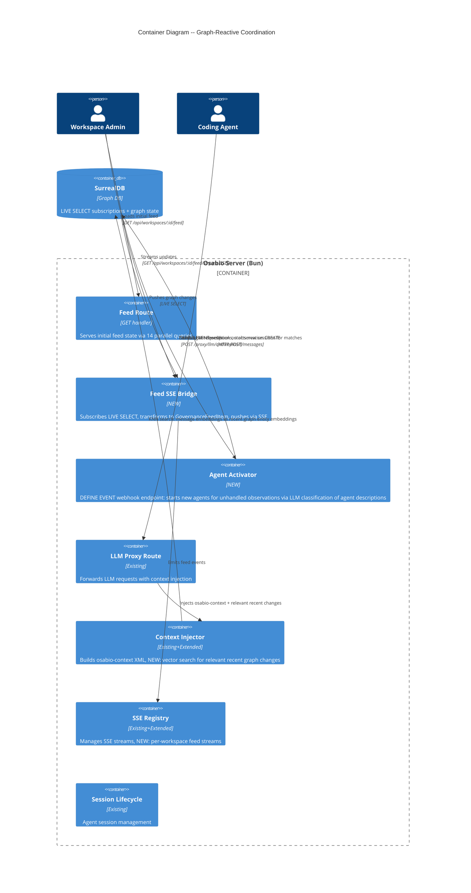
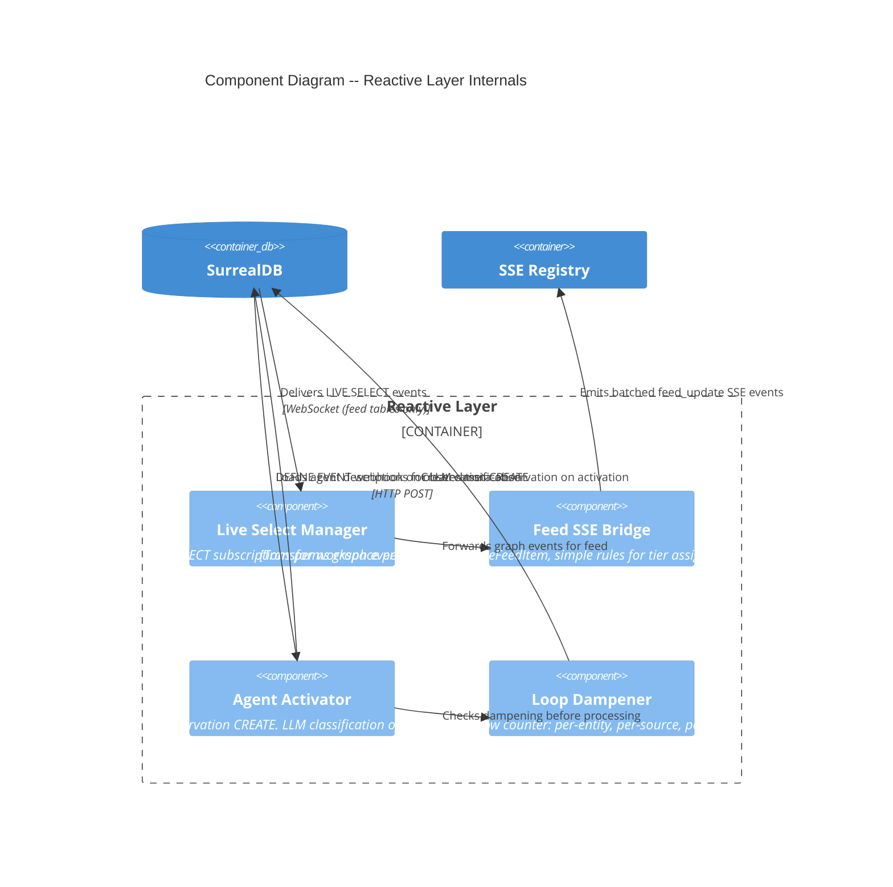

# Graph-Reactive Agent Coordination -- Architecture

## System Context

Osabio is a knowledge graph platform where agents coordinate through shared state in SurrealDB. Today, the governance feed is poll-on-load (14 parallel queries per page load), agents discover context changes only at session start, and conflict detection relies on periodic Observer scans.

This feature replaces poll-based reactivity with push-based coordination powered by SurrealDB LIVE SELECT, enabling:
- Real-time governance feed updates via SSE
- Automatic agent context injection when graph state changes mid-session
- Immediate conflict notification to affected agents

## Confirmed Architecture Decisions (Pre-Existing)

These are NOT open for re-decision:

1. SurrealDB LIVE SELECT as event source for feed (push-based, native to stack)
2. Agent Activator uses LLM classification to decide which agents to start for observations (ADR-061)
3. Proxy enriches running agents via vector search (new message embeddings → KNN against recent graph entity embeddings)
4. LLM proxy injects as `<urgent-context>` / `<context-update>` XML blocks
5. Never cancel current generation -- interrupts wait for next turn
6. Loop dampening: >3 events on same entity from same source in 60s
7. Feed SSE bridge uses simple rules for tier assignment (display concern only -- not routing)
8. WebSocket transport already in use for SurrealDB connection
9. No `context_queue` table -- the graph IS the delivery mechanism

## C4 System Context (L1)

```mermaid
C4Context
  title System Context -- Graph-Reactive Agent Coordination

  Person(admin, "Workspace Admin", "Monitors agent activity via governance feed")
  Person(coder, "Coding Agent (MCP)", "Works on tasks via LLM proxy")

  System(osabio, "Osabio Platform", "Knowledge graph + agent coordination")

  System_Ext(surrealdb, "SurrealDB", "Graph database with LIVE SELECT")
  System_Ext(anthropic, "Anthropic API", "LLM provider")

  Rel(admin, osabio, "Views live feed via SSE")
  Rel(coder, osabio, "Sends LLM requests via proxy")
  Rel(brain, surrealdb, "Subscribes to graph changes via LIVE SELECT")
  Rel(brain, surrealdb, "Reads/writes graph state via queries")
  Rel(brain, anthropic, "Forwards LLM requests with injected context")
```

## C4 Container (L2)



## C4 Component (L3) -- Reactive Layer

The reactive layer is complex enough (5+ internal components) to warrant L3 detail.



## Component Boundaries

### New Modules

| Module | Path | Responsibility |
|--------|------|---------------|
| Live Select Manager | `app/src/server/reactive/live-select-manager.ts` | Create/manage LIVE SELECT subscriptions per workspace for feed tables only. Uses existing `surreal` WebSocket connection. |
| Feed SSE Bridge | `app/src/server/reactive/feed-sse-bridge.ts` | Subscribes to graph events via Live Select Manager, simple rules for feed tier assignment (display only), transforms to `GovernanceFeedItem`, batches within 500ms window, pushes via SSE registry. |
| Agent Activator | `app/src/server/reactive/agent-activator.ts` | POST endpoint handler called by SurrealDB DEFINE EVENT webhook on observation CREATE. LLM classification (observation text + agent descriptions → fast model judges which agents can act, ADR-061), starts new agent sessions. Skips observations targeting entities with active agent sessions (proxy handles those — ADR-059). |
| Loop Dampener | `app/src/server/reactive/loop-dampener.ts` | Pure function + state container: sliding window event counter. Threshold check returns dampen/allow. |

### Extended Existing Modules

| Module | Path | Change |
|--------|------|--------|
| SSE Registry | `app/src/server/streaming/sse-registry.ts` | Add per-workspace stream management (current: per-message only). New methods: `registerWorkspaceStream`, `emitWorkspaceEvent`, `handleWorkspaceStreamRequest`. |
| Context Injector | `app/src/server/proxy/context-injector.ts` | Add `buildRecentChangesXml()`. Vector search: new message embeddings → KNN against recent graph entity embeddings. Injects relevant changes as `<urgent-context>` / `<context-update>` XML blocks. |
| Anthropic Proxy Route | `app/src/server/proxy/anthropic-proxy-route.ts` | Wire `loadRelevantGraphChanges()` into context injection pipeline. |
| Start Server | `app/src/server/runtime/start-server.ts` | Register agent activator webhook endpoint and feed stream SSE endpoint. Start Live Select Manager for feed. |
| MCP Route | `app/src/server/mcp/mcp-route.ts` | Extend context endpoint to include `urgent_updates` and `context_updates` arrays from vector-searched relevant graph changes. |

## Technology Stack

| Technology | Purpose | License | Rationale |
|------------|---------|---------|-----------|
| SurrealDB LIVE SELECT | Push-based graph change notifications | BSL 1.1 | Already in stack. Native to DB. No additional dependency. |
| SurrealDB JS SDK v2 | LIVE SELECT subscription API | MIT | Already in stack (`surrealdb` package). Provides `surreal.live()` method. |
| Bun ReadableStream | SSE transport | MIT | Already in stack. Used by existing SSE registry. |
| EventSource (browser) | Client SSE consumption | Web standard | Already used by orchestrator stream client. |

No new dependencies required. All components use existing stack.

## Integration Patterns

### 1. LIVE SELECT Subscription

The Live Select Manager uses the existing `surreal` WebSocket connection for LIVE SELECT subscriptions.

**Subscribed tables** (workspace-scoped):
- `decision` -- status transitions (confirmed, superseded)
- `task` -- status transitions (blocked, done, in_progress)
- `observation` -- creation (all severities)
- `question` -- creation (high priority)
- `suggestion` -- creation
- `learning` -- creation (pending approval)
- `agent_session` -- status transitions (ended, error)

**Excluded tables** (too high volume):
- `trace` -- uses existing DEFINE EVENT webhooks
- `message` -- not relevant for governance feed
- `extracted_from` -- relation table, high write volume

**SurrealDB v3.0 LIVE SELECT constraint**: WHERE clauses do not support bound parameters. Workspace filtering must happen application-side after receiving the event, not in the LIVE SELECT query itself.

### 2. Event Routing

LIVE SELECT events are routed by the Live Select Manager to two consumers:
- **Feed SSE Bridge**: all graph events → simple tier rules (display only) → SSE to browser
- **Agent Coordinator**: observation events only → vector search against agent embeddings → invoke matched agents

There is no standalone event classifier. Routing is semantic (vector search) for agents and simple (entity type + severity) for feed display.

### 3. Feed SSE Bridge -> Client

```
Classified event (level=log, target=feed)
  |
  v
Feed SSE Bridge
  |-- Transforms to GovernanceFeedItem (same contract as GET endpoint)
  |-- Batches within 500ms window (prevents burst flooding)
  |-- Assigns monotonic event ID
  |
  v
SSE Registry (per-workspace stream)
  |
  v
EventSource (browser)
  |-- Merges into client-side feed state
  |-- Deduplicates by item.id
  |-- Updates tier counts
```

**SSE event format**:
```
id: <monotonic-event-id>
event: feed_update
data: { "items": GovernanceFeedItem[], "removals": string[] }
```

`removals` contains IDs of items that moved tiers or were resolved (e.g., decision confirmed removes it from blocking tier).

### 4. Agent Activator: Observation → Start New Agents (DEFINE EVENT Webhook)

```
SurrealDB observation CREATE
  |
  v
DEFINE EVENT activator_observation_created (fires ASYNC RETRY 3)
  |-- WHERE: excludes source_agent="agent_activator"
  |
  v
POST /api/internal/activator/observation (HTTP webhook)
  |-- Checks loop dampener (skip if dampened)
  |-- Checks if target entity has active agent session (skip if covered — proxy handles, ADR-059)
  |-- Loads registered agent descriptions for workspace
  |-- LLM classification (fast model): observation text + agent descriptions → which agents can act? (ADR-061)
  |-- Validates returned agent IDs against registered agents
  |-- Starts new agent sessions for classified matches (triggered_by = observation)
```

Uses the same DEFINE EVENT webhook pattern as the existing 8 observer webhooks (session_ended, task_completed, decision_confirmed, etc.). The activator is a POST endpoint, not an always-on LIVE SELECT listener. No subscription management, no application-side filtering — the EVENT condition handles it.

### 5. Proxy: Context Enrichment (Vector Search)

```
LLM Proxy receives API call for session xyz
  |-- Context Injector takes the current message content
  |-- Embeds the message (or uses existing embedding from extraction)
  |-- KNN search: message embedding vs recent graph entity embeddings
  |   (scoped to workspace, filtered to entities updated since last_request_at)
  |-- Relevant changes injected as:
  |     high similarity → <urgent-context> (before <osabio-context>)
  |     moderate similarity → <context-update> (after <osabio-context>)
  |-- Updates session's last_request_at timestamp
```

No `context_queue` table. No deterministic classifier. The graph is the single source of truth. Relevance is determined by semantic similarity. Multiple agents on related tasks see the same changes.

### 6. Reconnection Protocol

| Disconnection Duration | Strategy |
|------------------------|----------|
| < 10 minutes | Delta sync: replay events from `Last-Event-ID` |
| >= 10 minutes | Full refresh: trigger GET /api/workspaces/:id/feed reload |

Server maintains a bounded event buffer (last 1000 events per workspace, ~10 minutes at typical volume) for delta replay.

## Schema Changes

No new tables. Changes to existing tables:

```sql
-- Track when proxy last enriched this session's context
DEFINE FIELD OVERWRITE last_request_at ON agent_session TYPE option<datetime>;

-- Track which entity caused the activator to start this session (polymorphic)
DEFINE FIELD OVERWRITE triggered_by ON agent_session TYPE option<record<observation | task | decision | question>>;

-- Agent description embedding (kept for future use, no longer used by activator — ADR-061)
DEFINE FIELD OVERWRITE description_embedding ON agent TYPE option<array<float>>;
DEFINE INDEX OVERWRITE idx_agent_desc_embedding ON agent FIELDS description_embedding
  HNSW DIMENSION 1536 DIST COSINE;

-- Agent description (text) — used by LLM classification in the activator
DEFINE FIELD OVERWRITE description ON agent TYPE option<string>;
```

The activator loads agent descriptions as text and sends them to a fast LLM (Haiku) for classification (ADR-061). The proxy uses message/entity embeddings already produced by the extraction pipeline for vector search context enrichment.

## Deployment Architecture

No new services. All components run in-process within the existing Bun server:

- **Live Select Manager**: Started in `startServer()` after Surreal connection is established. Uses the existing `surreal` WebSocket connection for LIVE SELECT subscriptions (feed tables only).
- **Agent Activator**: POST endpoint registered in `startServer()`. Called by SurrealDB DEFINE EVENT webhook when observations are created. Not an always-on listener — activates on demand via HTTP. Skips observations with active agent coverage (ADR-059).
- **Feed SSE Bridge**: Started per-workspace on first SSE connection. Stopped when last client disconnects (with 30s grace period).
- **Loop Dampener**: In-memory state owned by the Agent Activator instance. State is per-workspace, per-entity, per-source-agent. Not persisted -- resets on server restart (acceptable: dampening is short-lived).

## Quality Attribute Strategies

### Performance
- Agent activation: LLM classification via fast model (Haiku), ~200-500ms per activation (async, non-blocking)
- Feed SSE delivery: < 2 seconds from graph write (95th percentile)
- 500ms batching window prevents client-side event flooding
- LIVE SELECT runs on existing WS connection (SurrealDB SDK multiplexes)

### Reliability
- SSE keep-alive every 15 seconds prevents connection timeout
- Delta sync on reconnection (< 10 min gap)
- Full refresh on extended disconnection (>= 10 min gap)
- Loop dampener prevents cascading notification storms
- Agent Activator is fail-safe: if it crashes, agents still work (new sessions just won't be started for unhandled observations)

### Maintainability
- Agent routing is LLM-judged — add new agent types without updating rules or tuning thresholds
- Feed SSE Bridge reuses existing `GovernanceFeedItem` contract -- no schema drift
- No separate messaging table -- graph is the single source of truth for both activator and proxy
- All new modules in `app/src/server/reactive/` -- clear module boundary

### Security
- Feed SSE endpoint (`/api/workspaces/:id/feed/stream`) scoped to workspace ID in URL path -- same access model as existing GET feed endpoint
- Proxy graph queries are scoped to session's task dependencies (proxy already resolves session from authenticated request)
- LIVE SELECT events are filtered application-side by workspace (SurrealDB v3.0 LIVE SELECT does not support WHERE with bound params) -- classifier discards events for non-matching workspaces before any processing
- No new authentication mechanisms -- all new endpoints use existing auth middleware

### Observability
- Log every LIVE SELECT subscription start/stop
- Log every activator LLM classification (observation, matched agents, reasons)
- Log every proxy context injection (relevant changes found, similarity scores)
- Log loop dampener activations (+ meta-observation in graph)
- SSE connection status tracked per workspace

## Migration Path

### Phase 3: Foundation (US-GRC-01)
1. Build Live Select Manager with workspace-scoped subscriptions (uses existing `surreal` connection)
2. Build Feed SSE Bridge with simple tier rules and 500ms batching
3. Extend SSE Registry for per-workspace streams
4. Register SSE endpoint: `GET /api/workspaces/:id/feed/stream`

### Phase 4: Agent Activator (US-GRC-03)
1. Migration: Add `last_request_at` field to `agent_session`, add `description_embedding` field + HNSW index to `agent` table
2. Migration: Add `DEFINE EVENT coordinator_observation_routed ON observation` webhook
3. Build Agent Activator as POST endpoint handler (observation → KNN against agent description embeddings → start new agent sessions). Skip observations with active coverage (ADR-059).
4. Build Loop Dampener
5. Register activator endpoint in `startServer()`

### Phase 5: Delivery (US-GRC-04)
1. Extend `context-injector.ts` with `buildRelevantChangesXml()` — vector search: message embeddings → KNN against recent graph entity embeddings (scoped to workspace, filtered to updates since `last_request_at`)
2. Similarity threshold determines urgency: high → `<urgent-context>`, moderate → `<context-update>`
3. Extend MCP context endpoint with same logic (structured arrays instead of XML)
4. Update `agent_session.last_request_at` on each proxy request
