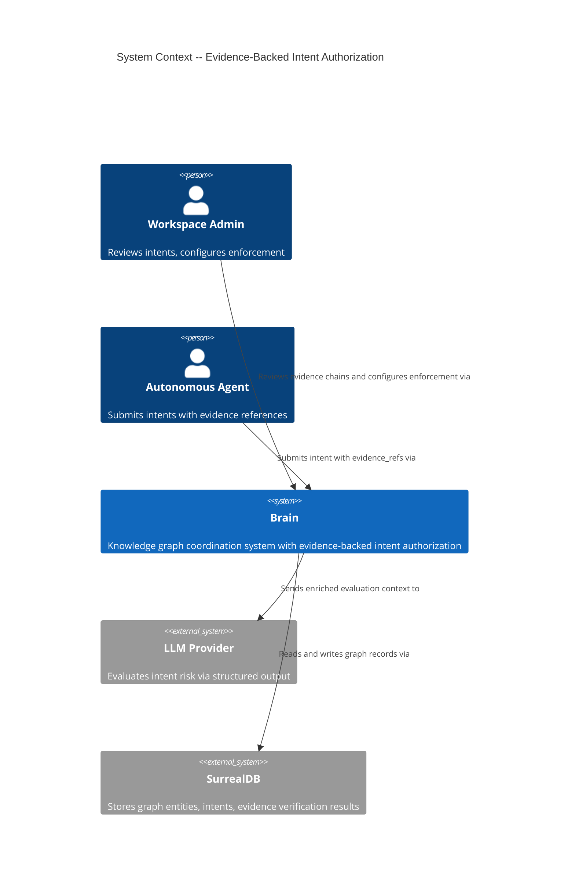
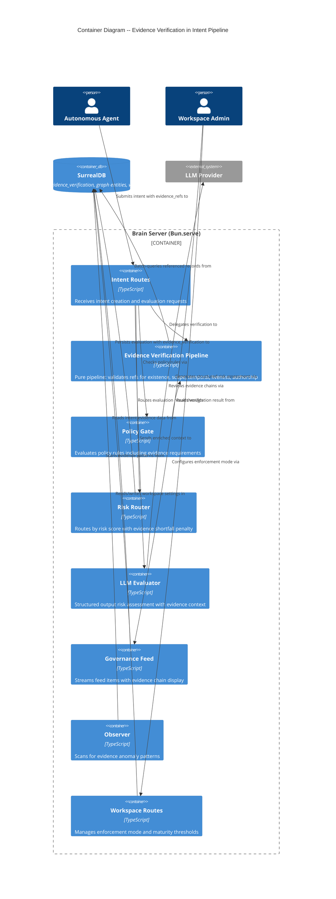
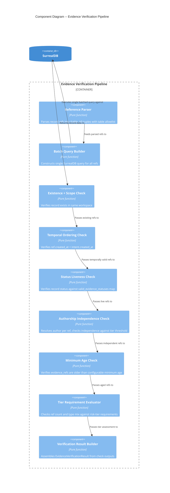

# Architecture Design: Evidence-Backed Intent Authorization

## System Context

Evidence-backed intent authorization adds a **deterministic verification layer** to the existing intent evaluation pipeline. When an autonomous agent submits an authorization request (intent), it must provide typed references to existing graph records as evidence. The system verifies these references before the LLM evaluator runs, ensuring authorization decisions are grounded in verifiable system state rather than fabricated free-text reasoning.

### Capabilities

1. **Evidence Submission**: Agents attach `evidence_refs` (typed polymorphic record references) when creating intents
2. **Deterministic Verification**: A pure pipeline verifies each reference for existence, workspace scope, temporal ordering, and status liveness in a single batched SurrealDB query
3. **Risk Score Adjustment**: Evidence shortfall increases risk score (soft enforcement) or rejects pre-LLM (hard enforcement)
4. **Authorship Independence**: Detects self-referencing loops where an agent cites only its own authored records
5. **Risk-Tiered Requirements**: Evidence requirements scale with risk tier (low: 1 any, medium: 2+ with decision/task, high: 3+ with decision AND task/observation)
6. **Enforcement Graduation**: Bootstrap (exempt) -> soft (penalty) -> hard (reject) enforcement modes per workspace
7. **Governance Visibility**: Feed displays evidence chains with verification status for human reviewers
8. **Policy-Driven Overrides**: Workspace admins define per-action evidence rules via the existing policy system
9. **Anomaly Detection**: Observer detects systematic evidence fabrication patterns

## C4 System Context (L1)



## C4 Container (L2)



## C4 Component (L3) -- Evidence Verification Pipeline

The evidence verification pipeline is the most complex new subsystem (5+ internal stages). It deserves L3 decomposition.



## Pipeline Integration Point

The evidence verification pipeline inserts into the existing `evaluateIntent` function between the policy gate and the LLM evaluator. The current pipeline:

```
draft -> pending_auth -> [policy gate ~5ms] -> [LLM evaluation ~2-5s] -> routing
```

Becomes:

```
draft -> pending_auth -> [policy gate ~5ms] -> [evidence verification ~10-30ms] -> [hard enforcement gate] -> [LLM evaluation (with evidence context) ~2-5s] -> [risk router (with evidence penalty)] -> routing
```

Key architectural decisions about this integration:

1. **Evidence verification runs AFTER policy gate**: Policy gate is the cheapest check (~5ms). If policy rejects, skip evidence verification entirely.
2. **Evidence verification runs BEFORE LLM evaluator**: Verification results enrich LLM context AND enable hard enforcement to reject pre-LLM.
3. **Hard enforcement is a gate before LLM**: Under hard enforcement, insufficient evidence rejects the intent immediately -- the expensive LLM call never happens.
4. **Soft enforcement adjusts risk score AFTER LLM**: The risk router applies the evidence shortfall penalty to the LLM's risk score.
5. **Enforcement mode is read from workspace at evaluation time**: Not at intent creation time (enforcement could change between creation and evaluation).

## Quality Attribute Strategies

### Performance (p95 < 100ms, p99 < 500ms verification latency)

- Single batched SurrealDB query for all evidence refs (max 10 refs per intent)
- Pure pipeline with zero additional DB round-trips after the batch query
- Authorship resolution included in the same batch query via record joins
- OpenTelemetry span attribute `evidence.verification_time_ms` for monitoring

### Security (zero false negatives on deterministic checks)

- Deterministic checks are complete: existence, workspace scope, temporal ordering, status liveness
- Table allowlist prevents referencing internal-only tables (e.g. `identity`, `proxy_token`)
- Authorship independence prevents self-referencing attack vector
- Minimum evidence age prevents create-and-reference timing exploits
- Hard enforcement provides a non-bypassable gate before LLM evaluation

### Reliability (< 2% false rejection rate)

- Graduated enforcement: bootstrap -> soft -> hard avoids cold-start problems
- Soft enforcement only adds risk score penalty, never blocks
- `valid_evidence_statuses` map is comprehensive and covers all entity lifecycle states
- Low-risk intents have minimal requirements (1 ref of any type)

### Maintainability

- Pure pipeline functions with explicit input/output types -- fully unit-testable
- Evidence verification is a new module (`intent/evidence-verification.ts`), not scattered changes
- Single integration point in `evaluateIntent` (authorizer.ts)
- All constants (tier thresholds, valid statuses, penalties) in a single constants file

### Auditability

- `evidence_verification` result stored on intent record alongside `evaluation`
- Every failed ref identified by ID in `failed_refs` array
- Verification time recorded for latency monitoring
- Observer scans for anomaly patterns (spam, self-referencing, timing clusters)

### Observability

- Wide-event span attribute `evidence.verification_time_ms` on intent evaluation traces
- Span attributes: `evidence.ref_count`, `evidence.verified_count`, `evidence.failed_count`
- Span attribute `evidence.enforcement_mode` (bootstrap/soft/hard)
- Span attribute `evidence.tier_met` (boolean)

## Architecture Enforcement

Style: Modular within existing monolith (ports-and-adapters pattern already in use)
Language: TypeScript
Tool: dependency-cruiser (already applicable to this codebase)

Rules to enforce:
- Evidence verification pipeline has zero imports from LLM/AI SDK modules (pure deterministic pipeline)
- Evidence verification pipeline has zero imports from HTTP/routing modules
- Evidence verification result type is the sole contract between pipeline and risk router
- Workspace enforcement config flows through function parameters, never read from module-level state

## Error Handling Strategy

### Batch Query Failure

If the SurrealDB batch query fails (connection error, timeout, malformed query):

- **Soft enforcement**: Fail-open. Return a degraded `EvidenceVerificationResult` with `verified_count: 0`, `warnings: ["verification unavailable: {error}"]`. The intent proceeds to LLM evaluation without evidence context. Risk router applies maximum evidence shortfall penalty, routing the intent to veto window for human review.
- **Hard enforcement**: Fail-closed. Reject the intent with `error_reason: "Evidence verification unavailable"`. Authorization without evidence verification is not permitted under hard enforcement.
- **Bootstrap enforcement**: Fail-open. Evidence is not required, so verification failure is informational only.

This follows the project's "fail fast" principle for hard enforcement while maintaining availability under soft enforcement.

### Invalid Ref Format

If any evidence_ref fails parsing (invalid table or malformed ID), it is counted as a failed ref in the verification result. The pipeline continues processing remaining refs. Invalid refs are listed in `failed_refs` with a "parse_error:" prefix.

### Empty Evidence Refs

If `evidence_refs` is empty or omitted, the pipeline returns immediately with `verified_count: 0` and the enforcement mode determines behavior (bootstrap/soft: proceed with penalty; hard: reject if tier requires evidence).

## MCP Tool Surface: Agent-Facing Evidence Contract

The `create_intent` MCP tool (`brain-tool-definitions.ts`) is the sole entry point through which agents submit evidence. The tool definition serves dual purposes:

1. **Input schema** (`createIntentSchema`): Adds optional `evidence_refs` parameter — an array of `table:id` strings referencing graph entities that justify the intent.
2. **Tool description** (`CREATE_INTENT_TOOL`): The description is the **only guidance agents receive** about evidence submission. It must explain what evidence_refs are, which entity types are valid, and that evidence quality affects authorization routing.

### Why this matters architecturally

Without updated tool descriptions, agents will never provide `evidence_refs` — making the entire evidence verification pipeline dead code. The tool description is a critical integration point, not documentation.

### Context delivery via proxy `<brain-context>` block

The proxy injects a `<brain-context>` XML block into the agent's system prompt via `buildBrainContextXml()` in `context-injector.ts`, orchestrated by `anthropic-proxy-route.ts`. Currently this block contains `<decisions>`, `<learnings>`, and `<observations>` sections. A new `<workspace-settings>` section should include the workspace's current `evidence_enforcement` mode (`bootstrap`, `soft`, `hard`). The context cache (`context-cache.ts`) needs to fetch and cache the workspace enforcement mode alongside existing context candidates. This enables agents to:
- Know whether evidence is required, encouraged, or exempt
- Proactively gather evidence refs before submitting intents
- Adapt their evidence-gathering behavior as workspace enforcement mode transitions

### MCP handler chain

```
Agent calls create_intent with evidence_refs
  → brain-tool-definitions.ts (Zod schema validates input)
  → create-intent-handler.ts (parses table:id refs, converts to RecordId[])
  → intent-queries.ts (persists evidence_refs on intent record)
  → evaluateIntent (evidence verification pipeline runs)
```

All three files (`brain-tool-definitions.ts`, `create-intent-handler.ts`, `intent-queries.ts`) must be updated in the same release as the schema migration (US-01).

## Implementation Notes

### `observation.evidence_refs` vs `intent.evidence_refs` — intentional type divergence

The existing `observation.evidence_refs` type (`option<array<record<project | feature | task | decision | question | observation | intent | git_commit>>>`) includes `question` and `intent` but excludes `policy`, `objective`, `learning`.

The new `intent.evidence_refs` type (`option<array<record<decision | task | feature | project | observation | policy | objective | learning | git_commit>>>`) includes `policy`, `objective`, `learning` but excludes `question` and `intent`.

This is intentional:
- Observations reference entities the observation is *about* (including questions and other intents)
- Intents reference entities that *justify* the action (policies, objectives, and learnings provide justification; questions and intents do not)
- `intent` is excluded from intent evidence to prevent circular self-referencing

### `observation_type` ASSERT — Release 3 migration

The schema ASSERT for `observation_type` on the observation table currently allows: `"contradiction"`, `"duplication"`, `"missing"`, `"deprecated"`, `"pattern"`, `"anomaly"`, `"validation"`, `"error"`, `"alignment"`. Release 3 (US-10: Observer anomaly detection) adds `"evidence_anomaly"` to this list via migration.

### `GovernanceFeedItem` shared contract — Release 4

The `GovernanceFeedItem` type in `app/src/shared/contracts.ts` is the API contract between server and client. Release 4 (US-08: Feed evidence chain display) extends it with:
- `evidenceRefs?: { entityId: string; entityKind: string; title: string; verified: boolean; failureReason?: string }[]`
- `evidenceSummary?: { verified: number; total: number }`

This is a shared contract change affecting both feed-queries (server) and FeedItem component (client).

### LLM evaluator prompt — evidence context injection

The `createLlmEvaluator` in `authorizer.ts` builds the evaluator prompt from intent fields. Evidence verification results must be appended to the prompt so the LLM can factor evidence quality into risk assessment. The `LlmEvaluator` port signature does not change — evidence context is added to the `intent` object passed to the port (extending the `intent` property of `EvaluateIntentInput` with an `evidence_summary` string field).

## External Integrations

No new external integrations are introduced. Evidence verification is entirely internal to Brain's graph layer. The LLM provider integration is pre-existing and unchanged.

**Note for platform-architect**: No new contract tests needed for this feature. The existing LLM provider contract tests remain sufficient.
