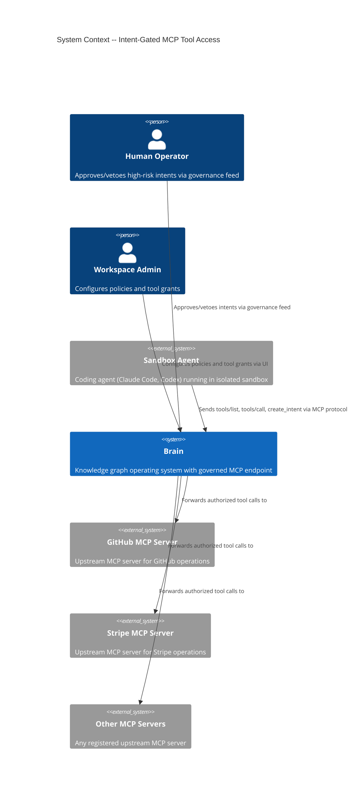
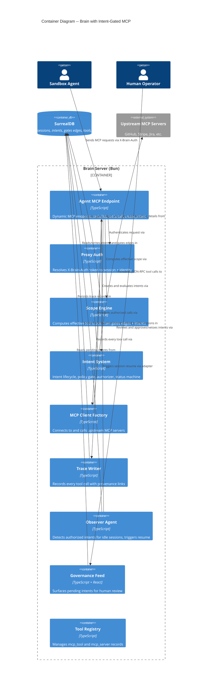
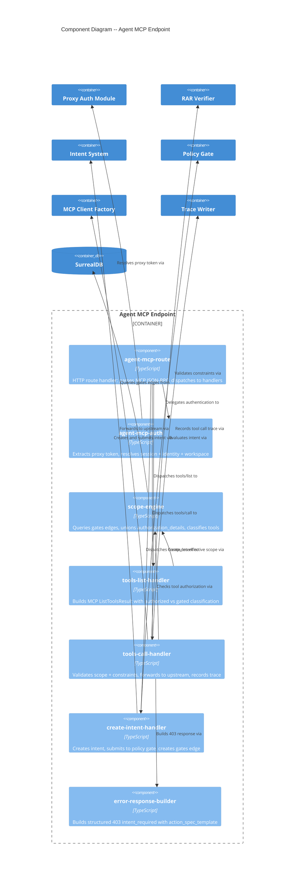

# Architecture Design: Intent-Gated MCP Tool Access

## System Overview

Intent-gated MCP is a dynamic per-agent MCP endpoint that gates external tool calls behind intent authorization and policy evaluation. Sandbox coding agents (Claude Code, Codex) interact with Brain through this endpoint, which computes an effective tool scope from the agent's session-linked intents and either forwards authorized calls to upstream MCP servers or guides the agent through intent-based escalation.

The endpoint is a new route module within Brain's existing modular monolith, composing existing infrastructure: proxy auth, tool resolver, intent lifecycle, policy gate, RAR verifier, MCP client factory, and trace writer.

---

## C4 System Context (L1)



---

## C4 Container (L2)



---

## C4 Component (L3) -- Agent MCP Endpoint

The Agent MCP Endpoint is the primary new subsystem with 6+ internal concerns, warranting a component diagram.



---

## Data Flow: Request Pipeline

Every request to the dynamic MCP endpoint follows this pipeline:

```
Request -> proxy_auth -> session_resolution -> scope_computation -> handler_dispatch
                                                                        |
                                    +-----------------------------------+
                                    |                |                  |
                              tools/list        tools/call        create_intent
                                    |                |                  |
                              classify tools    scope check +       create intent +
                              authorized vs     constraint          policy gate +
                              gated             validation          gates edge
                                    |                |                  |
                              ListToolsResult   forward to          intent status
                                                upstream MCP        response
                                                    |
                                              trace record
```

---

## Key Design Decisions (Preserved)

These decisions are carried forward from the DISCUSS wave and research. They are NOT new ADRs -- they are documented here for completeness.

### D1: No DPoP for sandbox agents

Sandbox agents authenticate via `X-Brain-Auth` proxy token only. The existing `proxy-auth.ts` already supports session and intent fields on `proxy_token`. No new auth mechanism needed.

**Rationale**: Sandbox agents are opaque processes that receive env vars. They cannot generate DPoP proofs (which require a private key and proof JWT generation per request). The proxy token is simpler and sufficient -- it binds to a session and workspace.

### D2: Proxy token with intent + session binding

The `proxy_token` table already has `intent` and `session` fields (added in sandbox-agent-integration R2). The Agent MCP endpoint uses `session` to resolve gates edges and compute effective scope.

### D3: Agent-driven escalation via create_intent tool

Two escalation mechanisms:
- **Proactive**: tools/list enriches gated tool descriptions with instructions to create an intent first
- **Reactive**: tools/call returns structured 403 `{ code: -32403, data: { tool, action_spec_template } }`

The agent calls `create_intent` MCP tool, which creates the intent, submits it through the policy gate, and returns the result.

### D4: Yield-and-resume, not polling

When `create_intent` returns `pending_veto`, the agent yields (session goes idle). The Observer detects the authorized intent and triggers `adapter.resumeSession`. The agent does NOT poll.

### D5: Intent accumulation via gates edges

A session accumulates intents over its lifetime. The `gates` relation (`intent -> agent_session`, per existing schema) links intents to sessions. Scope computation unions all authorized intents' `authorization_details`.

**Schema note**: The existing `gates` table is defined as `IN intent OUT agent_session`. This means the relation direction is `intent -gates-> agent_session`. Scope queries traverse: `SELECT in.* FROM gates WHERE out = $session AND in.status = "authorized"`.

### D6: Effective scope = can_use grants INTERSECT intent authorization_details

A tool must be BOTH:
1. Granted to the identity via `can_use` edge (tool registry level)
2. Covered by an authorized intent's `authorization_details` (runtime level)

Ungated tools (policy says no intent required for the action class) skip the intent check and are callable if granted.

---

## Integration Points

### Reused Existing Components

| Component | File | Reuse Type |
|-----------|------|-----------|
| Proxy auth | `proxy/proxy-auth.ts` | Direct -- resolveProxyAuth gives session + identity |
| RAR verifier | `oauth/rar-verifier.ts` | Direct -- verifyOperationScope for constraint enforcement |
| Intent lifecycle | `intent/status-machine.ts`, `intent-queries.ts` | Direct -- createIntent, updateIntentStatus |
| Intent authorizer | `intent/authorizer.ts` | Direct -- evaluateIntent for policy + LLM eval |
| Policy gate | `policy/policy-gate.ts` | Direct -- evaluatePolicyGate for rule matching |
| MCP client factory | `tool-registry/mcp-client.ts` | Direct -- connect + callTool for upstream forwarding |
| Tool resolver | `proxy/tool-resolver.ts` | Direct -- resolveToolsForIdentity for can_use grants |
| Trace writer | `proxy/tool-trace-writer.ts` | Extended -- captureToolTrace with intent linkage |
| Sandbox adapter | `orchestrator/sandbox-adapter.ts` | Direct -- adapter.resumeSession for observer resume |
| Governance feed | `feed/` | Extended -- new feed card type for MCP intent approval |

### New Components

| Component | Location | Purpose |
|-----------|----------|---------|
| Agent MCP route | `mcp/agent-mcp-route.ts` | HTTP handler for `/mcp/agent/:sessionName` |
| Agent MCP auth | `mcp/agent-mcp-auth.ts` | Proxy token to session resolution |
| Scope engine | `mcp/scope-engine.ts` | Effective scope computation from gates edges |
| Tools list handler | `mcp/tools-list-handler.ts` | MCP ListToolsResult builder |
| Tools call handler | `mcp/tools-call-handler.ts` | Scope check, constraint validation, upstream forwarding |
| Create intent handler | `mcp/create-intent-handler.ts` | Intent creation and policy evaluation |
| Error response builder | `mcp/error-response-builder.ts` | Structured 403 with action_spec_template |

---

## Quality Attribute Strategies

### Auditability (Priority 1)

Every `tools/call` -- success, failure, rejected, or constraint-violated -- produces a trace record in SurrealDB linked to the session and authorizing intent. The trace includes tool name, arguments, result, duration, and outcome. This uses the existing `captureToolTrace` pattern from `proxy/tool-trace-writer.ts`.

### Security (Priority 2)

- **Auth**: Proxy token resolves to workspace + identity + session. Invalid/expired/revoked tokens return 401.
- **Scope**: Effective scope is the intersection of can_use grants and authorized intent authorization_details.
- **Constraints**: RAR verifier enforces numeric bounds and string identity constraints before upstream forwarding.
- **Isolation**: Each sandbox agent has its own session; scope is per-session, not per-identity.

### Maintainability (Priority 3)

- Pure core / effect shell: scope computation, constraint verification, tool classification are pure functions. IO (DB queries, upstream calls, trace writes) happens at boundaries.
- Composition over inheritance: handlers compose existing modules via function calls.
- No new auth mechanism: reuses proxy-auth for sandbox agents, same pattern as existing proxy pipeline.

### Testability (Priority 4)

- All IO is injectable: SurrealDB queries via driven ports, upstream MCP via McpClientFactory, adapter via SandboxAgentAdapter.
- Pure functions (scope computation, constraint verification, tool classification) are unit-testable.
- Acceptance tests follow existing acceptance-test-kit pattern with isolated DB namespace.

### Time-to-Market (Priority 5)

- Walking skeleton (US-01 through US-03) reuses ~90% existing infrastructure.
- Release 1 (yield-and-resume) adds observer scan pattern using existing observer infrastructure.
- Release 2 (constraints + composites) reuses RAR verifier directly.
- Release 3 (hardening) is incremental improvements.

---

## Deployment Architecture

No deployment changes. The Agent MCP endpoint is a new route registered in `start-server.ts`, running in the same Bun process as all other Brain routes. SurrealDB schema changes are applied via `bun migrate`.

---

## External Integrations

The Agent MCP endpoint forwards tool calls to upstream MCP servers (GitHub, Stripe, Jira, etc.). These are external integrations accessed through the existing `McpClientFactory`.

**Contract tests recommended for upstream MCP servers** -- consumer-driven contracts (e.g., Pact-JS) to detect breaking changes in upstream MCP server responses before production. Priority targets: any upstream server where tool calls have financial or destructive side effects.

---

## Architectural Enforcement

Recommended tooling for enforcing the architecture:

- **Import linting**: Use `dependency-cruiser` (MIT, well-maintained) to enforce:
  - `mcp/scope-engine.ts` must NOT import from `http/` or `runtime/` (pure module)
  - `mcp/agent-mcp-route.ts` is the only file that imports from `mcp/tools-*-handler.ts`
  - No circular dependencies within `mcp/` modules
- **Test coverage gate**: Acceptance tests for every handler; unit tests for every pure function.
