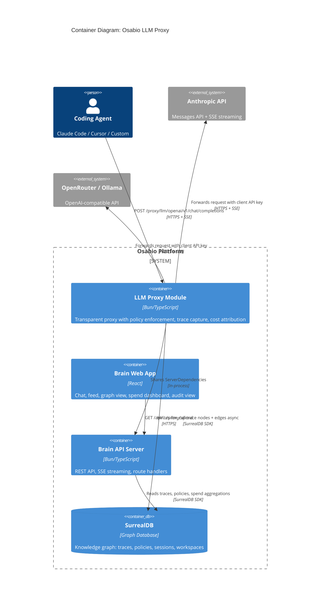

# LLM Proxy Architecture

**Feature**: Osabio LLM Proxy
**Author**: Morgan (solution-architect)
**Date**: 2026-03-15
**Status**: Proposed
**Paradigm**: Functional (per CLAUDE.md)

---

## 1. System Context and Capabilities

The LLM Proxy is the transparent intermediary between coding agents (Claude Code, Cursor, custom scripts) and LLM providers (Anthropic, OpenRouter/Ollama). It captures every LLM call as a first-class graph entity, enforces workspace policies, computes costs, and attributes usage to workspaces/projects/tasks -- all without adding perceptible latency to the agent's experience.

**Capabilities**:
- Transparent SSE passthrough with raw byte forwarding
- Identity resolution from Claude Code metadata + custom headers
- Graph-native trace capture (llm_call trace nodes with RELATE edges)
- Real-time cost computation from model-specific pricing tables
- Policy enforcement (model access, budget limits, rate limiting)
- Spend monitoring API for dashboard consumption
- Audit provenance chain traversal and export

---

## 2. C4 System Context (Level 1)

```mermaid
C4Context
    title System Context: Osabio LLM Proxy

    Person(developer, "Developer", "Uses Claude Code daily, 100-500 API calls/day")
    Person(admin, "Workspace Admin", "Monitors costs, manages policies")
    Person(auditor, "Compliance Auditor", "Quarterly audit, provenance verification")

    System(osabio, "Osabio Platform", "Knowledge graph OS for autonomous organizations")

    System_Ext(anthropic, "Anthropic API", "Claude model inference via Messages API")
    System_Ext(openrouter, "OpenRouter / Ollama", "Multi-provider model inference")
    System_Ext(claude_code, "Claude Code", "Coding agent, routes via ANTHROPIC_BASE_URL")
    System_Ext(cursor, "Cursor / Other Agents", "OpenAI-compatible coding agents")

    Rel(developer, claude_code, "Uses")
    Rel(developer, cursor, "Uses")
    Rel(claude_code, osabio, "Sends LLM requests via proxy")
    Rel(cursor, osabio, "Sends LLM requests via proxy")
    Rel(brain, anthropic, "Forwards authenticated requests")
    Rel(brain, openrouter, "Forwards authenticated requests")
    Rel(admin, osabio, "Views spend dashboard, manages policies")
    Rel(auditor, osabio, "Queries provenance chains, runs compliance checks")
```

---

## 3. C4 Container (Level 2)



**Key architectural decision**: The proxy is a module within the existing Osabio Bun server, not a separate process. It shares `ServerDependencies` (SurrealDB connection, inflight tracker, config) with the rest of the API server. This eliminates inter-process communication overhead and reuses existing infrastructure (auth, policy engine, observation system).

---

## 4. C4 Component (Level 3) -- Proxy Module

```mermaid
C4Component
    title Component Diagram: LLM Proxy Module

    Container_Boundary(proxy, "LLM Proxy Module") {
        Component(anthropic_route, "Anthropic Route Handler", "TypeScript", "Receives POST /proxy/llm/anthropic/v1/messages, orchestrates pipeline")
        Component(openai_route, "OpenAI Route Handler", "TypeScript", "Receives POST /proxy/llm/openai/v1/chat/completions, orchestrates pipeline")
        Component(identity, "Identity Resolver", "TypeScript", "Parses metadata.user_id + X-Osabio-* headers into workspace/session/task")
        Component(policy_check, "Policy Evaluator", "TypeScript", "Checks model access, budget, rate limit against policy graph")
        Component(forwarder, "Request Forwarder", "TypeScript", "Raw byte SSE relay via TransformStream, non-streaming JSON forwarding")
        Component(sse_parser, "SSE Usage Extractor", "TypeScript", "Parses message_start + message_delta for token counts from SSE buffer")
        Component(cost_calc, "Cost Calculator", "TypeScript", "Computes cost from model pricing table + token counts")
        Component(trace_writer, "Trace Writer", "TypeScript", "Async graph writes: llm_call trace node + RELATE edges via inflight tracker")
        Component(spend_api, "Spend API", "TypeScript", "GET endpoints for workspace/project/session spend aggregation")
        Component(pricing, "Pricing Table", "TypeScript", "Static model -> rate config, updated via config change")
        Component(rate_limiter, "Rate Limiter", "TypeScript", "In-memory sliding window counter per workspace")
    }

    System_Ext(anthropic, "Anthropic API")
    System_Ext(openrouter, "OpenRouter / Ollama")
    ContainerDb(surreal, "SurrealDB")
    Container(policy_engine, "Brain Policy Engine", "Existing policy-gate.ts")
    Container(obs_system, "Observation System", "Existing observation module")

    Rel(anthropic_route, identity, "Resolves request identity")
    Rel(anthropic_route, policy_check, "Evaluates pre-request policies")
    Rel(anthropic_route, forwarder, "Forwards to upstream provider")
    Rel(openai_route, identity, "Resolves request identity")
    Rel(openai_route, policy_check, "Evaluates pre-request policies")
    Rel(openai_route, forwarder, "Forwards to upstream provider")
    Rel(forwarder, sse_parser, "Feeds SSE chunks for usage extraction")
    Rel(forwarder, anthropic, "Relays raw bytes")
    Rel(forwarder, openrouter, "Relays raw bytes")
    Rel(sse_parser, cost_calc, "Provides token counts")
    Rel(cost_calc, pricing, "Looks up model rates")
    Rel(cost_calc, trace_writer, "Provides computed cost")
    Rel(trace_writer, surreal, "CREATE llm_call trace + RELATE edges async")
    Rel(policy_check, policy_engine, "Reuses evaluatePolicyGate pipeline")
    Rel(policy_check, rate_limiter, "Checks rate limit")
    Rel(policy_check, surreal, "Reads spend counters for budget check")
    Rel(trace_writer, obs_system, "Creates warning observations on failure")
    Rel(spend_api, surreal, "Aggregates trace costs")
```



---

## 5. Component Architecture

### 5.1 Request Pipeline (Synchronous Hot Path)

```
Agent Request
  |
  +-> [1] Parse request body (extract model, stream flag, metadata)
  +-> [2] Identity Resolution (parse metadata.user_id + X-Osabio-* headers)
  +-> [3] Policy Evaluation (model access + budget + rate limit)
  |     |-- DENY -> Return 403/429 with policy_ref + remediation
  |     |-- ALLOW -> continue
  +-> [4] Forward to upstream provider (raw byte relay)
  +-> [5] Return Response to agent (SSE stream or JSON)
```

**Latency budget**: Steps 1-3 must complete within 10ms p99. Step 4 adds zero overhead (raw byte pipe). Step 5 is the upstream's response time.

### 5.2 Post-Response Pipeline (Asynchronous, Non-Blocking)

```
Stream Complete / Response Received
  |
  +-> [6] Extract usage (from SSE buffer or JSON response body)
  +-> [7] Compute cost (pricing table lookup + token math)
  +-> [8] Write llm_call trace node to SurrealDB
  +-> [9] Create RELATE edges (invoked, scoped_to, attributed_to, governed_by)
  +-> [10] On write failure: retry 3x exponential backoff -> stderr JSON fallback
```

All post-response work runs via `deps.inflight.track()` consistent with Osabio's existing async pattern.

### 5.3 Component Boundaries

| Component | Responsibility | Driven Port (Input) | Driving Port (Output) |
|-----------|---------------|--------------------|--------------------|
| Anthropic Route | HTTP handling, pipeline orchestration for Anthropic format | `POST /proxy/llm/anthropic/v1/messages` | Forward request, trigger trace |
| OpenAI Route | HTTP handling, pipeline orchestration for OpenAI format | `POST /proxy/llm/openai/v1/chat/completions` | Forward request, trigger trace |
| Identity Resolver | Parse and validate identity signals | Request headers + body metadata | Resolved identity (workspace, session, task) |
| Policy Evaluator | Pre-request authorization | Resolved identity + model | Allow/deny decision with policy trace |
| Request Forwarder | Transparent SSE/JSON relay | Upstream URL + headers + body | Raw byte stream to client |
| SSE Usage Extractor | Parse SSE events for usage data | Raw byte buffer from stream | Token counts + stop reason |
| Cost Calculator | Compute per-request cost | Model + token counts | Cost in USD |
| Trace Writer | Persist trace + edges to graph | Trace data (identity, usage, cost) | llm_call trace node + RELATE edges |
| Pricing Table | Model-to-rate lookup | Model ID | Per-token rates |
| Rate Limiter | Sliding window rate enforcement | Workspace ID | Allow/deny + current count |
| Spend API | Aggregation queries for dashboard | HTTP GET with filters | Spend breakdown JSON |

---

## 6. Data Model

### 6.1 Extended `trace` Table (per ADR-042)

The existing `trace` table is extended with `"llm_call"` as a new type value and LLM-specific optional fields. No new table is created.

**New fields on `trace`** (optional, populated when `type = "llm_call"`):
```
  - model: option<string>                  -- model ID from response
  - provider: option<string>               -- "anthropic" | "openai"
  - input_tokens: option<int>
  - output_tokens: option<int>
  - cache_creation_tokens: option<int>
  - cache_read_tokens: option<int>
  - cost_usd: option<float>
  - stop_reason: option<string>
  - request_id: option<string>             -- Anthropic's request-id header
```

**Existing fields reused**: `session` (record<agent_session>), `workspace` (record<workspace>), `duration_ms`, `input`/`output` (FLEXIBLE), `parent_trace`, `actor`, `created_at`.

**`agent_session` rename**: `opencode_session_id` → `external_session_id` via 3-step data migration: (1) DEFINE FIELD `external_session_id`, (2) UPDATE existing records to copy `opencode_session_id` → `external_session_id`, (3) REMOVE FIELD `opencode_session_id`. Composite index on `(external_session_id, workspace)` created after data copy. Stores Claude Code session UUID or any external agent session ID.

Indexes already exist on `trace` for `session`, `workspace`, `created_at`.

### 6.2 Graph Topology

```
agent_session --[session]--> llm_call trace --[workspace]--> workspace
                                                      --[parent_trace]--> trace (parent)
```

Attribution to task/project flows through the `agent_session` which already links to `task_id` and `project`.

### 6.3 Key Queries

**Per-workspace spend (today)**:
```sql
SELECT math::sum(cost_usd) AS total, count() AS calls
FROM trace
WHERE type = "llm_call" AND workspace = $ws AND created_at >= $today_start;
```

**Per-session breakdown**:
```sql
SELECT session, model, math::sum(cost_usd) AS spend, count() AS calls
FROM trace
WHERE type = "llm_call" AND workspace = $ws AND created_at >= $start
GROUP BY session, model;
```

**Per-project via agent_session**:
```sql
SELECT session.project AS project, math::sum(cost_usd) AS spend, count() AS calls
FROM trace
WHERE type = "llm_call" AND workspace = $ws AND created_at >= $start
FETCH session
GROUP BY project;
```

**Full session timeline (agent traces + LLM calls interleaved)**:
```sql
SELECT type, model, tool_name, cost_usd, duration_ms, created_at
FROM trace
WHERE session = $session_id
ORDER BY created_at ASC;
```

---

## 7. Technology Stack

| Component | Technology | License | Rationale |
|-----------|-----------|---------|-----------|
| Runtime | Bun 1.3+ | MIT | Existing Osabio runtime; native fetch + TransformStream for SSE relay |
| Database | SurrealDB | BSL 1.1 | Existing Osabio graph DB; RELATE edges for provenance chains |
| Language | TypeScript | Apache 2.0 | Existing Osabio language; functional paradigm per CLAUDE.md |
| HTTP Framework | Bun.serve routes | MIT | Existing Osabio routing; no new framework dependency |
| SSE Relay | TransformStream (Web API) | N/A (Web Standard) | Zero-dependency streaming; already used in walking skeleton |

No new dependencies introduced. All components use existing Osabio infrastructure.

---

## 8. Integration Patterns

### 8.1 Policy Engine Integration

The proxy reuses `evaluatePolicyGate()` from `policy-gate.ts` with an adapted context. For LLM proxy policy evaluation, the intent context maps:

| Policy Field | Proxy Value |
|-------------|-------------|
| `action` | `"llm_call"` |
| `resource` | Model ID (e.g., `"claude-sonnet-4"`) |
| `agent_role` | Agent type from `X-Osabio-Agent-Type` header or inferred |

Budget and rate limit checks are separate from the policy gate:
- **Budget**: Read spend counter from cached spend aggregation (updated on every trace write via inflight tracker callback, TTL 10s fallback). Cache miss triggers live trace aggregation query. Compare against workspace-configured limit.
- **Rate limit**: In-memory sliding window counter per workspace (too frequent for DB queries)

### 8.2 Observation System Integration

Warning observations created for:
- Unresolved workspace (request forwarded but unattributed)
- Missing LLM proxy policies (permissive default)
- Graph write failure after retry exhaustion
- Anomalous spending patterns (2x average rate)

### 8.3 Inflight Tracker Integration

All async post-response work tracked via `deps.inflight.track()`:
- Trace node creation
- Edge creation
- Retry attempts
- Observation creation on failure

This ensures acceptance tests can `drain()` pending work before asserting.

### 8.4 Multi-Provider Abstraction

Two route handlers, one shared pipeline:

| Route | Provider | Wire Format | Usage Extraction |
|-------|----------|-------------|-----------------|
| `/proxy/llm/anthropic/v1/messages` | Anthropic | Anthropic Messages API | `message_start` + `message_delta` SSE events |
| `/proxy/llm/openai/v1/chat/completions` | OpenRouter/Ollama | OpenAI Chat Completions | `usage` field in final SSE chunk or JSON response |

Both routes share: identity resolver, policy evaluator, cost calculator, trace writer. Only the SSE usage extraction and request forwarding URL differ.

### 8.5 API Endpoints

| Method | Path | Purpose | Story |
|--------|------|---------|-------|
| POST | `/proxy/llm/anthropic/v1/messages` | Anthropic proxy passthrough | US-LP-001 |
| POST | `/proxy/llm/anthropic/v1/messages/count_tokens` | Token counting (no trace) | US-LP-001 |
| POST | `/proxy/llm/openai/v1/chat/completions` | OpenAI-compatible proxy | US-LP-001 |
| GET | `/api/workspaces/:wsId/proxy/spend` | Workspace spend overview | US-LP-004, US-LP-006 |
| GET | `/api/workspaces/:wsId/proxy/sessions` | Session cost breakdown | US-LP-006 |
| GET | `/api/workspaces/:wsId/proxy/sessions/:sessionId/traces` | Session trace detail | US-LP-006 |
| GET | `/api/workspaces/:wsId/proxy/traces/:traceId` | Single trace with provenance chain | US-LP-007 |
| GET | `/api/workspaces/:wsId/proxy/compliance` | Authorization compliance check | US-LP-007 |
| GET | `/api/workspaces/:wsId/proxy/export` | CSV/JSON export of traces | US-LP-007 |

---

## 9. Quality Attribute Strategies

| Attribute | Strategy | Measure |
|-----------|----------|---------|
| **Performance** | Raw byte SSE forwarding; no decode/re-encode on hot path; async post-processing | < 50ms p95 TTFT overhead |
| **Reliability** | 3x retry with exponential backoff on graph writes; stderr JSON fallback; inflight tracker for drain | 100% trace capture (with fallback) |
| **Security** | Client API key forwarded (never stored); workspace validation; policy enforcement | No credential storage in proxy |
| **Maintainability** | Functional pipeline (pure functions for identity, cost, policy); shared components across providers | Single responsibility per component |
| **Auditability** | Every trace linked to session/workspace/task/policy via RELATE edges; provenance chain queryable | Full graph traversal from trace to intent |
| **Scalability** | In-memory rate limiting; cached policy lookups (60s TTL); spend aggregation with short-TTL cache | < 10ms p99 policy check |

---

## 10. Deployment Architecture

The proxy runs as part of the existing Osabio Bun server process. No separate deployment, no additional infrastructure.

```
osabio-server (Bun.serve)
  |-- /api/*          -- existing Osabio API routes
  |-- /proxy/llm/*    -- LLM proxy routes (new)
  |-- SurrealDB conn  -- shared connection pool
  |-- InflightTracker  -- shared async work tracker
```

Configuration via existing `.env`:
- `LLM_PROXY_ENABLED=true` (feature flag)
- Pricing table as TypeScript config object (not DB table)
- Policy graph queried at runtime (existing policy module)

---

## 11. Requirements Traceability

| Requirement | Component(s) | Story |
|------------|-------------|-------|
| SSE passthrough with raw bytes | Request Forwarder | US-LP-001 |
| Header forwarding (anthropic-*) | Anthropic Route | US-LP-001 |
| Upstream failure -> 502 | Request Forwarder | US-LP-001 |
| metadata.user_id parsing | Identity Resolver | US-LP-002 |
| X-Osabio-Workspace/Task resolution | Identity Resolver | US-LP-002 |
| Graceful identity degradation | Identity Resolver | US-LP-002 |
| llm_call trace node creation | Trace Writer | US-LP-003 |
| RELATE edges (invoked, scoped_to, attributed_to) | Trace Writer | US-LP-003 |
| Async non-blocking writes | Trace Writer + Inflight Tracker | US-LP-003 |
| Retry + fallback on write failure | Trace Writer | US-LP-003 |
| Cost computation from pricing table | Cost Calculator | US-LP-004 |
| Spend counters at workspace/project/task | Spend API | US-LP-004 |
| Spend API endpoint | Spend API | US-LP-004 |
| Model access policy check | Policy Evaluator | US-LP-005 |
| Budget enforcement | Policy Evaluator | US-LP-005 |
| Rate limiting | Rate Limiter | US-LP-005 |
| Policy violation error responses | Policy Evaluator | US-LP-005 |
| Dashboard spend overview API | Spend API | US-LP-006 |
| Session breakdown API | Spend API | US-LP-006 |
| Anomaly detection alerts | Spend API + Observation System | US-LP-006 |
| Provenance chain query | Spend API (trace detail) | US-LP-007 |
| Compliance check | Spend API (compliance endpoint) | US-LP-007 |
| CSV/JSON export | Spend API (export endpoint) | US-LP-007 |

---

## 12. Implementation Roadmap

### Phase 1: Foundation (US-LP-001, US-LP-002, US-LP-003)

```yaml
step_01:
  title: "Schema migration: extend trace table with llm_call type + LLM fields"
  description: "Add 'llm_call' to trace type enum, add LLM-specific optional fields (model, tokens, cost, provider, stop_reason), rename opencode_session_id to external_session_id on agent_session via 3-step data migration, create proxy_intelligence_config table"
  acceptance_criteria:
    - "trace type ASSERT includes 'llm_call'"
    - "LLM fields (model, input_tokens, output_tokens, cost_usd, provider) defined on trace"
    - "agent_session.external_session_id replaces opencode_session_id via 3-step migration (DEFINE → UPDATE → REMOVE)"
    - "proxy_intelligence_config table created in migration 0042"
  architectural_constraints:
    - "Three migration files: 0040 (trace fields), 0041 (session rename), 0042 (intelligence config)"
    - "Existing trace records unaffected — new fields are optional"
    - "Schema migrations are breaking (per project policy) — no rollback supported"

step_02:
  title: "Solidify Anthropic proxy passthrough with identity resolution"
  description: "Extend walking skeleton with full header forwarding, error handling, identity resolution from metadata + headers, and workspace validation"
  acceptance_criteria:
    - "SSE events relayed as raw bytes with < 50ms p95 TTFT overhead"
    - "Upstream failure returns 502 with source:proxy distinction"
    - "Identity resolved from metadata.user_id + X-Osabio-Workspace + X-Osabio-Task"
    - "Missing identity signals degrade gracefully (workspace-only or no attribution)"
    - "Invalid workspace triggers warning observation but does not block request"
  architectural_constraints:
    - "Identity resolver is a pure function accepting headers + body metadata"
    - "Workspace validation cached (records change infrequently)"
    - "Proxy handler receives ServerDependencies for SurrealDB and inflight access"

step_03:
  title: "Async trace capture with graph edges"
  description: "After stream/response completes, write llm_call trace node + RELATE edges asynchronously via inflight tracker"
  acceptance_criteria:
    - "llm_call trace node created for every forwarded LLM call with model, tokens, latency, stop_reason"
    - "RELATE edges created: session->invoked->trace, trace->scoped_to->workspace"
    - "Optional attributed_to edge created when task identity resolved"
    - "Trace capture does not block response delivery"
    - "Graph write failure retried 3x with exponential backoff; fallback to stderr JSON"
  architectural_constraints:
    - "All async work tracked via deps.inflight.track()"
    - "SSE usage extracted from message_start (input) and message_delta (output) events"
```

### Phase 2: Value (US-LP-004, US-LP-005)

```yaml
step_04:
  title: "Cost calculation and spend tracking"
  description: "Compute per-call cost from pricing table, store in trace, expose spend aggregation API"
  acceptance_criteria:
    - "Cost computed from model-specific rates for input, output, cache_create, cache_read tokens"
    - "Each llm_call trace records exact cost_usd at time of call"
    - "Spend API returns workspace/project/task breakdown with call counts"
    - "Unattributed costs visible as separate category"
    - "API response under 2 seconds for spend queries"
  architectural_constraints:
    - "Pricing table is a TypeScript config object (not DB table)"
    - "Unknown model IDs produce zero cost with warning observation"

step_05:
  title: "Policy enforcement at proxy boundary"
  description: "Pre-request policy check for model access, budget limit, and rate limit using existing policy engine"
  acceptance_criteria:
    - "Model access violation returns 403 with JSON body: {error, policy_ref, policy_description, model_suggestion, remediation}"
    - "Budget exceeded returns 429 with JSON body: {error, current_spend_usd, daily_limit_usd, time_until_reset_seconds}"
    - "Rate limit exceeded returns 429 with Retry-After header + JSON body: {error, rate_limit_per_minute, reset_time_unix}"
    - "Policy check completes under 10ms at p99"
    - "Missing policies default to permissive with warning observation"
  architectural_constraints:
    - "Model access evaluated via evaluatePolicyGate() with llm_call context"
    - "Rate limiting uses in-memory sliding window (not DB)"
    - "Budget check reads spend aggregation from llm_call trace"
    - "Policy decisions logged for audit trail"
```

### Phase 3: Visibility (US-LP-006, US-LP-007)

```yaml
step_06:
  title: "Spend monitoring dashboard API and anomaly detection"
  description: "API endpoints for dashboard consumption: spend overview, session breakdown, trace drill-down, anomaly alerts"
  acceptance_criteria:
    - "Dashboard API returns workspace spend with progress bar data against budget"
    - "Per-project breakdown shows today, MTD, and call count"
    - "Per-session breakdown shows cost, model, duration with drill-down"
    - "Anomaly alerts created for sessions exceeding 2x average rate"
    - "Budget threshold alerts fire at configured percentage"
  architectural_constraints:
    - "Anomaly alerts integrate with existing observation system"
    - "Spend aggregation cached with short TTL (10s) for dashboard reads; cache invalidated on every trace creation via inflight tracker callback"

step_07:
  title: "Audit provenance chain and compliance"
  description: "Trace detail with provenance chain, date-range queries, compliance check, and CSV/JSON export"
  acceptance_criteria:
    - "Trace detail shows usage data plus linked session/workspace/task/policy"
    - "Provenance chain exportable as JSON"
    - "Project + date range query returns results under 2 seconds"
    - "Compliance check verifies policy edges on all traces in period"
    - "Traces without policy authorization flagged as unverified"
  architectural_constraints:
    - "governed_by edge links trace to evaluated policy"
    - "CSV export uses streaming response for large result sets"

step_08:
  title: "OpenAI-compatible proxy route"
  description: "Add /proxy/llm/openai route handler for OpenRouter, Ollama, Cursor with shared pipeline"
  acceptance_criteria:
    - "OpenAI Chat Completions format forwarded transparently"
    - "SSE usage extracted from OpenAI-format stream events"
    - "Identity, policy, cost, and trace pipeline shared with Anthropic route"
    - "Provider field on llm_call trace distinguishes Anthropic from OpenAI calls"
  architectural_constraints:
    - "Separate route handler, not format auto-detection"
    - "Upstream URL configurable per workspace"
```

### Roadmap Metrics

| Metric | Value |
|--------|-------|
| Total steps | 8 |
| Estimated production files | ~12-15 |
| Step ratio | 8/14 = 0.57 (well under 2.5 threshold) |
| Total AC | 37 |
| Avg AC per step | 4.6 |

---

## 13. Rejected Simple Alternatives

### Alternative 1: Log-only proxy (no graph writes)
- **What**: Forward requests transparently, log usage to stdout/file
- **Expected impact**: Solves ~30% (visibility into calls, but no cost attribution, no policy enforcement, no graph-traversable audit)
- **Why insufficient**: Does not address JS-1 (cost visibility), JS-3 (governed autonomy), or JS-4 (auditable provenance). The existing walking skeleton already does log-only.

### Alternative 2: Anthropic Usage API polling
- **What**: Periodically poll Anthropic's Usage/Cost API for billing data, import into graph
- **Expected impact**: Solves ~40% (cost visibility at workspace level, but no per-task attribution, no policy enforcement, no real-time data)
- **Why insufficient**: Anthropic's Usage API provides aggregate billing, not per-call attribution. Cannot link costs to tasks/sessions. No pre-request policy enforcement. Polling latency means data is always stale.

### Why the full proxy is necessary
Both alternatives fail because they cannot: (1) attribute costs to individual tasks/sessions, (2) enforce policies before forwarding requests, or (3) build graph-traversable provenance chains. The proxy intercepts at the right point to capture all three.
