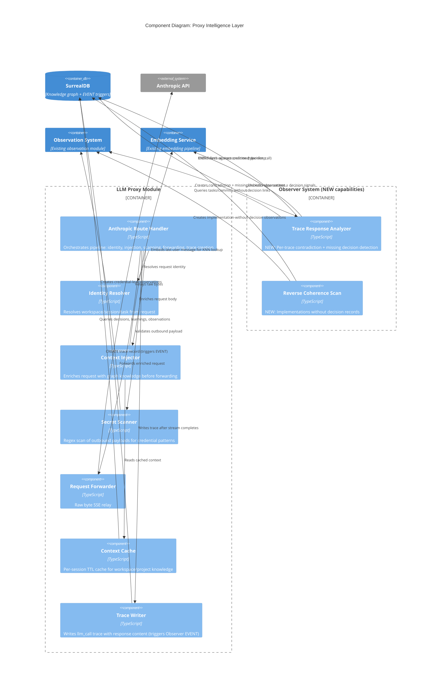

# LLM Proxy Intelligence Capabilities

**Feature**: Brain LLM Proxy -- Context Injection, Contradiction Detection, Missing Decision Detection, Secret Scanning, Cross-Trace Pattern Synthesis
**Author**: Morgan (solution-architect)
**Date**: 2026-03-15
**Status**: Proposed
**Paradigm**: Functional (per CLAUDE.md)
**Depends on**: [LLM Proxy Architecture](./llm-proxy-architecture.md), [ADR-042](../adrs/ADR-042-llm-trace-as-graph-entity.md)

---

## 1. Overview

Five intelligence capabilities layered onto the existing LLM proxy pipeline. The proxy owns two capabilities directly (context injection, secret scanning). The Observer owns three detection capabilities (contradiction detection, missing decision detection, cross-trace pattern synthesis) -- **all three require NEW Observer modules that do not exist today**.

### Proxy-Owned Capabilities (all clients)

| Capability | Pipeline Position | Latency Impact | LLM Cost | Blocking | Owner |
|---|---|---|---|---|---|
| Context Injection | Pre-forward (request mutation) | +5-15ms (cached), +50-100ms (cold) | Zero | Yes (delays forward) | Proxy |
| Secret Scanning | Pre-forward (request validation) | +1-2ms | Zero | Yes (may block) | Proxy |
| Trace Creation | Post-response (async) | Zero (non-blocking) | Zero | Never | Proxy |

### Observer-Owned Capabilities (NEW -- must be built)

| Capability | Trigger | Latency Impact | LLM Cost | Exists Today? |
|---|---|---|---|---|
| Contradiction Detection | EVENT on trace creation (type=llm_call) | Zero (async EVENT) | Selective (Tier 2 only) | **No** |
| Missing Decision Detection | EVENT on trace creation (type=llm_call) | Zero (async EVENT) | Selective (Tier 2 only) | **No** |
| Reverse Coherence Scan | Batch (existing runCoherenceScans) | Zero (batch scan) | Zero (deterministic) | **No** |
| Cross-Trace Pattern Synthesis | EVENT on agent_session ended_at | Zero (async EVENT) | OBSERVER_MODEL per session | **No** |

> **The Observer today does NOT**: analyze trace content, extract decision signals from LLM responses, detect missing decisions, run on trace entities, or detect implementations without decision records. These are all new capabilities.

**Architecture boundary**: The proxy's role is (1) context injection pre-forward and (2) trace creation post-response. The Observer's role is ALL detection and analysis, triggered by SurrealDB EVENTs on `trace` and `agent_session` tables. The proxy has no analysis modules.

**Prerequisite: Session ID Resolution** -- The proxy extracts session IDs from incoming requests (Claude Code `metadata.user_id` or `X-Brain-Session` header) and links traces to existing sessions. The proxy does NOT manage session lifecycle -- session creation and end-of-session are handled by the CLI (`brain init` hooks) and orchestrator. See [feature design](../feature/llm-proxy/design/architecture-design.md#4-session-id-resolution) and [ADR-049](../adrs/ADR-049-proxy-session-lifecycle-inactivity-timeout.md).

Contradiction detection and missing decision detection are triggered by trace creation and run in the Observer's Trace Response Analyzer (NEW module). Both use the same two-tier architecture (Tier 1: embedding similarity, Tier 2: Haiku verification). See [ADR-047](../adrs/ADR-047-contradiction-detection-proxy-hybrid-with-observer.md).

Cross-trace pattern synthesis (enhancement) is detailed in [feature design](../feature/llm-proxy/design/architecture-design.md#9-enhancement-observer-session-end-cross-trace-pattern-synthesis) and [ADR-048](../adrs/ADR-048-observer-session-end-trace-analysis.md).

---

## 2. C4 Component Diagram (Level 3) -- Intelligence Layer



---

## 3. Extended Request Pipeline

```
Agent Request
  |
  +-> [1] Parse request body (model, stream, metadata)
  +-> [2] Identity Resolution (workspace, session, task)
  +-> [3] Policy Evaluation (model access, budget, rate limit)
  |     |-- DENY -> 403/429
  |     |-- ALLOW -> continue
  +-> [4] SECRET SCAN (regex against serialized body)         <-- NEW
  |     |-- MATCH + policy=block  -> 403 + observation
  |     |-- MATCH + policy=redact -> redact + forward + observation
  |     |-- MATCH + policy=log    -> forward + observation
  |     |-- NO MATCH -> continue
  +-> [5] CONTEXT INJECTION (append Brain context system block) <-- NEW
  |     |-- Tiered routing: fast path skips, secure path injects
  |     |-- Cache hit -> use cached context
  |     |-- Cache miss -> KNN query + format + cache
  +-> [6] Forward to upstream (raw byte relay of enriched request)
  +-> [7] Return Response to agent (SSE stream or JSON)

Post-Response (async, proxy-owned):
  +-> [8] Extract usage (SSE buffer / JSON body)
  +-> [9] Compute cost
  +-> [10] WRITE TRACE (llm_call with response content)             <-- NEW
  |     |-- Trace includes response text, tool inputs, stop_reason
  |     |-- Intelligence metadata (context injection stats)
  |     |-- Trace creation triggers SurrealDB EVENT

Observer Pipeline (async, EVENT-driven, NEW -- does NOT exist today):
  +-> [11] SurrealDB EVENT fires on trace creation (type=llm_call)
  +-> [12] Observer Trace Response Analyzer (NEW module):
  |     |-- Contradiction: Tier 1 embed response, KNN against decisions
  |     |-- Contradiction: Tier 2 (if flagged): Haiku verification
  |     |-- Missing decision: extract decision signals, embed, KNN
  |     |-- Missing decision: Tier 2 (if unmatched): Haiku verification
  |     |-- Confirmed findings: create observations
```

---

## 4. Capability 1: Context Injection

### 4.1 Data Flow

```
Identity (workspace, session, task)
  |
  +-> Check tiered routing config
  |     |-- fast_path -> skip injection, forward as-is
  |     |-- secure_path -> continue
  |
  +-> Check context cache (keyed by session_id)
  |     |-- HIT + not expired -> use cached context packet
  |     |-- MISS or expired -> build fresh context
  |
  +-> Build context packet:
  |     |-- Extract search query from last user message
  |     |-- Embed query via existing embedding pipeline
  |     |-- KNN search: decisions, learnings, observations (two-step pattern)
  |     |-- Score + rank by priority tier
  |     |-- Truncate to token budget
  |     |-- Cache result (TTL from config)
  |
  +-> Inject into request body:
  |     |-- Parse system field (string or array)
  |     |-- Normalize to array of content blocks
  |     |-- Append new block at end (preserves prompt cache)
  |     |-- Re-serialize body
  |
  +-> Forward enriched request
```

### 4.2 Query Strategy

Three signals extracted from the request, used in priority order:

| Signal | Source | Purpose | Stability |
|---|---|---|---|
| Workspace + Project | Identity resolver (session headers) | Scope all queries | Stable per session |
| Last user message | Last `user` role entry in `messages` array | Semantic search query for KNN | Changes per turn |
| Tool calls | `tool_use` / `tool_result` blocks in messages | File paths for task-level context | Changes per turn |

The workspace/project context (confirmed decisions, active constraints, learnings) is stable per session and cached. The semantic relevance ranking (which of those items to include) changes per turn based on the user message embedding.

**Two-phase query** (leverages caching):
1. **Session-scoped fetch (cached, TTL 5min)**: All confirmed decisions + active learnings + open observations for workspace. This is the candidate pool.
2. **Per-turn ranking (computed per request)**: Embed last user message, compute cosine similarity against cached candidate embeddings, rank by priority tier within budget.

This avoids a KNN database query on every request -- the KNN ranking happens in-memory against the cached candidate pool.

### 4.3 SurrealDB Queries

**Fetch candidate pool (session cache miss)**:

```sql
-- Confirmed decisions for workspace (no KNN, simple filter)
SELECT id, summary, rationale, status, embedding
FROM decision
WHERE workspace = $ws AND status = "confirmed"
ORDER BY created_at DESC
LIMIT 50;

-- Active learnings for workspace
SELECT id, text, learning_type, priority, target_agents, embedding
FROM learning
WHERE workspace = $ws AND status = "active"
ORDER BY priority DESC, created_at DESC
LIMIT 30;

-- Open observations for workspace (conflict + warning only)
SELECT id, text, severity, observation_type, embedding
FROM observation
WHERE workspace = $ws
  AND status IN ["open", "acknowledged"]
  AND severity IN ["conflict", "warning"]
ORDER BY created_at DESC
LIMIT 20;
```

No KNN + WHERE bug encountered here -- these are simple indexed queries fetching the candidate pool. The cosine similarity ranking is computed in-memory in the proxy process against the fetched embeddings.

**In-memory ranking** (per-turn, no DB call):
```
For each candidate in pool:
  similarity = cosine(candidate.embedding, userMessageEmbedding)
  score = similarity * priorityWeight[candidate.tier]
Sort by score DESC
Take top N within token budget
```

Priority weights: decisions (1.0) > constraints (0.9) > learnings (0.8) > observations (0.7).

### 4.4 Injected System Block Format

The Anthropic Messages API `system` field accepts either a string or an array of content blocks. Claude Code sends it as an array with `cache_control: { type: "ephemeral" }` on its blocks. The proxy MUST:

1. Normalize `system` to array form (if string, wrap in `[{ type: "text", text: value }]`)
2. Append a new block at the END of the array
3. Never modify existing blocks (preserves prompt cache hits)

**Injected block structure**:

```json
{
  "type": "text",
  "text": "<brain-context workspace=\"acme\" project=\"backend-v2\" session=\"abc-123\" injected_at=\"2026-03-15T10:30:00Z\">\n## Active Decisions\n- [d:7f3a] Standardize on tRPC for all internal APIs (confirmed 2026-03-10)\n- [d:9b2c] PostgreSQL 16 for all persistent storage (confirmed 2026-03-08)\n\n## Constraints\n- [l:4e1f] All new endpoints must include DPoP authentication (high priority)\n\n## Open Observations\n- [o:2d5a] WARNING: billing API still uses REST, contradicts tRPC decision d:7f3a\n</brain-context>",
  "cache_control": { "type": "ephemeral" }
}
```

Design choices:
- **XML-like wrapper** (`<brain-context>`) with attributes for metadata -- LLMs parse XML structure reliably, and the tag name is distinctive enough to avoid collision with agent prompts
- **Markdown inside** -- decisions, learnings, observations as bullet lists with short IDs for reference
- **`cache_control: ephemeral`** -- marks this block for prompt caching so subsequent turns in the same session benefit from cached context (the context is stable per session)
- **Short IDs** (`d:7f3a`) -- first 4 chars of the record UUID, enough for the LLM to reference back without consuming tokens on full UUIDs

### 4.5 Token Budget

| Item | Estimated Tokens | Max Items | Budget |
|---|---|---|---|
| Wrapper + metadata | ~30 | 1 | 30 |
| Decisions | ~40 each | 10 | 400 |
| Learnings/Constraints | ~30 each | 5 | 150 |
| Observations | ~35 each | 5 | 175 |
| **Total** | | | **~755** |

Default budget: 1000 tokens. Configurable per workspace (200-2000 range). Budget enforcement: count items by priority tier until budget exhausted.

### 4.6 Session Caching

| Cache Key | Value | TTL | Invalidation |
|---|---|---|---|
| `ctx:{session_id}` | Candidate pool (decisions + learnings + observations with embeddings) | 5 min (configurable) | Session change, manual flush |
| `emb:{hash(text)}` | User message embedding vector | 10 min | LRU eviction |

Cache is in-memory (`Map`), per-process. No shared cache needed -- each proxy process handles its own sessions.

---

## 5. Capability 2: Per-Trace Analysis -- Contradiction + Missing Decision Detection (Observer-Owned, NEW)

> **This capability does NOT exist today.** The Observer currently has no handler for `trace` entities. Everything in this section describes new Observer modules that must be built. The proxy's role ends at trace creation (Section 3, step [10]).

Both detection types are triggered by the `trace_llm_call_created` SurrealDB EVENT. They share the same content extraction and stop_reason check. They diverge at the analysis phase.

### 5.1 Data Flow

```
Proxy writes llm_call trace (post-response)
  |
  +-> SurrealDB EVENT fires (ASYNC, RETRY 3)
  +-> Observer route receives trace webhook
  +-> Observer dispatches to Trace Response Analyzer (NEW module)
  |
  +-> Check stop_reason from trace output
  |     |-- "tool_use" -> skip (intermediate loop step), return 200
  |     |-- "end_turn" -> proceed
  |     |-- "max_tokens" -> proceed
  |
  +-> Extract analysis targets from trace output FLEXIBLE field:
  |     |-- Assistant text blocks (reasoning, decisions, explanations)
  |     |-- Tool call inputs for Edit/Write/Bash (action content)
  |
  +-> CONTRADICTION DETECTION:
  |     +-> TIER 1: Embedding similarity (zero LLM cost)
  |     |     |-- Embed extracted text (batch if multiple targets)
  |     |     |-- KNN search against confirmed decisions (two-step pattern)
  |     |     |-- Filter: similarity > TIER1_THRESHOLD (default 0.75)
  |     |     |-- No matches above threshold -> done, no contradiction
  |     |     |-- Matches found -> pass to Tier 2
  |     |
  |     +-> TIER 2: LLM verification (selective, Haiku-class, async)
  |           |-- For each flagged decision:
  |           |     |-- Prompt: "Agent action: {text}. Decision: {summary+rationale}. Contradiction?"
  |           |     |-- If "no" -> discard. If "yes" -> create conflict observation
  |
  +-> MISSING DECISION DETECTION:
  |     +-> TIER 1: Decision signal extraction + embedding (zero LLM cost)
  |     |     |-- Extract decision signals from text (choices, selections, rejections)
  |     |     |-- Embed each signal, KNN against existing decisions
  |     |     |-- Match above threshold -> skip (already recorded)
  |     |     |-- No match -> unrecorded decision candidate
  |     |
  |     +-> TIER 2: LLM verification (selective, Haiku-class, async)
  |           |-- "Is this a genuine decision that should be recorded?"
  |           |-- confidence < threshold -> discard
  |           |-- confidence >= threshold -> create info observation
```

### 5.2 When to Check

| Stop Reason | Check? | Rationale |
|---|---|---|
| `end_turn` | Yes | Final response -- contains reasoning and decisions |
| `max_tokens` | Yes | Truncated but still contains actionable content |
| `tool_use` | No | Intermediate step, will produce more output |
| `stop_sequence` | No | Rare, typically control flow |

Additionally, within the response content blocks:
- **Text blocks**: Always analyze (contain reasoning, decisions, explanations)
- **`tool_use` blocks for Edit/Write/Bash**: Extract `input` field for action content analysis
- **`tool_use` blocks for Read/Glob/Grep**: Skip (read-only, no contradiction risk)

### 5.3 SurrealDB Queries (Two-Step KNN Pattern)

Per the SurrealDB v3.0 KNN + WHERE bug, KNN and B-tree indexed WHERE clauses cannot be combined. Use the established two-step pattern.

**Tier 1 -- KNN candidate fetch + workspace filter**:

```sql
-- Step 1: KNN candidates (HNSW index only, no WHERE)
LET $candidates = SELECT id, summary, rationale, workspace,
  vector::similarity::cosine(embedding, $response_embedding) AS similarity
FROM decision WHERE embedding <|20, COSINE|> $response_embedding;

-- Step 2: Filter by workspace + confirmed status + threshold
SELECT id, summary, rationale, similarity
FROM $candidates
WHERE workspace = $ws
  AND status = "confirmed"
  AND similarity > $tier1_threshold
ORDER BY similarity DESC
LIMIT 5;
```

Wait -- the `status` field is not selected in Step 1, and `status` filtering should happen in Step 2. Updated:

```sql
LET $candidates = SELECT id, summary, rationale, status, workspace,
  vector::similarity::cosine(embedding, $response_embedding) AS similarity
FROM decision WHERE embedding <|20, COSINE|> $response_embedding;

SELECT id, summary, rationale, similarity
FROM $candidates
WHERE workspace = $ws
  AND status = "confirmed"
  AND similarity > $tier1_threshold
ORDER BY similarity DESC
LIMIT 5;
```

### 5.4 Tier 2 Verification Prompt

```
You are a contradiction detector. Compare the agent's action against a confirmed organizational decision.

<agent_action>
{extracted_text}
</agent_action>

<confirmed_decision id="{decision_id}">
Summary: {summary}
Rationale: {rationale}
</confirmed_decision>

Does the agent's action contradict this decision?

Respond with exactly one JSON object:
{
  "contradicts": true | false,
  "explanation": "one sentence explanation",
  "confidence": 0.0 to 1.0
}
```

- Model: Haiku-class (cheapest available, configured via `CONTRADICTION_MODEL` env var or workspace config)
- Only invoked when Tier 1 similarity exceeds threshold
- Confidence < 0.6 from Tier 2 -> discard (false positive gate)

### 5.5 Detection Layers (All Observer-Owned)

All detection and analysis is the Observer's responsibility. The proxy only creates traces. The Observer operates at three detection layers:

| Layer | Trigger | Scope | Model | Exists Today? |
|---|---|---|---|---|
| Per-trace analysis (EVENT-driven) | `trace_llm_call_created` EVENT | Single trace: contradiction + missing decision | Haiku-class (Tier 2 only) | **No -- NEW** |
| Reverse coherence scan (batch) | `runCoherenceScans()` periodic | All completed tasks/commits without decisions | None (deterministic) | **No -- NEW** |
| Session-end analysis (EVENT-driven) | `session_ended` EVENT | All session traces: cross-trace patterns | OBSERVER_MODEL | **No -- NEW** |
| Periodic scan (batch) | Existing Observer scan | Cross-session pattern synthesis | OBSERVER_MODEL | Yes (existing) |

The per-trace analyzer creates `observation_type: "contradiction"` and `observation_type: "validation"` (missing decisions) observations. The periodic scan picks these up, correlates with other observations, and can escalate to suggestions or learnings.

---

## 6. Capability 3: Secret Scanning

### 6.1 Data Flow

```
Parsed Request Body (serialized JSON string)
  |
  +-> Pattern match against credential regex set
  |     |-- NO MATCH -> continue pipeline (fast path)
  |     |-- MATCH -> determine action from workspace policy
  |           |-- "block"  -> return 403, create observation, do not forward
  |           |-- "redact" -> replace matched patterns with [REDACTED], forward, create observation
  |           |-- "log"    -> forward as-is, create observation
  |
  +-> Create observation (on any match):
        |-- severity: "conflict"
        |-- observation_type: "anomaly"
        |-- source_agent: "llm_proxy_secret_scanner"
        |-- text: "Credential pattern detected in LLM request: {pattern_name} ({count} matches)"
        |-- data: { pattern_name, match_count, action_taken }
        |-- (NEVER include the actual credential value in the observation)
```

### 6.2 Credential Patterns

| Pattern Name | Regex | Risk Level |
|---|---|---|
| `github_pat` | `ghp_[A-Za-z0-9_]{36}` | High |
| `github_fine_grained` | `github_pat_[A-Za-z0-9_]{82}` | High |
| `aws_access_key` | `AKIA[0-9A-Z]{16}` | Critical |
| `aws_secret_key` | `[A-Za-z0-9/+=]{40}` (preceded by `aws_secret`) | Critical |
| `stripe_live` | `sk_live_[A-Za-z0-9]{24,}` | Critical |
| `stripe_test` | `sk_test_[A-Za-z0-9]{24,}` | Medium |
| `openai_key` | `sk-[A-Za-z0-9]{48,}` | High |
| `anthropic_key` | `sk-ant-[A-Za-z0-9-]{90,}` | High |
| `generic_bearer` | `Bearer [A-Za-z0-9._~+/=-]{20,}` (in message content, not headers) | Medium |
| `connection_string` | `(postgres\|mysql\|mongodb)://[^\s"']+@[^\s"']+` | High |
| `private_key_block` | `-----BEGIN (RSA\|EC\|OPENSSH) PRIVATE KEY-----` | Critical |

**Scan scope**: The serialized request body string. This covers `messages` content, `system` prompt, and `tool_result` blocks -- anywhere a credential could leak into an LLM request.

**Exclusions**: The `x-api-key` and `authorization` headers are intentionally NOT scanned -- they are expected to contain credentials (the agent's own API key being forwarded).

### 6.3 Performance

- Pattern set compiled once at startup (single combined regex or individual compiled patterns)
- Scan runs against the already-serialized request body string (no extra serialization)
- Expected latency: < 2ms for typical request bodies (5-50KB)
- No false-positive LLM verification needed -- regex matches on known credential formats are deterministic

---

## 7. Configuration Model

### 7.1 Per-Workspace Configuration

Stored in a `proxy_intelligence_config` record linked to the workspace. Schema extension:

```sql
DEFINE TABLE proxy_intelligence_config SCHEMAFULL;
DEFINE FIELD workspace ON proxy_intelligence_config TYPE record<workspace>;

-- Context Injection
DEFINE FIELD context_injection_enabled ON proxy_intelligence_config TYPE bool DEFAULT true;
DEFINE FIELD context_injection_token_budget ON proxy_intelligence_config TYPE int DEFAULT 1000;
DEFINE FIELD context_injection_cache_ttl_seconds ON proxy_intelligence_config TYPE int DEFAULT 300;
DEFINE FIELD context_injection_tier ON proxy_intelligence_config TYPE string
  DEFAULT "secure"
  ASSERT $value IN ["fast", "secure"];

-- Contradiction Detection
DEFINE FIELD contradiction_detection_enabled ON proxy_intelligence_config TYPE bool DEFAULT true;
DEFINE FIELD contradiction_tier1_threshold ON proxy_intelligence_config TYPE float DEFAULT 0.75;
DEFINE FIELD contradiction_tier2_confidence_min ON proxy_intelligence_config TYPE float DEFAULT 0.6;

-- Secret Scanning
DEFINE FIELD secret_scanning_enabled ON proxy_intelligence_config TYPE bool DEFAULT true;
DEFINE FIELD secret_scanning_action ON proxy_intelligence_config TYPE string
  DEFAULT "block"
  ASSERT $value IN ["block", "redact", "log"];

-- General
DEFINE FIELD created_at ON proxy_intelligence_config TYPE datetime;
DEFINE FIELD updated_at ON proxy_intelligence_config TYPE datetime;

DEFINE INDEX proxy_intel_config_workspace ON proxy_intelligence_config FIELDS workspace UNIQUE;
```

### 7.2 Tiered Routing

The `context_injection_tier` field controls whether context injection runs per request:

| Tier | Context Injection | Contradiction Detection | Secret Scanning | Use Case |
|---|---|---|---|---|
| `fast` | Skipped | Still runs (async, non-blocking) | Still runs (< 2ms) | High-throughput agents, cost-sensitive |
| `secure` | Enabled | Enabled | Enabled | Production agents working on governed projects |

Tiered routing is per-workspace. A workspace admin sets the tier based on their risk tolerance and latency requirements.

### 7.3 Environment Variables (Global Defaults)

```
# Intelligence feature flags (global kill switches)
LLM_PROXY_CONTEXT_INJECTION=true
LLM_PROXY_CONTRADICTION_DETECTION=true
LLM_PROXY_SECRET_SCANNING=true

# Contradiction detection model
CONTRADICTION_MODEL=<haiku-class-model-id>

# Default token budget (overridden by workspace config)
LLM_PROXY_CONTEXT_TOKEN_BUDGET=1000
```

---

## 8. Trace Metadata Extension

The `llm_call` trace node (from ADR-042) gains intelligence-related fields in `input`/`output` FLEXIBLE objects. No new top-level fields needed.

**`input` FLEXIBLE additions** (written by proxy when context injection runs):
```json
{
  "brain_context_injected": true,
  "brain_context_decisions": 3,
  "brain_context_learnings": 2,
  "brain_context_observations": 1,
  "brain_context_tokens_est": 680
}
```

**`output` FLEXIBLE field** (written by proxy -- contains response content for Observer analysis):
The `output` FLEXIBLE field stores the full response content (text blocks, tool inputs, stop_reason) that the Observer's Trace Response Analyzer reads when triggered by the `trace_llm_call_created` EVENT. This is the bridge between the proxy (data capture) and the Observer (analysis).

```json
{
  "stop_reason": "end_turn",
  "text_blocks": ["...assistant response text..."],
  "tool_inputs": [{"tool": "Write", "input": "..."}],
  "token_usage": { "input": 1234, "output": 567 }
}
```

This data enables the Observer to perform contradiction detection and missing decision detection without needing to re-fetch or re-parse anything from the upstream API.

---

## 9. ADR-043: Context Injection Approach -- Append-Only System Block

### Status
Proposed

### Context
The proxy needs to inject Brain knowledge graph context into LLM requests. Three approaches were considered for how to deliver the context to the model. The primary constraint is prompt cache compatibility -- Claude Code uses `cache_control: { type: "ephemeral" }` on its system blocks, and modifying those blocks invalidates the cache, increasing cost and latency for every turn.

### Decision
Append a new system content block AFTER all existing blocks. Normalize the `system` field to array form if it arrives as a string. Mark the appended block with `cache_control: { type: "ephemeral" }`.

### Alternatives Considered

**Alternative 1: Modify existing system blocks (inline injection)**
- Insert Brain context into the middle or beginning of the existing system prompt
- **Why rejected**: Invalidates Claude Code's prompt cache on every request. The cache key includes the full system content -- any mutation forces a cache miss. At ~$3.75/MTok for cache creation vs ~$0.30/MTok for cache reads, this could increase per-session cost by 10-12x for the system prompt portion. Additionally, finding a reliable injection point inside an opaque agent prompt is fragile.

**Alternative 2: HTTP header injection (X-Brain-Context)**
- Pass context via custom HTTP headers, rely on the provider to include them
- **Why rejected**: Anthropic's Messages API does not read custom headers as context. The model only sees `system`, `messages`, and `tools` fields. Headers are invisible to the model. Would require Anthropic to build a custom integration, which is not feasible.

**Alternative 3: Prepend a user message**
- Insert a synthetic `user` message at the beginning of the conversation with Brain context
- **Why rejected**: Mutates the `messages` array, potentially confusing the agent's conversation state management. Some agents track message indices. Also interferes with the model's understanding of conversation flow -- a system-level context appearing as a "user" message could cause the model to treat it as a user instruction rather than background context.

### Consequences
- **Positive**: Zero impact on prompt cache -- existing blocks untouched, new block appended
- **Positive**: Clear separation -- `<brain-context>` wrapper makes the injected block identifiable
- **Positive**: Compatible with both string and array `system` field formats
- **Positive**: The appended block itself benefits from ephemeral caching on subsequent turns (context is stable per session)
- **Negative**: Increases total system prompt size by ~750-1000 tokens per request
- **Negative**: The appended block position (last) means the model may weight it slightly less than earlier blocks -- mitigated by the distinctive XML wrapper tag

---

## 10. ADR-044: Per-Trace Detection via Observer Extension with Proxy Trace Creation

### Status
Proposed

### Context
Agent actions can contradict confirmed decisions in the knowledge graph. Agents also make decisions that never get recorded, creating context drift. Both issues are visible in individual LLM responses. Three approaches were considered for detection. The key trade-off is between detection speed (catching issues before they compound), detection depth (reducing false positives), and architectural clarity (who owns analysis).

The Observer today does NOT handle trace entities or analyze LLM response content. These are new capabilities that must be built.

### Decision
The proxy creates `llm_call` traces containing response content. A SurrealDB EVENT on trace creation triggers the Observer's new Trace Response Analyzer. The Observer performs all detection (Tier 1 embedding similarity + Tier 2 Haiku verification for both contradiction and missing decision checks). The proxy has no analysis logic -- its role ends at trace creation.

### Alternatives Considered

**Alternative 1: Observer-only detection (periodic scan, no EVENT trigger)**
- The Observer agent scans traces on its periodic schedule, comparing agent outputs against decisions
- **Why rejected**: Detection latency of minutes to hours. EVENT-driven analysis triggers within seconds of trace creation.

**Alternative 2: Proxy-owned detection (analysis logic in the proxy)**
- The proxy performs contradiction detection and missing decision detection in a "Response Analyzer" module, creating observations directly
- **Why rejected**: Violates the architectural boundary where all detection is the Observer's responsibility. Duplicates embedding, KNN, LLM verification, and observation creation logic that the Observer already has infrastructure for.

### Consequences
- **Positive**: Near-real-time detection via EVENT trigger (seconds, not minutes)
- **Positive**: Low false positive rate (Tier 2 Haiku verification + existing Observer peer review pipeline)
- **Positive**: Zero latency impact on agent (async EVENT, decoupled from proxy)
- **Positive**: Works for all clients -- proxy creates traces for all requests
- **Positive**: Clean ownership -- proxy captures data, Observer analyzes it
- **Negative**: Tier 2 incurs Haiku-class LLM cost per flagged candidate (~$0.001 per check)
- **Negative**: Requires building NEW Observer capabilities (Trace Response Analyzer, trace EVENT handling)
- **Negative**: EVENT-based trigger adds slight latency vs inline analysis (seconds vs sub-second)

---

## 11. Requirements Traceability

| Capability | Component(s) | Owner | Traces To |
|---|---|---|---|
| Context injection -- graph query | Context Injector, Context Cache | Proxy | US-LP-008 (future) |
| Context injection -- system block append | Context Injector | Proxy | US-LP-008 (future) |
| Context injection -- tiered routing | Context Injector, Config | Proxy | Issue #127 |
| Context injection -- session caching | Context Cache | Proxy | Performance QA |
| Trace creation -- response content capture | Trace Writer | Proxy | ADR-047 |
| Trace creation -- EVENT trigger | SurrealDB EVENT on trace | Proxy + SurrealDB | ADR-047 |
| Contradiction detection -- Tier 1 embedding | Trace Response Analyzer (NEW) | Observer | US-LP-009 (future) |
| Contradiction detection -- Tier 2 Haiku | Trace Response Analyzer (NEW) | Observer | US-LP-009 (future) |
| Contradiction detection -- observation creation | Trace Response Analyzer (NEW), Observation System | Observer | US-LP-009 (future) |
| Missing decision detection -- signal extraction | Trace Response Analyzer (NEW) | Observer | ADR-047 |
| Missing decision detection -- Tier 1 embedding | Trace Response Analyzer (NEW) | Observer | ADR-047 |
| Missing decision detection -- observation creation | Trace Response Analyzer (NEW), Observation System | Observer | ADR-047 |
| Reverse coherence scan | graph-scan.ts extension (NEW) | Observer | ADR-047 |
| Secret scanning -- pattern match | Secret Scanner | Proxy | Issue #127 |
| Secret scanning -- action enforcement | Secret Scanner, Config | Proxy | Issue #127 |
| Cross-trace pattern synthesis -- session-end analysis | Session Trace Analyzer (NEW), Observer Agent, Embedding Pipeline | Observer | ADR-048 |
| Cross-trace pattern synthesis -- EVENT trigger | SurrealDB EVENT on agent_session | SurrealDB | ADR-048 |

---

## 12. Implementation Roadmap

### Phase 4: Intelligence (builds on proxy architecture Phase 1-3)

```yaml
step_09:
  title: "Schema: session ID field + intelligence config"
  description: "Extend agent_session with external_session_id and create proxy_intelligence_config table with intelligence settings"
  acceptance_criteria:
    - "agent_session gains external_session_id field with index"
    - "opencode_session_id removed (replaced by external_session_id)"
    - "proxy_intelligence_config table created with context injection and contradiction detection settings"
    - "session_ended EVENT fires when ended_at transitions from NONE to a value"
    - "Workspace without config record uses global env defaults"
  architectural_constraints:
    - "Two migration files: 0040 for agent_session external_session_id, 0041 for config table + EVENT"
    - "No changes to existing trace table -- intelligence metadata in FLEXIBLE input/output"

step_10:
  title: "Session ID resolution in proxy pipeline"
  description: "Pure function extracting session ID from request metadata/headers, linked to existing agent_session for trace attribution"
  acceptance_criteria:
    - "Session ID extracted from Claude Code metadata.user_id or X-Brain-Session header"
    - "Unknown clients produce no session ID (trace linked to workspace only)"
    - "Session ID resolution never blocks request forwarding"
    - "Trace writer looks up agent_session by external_session_id for linking"
  architectural_constraints:
    - "Session ID resolver is a pure function with no DB calls or side effects"
    - "Proxy never creates, updates, or ends agent_session records"
    - "Session lifecycle owned by CLI (brain init hooks) and orchestrator"

step_11:
  title: "Secret scanning pre-forward validation"
  description: "Regex-based credential pattern scan on serialized request body before forwarding to upstream"
  acceptance_criteria:
    - "Known credential patterns detected in request body"
    - "Configured action applied: block returns 403, redact replaces matches, log forwards as-is"
    - "Observation created on any match with pattern name and action taken"
    - "Scan latency under 2ms for typical request bodies"
    - "Agent API key in headers not flagged (expected credentials excluded)"
  architectural_constraints:
    - "Patterns compiled once at startup"
    - "Observation created via existing createObservation() with observation_type 'anomaly'"
    - "Credential values never stored in observations or logs"

step_12:
  title: "Context injection with session-cached graph context"
  description: "Enrich LLM requests with workspace decisions, learnings, and observations appended as a system block"
  acceptance_criteria:
    - "System block appended after existing blocks preserving prompt cache"
    - "Context scoped to resolved workspace with confirmed decisions, active learnings, open observations"
    - "Token budget enforced with priority ordering: decisions > learnings > observations"
    - "Session cache avoids repeated DB queries within TTL"
    - "Fast-path tier skips injection entirely"
  architectural_constraints:
    - "System field normalized from string to array before append"
    - "Candidate pool fetched with simple indexed queries (no KNN)"
    - "Per-turn ranking via in-memory cosine similarity against cached embeddings"
    - "Embedding computed via existing embedding pipeline"

step_13:
  title: "Trace creation with response content for Observer analysis"
  description: "Extend trace writer to include response text blocks, tool inputs, and stop_reason in FLEXIBLE output field. Add SurrealDB EVENT on trace creation."
  acceptance_criteria:
    - "llm_call trace output contains response text blocks and tool inputs"
    - "trace_llm_call_created EVENT fires on trace creation with type=llm_call"
    - "Trace write never blocks SSE response delivery"
    - "Intelligence metadata (context injection stats) included in trace input"
  architectural_constraints:
    - "Trace writer uses FLEXIBLE output field (no schema changes needed)"
    - "All async work tracked via deps.inflight.track()"
    - "EVENT is ASYNC with RETRY 3"

step_14:
  title: "Observer per-trace analysis: contradiction + missing decision detection"
  description: "NEW Observer capability: Trace Response Analyzer triggered by trace_llm_call_created EVENT, performing two-tier contradiction + missing decision detection on trace content"
  acceptance_criteria:
    - "Observer route handles trace entities (SUPPORTED_TABLES extended)"
    - "Tier 1 embedding similarity runs on end_turn and max_tokens traces"
    - "Tier 2 Haiku verification runs only when Tier 1 exceeds threshold"
    - "Confirmed contradictions create conflict observations linked to decision and trace"
    - "Unrecorded decisions create info observations linked to trace and session"
  architectural_constraints:
    - "Two-step KNN pattern for SurrealDB workspace-scoped decision search"
    - "Observer agent dispatch gains trace case to trace-response-analyzer"
    - "Uses existing verification pipeline (confidence scoring, peer review gating)"
    - "Tier 2 model configurable via env var or workspace config"
    - "sourceAgent is observer_agent (Observer owns all detection)"

step_15:
  title: "Observer reverse coherence scan: implementations without decisions"
  description: "NEW coherence scan phase in runCoherenceScans() finding completed tasks and commits with no linked decision records"
  acceptance_criteria:
    - "Completed tasks without decision links flagged as info observations"
    - "Git commits without decision links flagged as info observations"
    - "Deduplication against existing observations on same entity"
    - "Scan is deterministic (no LLM cost)"
  architectural_constraints:
    - "Extension to existing runCoherenceScans() in graph-scan.ts"
    - "CoherenceScanResult gains implementations_without_decisions_found field"
    - "Same age threshold as existing coherence scans (14 days)"

step_16:
  title: "Observer session-end cross-trace pattern synthesis via SurrealDB EVENT"
  description: "SurrealDB EVENT on agent_session triggers Observer analysis of all session traces for cross-trace patterns invisible to per-trace detection"
  acceptance_criteria:
    - "EVENT fires when ended_at transitions from NONE to a value"
    - "Observer loads all trace types for the session and detects approach drift + accumulated contradictions"
    - "Cross-trace contradictions create conflict observations linked to decision and session"
    - "Analysis never blocks session end (EVENT is ASYNC)"
  architectural_constraints:
    - "session_ended EVENT fires for all sessions (no source filter -- CLI/orchestrator own lifecycle)"
    - "Observer route SUPPORTED_TABLES extended with 'agent_session'"
    - "Observer agent switch gains agent_session case dispatching to session-trace-analyzer"
    - "Uses OBSERVER_MODEL (not Haiku-class) via existing Observer pipeline"
    - "Confidence-gated with peer review (same as all Observer verification)"
    - "Prerequisite: step_14 (per-trace analysis) must be built first"
```

### Roadmap Metrics (Intelligence Phase Only)

| Metric | Value |
|---|---|
| Total steps | 8 (step_09 through step_16) |
| Estimated production files | ~15-17 |
| Step ratio | 8/16 = 0.50 (well under 2.5) |
| Total AC | 33 |
| Avg AC per step | 4.1 |

---

## 13. Quality Attribute Impact

| Attribute | Impact | Mitigation |
|---|---|---|
| **Performance** | Context injection adds 5-15ms (cached) on hot path | Session caching, tiered routing fast path, in-memory cosine ranking |
| **Performance** | Secret scanning adds ~1-2ms on hot path | Compiled regex, runs against already-serialized string |
| **Performance** | All detection/analysis runs in Observer via async EVENTs | Zero hot-path impact on proxy; fully decoupled |
| **Reliability** | Context injection failure must not block request | Catch-all: forward request without injection, log warning |
| **Reliability** | Trace write failure skips Observer analysis | Non-critical: no EVENT fires, no detection runs, log error |
| **Reliability** | Observer per-trace analysis failure is non-critical | ASYNC EVENT + handler returns 200 on all errors, proxy unaffected |
| **Security** | Secret scanner is defense-in-depth | Not a replacement for proper credential management |
| **Cost** | Context injection is zero LLM cost | Graph queries + in-memory ranking only |
| **Cost** | Observer Tier 2 uses Haiku-class model | ~$0.001 per check, only on flagged candidates (expected <5% of traces) |
| **Cost** | Reverse coherence scan is zero LLM cost | Deterministic graph queries only |
| **Maintainability** | Clean proxy/Observer boundary | Proxy owns data capture, Observer owns analysis. New detection = Observer modules only |
| **Performance** | Session trace analysis runs post-session (ASYNC EVENT) | Zero hot-path impact, runs after session commits |
| **Reliability** | Session trace analysis failure is non-critical | ASYNC EVENT + handler returns 200 on all errors |
| **Cost** | Session trace analysis uses OBSERVER_MODEL per session | One invocation per session end, only when traces exist |
| **Completeness** | Three detection layers cover all angles | Per-trace (EVENT), batch (coherence scan), session-end (EVENT) |

---

## 14. Rejected Simpler Alternatives

### Alternative: MCP-only context delivery (no proxy injection)
- **What**: Rely entirely on `brain init` + MCP `get_context` tool for knowledge graph context
- **Expected impact**: Works for agents with Brain MCP integration already set up
- **Why insufficient**: The proxy's value proposition is making ANY agent smarter without requiring MCP integration, `brain init`, or any client-side setup. MCP-only means agents without Brain integration get zero knowledge graph benefits. The proxy is the zero-config path.

### Alternative: Full response buffering for contradiction detection
- **What**: Buffer the entire SSE response, then analyze it before releasing to the agent
- **Expected impact**: Enables blocking contradictions before the agent sees them
- **Why rejected**: Destroys the streaming experience. The agent would see no output until the full response is buffered + analyzed. Adds seconds of perceived latency. Contradictions are better handled as async observations that surface in the feed/dashboard rather than blocking the agent's workflow.

### Alternative: Proxy-owned Response Analyzer (analysis logic in the proxy)
- **What**: The proxy contains a "Response Analyzer" module that performs contradiction detection and missing decision detection directly, creating observations in the post-response pipeline
- **Expected impact**: Slightly faster detection (no EVENT hop), single component owns trace creation + analysis
- **Why rejected**: Violates the architectural boundary where ALL detection/analysis is the Observer's responsibility. Duplicates embedding, KNN, LLM verification, and observation creation infrastructure that the Observer already has. Makes the proxy responsible for analysis concerns it should not own. Adding new detection types would require proxy changes instead of Observer-only changes. The EVENT hop adds seconds, not minutes -- acceptable tradeoff for clean architecture.
