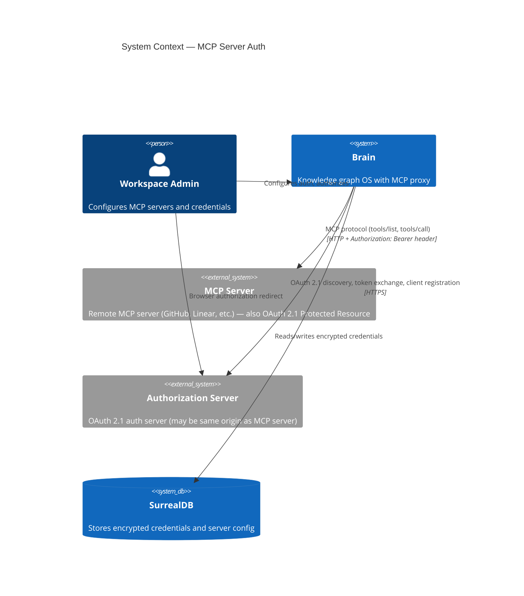
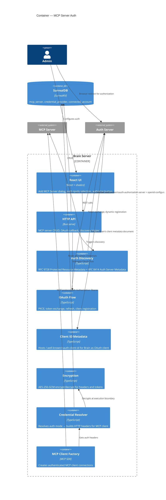

# Architecture Design — mcp-server-auth

## Overview

Adds two auth modes to the MCP server connection lifecycle: **static headers** (encrypted key-value pairs, Brain-specific convenience) and **MCP-native OAuth 2.1** (spec-compliant auto-discovery + PKCE authorization code flow per the [MCP Authorization spec](https://modelcontextprotocol.io/specification/draft/basic/authorization)). Extends the existing tool-registry module within Brain's modular monolith.

## Architecture Pattern

**Modular monolith** (existing) with **pure core / effect shell** (functional paradigm).

- **Pure core**: auth mode resolution, header building, metadata parsing, PKCE generation, scope selection
- **Effect shell**: HTTP fetches (discovery), encryption/decryption, SurrealDB queries, browser redirect orchestration

## C4 System Context



## C4 Container



## Component Design

### Backend Components

#### 1. Auth Discovery (`tool-registry/auth-discovery.ts`)

Implements MCP spec's Authorization Server Discovery (RFC 9728 + RFC 8414).

**Pure core:**
- `parseProtectedResourceMetadata(json) → ProtectedResourceMetadata` — validates RFC 9728 response, extracts `authorization_servers[]`
- `parseAuthServerMetadata(json) → AuthServerMetadata` — validates RFC 8414 response, extracts endpoints
- `deriveDiscoveryEndpoints(issuerUrl: string) → string[]` — returns ordered list of well-known URLs to try:
  1. `{origin}/.well-known/oauth-authorization-server/{path}` (path insertion, RFC 8414 §3.1)
  2. `{origin}/.well-known/openid-configuration/{path}` (OIDC path insertion)
  3. `{origin}/{path}/.well-known/openid-configuration` (OIDC path append)
  For URLs without path components, tries:
  1. `{origin}/.well-known/oauth-authorization-server`
  2. `{origin}/.well-known/openid-configuration`
- `deriveResourceMetadataUrl(serverUrl: string) → string` — `{origin}/.well-known/oauth-protected-resource`
- `selectAuthorizationServer(servers: string[]) → string` — selects first server (per RFC 9728 §7.6, client chooses)

**Effect shell:**
- `discoverAuth(serverUrl: string) → Promise<DiscoveredAuthConfig | undefined>`:
  1. Fetch `/.well-known/oauth-protected-resource` from MCP server origin
  2. If not found, try connecting to MCP server — on `401`, read `WWW-Authenticate` header for `resource_metadata` URL
  3. Parse Protected Resource Metadata, extract `authorization_servers[0]`
  4. Try each well-known endpoint for the auth server (ordered fallback)
  5. Return parsed config or undefined

#### 2. Static Header Manager (`tool-registry/static-headers.ts`)

Brain-specific convenience for servers using API keys/PATs (not part of MCP spec).

**Pure core:**
- `validateHeaders(headers: HeaderEntry[]) → ValidationResult` — validates:
  - No restricted names: `Host`, `Content-Length`, `Transfer-Encoding`, `Connection`
  - Non-empty names and values
  - No duplicate header names
- `buildHeaderMap(decryptedHeaders: HeaderEntry[]) → Record<string, string>` — converts to plain object

**Effect shell:**
- `encryptHeaders(headers: HeaderEntry[], keyHex: string) → EncryptedHeaderEntry[]`
- `decryptHeaders(encrypted: EncryptedHeaderEntry[], keyHex: string) → HeaderEntry[]`

#### 3. OAuth Flow (`tool-registry/oauth-flow.ts`)

MCP spec-compliant OAuth 2.1 implementation.

**Pure core:**
- `generatePkce() → PkceChallenge` — S256 code challenge (MUST per MCP spec §Authorization Code Protection)
- `buildAuthorizationUrl(params: AuthorizationParams) → string` — includes:
  - `response_type=code`
  - `client_id` (URL-format for Client ID Metadata Documents)
  - `redirect_uri`
  - `code_challenge` + `code_challenge_method=S256`
  - `state` (CSRF protection)
  - `resource` parameter (RFC 8707 — MCP server's canonical URI)
  - `scope` (from Protected Resource Metadata `scopes_supported` or auth server metadata)
- `buildTokenRequest(params: TokenExchangeParams) → { url, body, headers }` — authorization_code grant with PKCE verifier

**Effect shell:**
- `exchangeCode(config, code, redirectUri, codeVerifier) → Promise<TokenResult>`
- `refreshAccessToken(config, refreshToken) → Promise<TokenResult>`
- `registerDynamicClient(registrationEndpoint, metadata) → Promise<ClientRegistration>` — RFC 7591

#### 4. Client ID Metadata Document (`tool-registry/client-metadata.ts`)

Brain hosts its own Client ID Metadata Document (MCP spec's preferred registration approach).

**Pure core:**
- `buildClientMetadataDocument(brainBaseUrl: string) → ClientMetadataDocument` — returns JSON:
  ```json
  {
    "client_id": "https://brain.example.com/.well-known/oauth-client-id",
    "client_name": "Brain",
    "redirect_uris": ["https://brain.example.com/oauth/callback"],
    "grant_types": ["authorization_code"],
    "response_types": ["code"],
    "token_endpoint_auth_method": "none"
  }
  ```

**Route:**
- `GET /.well-known/oauth-client-id` — serves the metadata document (auth servers fetch this to verify Brain's client identity)

#### 5. Credential Resolver Extension (`proxy/credential-resolver.ts`)

Extended with new auth modes:

- `resolveAuthForMcpServer(server, deps) → Record<string, string>` — returns headers map:
  - `auth_mode: "none"` → empty headers
  - `auth_mode: "static_headers"` → decrypt stored headers, return as-is
  - `auth_mode: "oauth"` → load tokens from connected_account, refresh if expired, return `{ Authorization: "Bearer <token>" }`
  - `auth_mode: "provider"` → existing credential_provider flow (unchanged)

#### 6. Server Routes Extension

New/modified endpoints:
- `POST /mcp-servers` — extended with `auth_mode` and `static_headers` fields
- `PUT /mcp-servers/:id/headers` — update static headers (encrypted at rest)
- `POST /mcp-servers/:id/discover-auth` — trigger OAuth discovery, auto-create credential_provider, return config
- `GET /mcp-servers/:id/auth-status` — current auth state (connected, expired, not_authorized, none)
- `GET /.well-known/oauth-client-id` — Brain's Client ID Metadata Document
- `GET /oauth/callback` — receives authorization code from auth server redirect

### Frontend Components

#### 7. AddMcpServerDialog Enhancement

Current: name, url, transport, optional provider dropdown.

New auth mode selector (replaces provider dropdown):
- **No Auth**: name + URL + transport (default)
- **Static Headers**: dynamic key-value input list, values masked, add/remove buttons
- **OAuth**:
  - On URL entry → auto-triggers discovery in background
  - Discovery succeeds → shows auth server name + "Authorize" button
  - Discovery fails → shows error, suggests switching to Static Headers
  - "Authorize" → opens browser tab to authorization URL
  - Callback auto-closes, server status updates to "Connected"

#### 8. McpServerSection Auth Status

Server rows gain:
- Auth mode badge: "No Auth" | "Headers" | "OAuth"
- OAuth status: "Connected" (green) | "Expired" (amber, + Re-authorize button) | "Not authorized" (gray)

#### 9. OAuth Callback Page

Minimal route: `/oauth/callback`
- Receives `code` + `state` query params from auth server redirect
- Calls Brain API to exchange code for tokens
- Shows success/error → auto-redirects to Tool Registry after 2s

### Data Flow: Static Headers

```
Admin enters headers in dialog
  → POST /mcp-servers { auth_mode: "static_headers", static_headers: [{name, value}] }
  → Server validates header names (no restricted headers)
  → Encrypts each value with AES-256-GCM
  → Stores as static_headers on mcp_server record
  → On MCP connect: resolver decrypts → injects all headers into HTTP transport
```

### Data Flow: MCP OAuth 2.1 (spec-compliant)

```
1. Admin enters MCP server URL, selects "OAuth"
2. Brain fetches /.well-known/oauth-protected-resource from MCP server
   - If 404: tries connecting → on 401, reads WWW-Authenticate resource_metadata URL
3. Parses Protected Resource Metadata → extracts authorization_servers[0]
4. Brain tries auth server well-known endpoints (ordered fallback):
   a. /.well-known/oauth-authorization-server/{path}
   b. /.well-known/openid-configuration/{path}
   c. {path}/.well-known/openid-configuration
5. Parses Auth Server Metadata → stores endpoints in auto-created credential_provider
6. Client registration:
   a. Primary: Brain's client_id = URL to its Client ID Metadata Document
      (auth server fetches https://brain.example.com/.well-known/oauth-client-id)
   b. Fallback: Dynamic Client Registration (RFC 7591) if registration_endpoint exists
7. Admin clicks "Authorize"
8. Brain generates PKCE pair (S256) + state token
9. Browser redirects to authorization_endpoint with:
   - response_type=code, client_id, redirect_uri, code_challenge, state
   - resource=<MCP server canonical URI> (RFC 8707)
   - scope=<from Protected Resource Metadata or auth server>
10. User authorizes at auth server
11. Auth server redirects to /oauth/callback?code=...&state=...
12. Brain exchanges code for tokens at token_endpoint with code_verifier
13. Encrypts access_token + refresh_token → stores in connected_account
14. Links connected_account to mcp_server.oauth_account
15. MCP server status → "connected"
```

### Data Flow: Token Refresh

```
On MCP connect for OAuth server:
  → Resolver loads connected_account tokens
  → If token_expires_at < now + 60s:
    → Refresh using refresh_token grant at token_endpoint
    → Encrypt + store new tokens
    → If refresh fails: set server last_status = "auth_error", surface to admin
  → Return Authorization: Bearer <access_token>
```

### Data Flow: Insufficient Scope (Step-Up Authorization)

```
On MCP request → server returns 403 with WWW-Authenticate insufficient_scope:
  → Parse required scopes from response
  → Trigger re-authorization with expanded scope set
  → Retry original request with new token (max 2 retries)
```

## Integration Points

| Existing Component | Integration |
|---|---|
| `credential-resolver.ts` | Extended with `resolveAuthForMcpServer()` — static headers + OAuth Bearer |
| `mcp-client-factory.ts` | Calls resolver for auth headers before creating transport |
| `encryption.ts` | Reused for header value and token encryption (ADR-066) |
| `server-routes.ts` | Extended with discovery, headers, callback endpoints |
| `oauth-flow.ts` | Extended with PKCE, dynamic registration, Client ID Metadata |
| `queries.ts` | Extended with auth-related CRUD queries |
| `McpServerSection.tsx` | Enhanced with auth mode + status display |
| `AddMcpServerDialog.tsx` | Redesigned with auth mode selector |

## Security Considerations

1. **SSRF**: Discovery fetches admin-provided URLs and discovered auth server URLs. Validate URL scheme (HTTPS required in production per MCP spec §Communication Security), reject private IP ranges (`10.x`, `172.16-31.x`, `192.168.x`, `127.x`, `::1`), 5s timeout.
2. **Header injection**: Validate header names against blocklist (`Host`, `Content-Length`, `Transfer-Encoding`, `Connection`).
3. **PKCE**: S256 required for all OAuth flows (MCP spec mandate). Prevents authorization code interception.
4. **State parameter**: CSRF protection — cryptographically random, tied to session, 10-min TTL.
5. **Resource parameter**: RFC 8707 — binds token audience to MCP server's canonical URI.
6. **Token audience validation**: Tokens MUST NOT be sent to servers other than the one they were issued for (MCP spec §Token Audience Binding).
7. **Token storage**: AES-256-GCM (ADR-066). Decryption only at execution boundary.
8. **Client ID Metadata Document**: Served over HTTPS, `client_id` in document MUST match the document URL exactly.
9. **Communication**: All auth server endpoints MUST be HTTPS. Redirect URIs MUST be localhost or HTTPS (MCP spec §Communication Security).
