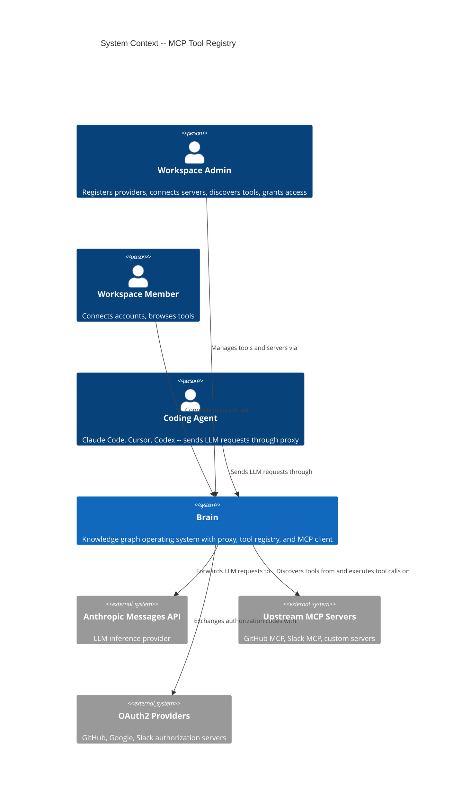
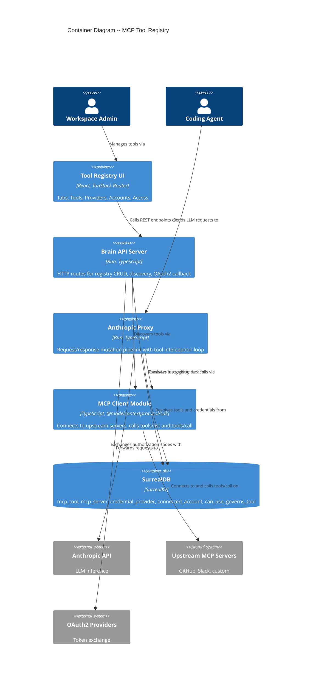
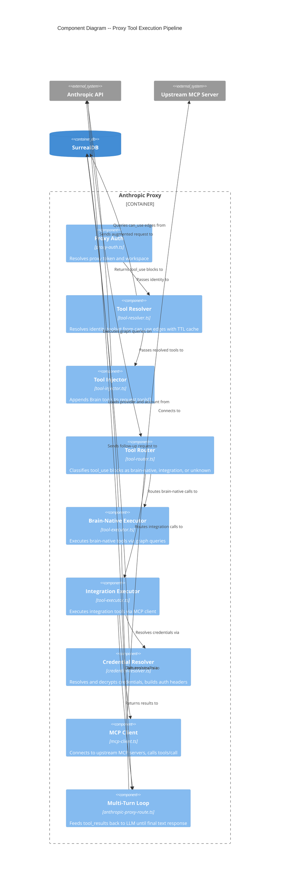

# MCP Tool Registry UI -- Architecture

## 1. Overview

A workspace-scoped admin UI for managing MCP tool integrations: credential providers, connected accounts (including OAuth2 flows), registered tools, identity-level grants (`can_use` edges), governance policy links (`governs_tool` edges), MCP server connections, tool discovery, and transparent tool execution via the proxy pipeline.

Adds one new sidebar nav item ("Tool Registry") and a tabbed page at `/tools`.

## 2. Scope

### In scope
- **Tools tab**: list registered MCP tools with toolkit grouping, view tool detail (schema, risk level, grants, governance), MCP server discovery section
- **Providers tab**: list, create, delete credential providers (oauth2, api_key, bearer, basic)
- **Accounts tab**: list connected accounts, connect new account (static credentials or OAuth2 redirect), revoke account
- **Access tab**: grant/revoke `can_use` edges, view effective toolset per identity
- **Tool detail panel**: expandable row showing input_schema, linked provider, `can_use` grants, `governs_tool` policies
- **MCP server management**: connect external MCP servers, `tools/list` discovery with review, selective import, on-demand sync (see [architecture-mcp-discovery.md](./architecture-mcp-discovery.md))
- **MCP client module**: connect to upstream MCP servers via SSE and Streamable HTTP transports
- **Tool executor (proxy step 9)**: execute integration-classified tool calls on upstream MCP servers via MCP protocol
- **Multi-turn loop (proxy step 8.5)**: unified brain-native + integration + unknown handling per iteration
- **OAuth2 callback handler**: backend route to complete the authorization code exchange
- **Tool CRUD endpoints**: backend routes to list/create/update tools
- **Grant management endpoints**: backend routes to create/revoke `can_use` edges

### Out of scope
- Streaming tool interception (deferred per ADR-067)
- Governance policy CRUD (already exists at `/policies`)
- Bulk import/export of tools or providers
- Persistent MCP connections or `listChanged` subscriptions (ADR-070)

## 3. System Context (C4 Level 1)



## 4. Container Diagram (C4 Level 2)



## 5. Component Diagram: Proxy Pipeline (C4 Level 3)



## 6. Proxy Pipeline Steps (Revised)

| Step | Name | Module | Description |
|------|------|--------|-------------|
| 1 | Identity Resolution | identity-resolver.ts | Resolve identity from proxy token |
| 2 | Session Resolution | session-id-resolver.ts | Resolve or create session |
| 3 | Conversation Hash | session-hash-resolver.ts | Deterministic UUIDv5 from content |
| 4 | Policy Evaluation | policy-evaluator.ts | Evaluate proxy policies |
| 5 | Context Injection | context-injector.ts | Inject brain context into system prompt |
| 6 | Request Forwarding | anthropic-proxy-route.ts | Forward to Anthropic API |
| 7 | Tool Resolution | tool-resolver.ts | Resolve identity's effective toolset (cached) |
| 7.5 | Tool Injection | tool-injector.ts | Append Brain tools to request tools[] |
| 8 | Response Read | anthropic-proxy-route.ts | Read full response (non-streaming) |
| 8.5 | Tool Classification | tool-router.ts | Classify tool_use blocks |
| **9** | **Tool Execution** | **tool-executor.ts** | **Execute brain-native (graph) + integration (MCP) tools** |
| **9.5** | **Result Merge** | **tool-executor.ts** | **Combine all tool_results into single message** |
| **10** | **Multi-Turn Loop** | **anthropic-proxy-route.ts** | **Send follow-up to LLM, repeat 8-9.5 until text response (max 10 iterations)** |
| 11 | Trace Capture | trace-writer.ts | Async trace recording |

Steps in **bold** are new or significantly revised.

## 7. Component Architecture

### 7.1 Frontend

```
/tools (ToolRegistryPage)
+-- Tab: Tools
|   +-- McpServerSection (collapsible)
|   |   +-- Server list (name, url, status, tool_count, last_discovery)
|   |   +-- AddMcpServerDialog
|   |   +-- DiscoveryReviewPanel
|   +-- ToolTable (grouped by toolkit)
|   +-- ToolDetailPanel (expandable)
+-- Tab: Providers
|   +-- ProviderTable
|   +-- CreateProviderDialog
|   +-- DeleteProviderConfirm
+-- Tab: Accounts
|   +-- AccountTable
|   +-- ConnectAccountDialog (static + OAuth2)
|   +-- RevokeAccountConfirm
+-- Tab: Access
    +-- GrantTable (per tool, expandable)
    +-- CreateGrantDialog
```

### 7.2 File layout

```
app/src/client/
  routes/tool-registry-page.tsx         # Page component with tab state
  components/tool-registry/
    ProviderTable.tsx
    CreateProviderDialog.tsx
    AccountTable.tsx
    ConnectAccountDialog.tsx
    ToolTable.tsx
    ToolDetailPanel.tsx
    McpServerSection.tsx
    AddMcpServerDialog.tsx
    DiscoveryReviewPanel.tsx
    GrantTable.tsx
    CreateGrantDialog.tsx
  hooks/
    use-providers.ts
    use-accounts.ts
    use-tools.ts
    use-mcp-servers.ts
    use-grants.ts

app/src/server/
  tool-registry/
    routes.ts                            # Provider + account route handlers (existing)
    queries.ts                           # Provider + account + governance queries (existing)
    types.ts                             # Domain types (existing)
    tool-routes.ts                       # Tool CRUD + list route handlers (new)
    grant-routes.ts                      # can_use edge management route handlers (new)
    server-routes.ts                     # MCP server CRUD + discovery route handlers (new)
    server-queries.ts                    # MCP server SurrealDB queries (new)
    mcp-client.ts                        # MCP client connection factory (new)
    discovery.ts                         # Discovery service: tools/list + sync algorithm (new)
    oauth-callback.ts                    # OAuth2 callback route handler (new)
  proxy/
    tool-executor.ts                     # Brain-native + integration execution (revised)
    credential-resolver.ts              # Credential resolution chain (existing, reused)
    tool-router.ts                       # Tool classification (existing)
    tool-injector.ts                     # Tool injection (existing)
    tool-resolver.ts                     # Tool resolution with cache (revised: add source_server)
    anthropic-proxy-route.ts             # Proxy pipeline with unified loop (revised)
```

## 8. Backend Gaps and New Endpoints

### 8.1 Existing endpoints (no changes needed)

| Method | Path | Handler |
|--------|------|---------|
| POST | `/api/workspaces/:wsId/providers` | Create provider |
| GET | `/api/workspaces/:wsId/providers` | List providers |
| POST | `/api/workspaces/:wsId/accounts/connect/:providerId` | Connect account |
| GET | `/api/workspaces/:wsId/accounts` | List accounts |
| DELETE | `/api/workspaces/:wsId/accounts/:accountId` | Revoke account |

### 8.2 New endpoints required

| Method | Path | Purpose |
|--------|------|---------|
| GET | `/api/workspaces/:wsId/accounts/oauth2/callback` | OAuth2 callback: exchange code, create account, redirect |
| GET | `/api/workspaces/:wsId/tools` | List MCP tools with grant/governance counts |
| GET | `/api/workspaces/:wsId/tools/:toolId` | Tool detail with schema, grants, governance |
| POST | `/api/workspaces/:wsId/tools` | Register a new MCP tool |
| PUT | `/api/workspaces/:wsId/tools/:toolId` | Update tool (status, description, risk_level) |
| POST | `/api/workspaces/:wsId/tools/:toolId/grants` | Create can_use edge |
| DELETE | `/api/workspaces/:wsId/tools/:toolId/grants/:grantId` | Revoke can_use edge |
| DELETE | `/api/workspaces/:wsId/providers/:providerId` | Delete provider (guard: no active accounts) |
| POST | `/api/workspaces/:wsId/mcp-servers` | Register MCP server |
| GET | `/api/workspaces/:wsId/mcp-servers` | List MCP servers |
| GET | `/api/workspaces/:wsId/mcp-servers/:serverId` | Server detail |
| DELETE | `/api/workspaces/:wsId/mcp-servers/:serverId` | Remove server + disable discovered tools |
| POST | `/api/workspaces/:wsId/mcp-servers/:serverId/discover` | Trigger discovery (dry_run query param) |
| POST | `/api/workspaces/:wsId/mcp-servers/:serverId/sync` | Apply discovery results |

### 8.3 OAuth2 callback handler design

The `oauth-flow.ts` module already provides `consumeOAuthState()` and `exchangeCodeForTokens()`. The callback handler:
1. Extracts `code` and `state` from query params
2. Calls `consumeOAuthState(state)` -- returns `{ providerId, identityId, workspaceId }` or rejects if expired/missing
3. Loads provider record via `getProviderById()`
4. Calls `exchangeCodeForTokens(provider, code, redirectUri)` to get access/refresh tokens
5. Encrypts tokens via `encryptSecret()`
6. Creates `connected_account` record via `createConnectedAccount()`
7. Redirects (302) to `/tools?tab=accounts&status=connected`

Error cases redirect to `/tools?tab=accounts&status=error&reason=<code>`.

## 9. MCP Client Module

File: `app/src/server/tool-registry/mcp-client.ts`

See [architecture-mcp-discovery.md](./architecture-mcp-discovery.md) Section 4 for full specification.

Key design points for tool execution (beyond discovery):

### 9.1 Connection lifecycle for tool execution

The proxy creates a request-scoped connection map:
```
Request starts -> Map<serverId, Client> (empty)
  -> First tool call to server X: connect, store in map
  -> Second tool call to server X: reuse from map
  -> Request ends (finally): close all connections in map
```

### 9.2 Credential injection for execution

Same pattern as discovery (Section 4 of architecture-mcp-discovery.md). The credential resolver (`credential-resolver.ts`) already resolves and decrypts credentials for a tool name. For MCP execution, the resolved `headers` are injected into the MCP transport:

1. Tool executor receives classified integration tool call
2. Looks up `source_server` from the tool's `ResolvedTool` (added by revised tool resolver query)
3. Loads `mcp_server` record to get URL, transport, and optional `provider` reference
4. If `mcp_server.provider` is set: resolve credentials via existing `resolveCredentialsForTool`
5. Inject resolved headers into MCP transport `requestInit.headers`
6. Connect, call `tools/call`, return result

### 9.3 Error handling

- Connection failure: return `tool_result` with `is_error: true` and descriptive message
- MCP `tools/call` error: forward MCP error content as `tool_result` with `is_error: true`
- Timeout (10s): abort connection, return `is_error: true` with timeout message
- All errors are tool_results, never HTTP 500s from the proxy

## 10. Tool Executor (Revised)

File: `app/src/server/proxy/tool-executor.ts`

### 10.1 Integration execution via MCP (replaces HTTP fetch)

The current `executeIntegrationTools` function uses HTTP fetch with `endpoint_url` from tool input. This is replaced with MCP protocol execution:

1. **Governance check**: unchanged (existing `fetchGovernancePolicies` + `evaluateGovernancePolicies`)
2. **Rate limit check**: unchanged (existing `fetchCanUseRateLimit` + `evaluateRateLimit`)
3. **Source server lookup**: load `mcp_server` record via `source_server` from resolved tool
4. **Credential resolution**: use existing `resolveCredentialsForTool` to get auth headers
5. **MCP connection**: get-or-create from request-scoped connection map
6. **Tool call**: `client.callTool({ name, arguments })` via MCP SDK
7. **Response mapping**: map MCP `CallToolResult` to `ToolExecutionResult`
   - `content` array with `text` items -> concatenate as string
   - `isError` from MCP result
8. **Sanitization**: apply existing `sanitizeIntegrationResponse` to the result content
9. **Trace capture**: unchanged (existing `captureToolTrace`)

### 10.2 Unified execution function

New function `executeAllToolCalls` replaces the two-branch pattern:

```
executeAllToolCalls(classifiedCalls, brainNativeDeps, integrationDeps, connectionMap)
  -> partition calls into brain-native, integration, unknown
  -> execute brain-native via executeBrainNativeTools (existing)
  -> execute integration via executeIntegrationToolsViaMcp (new)
  -> generate error results for unknown calls
  -> merge all results, ordered by original tool_use block position
  -> return ToolExecutionResult[]
```

## 11. Multi-Turn Loop (Revised)

In `anthropic-proxy-route.ts`, the tool use loop is unified:

```
MAX_ITERATIONS = 10
conversationMessages = [...originalMessages]
connectionMap = new Map<string, Client>()

try {
  while (iteration < MAX_ITERATIONS) {
    parse response
    if not tool_use response -> break
    extract tool_use blocks
    classify all blocks
    if all unknown -> break (pass through)

    results = executeAllToolCalls(classified, brainDeps, integDeps, connectionMap)
    toolResultMessage = buildToolResultMessage(results)

    conversationMessages.push(assistantMessage, toolResultMessage)
    followUpResponse = fetch(anthropic, { messages: conversationMessages })
    responseBody = followUpResponse.text()
    iteration++
  }
} finally {
  // Close all MCP connections
  for (const client of connectionMap.values()) {
    client.close().catch(log.warn)
  }
}
```

## 12. Schema Changes

### 12.1 New table: `mcp_server`

See [architecture-mcp-discovery.md](./architecture-mcp-discovery.md) Section 3 for full schema.

### 12.2 New field on `mcp_tool`: `source_server`

Migration: `schema/migrations/0066_mcp_server_table.surql`

```sql
DEFINE FIELD OVERWRITE source_server ON mcp_tool TYPE option<record<mcp_server>>;
```

### 12.3 Revised tool resolver query

The `can_use` graph query in `tool-resolver.ts` (`createQueryGrantedTools`) adds `source_server`:

```sql
SELECT out.name AS name, out.description AS description,
       out.input_schema AS input_schema, out.toolkit AS toolkit,
       out.risk_level AS risk_level, out.source_server AS source_server
FROM can_use
WHERE in = $identity AND out.status = 'active' AND out.workspace = $workspace;
```

`ResolvedTool` type gains:
```
source_server?: RecordId<"mcp_server", string>
```

## 13. Shared Contract Types

Add to `app/src/shared/contracts.ts`:

```typescript
// --- Tool Registry UI contracts ---

type ProviderApiResponse = {
  id: string;
  name: string;
  display_name: string;
  auth_method: "oauth2" | "api_key" | "bearer" | "basic";
  has_client_secret: boolean;
  client_id?: string;
  scopes?: string[];
  api_key_header?: string;
  created_at: string;
};

type AccountApiResponse = {
  id: string;
  provider_id: string;
  provider_name: string;
  provider_display_name: string;
  status: "active" | "revoked" | "expired";
  has_api_key: boolean;
  has_bearer_token: boolean;
  has_basic_credentials: boolean;
  has_access_token: boolean;
  connected_at: string;
};

type ToolListItem = {
  id: string;
  name: string;
  toolkit: string;
  description: string;
  risk_level: "low" | "medium" | "high" | "critical";
  status: "active" | "disabled";
  provider_id?: string;
  provider_name?: string;
  source_server_id?: string;
  source_server_name?: string;
  grant_count: number;
  governance_count: number;
  created_at: string;
};

type ToolDetail = ToolListItem & {
  input_schema: Record<string, unknown>;
  output_schema?: Record<string, unknown>;
  grants: Array<{
    id: string;
    identity_id: string;
    identity_name: string;
    granted_at: string;
    max_calls_per_hour?: number;
  }>;
  governance_policies: Array<{
    id: string;
    policy_title: string;
    policy_status: string;
    conditions?: string;
    max_per_call?: number;
    max_per_day?: number;
  }>;
};

type McpServerListItem = {
  id: string;
  name: string;
  url: string;
  transport: "sse" | "streamable-http";
  last_status: "ok" | "error";
  provider_id?: string;
  provider_name?: string;
  tool_count: number;
  last_discovery?: string;
  last_error?: string;
  server_version?: string;
  created_at: string;
};

type DiscoveryResult = {
  created: number;
  updated: number;
  disabled: number;
  unchanged: number;
  tools: ToolSyncDetail[];
};

type ToolSyncDetail = {
  name: string;
  description: string;
  action: "create" | "update" | "disable" | "unchanged";
  risk_level: "low" | "medium" | "high" | "critical";
  changes?: string[];
  input_schema: Record<string, unknown>;
};

type AddMcpServerInput = {
  name: string;
  url: string;
  transport?: "sse" | "streamable-http";
  provider_id?: string;
};
```

## 14. Data Flow

### Tool execution via proxy (end-to-end)

```
Agent sends LLM request -> Proxy
  -> Step 7: Resolve identity toolset (can_use graph + cache)
  -> Step 7.5: Inject Brain tools into request tools[]
  -> Step 8: Forward to Anthropic, read response
  -> Step 8.5: Classify tool_use blocks
  -> Step 9: Execute all classified tools:
       brain-native: graph queries
       integration: credential resolve -> MCP connect -> tools/call -> sanitize
       unknown: error tool_result
  -> Step 9.5: Merge all tool_results into single message
  -> Step 10: Send follow-up to Anthropic with tool_results
  -> Repeat 8-10 until text response or max 10 iterations
  -> Return final response to agent
```

### Discovery flow

```
Admin clicks "Discover" -> POST /mcp-servers/:id/discover?dry_run=true
  -> Load mcp_server record
  -> Resolve credentials (if server has provider link)
  -> Connect to MCP server via mcp-client.ts
  -> Call tools/list
  -> Diff against existing mcp_tool records
  -> Return DiscoveryResult (no DB writes)
  -> Admin reviews, selects tools
  -> POST /mcp-servers/:id/sync with selected tools
  -> Apply: create/update/disable mcp_tool records
  -> Update mcp_server.last_discovery, tool_count
```

## 15. UI Patterns

- **Tabs**: Use shadcn Tabs component. Tab state via URL search params (`?tab=tools`) for deep-linking and OAuth2 callback redirects.
- **Tables**: Follow `PoliciesPage` table pattern -- `<table>` with `text-xs`, hover rows, badge for status/risk
- **Dialogs**: Follow `CreatePolicyDialog` pattern -- controlled dialog with form state, async submit
- **Hooks**: Follow `useLearnings` pattern -- `useState` + `useCallback` + `fetch`, return `{ data, isLoading, error, refresh }`
- **Sidebar**: Add "Tool Registry" link following existing `Link` + `matchRoute` + `navItemClass` pattern
- **Risk badges**: color-coded -- low: green, medium: amber, high: red, critical: destructive
- **Status badges**: active: default, disabled: secondary, revoked: destructive, expired: secondary
- **Tool provenance badge**: "manual" for tools without source_server, server name for discovered tools

## 16. Security Considerations

- **No plaintext secrets**: API responses use `has_*` boolean indicators, never return encrypted values
- **Encryption**: All credential storage uses AES-256-GCM via existing `encryption.ts` (ADR-066)
- **OAuth2 state**: CSRF protection via `consumeOAuthState()` with 10-minute TTL
- **Provider deletion guard**: Cannot delete provider with active connected accounts
- **MCP server URL validation**: Only `http://` and `https://` URLs. No `file://`, `javascript://`, etc.
- **SSRF consideration**: Admin-provided MCP server URLs require network-level restrictions in production
- **Credential isolation**: MCP client transport headers never logged or returned in API responses
- **Response sanitization**: Integration tool responses stripped of sensitive headers and credential fields (existing `sanitizeIntegrationResponse`)
- **Transport security**: No downgrade from HTTPS to HTTP when falling back from Streamable HTTP to SSE

## 17. Testing Strategy

- **Acceptance tests**: Tool execution end-to-end (mock MCP server via InMemoryTransport), discovery flow, OAuth2 callback, tool CRUD, grant CRUD, provider deletion guard, multi-turn loop with mixed tool calls
- **Unit tests**: Tool classification (existing), governance evaluation (existing), risk_level inference from MCP annotations, sync diff algorithm, URL validation, response sanitization (existing), unified result merging
- **Pattern**: Follow existing `tests/acceptance/tool-registry/` structure. Use `createTestUserWithMcp()` for DPoP-authenticated requests.
- **MCP mock**: Use `@modelcontextprotocol/sdk`'s `InMemoryTransport` for acceptance tests with a mock MCP server that exposes known tools

## 18. Quality Attribute Strategies

| Quality Attribute | Strategy |
|-------------------|----------|
| Performance | Tool resolution cached (60s TTL, ADR-065). MCP connections reused within request. Response truncated at 100KB. |
| Security | AES-256-GCM encryption (ADR-066). Credential isolation. SSRF-safe URL validation. Response sanitization. |
| Reliability | Tool errors returned as tool_results (graceful). Max 10 iterations safety limit. Connection timeout 10s. |
| Maintainability | Ports-and-adapters: MCP client as adapter, tool executor as port. Pure classification functions. |
| Testability | MCP client injectable via factory. InMemoryTransport for mock servers. Pure functions for classification, governance, sanitization. |
| Observability | Wide-event spans per proxy request. Tool execution traces. MCP server status tracking. |

## 19. Architectural Enforcement

- **Dependency direction**: `proxy/` depends on `tool-registry/` for types and credential resolution. `tool-registry/` does not depend on `proxy/`. Enforce with import-linter or ESLint import rules.
- **No module-level singletons**: MCP connections are request-scoped. Tool resolution cache is created per handler factory instance, not at module level.
- **Encrypted field naming**: All `_encrypted` fields (ADR-068) enforced by SCHEMAFULL schema -- cannot persist un-suffixed credential field names.

## 20. External Integrations

**Contract tests recommended for:**
- **Upstream MCP Servers** (MCP protocol): consumer-driven contracts via Pact-JS to verify tools/list and tools/call response shapes
- **Anthropic Messages API** (HTTP REST): existing proxy tests cover this
- **OAuth2 Providers** (token exchange): consumer-driven contracts via Pact-JS for token endpoint response shape

Annotation for platform-architect handoff: "Contract tests recommended for upstream MCP server protocol compliance and OAuth2 token exchange endpoints -- consumer-driven contracts (e.g., Pact-JS) to detect breaking changes before production."
