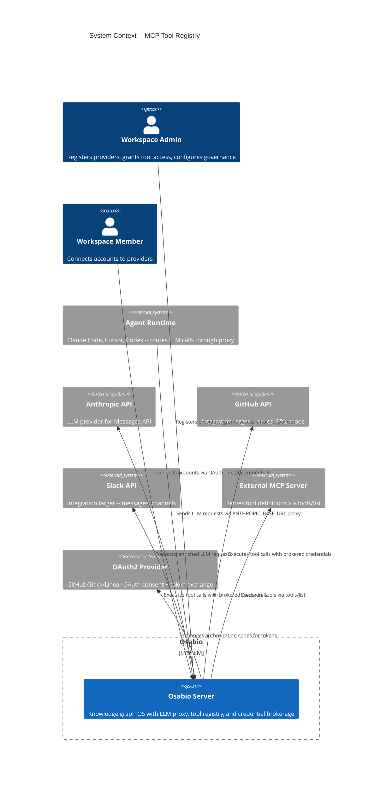
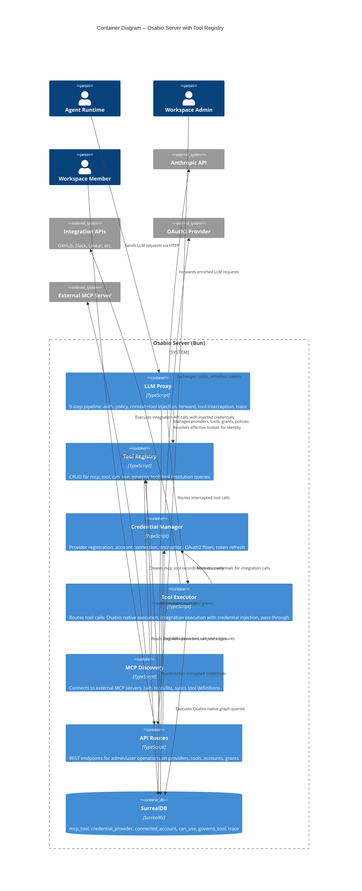
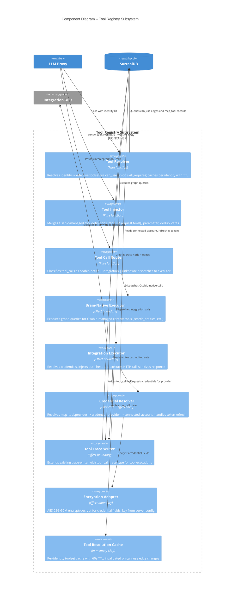

# Architecture Design -- MCP Tool Registry (#178)

## System Context and Capabilities

Osabio's MCP Tool Registry extends the existing LLM proxy to become a **tool brokerage layer**. Any agent routing LLM calls through Osabio's proxy gets workspace-managed tools injected into requests, tool calls intercepted and executed with brokered credentials, and full forensic traces written -- all transparently.

**Core capabilities:**
- Graph-native tool registry (`mcp_tool` nodes in SurrealDB)
- Per-identity tool authorization via `can_use` relation edges
- Proxy-based tool injection into LLM request `tools[]` parameter
- Three-way tool call routing: Osabio-native | integration | pass-through
- Credential brokerage with encrypted-at-rest secrets and OAuth2 token refresh
- Governance via `governs_tool` policy edges
- Full audit trail via existing trace infrastructure

**What this is NOT:**
- Not a standalone MCP server (existing CLI MCP server remains unchanged)
- Not a replacement for the existing proxy pipeline (extends steps 5-7)
- Not a multi-provider proxy (Anthropic Messages API only, per ADR-045)

## C4 System Context (L1)



## C4 Container (L2)



## C4 Component (L3) -- Tool Registry Subsystem



## Proxy Pipeline Extension

The existing 9-step proxy pipeline (ADR-040, ADR-046) is extended with tool injection and tool call interception. The new steps slot into the existing flow without modifying prior steps.

```
Existing Pipeline:
  1. Parse request body
  2. Resolve auth (Osabio/direct)
  3. Resolve identity
  4. Resolve session
  5. Validate workspace
  6. Evaluate policy
  7. Inject context (BM25 + recent changes)
  8. Forward to Anthropic
  9. Async trace capture

Extended Pipeline:
  1-6. (unchanged)
  7.  Inject context (unchanged)
  7.5 Resolve effective toolset -> Inject tools into request  [NEW]
  8.  Forward to Anthropic (with injected tools)
  8.5 Intercept tool_calls in response -> Route + Execute     [NEW]
  9.  Async trace capture (extended with tool_call traces)
```

**Step 7.5 -- Tool Injection** (pre-forward):
- Query `can_use` edges for identity -> get `mcp_tool` records
- (Future: union with `possesses -> skill_requires` when #177 ships)
- Convert `mcp_tool` records to Anthropic tool format
- Append to request `tools[]` (additive, runtime tools preserved)
- Cache resolved toolset per identity (60s TTL)

**Step 8.5 -- Tool Call Interception** (post-response):
- Parse LLM response for `tool_use` content blocks (non-streaming) or `content_block_start` events (streaming)
- For each tool_call, classify:
  - **Osabio-native**: `tool_name` matches an `mcp_tool` without `provider` -> execute via osabio-native tool registry (reuses `chat/tools/*.ts` handlers)
  - **Integration**: `tool_name` matches an `mcp_tool` with `provider` -> governance check -> credential resolution -> HTTP execution -> sanitization
  - **Unknown**: no matching `mcp_tool` -> pass through to runtime (do not intercept)
- **Governance ordering** (integration tools): `classify -> check governs_tool policies -> resolve credentials -> execute -> sanitize -> trace`. Policy check happens BEFORE credential resolution -- denied calls never touch credentials.
- Return tool results back into the LLM conversation loop

### Non-Streaming vs Streaming Tool Call Handling

**Non-streaming**: Proxy receives full response, parses `content` array for `tool_use` blocks, executes sequentially, returns results as next request's `tool_result` messages. This requires the proxy to manage a multi-turn loop internally.

**Streaming**: Proxy accumulates `content_block_start` (type=tool_use) and `content_block_delta` events to reconstruct tool calls, then executes after `message_stop`. SSE relay continues for text blocks.

**Walking skeleton**: Start with non-streaming tool interception only. Streaming support layers on in a later phase.

## Integration Points

| Integration Point | Existing Code | Extension |
|---|---|---|
| Auth resolution | `proxy-auth.ts` | No change -- identity resolved from `X-Osabio-Auth` or `x-api-key` |
| Policy evaluation | `policy-evaluator.ts` | Extended to evaluate `governs_tool` edges for tool calls. Governance check runs BEFORE credential resolution in step 8.5 -- denied calls never touch credentials. |
| Context injection | `context-injector.ts` | No change -- tool injection is a separate step after context |
| Trace capture | `trace-writer.ts` | Extended with `tool_call` trace type and tool-specific fields |
| Chat tools | `chat/tools/*.ts` | Osabio-native executor reuses these handlers via a static tool registry map built at startup. Adapts `tool_call.arguments` → tool's Zod `inputSchema` → handler → `tool_result`. See component-boundaries.md for bridge pattern. |
| DPoP auth | `mcp-dpop-auth.ts` | API routes for admin/user operations use existing DPoP middleware |

## Quality Attribute Strategies

### Security (Priority 1)
- AES-256-GCM encryption for all credential fields at rest (see data-models.md)
- Encryption key from `ServerConfig` (parsed once at startup, never in `process.env`)
- Credentials decrypted only at execution boundary, never passed to LLM context
- Integration API responses sanitized: strip HTTP headers (`Authorization`, `Set-Cookie`, `X-API-Key`, `WWW-Authenticate`), strip JSON fields matching credential patterns (`access_token`, `refresh_token`, `api_key`, `client_secret`, `password`, `secret`, `token` -- case-insensitive recursive), truncate body to 100KB
- `connected_account` credential fields deleted (not just status-flagged) on revocation

### Auditability (Priority 2)
- Every tool execution produces a `trace` record with `type: "tool_call"`
- Trace includes: `tool_name`, `identity`, `workspace`, `duration_ms`, `outcome` (success/error/denied/rate_limited)
- Integration traces include: `credential_provider` reference (never credential values)
- Policy denials produce traces with denial reason
- Existing `governed_by` edge pattern reused for tool governance audit trail

### Maintainability (Priority 3)
- Pure core / effect shell: tool resolution, injection, routing are pure functions
- Effect boundaries at: SurrealDB queries, HTTP calls, encryption operations
- All new modules follow existing ports-and-adapters pattern (see `proxy-auth.ts` as reference)
- Composition pipeline: `resolveTools |> injectTools |> forwardRequest |> interceptToolCalls |> routeAndExecute |> writeTrace`

### Latency (Priority 4)
- Tool resolution cached per identity with 60s TTL (in-memory `Map`, same pattern as `WorkspaceCache`)
- Cache invalidation: TTL-based (not event-driven) -- acceptable for 60s staleness
- Target: tool resolution + injection < 50ms (single SurrealDB query with index)
- Target: credential resolution < 200ms (single query + optional OAuth refresh)
- Fail-open: if tool resolution fails, forward request without injected tools (same pattern as context injection)

### Compatibility (Priority 5)
- Tool injection is additive -- runtime tools in request preserved exactly
- Tool format matches Anthropic Messages API `tools[]` schema
- Unknown tool calls passed through -- agent runtimes continue to handle their own tools
- Osabio-managed tools namespaced with toolkit prefix (e.g., `github.create_issue`) to avoid collisions

## Deployment Architecture

No new deployment units. Tool registry runs in-process within the existing Osabio Bun server (per ADR-040). New modules are registered as routes in `start-server.ts` alongside existing proxy and API routes.

**New config fields** (added to `ServerConfig`):
- `toolEncryptionKey`: AES-256-GCM key for credential encryption (required when tool registry is enabled)
- `toolResolutionCacheTtlMs`: TTL for per-identity tool cache (default: 60000)

## Development Paradigm

Functional TypeScript per project CLAUDE.md:
- Types-first: algebraic data types for tool resolution results, credential states, routing decisions
- Pure core: resolution, injection, routing, sanitization are pure functions
- Effect shell: SurrealDB queries, HTTP calls, encryption at adapter boundary
- Composition pipelines over class hierarchies
- `Result` pattern for error handling in credential resolution (expired/missing/revoked are values, not exceptions)

## Requirements Traceability

| Requirement | Component(s) | ADR |
|---|---|---|
| FR-1: Tool Registry Schema | `tool-registry/queries.ts`, `types.ts`, migration 0065 | -- |
| FR-2: Direct Tool Authorization | `tool-registry/queries.ts` (can_use CRUD) | -- |
| FR-3: Tool Resolution | `proxy/tool-resolver.ts` | ADR-065 |
| FR-4: Proxy Tool Injection | `proxy/tool-injector.ts`, proxy route step 7.5 | ADR-064 |
| FR-5: Proxy Tool Call Interception | `proxy/tool-router.ts`, `proxy/tool-executor.ts`, proxy route step 8.5 | ADR-067 |
| FR-6: Credential Provider Registration | `tool-registry/provider-queries.ts`, `encryption.ts`, `routes.ts` | ADR-066, ADR-068 |
| FR-7: Account Connection | `tool-registry/account-queries.ts`, `oauth-flow.ts`, `routes.ts` | ADR-066 |
| FR-8: Credential Resolution | `proxy/credential-resolver.ts` | ADR-066 |
| FR-9: Token Refresh | `proxy/credential-resolver.ts`, `tool-registry/oauth-flow.ts` | -- |
| FR-10: Tool Governance | `proxy/policy-evaluator.ts` (extended), `tool-registry/queries.ts` (governs_tool) | -- |
| FR-11: MCP Server Discovery | `tool-registry/mcp-discovery.ts` | -- |
| FR-12: Tool Change Notifications | `tool-registry/mcp-discovery.ts` (listChanged handler) | -- |
| FR-13: Trace Logging | `proxy/tool-trace-writer.ts` | -- |
| NFR-1: Security | `tool-registry/encryption.ts`, `proxy/credential-resolver.ts`, `proxy/tool-executor.ts` (sanitization) | ADR-066, ADR-068 |
| NFR-2: Latency | `proxy/tool-resolver.ts` (cache), indexed queries | ADR-065 |
| NFR-3: Compatibility | `proxy/tool-injector.ts` (additive), `proxy/tool-router.ts` (pass-through) | ADR-064 |
| NFR-4: Scalability | Indexed queries in `data-models.md`, composite index on connected_account | -- |
| NFR-5: Auditability | `proxy/tool-trace-writer.ts`, governed_by edges | -- |
