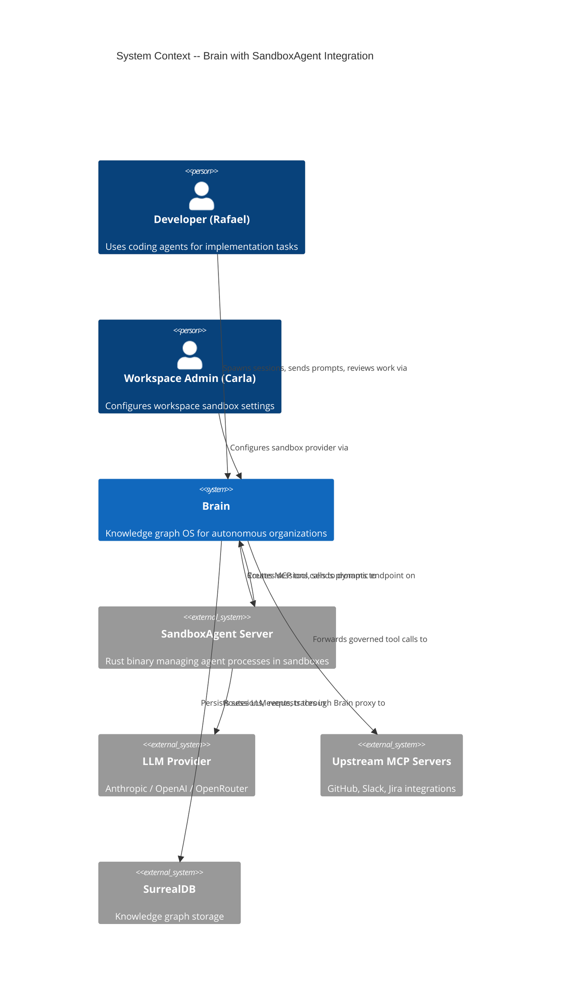
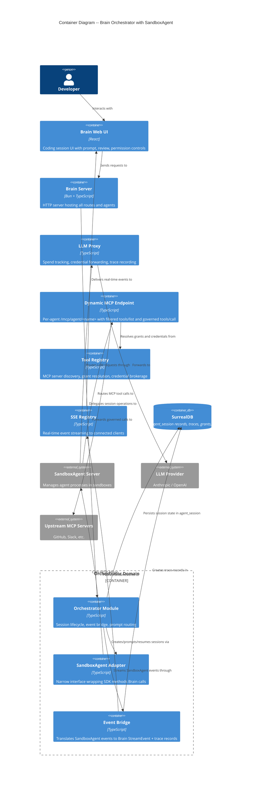
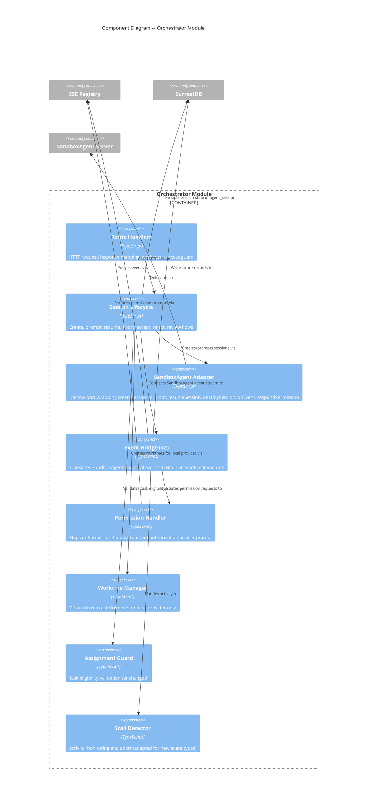

# Architecture Design: Sandbox Agent Integration

## 1. System Context

Brain is a knowledge graph operating system for autonomous organizations. The sandbox agent integration adds SandboxAgent SDK as the execution layer for coding agents running in isolated sandboxes, while Brain retains full governance control through its proxy and dynamic MCP endpoints.

### Quality Attribute Priorities (from DISCUSS wave)

| Priority | Quality Attribute | Driver |
|----------|------------------|--------|
| 1 | **Reliability** | Session restoration > 95%, zero event drops |
| 2 | **Maintainability** | Adapter interface isolates 0.x SDK dependency risk |
| 3 | **Testability** | Pure core / effect shell, injectable dependencies |
| 4 | **Security** | Per-session credential isolation, policy evaluation on every MCP call |
| 5 | **Performance** | < 5s spawn, < 500ms event latency, < 500ms MCP round-trip |

### Constraints

| Constraint | Impact |
|-----------|--------|
| Functional paradigm | Types-first, composition pipelines, no classes |
| SurrealDB SCHEMAFULL | Every field must be declared; no schemaless shortcuts |
| No module-level mutable singletons | Session registry must be injected, not global |
| SandboxAgent SDK 0.x stability | Adapter interface mandatory for isolation |
| Brain-native agents unchanged | Chat, PM, observer, analytics stay in-process with AI SDK |

## 2. C4 System Context Diagram (L1)



## 3. C4 Container Diagram (L2)



## 4. C4 Component Diagram (L3) -- Orchestrator Internals

The orchestrator has 6+ internal components after migration, warranting L3 detail.



## 5. Data Flow: Session Lifecycle

### 5.1 Session Creation (Spawn)

```
Developer -> POST /api/orchestrator/:ws/sessions/assign { taskId }
  -> Route Handler: validate workspace access
  -> Assignment Guard: validate task eligibility
  -> [Local provider only] Worktree Manager: create git worktree
  -> Session Lifecycle:
       1. Create agent_session record in SurrealDB (status: "spawning")
       2. Issue proxy token + DPoP credentials (existing flow)
       3. Call sandbox_adapter.createSession({
            agent: "claude",
            cwd: worktreePath,
            env: { ANTHROPIC_BASE_URL: proxyUrl, ... }
          })
       4. Configure MCP: sandbox_adapter.setMcpConfig("brain", {
            type: "remote",
            url: "/mcp/agent/<session-name>",
            headers: { "X-Brain-Auth": agentToken }
          })
       5. Register persistence driver on SDK instance
       6. Connect event stream -> event bridge -> SSE registry
       7. Update agent_session: status "spawning"
  -> Return { agentSessionId, streamId, streamUrl }
```

### 5.2 Multi-Turn Prompt

```
Developer -> POST /api/orchestrator/:ws/sessions/:id/prompt { text }
  -> Route Handler: validate workspace access
  -> Session Lifecycle:
       1. Lookup session in SurrealDB (not in-memory registry)
       2. Validate status is promptable (spawning | active | idle)
       3. Call sandbox_adapter.prompt(sessionId, [{ type: "text", text }])
       4. Return 202 Accepted (prompt queued/delivered)
       5. Agent processes prompt, events flow through event bridge
```

### 5.3 Session Restoration

```
[Network timeout or server restart detected]
  -> SDK internally detects stale connection
  -> SDK replays recent events from in-memory driver (max 50 events / 12,000 chars) as context
  -> SDK calls createSession() with fresh sandbox process
  -> SDK rebinds session ID to new runtime ID
  -> Brain updates agent_session.external_session_id to new runtime ID
  -> Event bridge reconnects to new event stream
  -> SSE registry notifies client: "Session restored automatically"
  Note: R1 uses SDK's InMemorySessionPersistDriver. SurrealDB persistence driver deferred to cloud providers (#187).
```

### 5.4 Two-Plane Governance Flow

```
Coding Agent in Sandbox:
  |
  |-- LLM API request --> Brain Proxy (/proxy/llm/anthropic)
  |     -> X-Brain-Auth header for spend tracking
  |     -> Forward to LLM provider with credentials
  |     -> Record trace
  |
  |-- MCP tools/list --> Brain Dynamic MCP Endpoint (/mcp/agent/<name>)
  |     -> Resolve effective toolset (can_use UNION possesses->skill_requires)
  |     -> Return filtered tool list
  |
  |-- MCP tools/call --> Brain Dynamic MCP Endpoint (/mcp/agent/<name>)
  |     -> Evaluate policy graph
  |     -> Inject OAuth credentials from credential broker
  |     -> Forward to upstream MCP server
  |     -> Record trace with policy evaluation result
  |     -> Return tool result
  |
  |-- Native tools (file, bash, git) --> Execute locally in sandbox
       -> No governance (passthrough)
       -> Permission handler may intercept dangerous operations
```

## 6. Integration Patterns

### 6.1 SandboxAgent SDK Integration (HTTP/SSE)

Brain communicates with SandboxAgent Server via HTTP API (REST + SSE). The SDK client library wraps these calls. Brain wraps the SDK behind an adapter interface (see component-boundaries.md).

- **Protocol**: HTTP/SSE (not WebSocket)
- **Authentication**: Session-scoped tokens
- **Event delivery**: SSE from SandboxAgent Server, consumed by adapter, forwarded through event bridge
- **Error handling**: Fail fast on connection errors; retry with backoff on transient failures

### 6.2 Dynamic MCP Endpoint (MCP Protocol over HTTP)

The coding agent inside the sandbox connects to Brain's `/mcp/agent/<name>` endpoint as a remote MCP server. This uses the standard MCP protocol (SSE transport) that Claude Code and other agents natively speak.

- **Protocol**: MCP over SSE transport
- **Authentication**: `X-Brain-Auth` header with per-session agent token
- **Tool filtering**: `tools/list` returns only the agent's effective toolset
- **Policy enforcement**: `tools/call` evaluates policy graph before forwarding
- **Credential injection**: OAuth tokens injected by credential broker per tool call

### 6.3 Session Persistence

**R1 (local provider):** Session lifecycle state (`agent_session` table) is persisted in SurrealDB. Event persistence for SDK replay uses the built-in `InMemorySessionPersistDriver` — sufficient because Brain and agent processes share the same host lifecycle.

**Deferred (cloud providers):** A custom SurrealDB `SessionPersistDriver` with `sandbox_event` table and 100ms write buffering (ADR-077) is needed when sandboxes outlive Brain restarts. Tracked in [#187](https://github.com/marcus-sa/brain/issues/187).

## 7. External Integrations

| Integration | Type | Contract Test Annotation |
|------------|------|-------------------------|
| SandboxAgent Server | HTTP/SSE API (localhost) | Contract tests recommended for SandboxAgent HTTP API -- consumer-driven contracts (e.g., Pact-JS) to detect breaking changes in 0.x SDK releases |
| Upstream MCP Servers | MCP Protocol (various) | Already annotated in existing tool registry design |
| LLM Providers | HTTP API (via proxy) | Already covered by existing proxy infrastructure |

## 8. Architecture Enforcement

| Rule | Enforcement Tool | Description |
|------|-----------------|-------------|
| Adapter interface boundary | dependency-cruiser | Orchestrator modules must not import SandboxAgent SDK directly; only through adapter |
| No module-level mutable state | ESLint custom rule | Ban `let` declarations at module scope in orchestrator/ |
| Dependency direction | dependency-cruiser | event-bridge, permission-handler must not depend on session-lifecycle |
| Port/adapter compliance | TypeScript strict types | Adapter interface defined as type; implementation injectable |

## 9. Handoff Notes

### For Platform Architect (DEVOPS wave)

- **Development paradigm**: Functional (types-first, composition pipelines, pure core / effect shell)
- **SandboxAgent Server deployment**: Rust binary must be available alongside Brain server. Local dev: direct binary. Production: containerized (Docker image from Rivet, or custom build).
- **Port requirements**: SandboxAgent Server listens on port 4100 (configurable). Brain must reach it at `http://localhost:4100` (local) or via Docker network.

**External Integrations Requiring Contract Tests:**
- SandboxAgent Server (HTTP/SSE API): session lifecycle, event streaming, permission handling. Recommended: consumer-driven contracts via Pact-JS in CI acceptance stage to detect breaking changes in 0.x releases before production.

### For Acceptance Designer (DISTILL wave)

- All acceptance criteria from DISCUSS wave user stories are preserved unchanged
- New event types (`agent_permission_request`, `agent_permission_response`, `agent_restoration`) need SSE stream assertions in acceptance tests
- Session persistence requires SurrealDB migration for `agent_session` sandbox fields (`provider`, `session_type`)
- Multi-turn prompt flow replaces the current 409 rejection -- this is the core behavioral change
- Mock adapter injection point: `SandboxAgentAdapter` type in `sandbox-adapter.ts`
