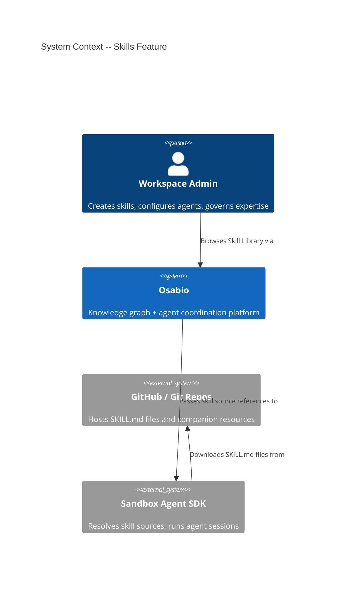
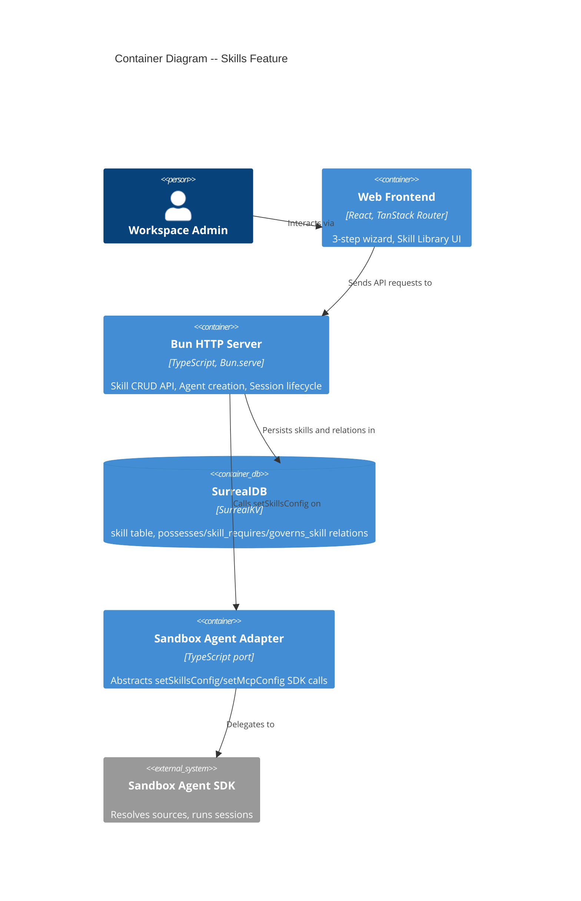
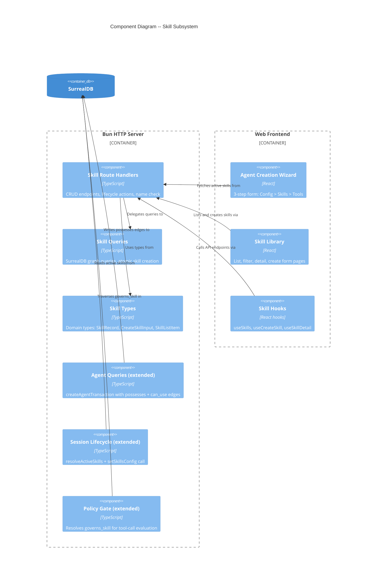

# Skills Feature -- Architecture Document

**Feature**: Skills -- Graph-native behavioral expertise layer (#177)
**Wave**: DESIGN
**Date**: 2026-03-30
**Architect**: Morgan (nw-solution-architect)

---

## 1. System Context and Capabilities

The Skills feature adds a **governed domain expertise layer** between Tools (functional capabilities) and Learnings (reactive corrections). Skills are metadata-and-source-pointer records in the knowledge graph that control which domain expertise is available to sandbox agents at session time.

### Capabilities Delivered (MVP)

1. **Skill CRUD API** -- Create, list, detail, update, delete skills with source references and required tool edges
2. **3-Step Agent Creation Wizard** -- Config > Skills checklist > Tools review + Create
3. **Atomic Agent Creation** -- Extended transaction includes `possesses` and `can_use` edges
4. **Session Lifecycle Integration** -- `setSkillsConfig` passes source references to sandbox agent SDK
5. **Skill Library UI** -- Browse, filter, detail view, create form
6. **Skill Lifecycle Management** -- draft > active > deprecated transitions
7. **Policy Governance** -- `governs_skill` relation + policy evaluation at tool-call time

### Out of Scope (MVP)

- Skill import from skills.sh / GitHub registry browser
- Brain-authored skills with inline content (#200)
- Skill activation telemetry (`skill_evidence` edges beyond schema)
- Observer-proposed skill updates (#204)
- Local skill sources
- MCP tool gating (`tools/list` filtering) -- deferred to Release 2

---

## 2. C4 System Context (L1)



---

## 3. C4 Container (L2)



---

## 4. C4 Component (L3) -- Skill Subsystem



---

## 5. Component Architecture and Boundaries

### 5.1 Backend Modules

| Module | Location | Responsibility | Follows Pattern |
|--------|----------|---------------|-----------------|
| **skill/** | `app/src/server/skill/` | Skill CRUD, lifecycle, queries, types | Learning system |
| **agents/** (extended) | `app/src/server/agents/` | Extended `createAgentTransaction` with `possesses` + `can_use` | Existing agent-queries.ts |
| **orchestrator/** (extended) | `app/src/server/orchestrator/` | `resolveActiveSkills` + `setSkillsConfig` in session lifecycle | Existing session-lifecycle.ts |
| **policy/** (extended) | `app/src/server/policy/` | `governs_skill` traversal at tool-call time | Existing policy-gate.ts |

#### 5.1.1 New Module: `skill/`

```
app/src/server/skill/
  skill-route.ts       -- Route handler factory (createSkillRouteHandlers)
  skill-queries.ts     -- SurrealDB queries (CRUD, list, detail, lifecycle)
  types.ts             -- Domain types (SkillRecord, SkillListItem, SkillDetail, CreateSkillInput)
```

This mirrors the learning system structure: route handler factory with dependency injection, query functions taking `surreal` as first parameter, and separated type definitions.

#### 5.1.2 Extended Modules

**agent-queries.ts** -- `createAgentTransaction` adds:
- `possesses` edges: `RELATE $identity->possesses->$skill SET granted_at = $now`
- `can_use` edges: `RELATE $identity->can_use->$tool`
- Skill status validation: reject if any selected skill is no longer active

**agent-route.ts** -- `handleCreateAgent` accepts new body fields:
- `skill_ids?: string[]` -- selected skill record IDs from Step 2
- `additional_tool_ids?: string[]` -- additional tool record IDs from Step 3

**sandbox-adapter.ts** -- New port method:
- `setSkillsConfig: (directory: string, name: string, config: SkillsConfig) => Promise<void>`
- `deleteSkillsConfig: (directory: string, name: string) => Promise<void>`

**session-lifecycle.ts** -- Before `adapter.createSession()`:
1. Query: `SELECT out.* FROM possesses WHERE in = $identity AND out.status = "active"`
2. If results > 0: call `adapter.setSkillsConfig(worktreePath, "brain-skills", { sources })`

**policy-gate.ts** -- At tool-call time:
1. Resolve: `tool -> skill_requires <- skill -> governs_skill -> policy`
2. If governing policy exists: evaluate intent against policy

### 5.2 Frontend Components

| Component | Location | Responsibility |
|-----------|----------|---------------|
| **AgentCreatePage** (rewritten) | `app/src/client/routes/agent-create-page.tsx` | 3-step wizard with shared state |
| **WizardStepConfig** | `app/src/client/components/agent/wizard-step-config.tsx` | Step 1: runtime radio + form fields |
| **WizardStepSkills** | `app/src/client/components/agent/wizard-step-skills.tsx` | Step 2: active skills checklist |
| **WizardStepTools** | `app/src/client/components/agent/wizard-step-tools.tsx` | Step 3: skill-derived + additional tools |
| **SkillLibraryPage** | `app/src/client/routes/skill-library-page.tsx` | List, filter, empty state |
| **SkillDetailPage** | `app/src/client/routes/skill-detail-page.tsx` | Full metadata, required tools, agents, governance |
| **SkillCreatePage** | `app/src/client/routes/skill-create-page.tsx` | Create skill form |
| **SkillCard** | `app/src/client/components/skill/skill-card.tsx` | Card for library list + wizard checklist |
| **useSkills** | `app/src/client/hooks/use-skills.ts` | Fetch skills (list, detail, create, lifecycle) |

#### Wizard State Management

The 3-step wizard uses React `useState` at the `AgentCreatePage` level. Each step is a child component receiving state and callbacks as props. This matches the current pattern (no Zustand/external state needed for <20 skills).

```
AgentCreatePage (state owner)
  |-- step: 1 | 2 | 3
  |-- configState: { runtime, name, description, model, scopes, sandboxConfig }
  |-- selectedSkillIds: string[]
  |-- additionalToolIds: string[]
  |
  +-- WizardStepConfig (step 1)
  +-- WizardStepSkills (step 2)
  +-- WizardStepTools (step 3)
```

---

## 6. Data Model

### 6.1 SurrealDB Schema (Migration 0084)

```sql
-- skill table
DEFINE TABLE skill SCHEMAFULL;
DEFINE FIELD name ON skill TYPE string;
DEFINE FIELD description ON skill TYPE string;
DEFINE FIELD version ON skill TYPE string;
DEFINE FIELD status ON skill TYPE string ASSERT $value IN ["draft", "active", "deprecated"];
DEFINE FIELD workspace ON skill TYPE record<workspace>;
DEFINE FIELD source ON skill TYPE object;
DEFINE FIELD source.type ON skill TYPE string ASSERT $value IN ["github", "git"];
DEFINE FIELD source.source ON skill TYPE string;
DEFINE FIELD source.ref ON skill TYPE option<string>;
DEFINE FIELD source.subpath ON skill TYPE option<string>;
DEFINE FIELD source.skills ON skill TYPE option<array<string>>;
DEFINE FIELD created_by ON skill TYPE option<record<identity>>;
DEFINE FIELD created_at ON skill TYPE datetime;
DEFINE FIELD updated_at ON skill TYPE option<datetime>;

-- Unique name per workspace (non-UNIQUE index due to SurrealDB v3.0.4 bug)
DEFINE INDEX idx_skill_workspace_name ON skill FIELDS workspace, name;

-- Relations
DEFINE TABLE skill_requires TYPE RELATION IN skill OUT mcp_tool SCHEMAFULL;
DEFINE TABLE possesses TYPE RELATION IN identity OUT skill SCHEMAFULL;
DEFINE FIELD granted_at ON possesses TYPE datetime;
DEFINE TABLE skill_supersedes TYPE RELATION IN skill OUT skill SCHEMAFULL;
DEFINE TABLE skill_evidence TYPE RELATION IN skill OUT agent_session | trace | observation SCHEMAFULL;
DEFINE FIELD added_at ON skill_evidence TYPE datetime;
DEFINE TABLE governs_skill TYPE RELATION IN policy OUT skill SCHEMAFULL;
```

Note: `UNIQUE` index avoided per documented SurrealDB v3.0.4 bug (see surrealdb.md). Name uniqueness enforced at application layer with pre-validation query.

### 6.2 TypeScript Types

```typescript
// app/src/server/skill/types.ts

type SkillStatus = "draft" | "active" | "deprecated";
type SkillSourceType = "github" | "git";

type SkillSource = {
  readonly type: SkillSourceType;
  readonly source: string;
  readonly ref?: string;
  readonly subpath?: string;
  readonly skills?: string[];
};

type SkillRecord = RecordId<"skill", string>;

type CreateSkillInput = {
  name: string;
  description: string;
  version: string;
  source: SkillSource;
  required_tool_ids?: string[];  // mcp_tool IDs for skill_requires edges
};

type SkillListItem = {
  id: string;
  name: string;
  description: string;
  version: string;
  status: SkillStatus;
  source: SkillSource;
  required_tools: Array<{ id: string; name: string }>;
  agent_count: number;
  created_at: string;
};

type SkillDetail = {
  skill: SkillListItem & {
    created_by?: string;
    updated_at?: string;
  };
  required_tools: Array<{ id: string; name: string }>;
  agents: Array<{ id: string; name: string }>;
  governed_by: Array<{ id: string; name: string; status: string }>;
};
```

### 6.3 Extended Agent Creation Input

```typescript
// Extended CreateAgentInput (agents/types.ts)
type CreateAgentInput = {
  name: string;
  description?: string;
  runtime: "sandbox" | "external";
  model?: string;
  sandbox_config?: SandboxConfig;
  authority_scopes?: AuthorityScopeInput[];
  skill_ids?: string[];           // NEW: selected skill IDs from Step 2
  additional_tool_ids?: string[];  // NEW: additional tool IDs from Step 3
};
```

### 6.4 Adapter Port Extension

```typescript
// Extended SandboxAgentAdapter (sandbox-adapter.ts)
type SkillsConfig = {
  readonly sources: readonly SkillSource[];
};

type SandboxAgentAdapter = {
  // ... existing methods ...
  setSkillsConfig: (directory: string, name: string, config: SkillsConfig) => Promise<void>;
  deleteSkillsConfig: (directory: string, name: string) => Promise<void>;
};
```

---

## 7. API Design

### 7.1 Skill CRUD Endpoints

| Method | Path | Description |
|--------|------|-------------|
| POST | `/api/workspaces/:wsId/skills` | Create skill (status: draft) |
| GET | `/api/workspaces/:wsId/skills` | List skills (query: `?status=active`) |
| GET | `/api/workspaces/:wsId/skills/:skillId` | Skill detail with tools, agents, policies |
| PUT | `/api/workspaces/:wsId/skills/:skillId` | Update skill metadata |
| DELETE | `/api/workspaces/:wsId/skills/:skillId` | Delete skill (only if 0 possesses edges) |
| GET | `/api/workspaces/:wsId/skills/check-name?name=...` | Check name availability |

### 7.2 Skill Lifecycle Endpoints

| Method | Path | Description |
|--------|------|-------------|
| POST | `/api/workspaces/:wsId/skills/:skillId/activate` | draft -> active |
| POST | `/api/workspaces/:wsId/skills/:skillId/deprecate` | active -> deprecated |

### 7.3 Request/Response Shapes

#### POST /api/workspaces/:wsId/skills

Request:
```json
{
  "name": "security-audit",
  "description": "Comprehensive security audits of code changes",
  "version": "1.0",
  "source": {
    "type": "github",
    "source": "acme-corp/agent-skills",
    "ref": "v1.0",
    "subpath": "skills/security-audit"
  },
  "required_tool_ids": ["tool-uuid-1", "tool-uuid-2"]
}
```

Response (201):
```json
{
  "skill": {
    "id": "uuid",
    "name": "security-audit",
    "version": "1.0",
    "status": "draft"
  }
}
```

#### GET /api/workspaces/:wsId/skills?status=active

Response (200):
```json
{
  "skills": [
    {
      "id": "uuid",
      "name": "security-audit",
      "description": "...",
      "version": "1.2",
      "status": "active",
      "source": { "type": "github", "source": "acme-corp/agent-skills" },
      "required_tools": [{ "id": "tool-uuid", "name": "read_file" }],
      "agent_count": 3,
      "created_at": "2026-03-30T..."
    }
  ]
}
```

#### GET /api/workspaces/:wsId/skills/:skillId

Response (200):
```json
{
  "skill": { "id": "...", "name": "...", "description": "...", "version": "...", "status": "...", "source": {...}, "agent_count": 3, "created_at": "...", "updated_at": "..." },
  "required_tools": [{ "id": "...", "name": "read_file" }],
  "agents": [{ "id": "...", "name": "security-auditor" }],
  "governed_by": [{ "id": "...", "name": "Security Tool Access", "status": "active" }]
}
```

#### POST /api/workspaces/:wsId/agents (extended body)

Additional fields accepted:
```json
{
  "name": "security-auditor",
  "runtime": "sandbox",
  "skill_ids": ["skill-uuid-1", "skill-uuid-2"],
  "additional_tool_ids": ["tool-uuid-1"]
}
```

### 7.4 Error Responses

| Code | Condition |
|------|-----------|
| 400 | Missing required fields, invalid source type |
| 404 | Skill not found in workspace |
| 409 | Duplicate skill name in workspace |
| 409 | Cannot activate/deprecate from current status |
| 409 | Selected skill was deprecated (agent creation) |

---

## 8. Integration Patterns

### 8.1 Agent Creation Transaction (Extended)

The existing atomic transaction (`BEGIN TRANSACTION; ... COMMIT TRANSACTION;`) adds:

1. **Skill status validation**: Before transaction, query all selected skills and assert `status = "active"`. Fail fast if any are deprecated.
2. **possesses edges**: `RELATE $identity->possesses->$skill SET granted_at = $now` for each selected skill.
3. **can_use edges**: `RELATE $identity->can_use->$tool` for each additional tool from Step 3.

These are added to the existing transaction SQL string alongside agent, identity, member_of, authorized_to, and proxy_token statements.

### 8.2 Session Lifecycle (setSkillsConfig)

Sequence:
1. Resolve agent identity via `identity_agent` + `member_of` (existing)
2. Query active skills: `SELECT out.* FROM possesses WHERE in = $identity AND out.status = "active"`
3. If skills exist: `adapter.setSkillsConfig(worktreePath, "brain-skills", { sources: skills.map(s => s.source) })`
4. Register Brain MCP server: `adapter.setMcpConfig(...)` (existing)
5. Create session: `adapter.createSession(...)` (existing)

### 8.3 Policy Governance at Tool-Call Time

Graph traversal path: `mcp_tool <- skill_requires <- skill <- governs_skill <- policy`

When a tool call arrives through the MCP proxy:
1. Look up the tool's source skill(s) via `skill_requires` edges
2. Filter to skills the calling agent possesses (via `possesses` edges)
3. For each matching skill, check `governs_skill` for governing policies
4. If a governing policy exists and is active, evaluate the intent against it
5. If evaluation fails, deny the tool call

---

## 9. Technology Stack

| Component | Technology | License | Rationale |
|-----------|-----------|---------|-----------|
| Backend runtime | Bun | MIT | Existing stack |
| Database | SurrealDB | BSL 1.1 | Existing stack, graph-native relations |
| Frontend framework | React | MIT | Existing stack |
| Routing | TanStack Router | MIT | Existing stack |
| UI components | shadcn/ui (Base UI) | MIT | Existing stack |
| Sandbox SDK | sandbox-agent | Proprietary | Existing dependency for setSkillsConfig |

No new technology introduced. All choices are existing stack extensions.

---

## 10. Quality Attribute Strategies

### 10.1 Maintainability (Priority 1)

- Skill module follows established Learning system pattern: route handler factory, query functions with DI, separated types
- No new architectural patterns or abstractions introduced
- Wizard components are leaf components receiving props from parent state owner

### 10.2 Testability (Priority 2)

- All query functions take `surreal: Surreal` as parameter -- directly testable
- `SandboxAgentAdapter` port enables mock injection for session lifecycle tests
- Acceptance tests verify atomic transaction (possesses + can_use edges present after creation)
- Skill status validation is a pure query -- unit testable

### 10.3 Time-to-Market (Priority 3)

- No new infrastructure, no new build steps, no new dependencies
- Schema migration is a single `.surql` file
- Route registration follows existing `start-server.ts` pattern
- Frontend follows existing page/component patterns

### 10.4 Auditability (Priority 4)

- All skill mutations traced via OpenTelemetry wide events (`skill.create`, `skill.activate`, etc.)
- `possesses` edges preserve assignment history (not deleted on deprecation)
- `governs_skill` enables policy audit trail for skill-derived tool usage
- `skill_evidence` schema ready for future telemetry (deferred to post-MVP)

---

## 11. Architectural Enforcement

| Rule | Enforcement | Scope |
|------|-------------|-------|
| No direct `process.env` reads | Existing convention + code review | All new modules |
| Skill queries take `surreal` as parameter (DI) | Code review + acceptance tests | `skill/skill-queries.ts` |
| No `null` values in domain data | Existing TypeScript conventions | All new types |
| `SCHEMAFULL` tables only | Schema review in migration PR | `0084_skill_table.surql` |
| Route handlers use handler factory pattern | Code review against learning-route.ts | `skill/skill-route.ts` |

Recommended enforcement tooling: `typescript-eslint` with `no-restricted-syntax` rules for `process.env` access outside `runtime/config.ts`. Existing project convention; no new tooling needed.

---

## 12. Deployment Architecture

No deployment changes. The skill module is compiled into the existing Bun server binary. The schema migration runs via `bun migrate` before deployment. No new services, no new containers, no new infrastructure.

---

## 13. External Integration Annotations

### Sandbox Agent SDK (`setSkillsConfig`)

The `setSkillsConfig` method is a call to the Sandbox Agent SDK, which is an external dependency. The source references passed to this method must match the Agent Skills specification format.

**Contract test recommendation**: Consumer-driven contracts (e.g., Pact-JS) recommended for the `setSkillsConfig` call signature to detect breaking changes in the Sandbox Agent SDK before production. Key contract points:
- `SkillSource` shape: `{ type, source, ref?, subpath?, skills? }`
- `SkillsConfig` shape: `{ sources: SkillSource[] }`
- SDK method signature: `sdk.setSkillsConfig({ directory, skillName }, config)`

### GitHub / Git Source Resolution

Skill source references point to external Git repositories. The Sandbox Agent SDK handles resolution -- Osabio does not fetch from these repositories at runtime. No contract test needed from Osabio's side; the Sandbox Agent SDK owns this contract.
