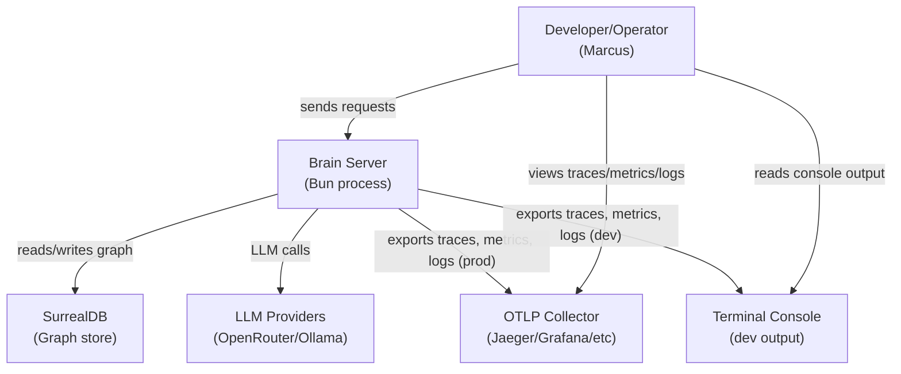
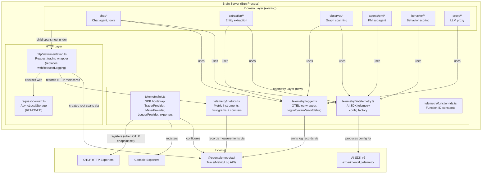

# Architecture Design: OpenTelemetry Observability Migration

## System Context

Brain is a single-process Bun server (modular monolith) that coordinates AI agents through a SurrealDB knowledge graph. It currently uses Pino for structured logging with `logInfo`/`logWarn`/`logError`/`logDebug` wrappers (411 call sites across 64 files) and `withRequestLogging` for HTTP request lifecycle tracking. This migration replaces all of that with OpenTelemetry's three signals: traces, metrics, and logs.

### Quality Attributes Driving Design

| Attribute | Priority | Strategy |
|-----------|----------|----------|
| Debuggability | Primary | Distributed traces with AI SDK telemetry spans; OTEL logs with automatic trace correlation |
| Operational visibility | Primary | OTEL metrics (histograms + counters) for LLM latency, tokens, HTTP health |
| Cost transparency | Primary | Per-function token counters via `functionId` taxonomy on AI SDK telemetry |
| Minimal overhead | Constraint | Async buffered export; <5ms per-request overhead; no-op on SDK failure |
| Simplicity | Constraint | Single telemetry system (no Pino+OTEL hybrid); console dev, OTLP prod |

## C4 System Context (L1)



## C4 Container (L2)



## Component Architecture

### 1. `app/src/server/telemetry/init.ts` -- SDK Bootstrap

**Responsibility**: Initialize all three OTEL providers before `Bun.serve()` starts. Select exporters based on environment.

**Behavior**:
- Creates a `Resource` with `service.name` (default "brain", overridable via `OTEL_SERVICE_NAME`), `service.version`, and `deployment.environment`
- Initializes `TracerProvider` with `BatchSpanProcessor`
- Initializes `MeterProvider` with `PeriodicExportingMetricReader`
- Initializes `LoggerProvider` with `BatchLogRecordProcessor`
- Exporter selection: if `OTEL_EXPORTER_OTLP_ENDPOINT` is set, use OTLP HTTP exporters (trace, metric, log); otherwise use Console exporters
- Wraps initialization in try/catch: on failure, logs warning to console and returns no-op providers (OTEL API's default behavior when no provider registered)
- Exports a `shutdownTelemetry()` function for graceful drain on server stop
- Exports the initialized `Tracer`, `Meter`, and `Logger` instances for use by other telemetry modules

**Integration point**: Called from `startServer()` in `runtime/start-server.ts`, before `createRuntimeDependencies()`.

**Bun compatibility note**: `@opentelemetry/sdk-node` bundles auto-instrumentation, gRPC exporters, and convenience wrappers we don't need — `sdk-trace-base` with `BatchSpanProcessor` is simpler for manual instrumentation. Core OTEL packages work on Bun: `NodeTracerProvider` is verified compatible (open-telemetry/opentelemetry-js#5260), `AsyncLocalStorage` and `performance.now()` are supported, and OTLP HTTP exporters use `fetch` (Bun-native). Known Bun incompatibilities are limited to `PrometheusExporter` (`http.createServer().unref()`) and gRPC exporters (native bindings) — neither of which we use.

### 2. `app/src/server/telemetry/logger.ts` -- OTEL Log Wrapper

**Responsibility**: Provide ergonomic `log.info()`/`log.warn()`/`log.error()`/`log.debug()` functions backed by the OTEL Logs API. Replace all `logInfo`/`logWarn`/`logError`/`logDebug` call sites.

**Behavior**:
- Obtains a `Logger` via `logs.getLogger('brain-server')` from `@opentelemetry/api-logs`
- Each function calls `logger.emit({ body: eventName, severityText, severityNumber, attributes })` with the OTEL severity mapping (DEBUG=5, INFO=9, WARN=13, ERROR=17)
- Logs emitted within an active span automatically inherit `trace_id` and `span_id` from the OTEL context (built-in OTEL SDK behavior, no manual correlation)
- Pre-init fallback: if LoggerProvider is not yet registered (early startup), fall back to `console.log`/`console.warn`/`console.error` with a `[brain]` prefix
- `log.error()` accepts an optional `Error` object, serialized using the existing `serializeError()` function from `logging.ts` (that function is retained and moved)

**Migration pattern**: `logInfo("event.name", "message", { key: value })` becomes `log.info("event.name", { key: value })`. The message string (second arg in current API) merges into the event body or is dropped where redundant with the event name.

### 3. `app/src/server/telemetry/metrics.ts` -- Metric Instruments

**Responsibility**: Define and export all OTEL metric instruments as module-level singletons (created once, used everywhere).

**Instruments**:

| Instrument | Type | Name | Attributes |
|-----------|------|------|------------|
| `llmDuration` | Histogram | `brain.llm.duration` | functionId, model |
| `llmPromptTokens` | Counter | `brain.llm.tokens.prompt` | functionId, model |
| `llmCompletionTokens` | Counter | `brain.llm.tokens.completion` | functionId, model |
| `llmErrors` | Counter | `brain.llm.errors` | functionId, model, error_type |
| `httpDuration` | Histogram | `brain.http.duration` | method, route, status_code |
| `httpRequests` | Counter | `brain.http.requests` | method, route, status_code |
| `extractionEntities` | Counter | `brain.extraction.entities` | entity_type |

**Usage**: LLM metrics recorded by a callback/wrapper around AI SDK calls (see ai-telemetry.ts). HTTP metrics recorded by the request tracing wrapper.

### 4. `app/src/server/telemetry/ai-telemetry.ts` -- AI SDK Telemetry Config Factory

**Responsibility**: Produce the `experimental_telemetry` configuration object for every AI SDK `generateObject`/`streamText` call, and optionally record LLM metrics after call completion.

**Behavior**:
- `createTelemetryConfig(functionId, metadata?)` returns `{ isEnabled: true, functionId, metadata }` -- a pure data factory
- `metadata` typically includes `workspaceId` and optionally `messageId`, `conversationId`
- `recordLlmMetrics(functionId, model, usage, durationMs)` records histogram + counter values on the metric instruments from `metrics.ts`
- `recordLlmError(functionId, model, errorType)` increments the error counter

**Integration**: Each AI SDK call site adds `experimental_telemetry: createTelemetryConfig('brain.extraction.generate', { workspaceId })` to its options. After the call completes, the caller invokes `recordLlmMetrics()` with the usage/timing data from the AI SDK response.

### 5. `app/src/server/telemetry/function-ids.ts` -- Function ID Constants

**Responsibility**: Single source of truth for the `brain.*` function ID taxonomy.

**Content**: Typed constants matching the taxonomy from the requirements:
- `brain.extraction.generate`, `brain.extraction.dedupe`
- `brain.chat.agent`, `brain.chat.stream`
- `brain.pm.agent`
- `brain.observer.verify`, `brain.observer.peer-review`
- `brain.behavior.score`
- `brain.onboarding.generate`
- `brain.intent.authorize`
- `brain.analytics.agent`

### 6. `app/src/server/http/instrumentation.ts` -- HTTP Request Tracing

**Responsibility**: Replace `withRequestLogging` with OTEL span-based request tracing. Create a root span for each HTTP request. Record HTTP metrics.

**Behavior**:
- `withTracing(route, method, handler)` wraps a route handler (same signature as `withRequestLogging`)
- Creates a root span `brain.http.request` with attributes: `http.method`, `http.route`, `http.target` (path), `requestId`
- Runs the handler within the span's OTEL context (via `context.with()`)
- `request-context.ts` is removed — its only consumers (`logging.ts`, `request-logging.ts`) are both replaced by OTEL. Request-scoped context (requestId, method, route) lives on the OTEL span attributes instead
- On success: sets `http.status_code` on span, records `httpDuration` histogram and `httpRequests` counter
- On error: sets span status to ERROR, calls `span.recordException(error)`, records metrics with error status code
- Adds `x-request-id` response header (preserving existing behavior)
- SSE streaming routes: root span covers the initial response (headers sent); streaming content is a separate concern

**Migration**: Every `withRequestLogging(...)` call in `start-server.ts` becomes `withTracing(...)`. The function signature is identical, making the migration mechanical.

### 7. Retained utilities

- `serializeError()` from `logging.ts` -- moved to a shared location (e.g., `telemetry/serialize-error.ts` or kept in `http/errors.ts`). Used by `log.error()` and span exception recording.
- `userFacingError()` and `extractCauseMessage()` from `observability.ts` -- retained in `observability.ts` (not logging-related).
- `elapsedMs()` from `observability.ts` -- retained for non-span timing needs (e.g., metrics recording where manual timing is needed alongside spans).
- `request-context.ts` -- removed. Only consumed by `logging.ts` and `request-logging.ts`, both replaced. OTEL context propagation replaces it.

## Startup Sequence

```
1. loadServerConfig()                    -- parse env vars
2. initTelemetry()                       -- NEW: OTEL SDK bootstrap (try/catch, no-op on failure)
3. createRuntimeDependencies(config)     -- Surreal + model clients
4. ensureDefaultWorkspaceProjectScope()  -- DB bootstrap
5. createBrainServer(deps)               -- route registration (withTracing replaces withRequestLogging)
6. Bun.serve()                           -- start accepting requests
7. log.info("server.started", {...})     -- startup log via OTEL logger
```

OTEL initialization (step 2) runs before any model clients or DB connections, ensuring the TracerProvider is active when the first AI SDK call is made. If OTEL init fails, steps 3-7 proceed normally with no-op telemetry.

## Context Propagation Design

```
HTTP Request arrives
  |
  v
withTracing() creates root span + OTEL context
  |
  +-- context.with(span) sets active OTEL context
       |
       +-- handler runs within OTEL context
            |
            +-- AI SDK experimental_telemetry creates child spans (automatic)
            +-- log.info() inherits trace_id/span_id (automatic)
            +-- manual tracer.startSpan() for pipeline stages
```

OTEL uses its own `AsyncLocalStorageContextManager` internally for context propagation. The existing `request-context.ts` is removed — its only consumers (`logging.ts`, `request-logging.ts`) are replaced by OTEL instrumentation.

## Files Changed (Summary)

### New files (6)
| File | Purpose |
|------|---------|
| `app/src/server/telemetry/init.ts` | SDK bootstrap |
| `app/src/server/telemetry/logger.ts` | OTEL log wrapper |
| `app/src/server/telemetry/metrics.ts` | Metric instruments |
| `app/src/server/telemetry/ai-telemetry.ts` | AI SDK telemetry config factory |
| `app/src/server/telemetry/function-ids.ts` | Function ID constants |
| `app/src/server/http/instrumentation.ts` | HTTP request tracing |

### Modified files
| File | Change |
|------|--------|
| `runtime/start-server.ts` | Add `initTelemetry()` call; replace `withRequestLogging` with `withTracing`; replace `logInfo`/`logError` with `log` |
| `runtime/dependencies.ts` | No change (devtools middleware stays) |
| `runtime/config.ts` | No change (OTEL uses its own env vars per spec) |
| 64 files with `logInfo`/`logWarn`/`logError`/`logDebug` | Mechanical migration to `log.info`/`log.warn`/`log.error`/`log.debug` |
| 16 files with `generateObject`/`streamText` | Add `experimental_telemetry` config + `recordLlmMetrics` calls |
| `chat/handler.ts` | Add telemetry to `streamText` call |
| `extraction/extract-graph.ts` | Add telemetry to `generateObject` call |
| All observer/PM/behavior/onboarding/intent/analytics LLM call sites | Add telemetry config |

### Removed files
| File | Reason |
|------|--------|
| `app/src/server/logging.ts` | Pino configuration replaced by OTEL logger (`serializeError` moved) |

### Removed dependencies
| Package | Reason |
|---------|--------|
| `pino` (v10.3.1) | Replaced by OTEL Logs API |

### Added dependencies
| Package | License | Purpose |
|---------|---------|---------|
| `@opentelemetry/api` | Apache-2.0 | Core OTEL API (traces, metrics) |
| `@opentelemetry/api-logs` | Apache-2.0 | OTEL Logs API |
| `@opentelemetry/sdk-trace-base` | Apache-2.0 | TracerProvider + BatchSpanProcessor |
| `@opentelemetry/sdk-metrics` | Apache-2.0 | MeterProvider + metric readers |
| `@opentelemetry/sdk-logs` | Apache-2.0 | LoggerProvider + log record processors |
| `@opentelemetry/resources` | Apache-2.0 | Resource definition (service.name etc) |
| `@opentelemetry/semantic-conventions` | Apache-2.0 | Standard attribute names |
| `@opentelemetry/exporter-trace-otlp-http` | Apache-2.0 | OTLP trace export via fetch |
| `@opentelemetry/exporter-metrics-otlp-http` | Apache-2.0 | OTLP metrics export via fetch |
| `@opentelemetry/exporter-logs-otlp-http` | Apache-2.0 | OTLP logs export via fetch |
| `@opentelemetry/context-async-hooks` | Apache-2.0 | AsyncLocalStorage context propagation |

All packages are Apache-2.0 licensed, maintained by the OpenTelemetry project (CNCF graduated), and use HTTP/fetch transport (Bun-compatible -- no Node.js-specific gRPC or native modules).

## Environment Variable Migration

### Removed env vars

| Env var | Current use | Post-migration |
|---------|------------|----------------|
| `LOG_LEVEL` | Pino log level filter | Removed. OTEL log severity filtering happens at the exporter/collector level. For dev console output, the logger wrapper accepts an optional `BRAIN_LOG_LEVEL` env var (default: `debug`) to filter which severities reach `console.*` fallback. This is not passed to OTEL SDK -- it only controls the pre-init fallback and dev console output. |
| `NODE_ENV` | Pino base metadata (`env` field) | Retained. Used by other parts of the system. Added as `deployment.environment` resource attribute on the OTEL Resource. |

### New env vars (standard OTEL, not in `config.ts`)

| Env var | Purpose | Default |
|---------|---------|---------|
| `OTEL_SERVICE_NAME` | Service name on all telemetry | `brain` |
| `OTEL_EXPORTER_OTLP_ENDPOINT` | Activates OTLP exporters (traces + metrics + logs) | unset (console exporters) |
| `OTEL_EXPORTER_OTLP_HEADERS` | Auth headers for OTLP endpoint | unset |
| `OTEL_METRIC_EXPORT_INTERVAL` | Metric export interval in ms | `60000` |

## Graceful Shutdown

`initTelemetry()` exports `shutdownTelemetry()` which calls `forceFlush()` + `shutdown()` on all three providers. This drains pending spans, metrics, and log records to the exporter before the process exits.

The server should call `shutdownTelemetry()` on `SIGTERM`/`SIGINT` before closing `Bun.serve()`. If not called, the `BatchSpanProcessor` and `PeriodicExportingMetricReader` have internal timers that flush on process exit in Node.js -- on Bun, explicit shutdown is safer.

## What This Design Intentionally Does NOT Include

- **Auto-instrumentation** (`@opentelemetry/sdk-node`, `@opentelemetry/instrumentation-http`): Auto-instrumentation uses Node.js require hooks for monkey-patching, which doesn't work on Bun. But even on Node.js we'd skip it — manual instrumentation via `withTracing` and `experimental_telemetry` is more explicit and avoids pulling in the `sdk-node` kitchen-sink wrapper with its gRPC and Prometheus dependencies.
- **SurrealDB query tracing**: The existing graph traces are an application-level audit trail, not operational telemetry. They remain independent.
- **Trace/metrics backends**: Jaeger, Grafana, etc. are deployment concerns. OTLP export is the boundary.
- **Dashboard definitions**: Downstream of this architecture.
- **Prompt content in spans**: AI SDK telemetry captures model/tokens/latency but does not include prompt content by default. This is the correct default for security.
