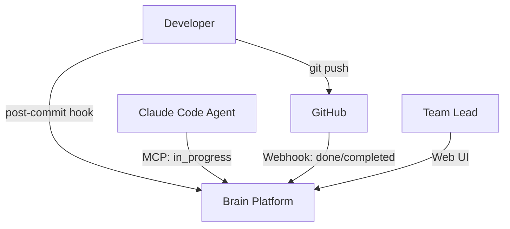
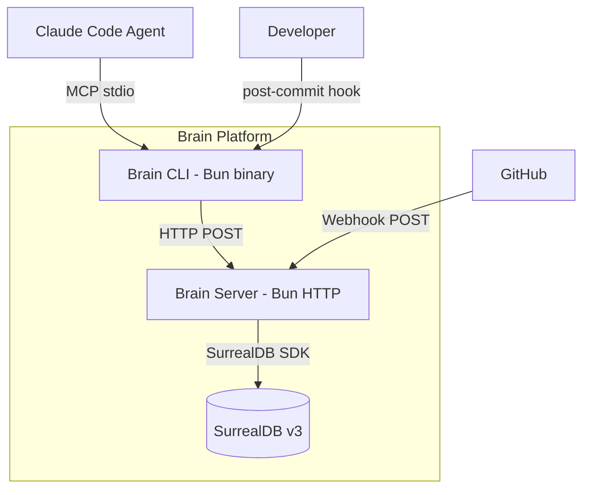
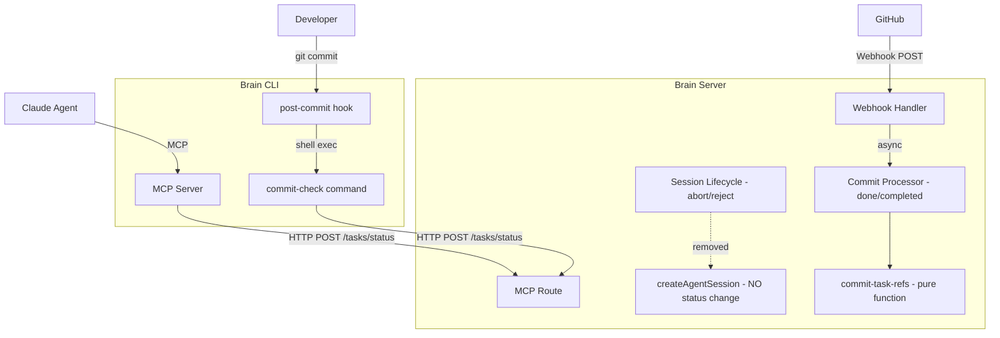

# Architecture Design: Task Status Ownership

## System Context

Task status lifecycle transitions are currently split between the server (orchestrator) and agents/processors, creating ambiguity about source of truth. This refactoring moves **forward transitions** to the entity doing the work (agent, commit hook, GitHub processor) while keeping **backward transitions** (abort/reject) server-owned.

### Capabilities

| Capability | Owner | Mechanism |
|---|---|---|
| in_progress | Agent | `brain-start-task` slash command calls `update_task_status` MCP tool |
| done | commit-check CLI (local) / GitHub processor (remote) | Task refs parsed from commit messages |
| completed | GitHub processor | Merge to main/default branch detected |
| ready (abort) | Server | `abortOrchestratorSession()` |
| ready (reject) | Server | `rejectOrchestratorSession()` |

### Setup-Dependent Behavior

| Setup | in_progress | done | completed |
|---|---|---|---|
| Solo/local | Agent | commit-check post-commit hook | N/A or manual |
| Team/remote | Agent | commit-check + GitHub processor | GitHub processor (merge) |

## C4 System Context (L1)

## C4 Container (L2)

## C4 Component (L3) -- Status Transition Flow

## Component Architecture

### Changes by Module

#### 1. `app/src/server/mcp/mcp-queries.ts` -- createAgentSession()
- **Remove**: Lines 546-561 conditional `status: "in_progress"` update
- **Keep**: `source_session` linkage to task record
- **Keep**: Workspace scope validation
- **Traces to**: US-1, R1

#### 2. `app/src/server/orchestrator/session-lifecycle.ts` -- acceptOrchestratorSession()
- **Remove**: Lines 557-563 `status: "done"` update on task
- **Keep**: `orchestrator_status: "completed"` on session
- **Keep**: Agent session end, handle registry cleanup
- **Traces to**: US-2, R1

#### 3. `cli/commands/git-hooks.ts` -- NEW: runCommitCheck()
- **Add**: New `brain commit-check` command — thin client
- **Behavior**: Read latest commit message, POST it to server endpoint, exit 0
- **Constraint**: Fire-and-forget, exit 0 on any error. No parsing or LLM logic in CLI.
- **Traces to**: US-3, R3

#### 3a. `POST /api/mcp/:workspaceId/commits/check` -- NEW server endpoint
- Accepts a commit message (and optional SHA) from the CLI
- **Two-pass task detection** (all server-side):
  1. **Fast path**: `extractReferencedTaskIds()` (regex, instant)
  2. **LLM fallback**: If no explicit refs found, runs `extractStructuredGraph()` (same extraction pipeline as the GitHub commit processor) to infer task matches
- **For each matched task**: Sets status → done (idempotent)
- **Reuses**: `extractReferencedTaskIds()` from `webhook/commit-task-refs.ts`, `extractStructuredGraph()` from `extraction/extract-graph.ts`, extraction model from `dependencies.ts`
- **Traces to**: US-3, R3

#### 4. `cli/commands/init.ts` -- Post-commit hook installation
- **Add**: Install `brain commit-check` as `.git/hooks/post-commit` alongside existing pre-commit hook
- **Script**: `#!/bin/sh\nbrain commit-check\n` (fire-and-forget, no error check)
- **Traces to**: US-4, R4

#### 5. `cli/brain.ts` -- CLI routing
- **Add**: `commit-check` case (currently only `check-commit` exists; rename or add alias)
- **Traces to**: US-3, US-4

#### 6. `app/src/server/webhook/github-commit-processor.ts` -- processCommit()
- **Add**: After creating `implemented_by` relations, set task status based on branch:
  - Non-default branch push: set referenced tasks to `done`
  - Default branch (main) push: set referenced tasks to `completed`
- **Input**: Branch info available from `GitHubPushEvent.ref` and `GitHubPushEvent.repository.default_branch`
- **Constraint**: Idempotent -- skip if task already at target status or beyond
- **Traces to**: US-5, US-6, R5, R6

#### 7. `app/src/server/webhook/github-webhook-route.ts` -- handleGitHubWebhook()
- **Add**: Pass `event.ref` and `event.repository.default_branch` through to `processGitCommits()` (already available in `event`)
- **Traces to**: US-5, US-6

#### 8. `app/src/server/webhook/types.ts` -- ProcessWebhookResult
- **Add**: `taskStatusUpdates: Array<{ taskId: string; newStatus: string }>` to result types for observability
- **Traces to**: US-5, US-6

### Shared Module: commit-task-refs.ts

The `extractReferencedTaskIds()` function in `app/src/server/webhook/commit-task-refs.ts` is already a pure function with no server dependencies. It can be imported directly by the CLI commit-check command since both CLI and server run on Bun.

**No duplication needed.** The CLI imports the server module directly at build time (CLI is compiled to a binary via `bun build`).

### Idempotent Status Transitions

Status transitions follow a forward-only ordering: `open < todo < ready < in_progress < done < completed`. A transition request is a no-op if the task is already at or beyond the target status. This is enforced at the API layer (`updateTaskStatus` MCP route) rather than duplicated across callers.

### Transition Ordering (conflict resolution)

| Scenario | commit-check fires | GitHub processor fires | Result |
|---|---|---|---|
| Local commit, then push | Sets done | Sets done (no-op) | done |
| Push to feature branch | May not run (remote CI) | Sets done | done |
| Merge to main | N/A | Sets completed | completed |
| Commit on main directly | Sets done | Sets completed (upgrades) | completed |

## Technology Stack

No new technology introduced. All changes use existing stack:

| Component | Technology | License | Rationale |
|---|---|---|---|
| CLI | Bun + TypeScript | MIT | Existing CLI runtime |
| Server | Bun HTTP | MIT | Existing server runtime |
| Database | SurrealDB v3 | BSL 1.1 | Existing data store |
| Task ref parsing | Regex (existing) | N/A | `extractReferencedTaskIds()` already exists |
| HTTP client | Fetch API (existing) | N/A | `BrainHttpClient.updateTaskStatus()` already exists |

## Integration Patterns

### CLI to Server (commit-check)
- **Protocol**: HTTP POST to `/api/mcp/{workspaceId}/tasks/status`
- **Auth**: Bearer token from `~/.brain/config.json` (existing OAuth2 flow)
- **Payload**: `{ task_id: string, status: "done" }`
- **Error handling**: Fire-and-forget. Log to stderr, exit 0.

### GitHub to Server (webhook)
- **Protocol**: HTTP POST webhook (existing)
- **Trigger**: Push event (existing handler)
- **Branch detection**: Compare `event.ref` against `refs/heads/${event.repository.default_branch}`
- **Status mapping**: default branch = `completed`, other branches = `done`

### Agent to Server (in_progress)
- **Protocol**: MCP stdio (existing)
- **Tool**: `update_task_status` (existing, no changes)
- **Trigger**: `brain-start-task` slash command (existing, no changes)

## Quality Attribute Strategies

### Reliability
- **Idempotent transitions**: Forward-only status ordering prevents conflicts between commit-check and GitHub processor
- **Fire-and-forget hook**: Post-commit hook never blocks git workflow
- **Backward transitions preserved**: Server-owned abort/reject continue unchanged

### Maintainability
- **Single ownership per transition**: Each status change has exactly one authoritative source
- **Shared pure functions**: `extractReferencedTaskIds()` reused without duplication
- **Existing API reuse**: `BrainHttpClient.updateTaskStatus()` already exists

### Observability
- **Logging**: Each transition logs source (commit-check, webhook, agent) with task ID and commit SHA
- **Result types**: `ProcessWebhookResult` extended with `taskStatusUpdates` for tracking

### Testability
- **Pure function**: Task ref parsing is already testable in isolation
- **HTTP boundary**: commit-check tests mock `BrainHttpClient`
- **Webhook tests**: Existing smoke test (`tests/smoke/github-webhook.test.ts`) extended for status transitions

## Deployment Architecture

No deployment changes. The CLI binary is rebuilt with `bun build` (existing process). Server deploys unchanged. Post-commit hook is installed via `brain init` (existing mechanism, extended).
