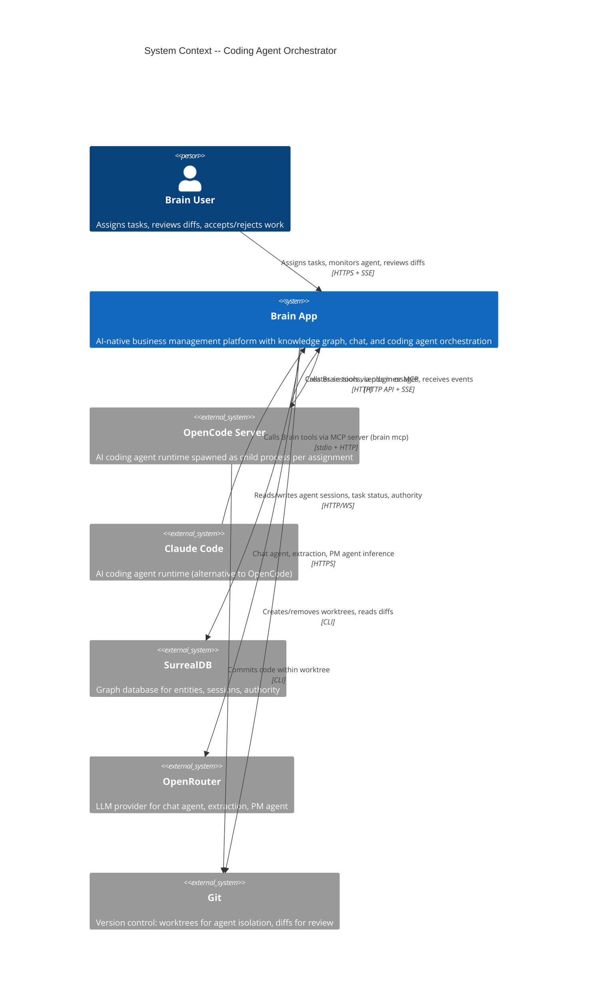
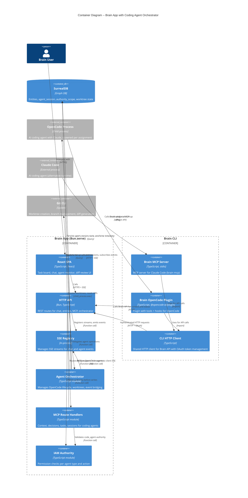
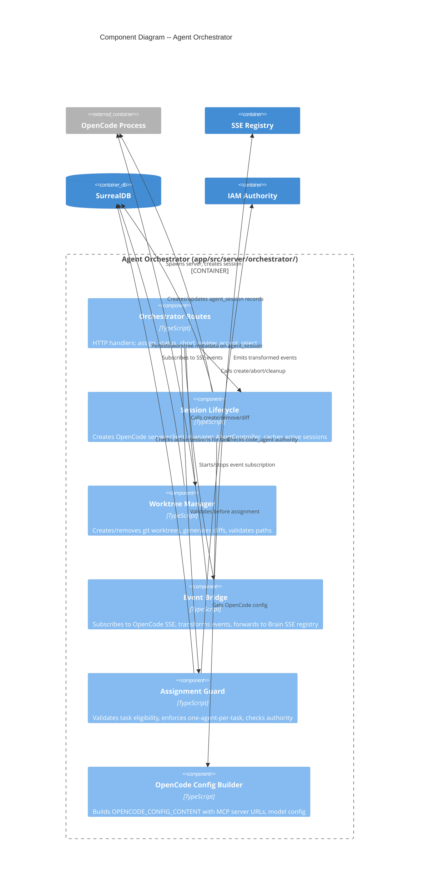
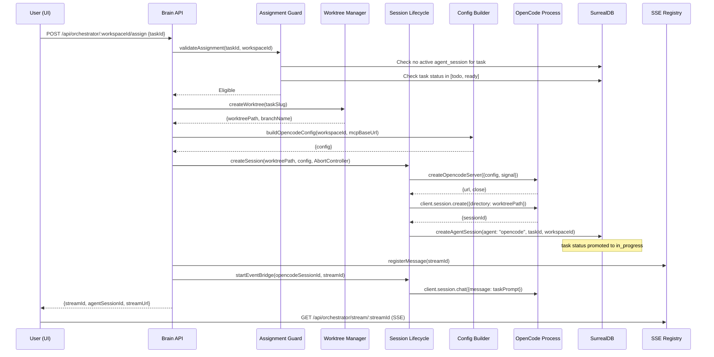
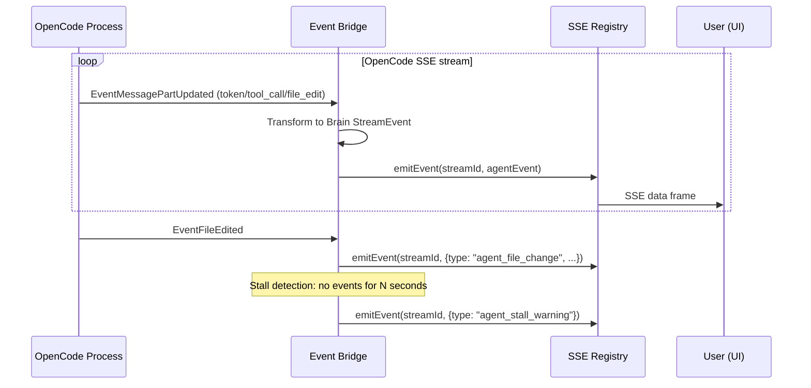
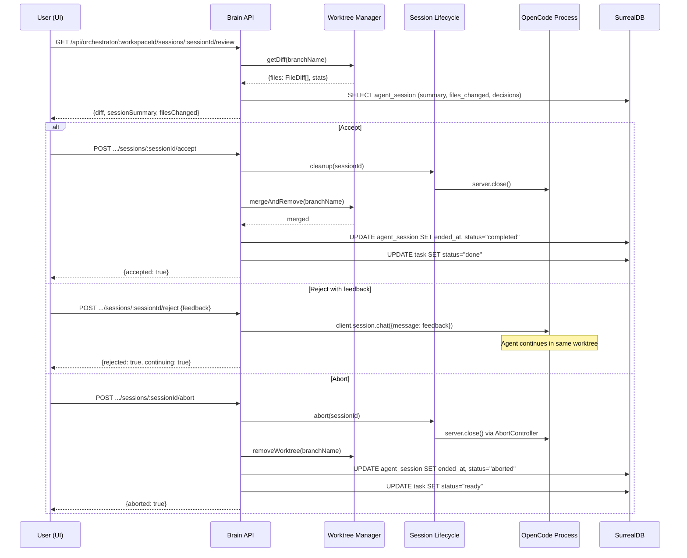

# Coding Agent Orchestrator -- Architecture Design

## Executive Summary

The coding agent orchestrator enables Brain to assign tasks to an AI coding agent (OpenCode), monitor its progress via SSE, and present diffs for human review. It extends the existing modular monolith with a new `orchestrator/` domain that manages the OpenCode process lifecycle, git worktree isolation, and event bridging.

The design also includes a **Brain OpenCode Plugin** that ports the existing Brain CLI / Claude Code integration to OpenCode's plugin system. This gives OpenCode agents the same knowledge graph tools and session lifecycle hooks that Claude Code agents already have, enabling Brain to work with both agent runtimes through a shared backend.

The design reuses existing infrastructure: `agent_session` table, SSE registry, MCP route handlers, IAM authority framework, and the CLI HTTP client (`cli/http-client.ts`).

---

## Quality Attribute Priorities

| Rank | Attribute | Strategy |
|------|-----------|----------|
| 1 | Maintainability | Extend existing patterns (factory handlers, `ServerDependencies`). No new frameworks. |
| 2 | Reliability | AbortController-based cleanup. Stall detection via heartbeat timeout. One active agent per task guard. |
| 3 | Operability | All OpenCode events bridged to Brain SSE. Agent activity queryable from `agent_session`. |
| 4 | Security | Authority scoped to `code_agent`. Worktree paths validated. No arbitrary command execution. |
| 5 | Performance | Lazy spawn (<5s). SSE forwarding <1s. No hot path changes to existing chat/extraction. |

---

## C4 System Context (L1)



---

## C4 Container (L2)



---

## C4 Component (L3) -- Agent Orchestrator Subsystem



---

## Data Flow: Task Assignment



---

## Data Flow: Agent Monitoring (Event Bridge)



---

## Data Flow: Review and Accept/Reject



---

## Integration with Existing Infrastructure

### Reused Components

| Component | Location | How Used |
|-----------|----------|----------|
| `agent_session` table | `schema/surreal-schema.surql` | Extended with orchestrator-specific fields |
| `createAgentSession()` | `mcp/mcp-queries.ts` | Called during assignment to create session + promote task status |
| `endAgentSession()` | `mcp/mcp-queries.ts` | Called on accept/abort to finalize session |
| `SSE Registry` | `streaming/sse-registry.ts` | Event bridge emits transformed OpenCode events |
| `IAM Authority` | `iam/authority.ts` | Guard checks `code_agent` permissions before assignment |
| `MCP Route Handlers` | `mcp/mcp-route.ts` | OpenCode agent calls these for context, decisions, task status |
| `ServerDependencies` | `runtime/types.ts` | Extended to include orchestrator registry |
| `withRequestLogging` | `http/request-logging.ts` | Wraps new orchestrator routes |

### New Route Registration

New routes registered in `start-server.ts` under `/api/orchestrator/` prefix:

| Method | Path | Handler |
|--------|------|---------|
| POST | `/api/orchestrator/:workspaceId/assign` | Assign task to agent |
| GET | `/api/orchestrator/:workspaceId/sessions` | List active sessions |
| GET | `/api/orchestrator/:workspaceId/sessions/:sessionId` | Session status |
| GET | `/api/orchestrator/:workspaceId/sessions/:sessionId/review` | Get diff + summary |
| GET | `/api/orchestrator/stream/:streamId` | SSE stream for agent events |
| POST | `/api/orchestrator/:workspaceId/sessions/:sessionId/accept` | Accept and merge |
| POST | `/api/orchestrator/:workspaceId/sessions/:sessionId/reject` | Reject with feedback |
| POST | `/api/orchestrator/:workspaceId/sessions/:sessionId/abort` | Abort and cleanup |

### MCP Configuration for OpenCode

The orchestrator builds an OpenCode config that points the agent's MCP tools at the existing Brain MCP endpoints:

- Base URL: `http://127.0.0.1:{PORT}/api/mcp/{workspaceId}/`
- Auth: JWT token scoped to workspace + `code_agent` agent type
- Tools available: all existing MCP tier 1 (read), tier 2 (reason), tier 3 (write) handlers
- The agent calls `sessions/start` on init and `sessions/end` on completion -- these are the existing MCP session lifecycle endpoints

---

## Brain OpenCode Plugin Architecture

The Brain CLI currently integrates with Claude Code via two mechanisms: an MCP stdio server (`brain mcp`) for 30+ tools, and Claude Code hooks for session lifecycle. The OpenCode plugin ports both to OpenCode's native plugin system.

### Integration Strategy: Two Paths, Shared Backend

```
┌─────────────────────────────────────────────────────────────┐
│                    Brain HTTP API                            │
│  /api/mcp/:workspaceId/* (context, decisions, tasks, etc.)  │
└────────────────────┬────────────────────┬───────────────────┘
                     │                    │
        ┌────────────┴──────┐   ┌────────┴──────────────┐
        │  Brain MCP Server │   │  Brain OpenCode Plugin │
        │  (cli/mcp-server) │   │  (.opencode/plugins/)  │
        │                   │   │                        │
        │  stdio transport  │   │  Plugin custom tools   │
        │  30+ MCP tools    │   │  + lifecycle hooks     │
        └────────┬──────────┘   └────────┬──────────────┘
                 │                       │
        ┌────────┴──────────┐   ┌────────┴──────────────┐
        │   Claude Code     │   │      OpenCode          │
        └───────────────────┘   └───────────────────────┘
```

Both paths use the **same HTTP client** (`cli/http-client.ts`) and the **same backend API** (`/api/mcp/:workspaceId/*`). The difference is transport:
- Claude Code: MCP stdio protocol → HTTP
- OpenCode: Plugin custom tools → HTTP

### Plugin Structure

```
.opencode/
├── plugins/
│   └── brain.ts              # Brain plugin (tools + hooks)
├── package.json              # Dependencies: cli/http-client
└── (auto-generated by brain init --opencode)
```

The plugin exports a single `Plugin` function that:
1. Initializes the Brain HTTP client with stored credentials
2. Registers **custom tools** (same 30+ tools as MCP, using `tool()` helper)
3. Registers **lifecycle hooks** (ported from Claude Code hooks)

### Hook Mapping: Claude Code → OpenCode Plugin

| Claude Code Hook | OpenCode Plugin Event | Brain CLI Command | Plugin Behavior |
|-----------------|----------------------|-------------------|-----------------|
| `SessionStart` | `session.created` | `brain system load-context` | Load workspace context, start agent session via API |
| `PreToolUse` (Agent dispatch) | `tool.execute.before` | `brain system pretooluse` | Inject Brain context when subagent tools are dispatched |
| `UserPromptSubmit` | `message.updated` (role=user) | `brain system check-updates` | Check for workspace graph updates since last check |
| `SessionEnd` / `Stop` | `session.idle` | `brain system end-session` | End agent session, log summary via API |
| *(not available)* | `experimental.session.compacting` | *(new)* | Inject Brain entity context into compaction prompt |

### Custom Tool Registration

The plugin registers Brain tools as OpenCode native custom tools using `@opencode-ai/plugin`'s `tool()` helper. Each tool wraps an HTTP call to the Brain API:

```
// Conceptual structure (not implementation code)
plugin tools = {
  brain_get_context:        tool({ ... }) → HTTP POST /api/mcp/:ws/context
  brain_get_project_context: tool({ ... }) → HTTP POST /api/mcp/:ws/project-context
  brain_get_task_context:    tool({ ... }) → HTTP POST /api/mcp/:ws/task-context
  brain_update_task_status:  tool({ ... }) → HTTP POST /api/mcp/:ws/tasks/status
  brain_create_observation:  tool({ ... }) → HTTP POST /api/mcp/:ws/observations
  brain_log_note:            tool({ ... }) → HTTP POST /api/mcp/:ws/notes
  // ... all 30+ tools from cli/mcp-server.ts
}
```

### Plugin vs MCP: Why Not Just MCP?

OpenCode supports MCP natively, so the existing `brain mcp` server could work by adding config to `opencode.json`. However, using native plugin tools provides advantages:

| Aspect | MCP in OpenCode | Native Plugin Tools |
|--------|----------------|-------------------|
| **Transport** | Separate stdio process | In-process function calls |
| **Startup** | Spawns `brain mcp` subprocess | Plugin loaded at init |
| **Lifecycle hooks** | Not available via MCP | `session.created`, `session.idle`, `tool.execute.before`, `session.compacting` |
| **Compaction context** | Not possible | Can inject Brain entities into compaction prompt |
| **Latency** | stdio IPC + HTTP | Direct HTTP (no IPC layer) |
| **Error handling** | MCP error protocol | Native plugin error handling |

The plugin approach is strictly superior for OpenCode because it provides lifecycle hooks that MCP cannot offer, plus compaction context injection.

### Orchestrator Integration

When the orchestrator spawns an OpenCode server for task assignment, it configures the Brain plugin via `OPENCODE_CONFIG_CONTENT`:

```
{
  "plugin": [],                    // No npm plugins needed
  // Plugin loaded from .opencode/plugins/brain.ts in the worktree
}
```

The worktree inherits the project's `.opencode/plugins/brain.ts` file, so the spawned OpenCode automatically loads the Brain plugin. The orchestrator's Config Builder sets the auth token and workspace ID via environment variables that the plugin reads at init.

### `brain init` Changes

The `brain init` command gains OpenCode support:

| Current (`brain init`) | New (`brain init --opencode`) |
|------------------------|-------------------------------|
| Creates `.mcp.json` with Brain MCP server | Creates `opencode.json` with Brain plugin reference |
| Creates `.claude/settings.json` hooks | Drops `.opencode/plugins/brain.ts` plugin file |
| Creates `.claude/commands/` slash commands | Creates `.opencode/commands/` if supported |
| OAuth flow → stores in `~/.brain/config.json` | Same OAuth flow, same credential store |

Auto-detection: `brain init` can detect whether `.claude/` or `.opencode/` exists and configure the appropriate integration. Both can coexist in the same repository.

---

## Walking Skeleton Scope

The walking skeleton (Feature 0) covers the minimum viable path:

1. **Brain OpenCode Plugin**: Plugin with core tools (get_context, get_task_context, update_task_status, create_observation) + session lifecycle hooks (session.created, session.idle)
2. **`brain init --opencode`**: Init command generates `opencode.json` config + drops plugin into `.opencode/plugins/`
3. **Assign route**: POST handler that creates worktree, spawns OpenCode, creates session, sends initial task message
4. **MCP integration**: OpenCode agent uses Brain tools via plugin (or MCP fallback)
5. **Status polling**: GET session status (no SSE bridging yet -- polling only)
6. **Accept/abort**: Accept merges worktree branch, abort removes it

Deferred from walking skeleton:
- SSE event bridging (use polling instead)
- Stall detection
- Reject-with-feedback loop
- UI components (test via curl/API client)
- Multi-session management
- Compaction context injection (experimental hook)
- Full 30+ tool parity in plugin (start with essential subset)

---

## Deployment Architecture

No changes to deployment topology. The orchestrator runs in-process within the existing Bun.serve monolith. OpenCode processes are spawned as child processes on the same host. Git worktrees are created in a `.brain/worktrees/` directory relative to the repository root.

Resource considerations:
- Each active agent consumes one OpenCode child process (~100-200MB RSS)
- Practical limit: 2-3 concurrent agents on a single host
- Worktrees share git objects (disk-efficient)
