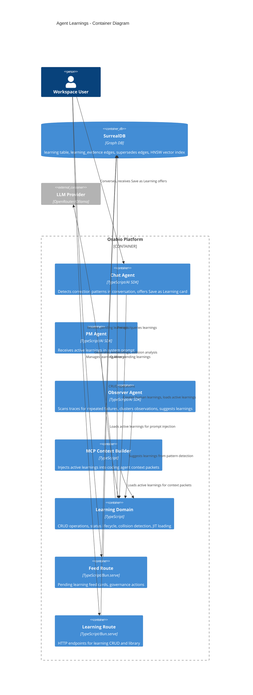
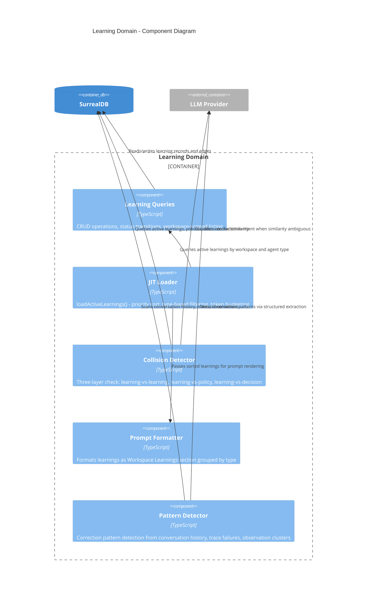

# Agent Learnings Architecture Design

## System Context

Agent Learnings adds persistent behavioral modification to Osabio's knowledge graph. Learnings are behavioral rules injected into agent system prompts at runtime (JIT prompting), converting repeated corrections into permanent wisdom.

Two creation paths:
- **Human-created**: User records a correction as a permanent rule. Immediately active.
- **Agent-suggested**: Observer/chat agent detects repeated patterns, suggests a learning. Requires human approval before activation.

## C4 System Context (L1)

```mermaid
C4Context
    title Agent Learnings - System Context

    Person(human, "Workspace User", "Creates learnings, approves agent suggestions, curates learning library")

    System(osabio, "Osabio Platform", "Knowledge graph operating system for autonomous organizations")

    System_Ext(llm, "LLM Provider", "OpenRouter/Ollama - embedding generation, correction detection, collision analysis")
    System_Ext(surrealdb, "SurrealDB", "Graph + vector + document store")

    Rel(human, osabio, "Creates learnings, approves/dismisses suggestions", "HTTP/SSE")
    Rel(brain, llm, "Generates embeddings, detects patterns, classifies collisions", "HTTP")
    Rel(brain, surrealdb, "Persists learnings, queries active learnings, vector search", "WS/HTTP")
```

## C4 Container (L2)



## C4 Component (L3) - Learning Domain

The learning domain has 5+ internal concerns warranting a component diagram.



## Component Architecture

### Learning Domain (`app/src/server/learning/`)

| Component | Responsibility | Driven Port |
|---|---|---|
| `queries.ts` | CRUD: create, update status, list by workspace/status/agent, deactivate, supersede | SurrealDB |
| `loader.ts` | `loadActiveLearnings()` - priority sort, type filter, token budget | SurrealDB |
| `formatter.ts` | `formatLearningsSection()` - renders learnings as prompt text grouped by type | None (pure) |
| `collision.ts` | `checkCollisions()` - three-layer collision detection before activation | SurrealDB, LLM |
| `detector.ts` | Pattern detection from conversation/trace/observation sources | SurrealDB, LLM |

### Integration Points (Existing Files Modified)

| File | Change | Nature |
|---|---|---|
| `chat/context.ts` | Add `activeLearnings` to `ChatContext`, inject via `buildSystemPrompt` | Additive |
| `agents/pm/prompt.ts` | Add learnings section to `buildPmSystemPrompt` | Additive |
| `agents/observer/prompt.ts` | Add learnings section to observer prompt | Additive |
| `mcp/context-builder.ts` | Add `learnings` field to context packets | Additive |
| `feed/feed-queries.ts` | Add `listPendingLearnings()` query | Additive |
| `feed/feed-route.ts` | Add pending learnings to review tier | Additive |
| `shared/contracts.ts` | Add `LearningSummary`, `LearningType`, `LearningStatus`, `LearningSource` types | Additive |
| `runtime/start-server.ts` | Register learning route handlers | Additive |
| `runtime/types.ts` | No change needed (uses existing `ServerDependencies`) | None |

### New Files

| File | Purpose |
|---|---|
| `schema/migrations/0030_learning_table.surql` | Learning table, relation tables, indexes |
| `app/src/server/learning/queries.ts` | Learning CRUD and status transitions |
| `app/src/server/learning/loader.ts` | JIT loading with priority sort and token budget |
| `app/src/server/learning/formatter.ts` | Prompt section rendering |
| `app/src/server/learning/collision.ts` | Three-layer collision detection |
| `app/src/server/learning/detector.ts` | Pattern detection from multiple sources |
| `app/src/server/learning/learning-route.ts` | HTTP endpoints for learning CRUD |
| `app/src/server/learning/types.ts` | Internal type definitions |

## Integration Patterns

### JIT Learning Injection (Hot Path)

All four prompt builders call the same shared function:

```
buildSystemPrompt / buildPmSystemPrompt / buildObserverSystemPrompt / buildProjectContext
  -> loadActiveLearnings(surreal, workspaceRecord, agentType, contextEmbedding?)
  -> formatLearningsSection(learnings)
  -> append to system prompt sections
```

Context embedding source per prompt builder:
- **Chat agent**: embedding of conversation's project description (if project linked), otherwise no precedents
- **PM agent**: embedding of project description
- **MCP context**: embedding of task description from context packet request
- **Observer**: no contextEmbedding provided -- gets constraints + instructions only, never precedents

Priority sort order:
1. Source: human > agent
2. Priority: high > medium > low
3. Created: newest first

Type-based injection rules:
- `constraint`: ALWAYS injected, never dropped for budget
- `instruction`: injected within token budget
- `precedent`: injected only when semantically relevant (similarity > 0.70 to current context embedding)

Token budget: ~500 tokens via `estimateTokens(text) = Math.ceil(text.trim().split(/\s+/).length / 0.75)`. Constraints are NEVER dropped -- if constraints alone exceed 500 tokens, include all and log an observation. Instructions fill remaining budget in priority order. Precedents fill remaining budget by similarity.

### Collision Detection (Write Path)

Before any learning transitions to `active` status:

**Unified classification algorithm** (see ADR-028 for full specification):

| Layer | Threshold | > 0.90 | 0.75/0.80 - 0.90 | Below threshold |
|---|---|---|---|---|
| Learning-vs-learning | 0.75 | `duplicates` | LLM classify | No collision |
| Learning-vs-policy | 0.80 | LLM classify | LLM classify | No collision |
| Learning-vs-decision | 0.80 | LLM classify | LLM classify | No collision |

**LLM intent classification**: Structured output `{ classification: "contradicts" | "reinforces" | "unrelated", reasoning: string }`. Single `generateObject` call per candidate pair, expected <2s. If LLM unavailable, default to `"contradicts"` (safer -- surfaces warning rather than missing conflict).

**Collision severity**: Policy contradiction = hard block. Learning contradiction = warning (user can override). Decision contradiction = informational.

**Embedding unavailable behavior**:
- Human-created: skip collision check, activate anyway, log observation "Learning activated without collision check", Observer picks up for deferred check
- Agent-suggested: skip collision check, status stays `pending_approval` (human reviews)
- Deferred retroactive check: Observer scans for active learnings with missing embeddings, computes embedding, runs collision check. If policy conflict discovered post-activation: deactivate learning, create warning observation, surface in governance feed (retroactive deactivation).

### Pattern Detection (Agent Suggestion Path)

Three independent detection sources:

1. **Conversation corrections**: Chat agent calls `detectConversationCorrections()` synchronously during message processing. Detects when user corrects same topic 3+ times in 14 days via LLM structured extraction.
2. **Trace failures**: Observer calls `detectTraceFailures()` during scheduled graph scan. Scans `trace` table for repeated tool failures (same tool, same error pattern, 3+ occurrences). Scan frequency: configurable, default every 6 hours.
3. **Observation clusters**: Observer calls `detectObservationClusters()` during scheduled graph scan. Clusters open observations by embedding similarity. Cluster of 3+ similar observations suggests a systemic pattern.

**Rate limiting gate** (executed before any suggestion creation):
1. Query: `SELECT count() FROM learning WHERE workspace = $ws AND suggested_by = $agent AND created_at > time::now() - 7d GROUP ALL`
2. If count >= 5: log observation "Learning suggestion rate limit reached for {agentType} ({count}/5 this week)", skip suggestion
3. Dismissed re-suggestion check: KNN on dismissed learnings in workspace, if any match with similarity > 0.85, skip suggestion (human already rejected substantially similar learning)

## Quality Attribute Strategies

### Maintainability
- Learning domain is a self-contained module under `app/src/server/learning/`
- Integration with existing prompt builders is additive (no modification of existing function signatures)
- Follows existing patterns: `observation/queries.ts`, `suggestion/queries.ts`

### Testability
- `formatter.ts` is pure function, unit-testable without DB or mocks
- `loader.ts` sort/budget logic is pure, unit-testable. DB integration via acceptance tests.
- `collision.ts` takes LLM model as parameter for mock injection in tests
- `detector.ts` rate limiting and dismissed check are DB queries, testable via acceptance kit
- Acceptance tests follow existing `acceptance-test-kit.ts` pattern with isolated namespace
- See component-boundaries.md "Testing Strategy" table for per-component test boundaries

### Performance
- JIT loading adds one DB query per agent session start (not per message)
- Two-step KNN pattern (per CLAUDE.md constraint) for vector similarity queries
- Collision detection runs only on status transitions, not on every read

### Security
- Workspace-scoped: all queries filter by `workspace = $workspace`
- Human-created learnings bypass approval but still run collision detection
- Agent-suggested learnings require human approval (governance gate)

### Reliability
- Fail-open for human-created learnings when embedding service unavailable (activate without collision check, log observation)
- Fail-closed for agent-suggested learnings (remain in `pending_approval`, embedding computed by deferred scan)
- No silent fallbacks: collision detection failures surface as observations in governance feed
- **Retroactive deactivation**: If deferred collision check discovers a policy conflict on an already-active learning, the system deactivates the learning, creates a warning observation ("Learning deactivated -- conflicts with policy {policy_text}"), and surfaces it in the governance feed. The human can re-activate if the conflict is acceptable.
- **Embedding retry**: Observer scans for learnings with `embedding = NONE AND status IN ["active", "pending_approval"]`, computes embedding, runs deferred collision check. Simple pull model -- no queue infrastructure needed.
- **Inflight tracking**: Background DB operations in route handlers (embedding generation, deferred collision) use `deps.inflight.track(promise)` per AGENTS.md contract

## Deployment Architecture

No new infrastructure. Agent Learnings uses existing:
- SurrealDB instance (new table + indexes via migration)
- LLM provider (existing embedding model for similarity, existing extraction model for pattern detection)
- Bun.serve (new route handlers registered in start-server.ts)

## Implementation Roadmap

### Phase 1: Schema Foundation

```yaml
step_01:
  title: "Learning table schema and migration"
  description: "SCHEMAFULL learning table with full audit trail, relation tables, indexes"
  acceptance_criteria:
    - "Learning table with all fields including audit trail (approved_by/at, dismissed_by/at/reason, deactivated_by/at)"
    - "learning_evidence TYPE RELATION with polymorphic OUT (message|trace|observation|agent_session)"
    - "supersedes TYPE RELATION IN learning OUT learning with superseded_at and reason"
    - "HNSW index on embedding, composite index on workspace+status"
    - "Migration applies cleanly via bun migrate"
  architectural_constraints:
    - "Migration file: 0030_learning_table.surql"
    - "Follow existing table patterns (observation, suggestion)"
    - "Supersession direction: RELATE new->supersedes->old"
```

### Phase 2: Core Domain (parallel tracks)

```yaml
step_02:
  title: "Learning CRUD queries and shared contract types"
  description: "Workspace-scoped create, status transitions, listing. Contract types in shared/contracts.ts"
  acceptance_criteria:
    - "createLearning persists record with evidence edges"
    - "Status transitions validate workspace scope before update"
    - "LearningSummary, LearningType, LearningStatus types exported"
    - "EntityKind union includes 'learning'"
  architectural_constraints:
    - "Follow observation/queries.ts pattern"
    - "No null in domain data"

step_03:
  title: "JIT learning loader and prompt formatter"
  description: "Load active learnings by workspace/agent, priority sort, token budget, format as prompt section"
  acceptance_criteria:
    - "Constraints always included even if they alone exceed 500 token budget"
    - "When constraints exceed budget, observation logged but no constraints dropped"
    - "Instructions fill remaining budget in priority order (skip oversized, try next)"
    - "Precedents included only when contextEmbedding provided and similarity > 0.70"
    - "Output grouped by type as Workspace Learnings section"
  architectural_constraints:
    - "estimateTokens: Math.ceil(text.trim().split(/\\s+/).length / 0.75)"
    - "Two-step KNN for precedent similarity (SurrealDB HNSW bug)"
    - "formatter.ts is pure function, no IO"

step_04:
  title: "Inject learnings into all four prompt builders"
  description: "Integrate loadActiveLearnings + formatLearningsSection into chat, PM, observer, MCP contexts"
  acceptance_criteria:
    - "Chat agent prompt includes Workspace Learnings with project description as contextEmbedding"
    - "PM agent prompt includes Workspace Learnings with project description as contextEmbedding"
    - "Observer agent prompt includes constraints + instructions only (no contextEmbedding)"
    - "MCP context packets include learnings with task description as contextEmbedding"
  architectural_constraints:
    - "Additive changes only to existing prompt builders"
    - "Learning section positioned before conversation/entity context"
    - "If contextEmbedding unavailable, precedents excluded silently (not an error)"
```

### Phase 3: Governance

```yaml
step_05:
  title: "Learning HTTP endpoints and feed integration"
  description: "CRUD routes with embedding error handling, governance feed, approve/dismiss actions with audit trail"
  acceptance_criteria:
    - "POST creates learning; if embedding fails, persists with embedding undefined and collisionCheckDeferred flag"
    - "GET lists learnings filterable by status, type, agent; includes audit trail fields"
    - "Approve action sets approved_by/at, runs collision check, activates or blocks"
    - "Dismiss action sets dismissed_by/at/reason"
    - "Pending learnings appear as review-tier feed cards"
  architectural_constraints:
    - "Route registered in start-server.ts"
    - "Background work (embedding gen, deferred collision) wrapped in deps.inflight.track()"
    - "Feed mapper follows mapPendingIntentToFeedItem pattern"
```

### Phase 4: Agent Self-Improvement

```yaml
step_06:
  title: "Pattern detection from conversations, traces, and observations"
  description: "Three detection sources with rate limiting gate and dismissed re-suggestion prevention"
  acceptance_criteria:
    - "Conversation detector finds 3+ corrections on same topic in 14 days"
    - "Trace detector finds 3+ same-tool failures with similar errors"
    - "Observation cluster detector groups 3+ similar observations by embedding"
    - "Rate limit query blocks suggestion when count >= 5 per agent per 7 days"
    - "Dismissed re-suggestion check (KNN similarity > 0.85) blocks re-proposal"
  architectural_constraints:
    - "Chat agent calls detectConversationCorrections synchronously during message processing"
    - "Observer calls detectTraceFailures + detectObservationClusters during scheduled scan (default 6h)"
    - "Rate limit check and dismissed check run before every suggestion creation"
```

### Phase 5: Safety Net

```yaml
step_07:
  title: "Three-layer collision detection with LLM intent classification"
  description: "Unified collision algorithm with structured LLM output, fallback, and retroactive deactivation"
  acceptance_criteria:
    - "Learning similarity > 0.90 classified as duplicate; 0.75-0.90 triggers LLM classification"
    - "Policy similarity > 0.80 triggers LLM classification; contradiction = hard block"
    - "Decision similarity > 0.80 triggers LLM classification; contradiction = informational"
    - "LLM returns structured {classification, reasoning}; fallback to 'contradicts' on LLM failure"
    - "Retroactive deactivation when deferred check finds policy conflict on active learning"
  architectural_constraints:
    - "Collision check runs on every status transition to active"
    - "Two-step KNN for all similarity searches (ADR-028)"
    - "LLM uses generateObject with extraction model, expected <2s per call"
    - "Fail-open for human-created when embedding unavailable; fail-closed for agent-suggested"
```

## Quality Gate Checklist

- [x] Requirements traced to components (6 user stories -> 7 steps)
- [x] Component boundaries with clear responsibilities (5 domain components + 1 route)
- [x] Technology choices in ADRs with alternatives (ADR-026 through ADR-030)
- [x] Quality attributes addressed (performance, security, reliability, maintainability, testability)
- [x] Dependency-inversion compliance (HTTP adapter -> domain -> driven ports)
- [x] C4 diagrams (L1 + L2 + L3, Mermaid)
- [x] Integration patterns specified (JIT injection, collision detection, pattern detection)
- [x] OSS preference validated (no new dependencies, all existing stack)
- [x] Roadmap step count efficient (7 steps / ~8 production files = 0.875, well under 2.5)
- [x] AC behavioral, not implementation-coupled (no method signatures or class names)
- [x] Functional paradigm: pure formatter, composition pipelines, effect boundaries at adapter layer

## Peer Review

### Iteration 1: Rejected with 4 Critical + 4 High Issues

| ID | Severity | Issue | Resolution |
|---|---|---|---|
| C1 | Critical | Token budget algorithm not specified | Added `estimateTokens` algorithm, overflow behavior, constraint-never-dropped rules to ADR-026 and step_03 |
| C2 | Critical | Collision intent classification undefined | Added LLM structured output schema `{classification, reasoning}`, prompt template, fallback to "contradicts", latency note to ADR-028 and step_07 |
| C3 | Critical | Rate limiting not implemented in detector spec | Added `countRecentSuggestionsByAgent` query with `time::now() - 7d`, skip logic, dismissed KNN check to data-models.md and step_06 |
| C4 | Critical | `approved_by/at` fields missing from schema | Added `approved_by/at`, `dismissed_by/at/reason`, `deactivated_by/at` to schema and LearningSummary contract |
| H1 | High | Precedent relevance embedding context undefined | Added contextEmbedding source table per prompt builder (project desc, task desc, or none) to loader spec and step_04 |
| H2 | High | Fire-and-forget tracking for async collision | Added `deps.inflight.track()` requirement to learning-route spec and step_05 |
| H3 | High | Embedding generation error handling | Added fail-open/closed behavior per source, deferred retry via Observer scan, `collisionCheckDeferred` flag |
| H4 | High | Collision type classification thresholds inconsistent | Added unified classification algorithm table to ADR-028 and architecture-design collision section |
| M1 | Medium | Supersession edge direction | Clarified: `RELATE new->supersedes->old` in data-models.md |
| M2 | Medium | Observer invocation scope | Documented: chat agent calls synchronously, observer calls during 6h scheduled scan |
| M3 | Medium | Rollback for deferred collision failures | Added retroactive deactivation to reliability section and step_07 |
| M4 | Medium | Test boundaries | Added testing strategy table to component-boundaries.md |

### Iteration 2: All Critical and High Issues Resolved

All 4 critical blockers addressed with concrete algorithms, schemas, and query definitions. All 4 high issues addressed with explicit contracts and error handling strategies. All 4 medium issues addressed. Architecture is ready for handoff.

## ADR Index

| ADR | Decision |
|---|---|
| [ADR-026](../../../adrs/ADR-026-word-count-heuristic-for-learning-token-budget.md) | Word-count heuristic over tokenizer library for token budget |
| [ADR-027](../../../adrs/ADR-027-dedicated-learning-table-over-suggestion-extension.md) | Dedicated learning table over suggestion table extension |
| [ADR-028](../../../adrs/ADR-028-three-layer-collision-detection-for-learnings.md) | Three-layer collision detection with escalating severity |
| [ADR-029](../../../adrs/ADR-029-workspace-scoped-learnings-not-project-scoped.md) | Workspace-scoped learnings, not project-scoped |
| [ADR-030](../../../adrs/ADR-030-jit-learning-injection-at-session-start.md) | JIT learning injection at session start |
