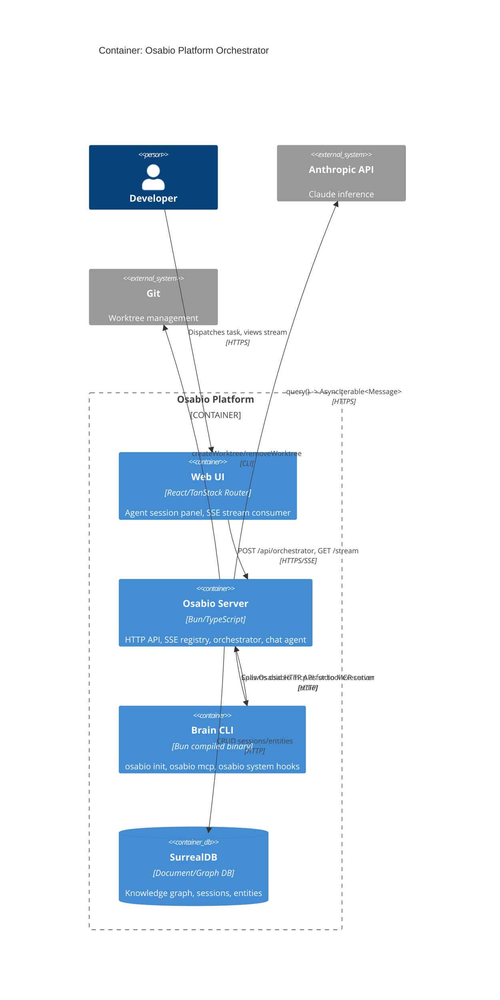
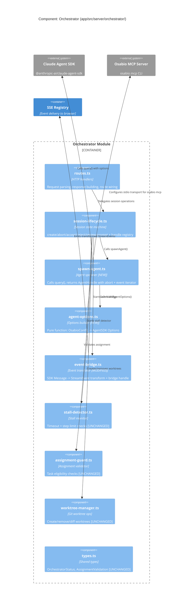

# Architecture Design: Claude Agent SDK Migration

## System Overview

Replace the OpenCode-based coding agent orchestrator with the Claude Agent SDK. The SDK's `query()` function returns a typed `AsyncIterable<Message>`, eliminating child process management, port allocation, stdout parsing, and the OpenCode proprietary event format.

**Affected boundary**: `app/src/server/orchestrator/` (spawn, config, event bridge). Session lifecycle, routes, worktree manager, assignment guard, stall detector, SSE streaming contract, and UI are unchanged.

## C4 System Context (L1)

```mermaid
C4Context
    title System Context: Osabio with Claude Agent SDK

    Person(user, "Developer", "Uses Osabio web UI to manage workspace and dispatch coding tasks")
    Person(agent, "Claude Agent", "Autonomous coding agent executing tasks in worktrees")

    System(osabio, "Osabio Platform", "Knowledge graph + orchestrator for AI-assisted development")

    System_Ext(anthropic, "Anthropic API", "Claude model inference via Agent SDK")
    System_Ext(surrealdb, "SurrealDB", "Knowledge graph persistence")
    System_Ext(git, "Git", "Worktree isolation for agent branches")

    Rel(user, osabio, "Dispatches tasks, reviews output", "HTTPS/SSE")
    Rel(brain, anthropic, "Sends query(), receives AsyncIterable<Message>", "HTTPS")
    Rel(brain, surrealdb, "Reads/writes entities, sessions", "HTTP/WS")
    Rel(brain, git, "Creates/removes worktrees", "CLI")
    Rel(agent, osabio, "Calls Osabio MCP tools", "stdio")
```

## C4 Container (L2)



## C4 Component (L3): Orchestrator Module



## Component Boundaries and Responsibilities

### New Components

| Component | Responsibility | Replaces |
|-----------|---------------|----------|
| `spawn-agent.ts` | Invokes `query()`, returns `AgentHandle` | `spawn-opencode.ts` (full replacement) |
| `agent-options.ts` | Pure function building SDK `Options` from Osabio config | `config-builder.ts` (full replacement) |

### Modified Components

| Component | Change |
|-----------|--------|
| `event-bridge.ts` | Transform SDK `Message` types instead of OpenCode events |
| `session-lifecycle.ts` | `OpenCodeHandle` -> `AgentHandle` type alias; `SpawnOpenCodeFn` -> `SpawnAgentFn` |
| `routes.ts` | Update `spawnOpenCodeImport` to `spawnAgentImport` |

### Unchanged Components

`stall-detector.ts`, `assignment-guard.ts`, `worktree-manager.ts`, `types.ts`, all route handlers, SSE registry, all UI components.

## Data Flow: Agent Spawn Sequence

```
createOrchestratorSession()
  |
  +-- validateAssignment() -> ok
  +-- createWorktree() -> worktreePath, branchName
  +-- createAgentSession() -> agentSessionId (DB record)
  +-- buildAgentOptions({ brainBaseUrl, workspaceId, taskId, ... })
  |     |
  |     +-- returns Options {
  |           prompt: system prompt with task context
  |           cwd: worktreePath
  |           permissionMode: "bypassPermissions"
  |           mcpServers: { brain: { type: "stdio", command: "brain", args: ["mcp"] } }
  |         }
  |
  +-- spawnAgent(options) -> AgentHandle { abort, messages }
  |     |
  |     +-- abortController = new AbortController()
  |     +-- messages = query({ ...options, abortController })
  |     +-- return { abort: () => abortController.abort(), messages }
  |
  +-- registerHandle(agentSessionId, handle)
  +-- startEventIteration(handle.messages, streamId, sessionId)
        |
        +-- for await (message of handle.messages)
        |     +-- transformSdkMessage(message) -> StreamEvent
        |     +-- emitEvent(streamId, streamEvent)
        |     +-- stallDetector.recordActivity()
        +-- on completion/error -> update session status
```

## Data Flow: Agent Abort Sequence

```
abortOrchestratorSession()
  |
  +-- handle = getHandle(sessionId)
  +-- handle.abort()  // triggers AbortController.abort()
  |     |
  |     +-- query() iterator terminates
  |     +-- event iteration loop breaks
  |     +-- bridge.stop() called
  |     +-- stall detector stopped
  |
  +-- update orchestrator_status = "aborted"
  +-- removeWorktree()
  +-- endAgentSession()
```

## Integration Patterns

### Osabio MCP Server (stdio transport)

The Agent SDK supports MCP servers as stdio subprocesses. Osabio MCP is configured as:

```
mcpServers: {
  brain: {
    type: "stdio",
    command: "brain",
    args: ["mcp"],
    env: {
      OSABIO_SERVER_URL: brainBaseUrl,
      OSABIO_WORKSPACE_ID: workspaceId
    }
  }
}
```

This eliminates the HTTP-based MCP relay from OpenCode. The SDK spawns `osabio mcp` as a child process with stdio IPC -- the same MCP server used by Claude Code, zero duplicate tool definitions.

### Lifecycle Hooks

Hooks are callback functions passed in the `Options` object. They execute at specific agent lifecycle points:

| Hook | When | Osabio Action |
|------|------|-------------|
| `SessionStart` | Agent session begins | Load workspace/project context via Osabio API |
| `PreToolUse` | Before each tool call | Inject osabio context for subagent dispatches |
| `UserPromptSubmit` | Follow-up prompt sent | Check for workspace-level graph updates |
| `Stop` | Agent reaches stop point | Catch unlogged decisions/observations |
| `PreCompact` | Context compaction triggered | Preserve osabio context across compaction |
| `SessionEnd` | Session terminates | Record session summary in knowledge graph |

Hook callbacks MUST NOT block the agent loop. Non-critical hooks (PreToolUse, UserPromptSubmit) use fire-and-forget with error swallowing. Critical hooks (SessionEnd) await with timeout.

### Event Translation

SDK `Message` types map to existing `StreamEvent` contract:

| SDK Message Type | StreamEvent Type | Notes |
|-----------------|-----------------|-------|
| `assistant` (text content) | `agent_token` | Streaming text tokens |
| `assistant` (tool_use) | (no direct mapping) | Tool usage tracked by stall detector step count |
| `result` (success) | `agent_status` (completed) | Session completion |
| `result` (error) | `agent_status` (error) | With error details |
| Tool output with file changes | `agent_file_change` | Extracted from tool results |

## Quality Attribute Strategies

### Maintainability
- Single agent runtime integration (vs. dual OpenCode + plugin)
- SDK message types are TypeScript-typed (vs. untyped OpenCode SSE events)
- Hook logic reuses existing `osabio system` commands

### Reliability
- AbortController-based cancellation (deterministic cleanup)
- No port allocation race conditions
- No stdout parsing failure modes
- Stall detector unchanged (already proven)

### Testability
- `SpawnAgentFn` remains injectable (same pattern as `SpawnOpenCodeFn`)
- Pure `buildAgentOptions()` function is trivially testable
- Pure `transformSdkMessage()` function testable with SDK message fixtures
- Mock spawn already wired in routes.ts via `ORCHESTRATOR_MOCK_OPENCODE` env var

### Performance
- Eliminates: port allocation (~50ms), process startup (~2-5s), HTTP client creation
- `query()` call is direct HTTPS to Anthropic API (no local intermediary)
- Event stream is native AsyncIterable (no SSE parsing layer)

## Deployment Considerations

- **New dependency**: `@anthropic-ai/claude-agent-sdk` (bundles Claude Code binary, ~50MB)
- **New env var**: `ANTHROPIC_API_KEY` (required for SDK authentication)
- **Removed dependency**: `@opencode-ai/sdk`
- **Binary size impact**: CLI binary (`osabio`) built with `bun build --compile` will increase due to SDK bundle
- **No schema migration needed**: `agent_session` table unchanged; `opencode_session_id` field becomes unused (can be removed in future cleanup migration)
