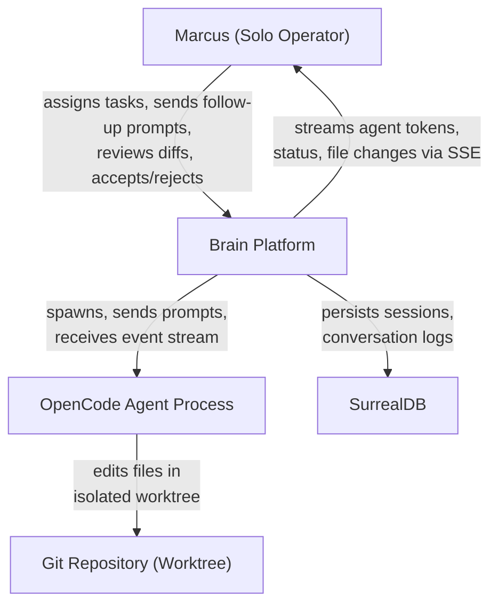
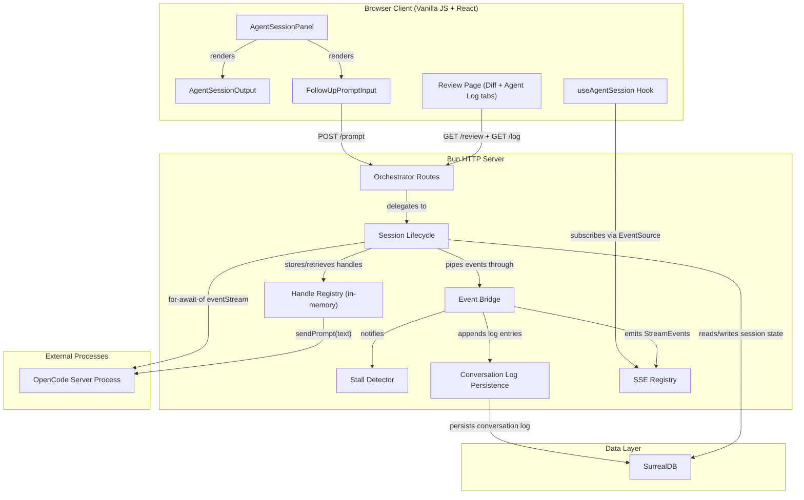

# Coding Session -- Architecture Design

## 1. System Context

The coding-session feature adds an interactive supervisory layer between Brain's human operator and spawned OpenCode coding agents. It wires existing infrastructure (spawn, event bridge, stall detector, SSE registry) into a live feedback loop.

### C4 Level 1: System Context



### C4 Level 2: Container Diagram



## 2. Component Architecture

### 2.1 Server Components

| Component | Location | Responsibility | Status |
|-----------|----------|---------------|--------|
| spawn-opencode | `orchestrator/spawn-opencode.ts` | Spawn OpenCode process, expose handle | **EXISTS** -- complete |
| event-bridge | `orchestrator/event-bridge.ts` | Transform OpenCode events to StreamEvents | **EXISTS** -- complete |
| stall-detector | `orchestrator/stall-detector.ts` | Monitor session activity, abort on stall | **EXISTS** -- complete |
| session-lifecycle | `orchestrator/session-lifecycle.ts` | Session CRUD, state machine, handle registry | **EXISTS** -- needs event iteration wiring |
| routes | `orchestrator/routes.ts` | HTTP route handlers | **EXISTS** -- needs prompt endpoint |
| sse-registry | `streaming/sse-registry.ts` | SSE stream management | **EXISTS** -- needs orchestrator wiring |
| conversation-log | `orchestrator/conversation-log.ts` | Persist/retrieve agent conversation log | **NEW** |

### 2.2 Client Components

| Component | Location | Responsibility | Status |
|-----------|----------|---------------|--------|
| AgentStatusSection | `components/graph/AgentStatusSection.tsx` | Status badge, assign button | **EXISTS** -- needs panel delegation |
| useAgentSession | `hooks/use-agent-session.ts` | SSE subscription, state reducer | **EXISTS** -- needs token accumulation |
| orchestrator-api | `graph/orchestrator-api.ts` | Client fetch wrappers | **EXISTS** -- needs sendPrompt + getLog |
| AgentSessionOutput | `components/graph/AgentSessionOutput.tsx` | Token stream display, auto-scroll | **NEW** |
| AgentSessionPanel | `components/graph/AgentSessionPanel.tsx` | Composite: output + prompt input | **NEW** |
| AgentLogView | `components/graph/AgentLogView.tsx` | Chronological conversation log for review | **NEW** |

### 2.3 Shared Contracts

| Type | Location | Status |
|------|----------|--------|
| AgentTokenEvent | `shared/contracts.ts` | **EXISTS** |
| AgentFileChangeEvent | `shared/contracts.ts` | **EXISTS** |
| AgentStatusEvent | `shared/contracts.ts` | **EXISTS** |
| AgentStallWarningEvent | `shared/contracts.ts` | **EXISTS** |
| AgentPromptEvent | `shared/contracts.ts` | **NEW** -- user prompt echoed in stream |
| ConversationLogEntry | `shared/contracts.ts` | **NEW** -- structured log entry for persistence |

## 3. Data Flow

### 3.1 Event Stream Flow (US-CS-003 + US-CS-001)

```
OpenCode Process
  |
  | AsyncIterable<OpencodeEvent>
  v
createOrchestratorSession (for-await-of loop, fire-and-forget)
  |
  | OpencodeEvent
  v
startEventBridge.handleEvent()
  |-- transformOpencodeEvent() -> StreamEvent
  |-- deps.emitEvent(streamId, streamEvent) -> SSE Registry
  |-- deps.updateLastEventAt(sessionId) -> SurrealDB
  |-- stallDetector.recordActivity()
  |-- appendLogEntry(sessionId, logEntry) -> SurrealDB
  |
  v
SSE Registry -> EventSource -> useAgentSession hook
  |
  | reduceAgentSessionEvent()
  v
AgentSessionOutput (renders accumulated tokens)
```

### 3.2 Follow-Up Prompt Flow (US-CS-002)

```
User types in PromptInput
  |
  | POST /api/orchestrator/:ws/sessions/:id/prompt { text }
  v
promptSession route handler
  |-- validate session exists and is active
  |-- look up OpenCodeHandle from handleRegistry
  |-- handle.sendPrompt(text) (fire-and-forget)
  |-- emit AgentPromptEvent to SSE stream (echo back to client)
  |-- appendLogEntry(sessionId, { type: "user_prompt", text })
  |
  v
Response: 202 Accepted
```

### 3.3 Review with Agent Log (US-CS-004)

```
User navigates to review page
  |
  | GET /api/orchestrator/:ws/sessions/:id/review (existing)
  | GET /api/orchestrator/:ws/sessions/:id/log (new)
  v
Review page renders two tabs:
  - Diff tab (existing)
  - Agent Log tab (new: chronological conversation trail)

Reject with Feedback:
  |
  | POST /api/orchestrator/:ws/sessions/:id/reject { feedback }
  v
rejectOrchestratorSession (existing)
  |-- sets status to "active"
  |-- handle.sendPrompt(feedback) via handleRegistry
  |-- appendLogEntry(sessionId, { type: "user_prompt", text: feedback })
```

## 4. Architecture Decisions

### 4.1 SSE Registry Wiring Gap

**Finding**: `wireOrchestratorRoutes` is called WITHOUT `sseRegistry` in `start-server.ts`. The SSE registry exists at `deps.sse` but is not passed to the orchestrator wiring.

**Resolution**: Pass `deps.sse` as `sseRegistry` to `wireOrchestratorRoutes`. Also register the stream in the SSE registry when creating a session (call `sseRegistry.registerMessage(streamId)` before spawning).

### 4.2 Orchestrator SSE Stream Route

**Finding**: No stream route is registered for orchestrator sessions. The chat system has `/api/chat/stream/:messageId` but the orchestrator's stream handler (created in `routes.ts` when `sseRegistry` is provided) has no registered URL path.

**Resolution**: Add route `/api/orchestrator/:workspaceId/sessions/:sessionId/stream` that delegates to the SSE registry's `handleStreamRequest(streamId)`.

### 4.3 Event Iteration Strategy

The `for-await-of` loop over `handle.eventStream` runs as a fire-and-forget background task after `createOrchestratorSession` returns. It must:
- Not block the HTTP response
- Catch errors and update session status
- Stop on terminal status events
- Clean up resources on completion

### 4.4 Token Accumulation in useAgentSession

The existing hook tracks `status`, `filesChanged`, `stallWarning` but does NOT accumulate `agent_token` events. The hook must be extended to accumulate tokens into a structured array and expose them to `AgentSessionOutput`.

Token accumulation model: **structured array** (not string concat). Each entry carries the token text and a timestamp, enabling the output component to render inline file-change notifications at the correct position in the stream.

### 4.5 Conversation Log Persistence

Server-side persistence (SurrealDB) chosen over client-side session storage. Rationale: log must survive page navigation, browser refresh, and be available on the review page. See ADR-005.

## 5. Integration Points

| Integration | Mechanism | Contract |
|-------------|-----------|----------|
| Server -> OpenCode | SDK client (HTTP) | `sendPrompt(text)`, `eventStream` |
| Server -> Client | SSE via `sse-registry` | `StreamEvent` union type |
| Client -> Server | HTTP REST | Orchestrator route handlers |
| Server -> SurrealDB | Surreal SDK | `agent_session` table + new `conversation_log` fields |
| Event Bridge -> SSE | `emitEvent(streamId, event)` | `StreamEvent` discriminated union |

## 6. Quality Attribute Strategies

| Attribute | Strategy |
|-----------|----------|
| **Responsiveness** | Fire-and-forget event iteration; 202 for prompt endpoint; SSE for real-time push |
| **Reliability** | Stall detector (existing); SSE reconnection (useAgentSession error handler); session state in DB survives client disconnects |
| **Maintainability** | Pure transform functions (event bridge); dependency injection (function signatures as ports); shared contracts |
| **Testability** | Pure core/effect shell pattern throughout; injectable clock/deps in stall detector; state reducer is pure |
| **Simplicity** | Reuse existing SSE registry, event bridge, stall detector; no new infrastructure components |

## 7. Architectural Constraints for Implementation

These are critical wiring requirements the crafter must address:

1. **SSE Registry must be passed to orchestrator wiring.** In `start-server.ts`, `wireOrchestratorRoutes` is currently called WITHOUT `sseRegistry`. Pass `deps.sse` as `sseRegistry` parameter. Without this, no events reach clients.
2. **SSE stream must be registered before spawn.** Call `sseRegistry.registerMessage(streamId)` in `createOrchestratorSession` before starting the event iteration loop. The stream URL is returned to the client in the assign response -- clients connect immediately.
3. **Orchestrator stream route must be added.** Register `/api/orchestrator/:workspaceId/sessions/:sessionId/stream` in `start-server.ts` route table. The handler delegates to `sseRegistry.handleStreamRequest(streamId)`.
4. **Prompt endpoint inherits existing auth.** The POST /prompt endpoint uses the same Cookie-based auth as all orchestrator endpoints. No new authentication surface.
5. **Event iteration must not block HTTP response.** The `for-await-of` loop is launched as an unlinked async IIFE. See ADR-006.
6. **Token batching for log persistence.** Accumulate tokens in memory, flush at turn boundaries (idle status or user prompt). See ADR-005.

## 8. Security

- All orchestrator endpoints are behind existing Cookie-based authentication (extracted in `routes.ts` via `extractAuthToken`)
- The prompt endpoint accepts only `{ text: string }` -- no injection surface beyond what `sendPrompt` already handles
- SSE streams are scoped by `streamId` (UUID-based) -- not guessable
- No new external network surface; OpenCode listens on `127.0.0.1` only

## 9. Known Limitations

- **Server restart loses handles**: In-memory `handleRegistry` is ephemeral. Active sessions become orphaned on restart. Documented limitation -- not addressed in this feature.
- **No SSE reconnection for orchestrator streams**: If EventSource drops, client shows "Connection lost" but does not auto-reconnect. The useAgentSession hook closes on error. This matches the existing chat SSE behavior.
- **Conversation log size**: Unbounded for now. Agent sessions are short-lived (minutes to hours). Cap at 10,000 entries if needed later.
