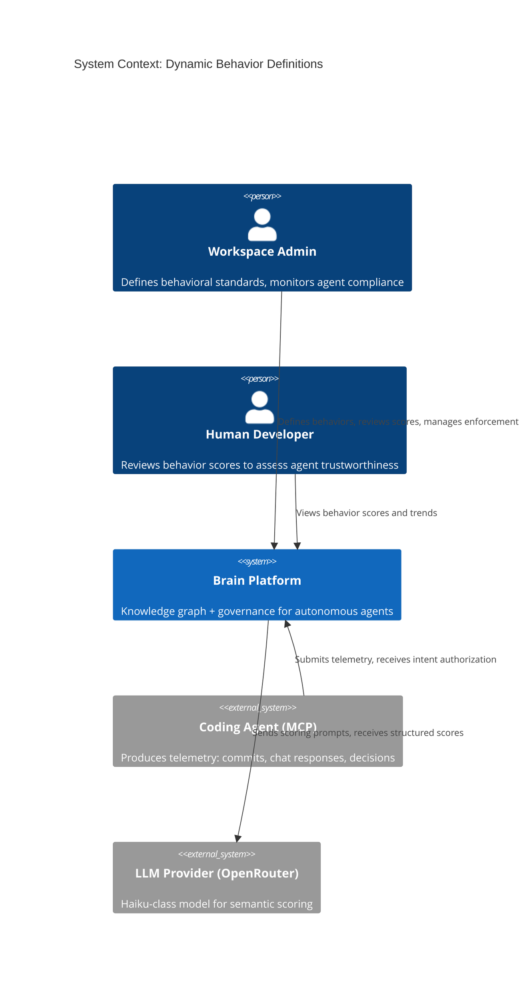
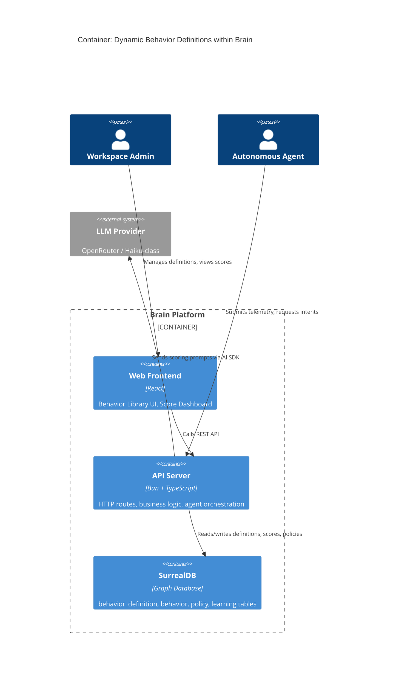
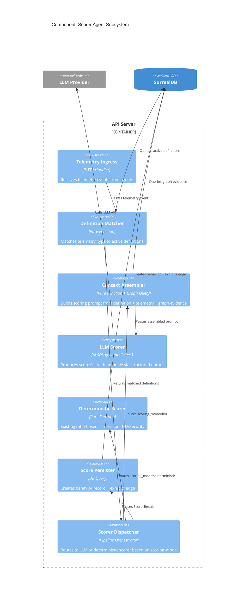

# Architecture Design: Dynamic Behavior Definitions

## System Context

Extends the existing Brain platform to allow workspace admins to define behavioral standards in plain language, scored by an LLM Scorer Agent, with automatic enforcement via the Authorizer and learning proposals via the Observer.

### Capabilities Added

1. **Behavior Definition CRUD** -- create/edit/archive definitions with plain-language goals and scoring logic
2. **LLM Scorer Agent** -- evaluates telemetry against definitions, produces scores with rationale and evidence
3. **Behavior Library UI** -- browse, create, manage definitions; view scores and trends
4. **Dynamic Authorizer Integration** -- policy predicates work with arbitrary metric names
5. **Observer Integration Enhancement** -- detect trends on dynamic metrics, propose targeted learnings

---

## C4 System Context (L1)



---

## C4 Container (L2)



---

## C4 Component (L3) -- Scorer Agent Subsystem



---

## Component Architecture

### Module Boundaries

```
app/src/server/
  behavior/                          # EXTENDED (existing module)
    scorer.ts                        # Existing deterministic scorers (unchanged)
    trends.ts                        # Existing trend analysis (unchanged, already metric-agnostic)
    queries.ts                       # Extended: add definition CRUD queries
    behavior-route.ts                # Extended: add definition endpoints
    definition-types.ts              # NEW: BehaviorDefinition types
    llm-scorer.ts                    # NEW: LLM scoring pipeline (pure core + effect boundary)
    scorer-dispatcher.ts             # NEW: Routes telemetry to deterministic or LLM scorer
    definition-matcher.ts            # NEW: Matches telemetry_type to active definitions

  observer/
    graph-scan.ts                    # MODIFIED: query dynamic metric behavior records
    learning-diagnosis.ts            # MODIFIED: include definition context in learning proposals

  policy/
    predicate-evaluator.ts           # UNCHANGED (already supports arbitrary dot-path)
    types.ts                         # UNCHANGED (behavior_scores already Record<string, number>)

app/src/client/
  routes/
    behaviors-page.tsx               # NEW: Behavior Library page
  components/
    behavior/
      behavior-card.tsx              # NEW: Definition card component
      score-timeline.tsx             # NEW: Score timeline chart
      definition-form.tsx            # NEW: Create/edit definition form
```

### Decision: Extend `behavior/` module (not a new module)

The new functionality (definitions, LLM scorer) is the same bounded context as existing behavior scoring. Creating a separate module would split a cohesive domain across boundaries. The `behavior/` module grows from 4 files to 8 files -- well within manageable scope.

---

## Design Answers to Key Questions

### Q1: Does `behavior_definition` get its own module?

**No.** It extends `behavior/`. The definition is intrinsically part of the behavior domain -- it defines what a behavior metric is. Splitting it would force cross-module imports for every scoring operation.

### Q2: How does the Scorer Agent receive telemetry?

**Push, synchronous within the telemetry submission pipeline.** When telemetry arrives at the behavior route (or via the existing `createBehavior` flow), the scorer dispatcher:
1. Matches the telemetry type against active definitions
2. For each matched definition: dispatches to deterministic or LLM scorer
3. Persists results

For the walking skeleton, scoring is triggered by explicit telemetry submission (existing endpoint). Event-driven auto-scoring from Observer is a future enhancement.

### Q3: How do deterministic scorers coexist with LLM scorers?

**Discriminated dispatch via `scoring_mode` field on `behavior_definition`.** The scorer dispatcher checks `scoring_mode`:
- `deterministic` -> routes to existing `scoreTelemetry()` (unchanged)
- `llm` -> routes to new `scoreTelemetryWithLlm()`

Existing hardcoded metrics (TDD_Adherence, Security_First) are represented as `behavior_definition` records with `scoring_mode=deterministic`. The ASSERT enum on the `behavior` table is removed, replaced by a foreign-key-style reference to `behavior_definition`.

### Q4: What is the `scoring_logic` field format?

**Free-text with optional rubric structure.** The field is a plain string. The Scorer Agent's system prompt instructs it to parse rubric levels if present (e.g., "Score 0.9-1.0: all claims verifiable...") but accepts any plain language. No structured template is enforced -- the LLM interprets the text. This maximizes expressiveness for non-technical admins.

### Q5: How does the Authorizer resolve dynamic behavior names?

**No change needed.** The predicate evaluator already uses `resolveDotPath()` to navigate `behavior_scores.{any_key}`. Since `behavior_scores` is `Record<string, number>`, any string key works. The `enrichBehaviorScores()` function already returns all metric types from behavior records. When definitions use dynamic titles (e.g., "Honesty"), the behavior record's `metric_type` matches the definition title, and `getLatestBehaviorScores()` picks it up automatically.

Missing scores return `undefined` from `resolveDotPath()`, and `evaluatePredicate()` returns `false` for `undefined` with non-`exists` operators -- so a missing score never triggers a deny rule. This is the correct "absence is not a violation" behavior.

### Q6: Should the Scorer Agent be synchronous or asynchronous?

**Asynchronous (background, tracked via `inflight.track()`).** Reasons:
- LLM scoring takes up to 30 seconds (NFR)
- Scoring must not block the agent's current action (NFR: fail-open)
- The telemetry submission endpoint returns immediately after queuing
- The scorer persists results in the background
- If scoring fails, it retries up to 3 times without blocking anything

The Authorizer reads the *latest persisted score*, not a live evaluation. This means there is a small window between telemetry submission and score availability. This is acceptable per the requirements (scores inform *future* intent evaluations, not the current action).

### Q7: How to prevent "participation trophy" scoring?

Three measures:
1. **System prompt anchoring** -- The Scorer Agent's system prompt includes a "Brutally Honest Auditor" identity: "Score 0.0 when evidence is absent. Never give benefit of the doubt. Absence of evidence is evidence of absence."
2. **Evidence grounding** -- The context assembler queries the graph for entities referenced in the telemetry. The scorer prompt includes both the claims and the evidence (or lack thereof). Fabricated claims produce verifiably low scores.
3. **Structured output schema** -- The LLM returns `{ score: number, rationale: string, evidence_checked: string[] }` via `generateObject`. The structured schema constrains the output format, and the rationale provides auditability.

---

## Integration Patterns

### Telemetry Scoring Pipeline

```
Agent Action
  |
  v
Telemetry Submission (POST /api/workspaces/:id/behaviors/score)
  |
  +--> Definition Matcher: query active definitions WHERE telemetry_types CONTAINS event_type
  |
  +--> For each matched definition:
  |      |
  |      +--> scoring_mode = deterministic?
  |      |      YES --> scoreTelemetry() (existing pure function)
  |      |      NO  --> Context Assembler --> LLM Scorer (generateObject)
  |      |
  |      +--> Score Persister: createBehavior() + exhibits edge
  |
  v
Response: { scored: true, definitions_matched: N }
```

### Authorizer Integration (unchanged flow)

```
Intent Request
  |
  v
enrichBehaviorScores(surreal, identityId, context)
  |  (queries ALL behavior records, returns latest per metric_type)
  |  (dynamic titles like "Honesty" are returned alongside "TDD_Adherence")
  |
  v
Policy Gate: evaluatePredicate(context, { field: "behavior_scores.Honesty", operator: "gte", value: 0.50 })
  |
  +--> resolveDotPath resolves to the score number (or undefined if no records)
  +--> undefined => predicate returns false => deny rule does NOT match => intent allowed
```

### Observer Integration (extended flow)

```
Observer Graph Scan
  |
  v
queryWorkspaceBehaviorTrends() -- already metric-type-agnostic
  |
  +--> Returns trends for ALL metric types (including dynamic)
  |
  +--> For actionable trends (drift/flat below threshold):
  |      |
  |      +--> NEW: Query behavior_definition for definition context (goal, scoring_logic)
  |      +--> proposeBehaviorLearning() with definition-enriched text
  |      +--> Rate limit check (5/7 days, existing)
  |
  v
Learning proposal or critical observation
```

---

## Quality Attribute Strategies

### Auditability (Priority 1)

- Every behavior record stores: `metric_type`, `score`, `source_telemetry` (includes `rationale`, `evidence_checked`, `definition_version`, `definition_id`)
- `behavior_definition` has `version` field, incremented on edit of active definitions
- `exhibits` edge links identity to behavior record
- Policy trace already records which rule matched/denied

### Testability (Priority 2)

- `definition-matcher.ts` -- pure function, no IO: `matchDefinitions(definitions, telemetryType) => MatchedDefinition[]`
- `llm-scorer.ts` -- separated into pure prompt builder + effect boundary (LLM call). Tests mock the LLM call and verify prompt assembly.
- `scorer-dispatcher.ts` -- pure routing logic, delegates to injected scorer functions
- Existing `scorer.ts` and `trends.ts` remain pure and unchanged

### Maintainability (Priority 3)

- Follows existing module patterns (queries.ts for CRUD, route.ts for HTTP, pure functions for logic)
- No new runtime dependencies -- uses existing AI SDK `generateObject` pattern (same as Observer)
- No new infrastructure -- SurrealDB, same deployment

### Fault Tolerance (Priority 5)

- Scorer failure: no score recorded, event queued for retry (3 attempts), agent not blocked
- Missing definition: no evaluation triggered, no side effects
- Missing score at authorization: predicate returns false, deny rule does not match (fail-open)

---

## Deployment Architecture

No changes to deployment topology. All new code runs within the existing Bun API server process. New env var: `SCORER_MODEL` (optional, defaults to extraction model for Haiku-class cost efficiency).

---

## Technology Stack

See `technology-stack.md` for detailed rationale. Summary: no new dependencies. Uses existing SurrealDB, AI SDK, Bun, React stack.
