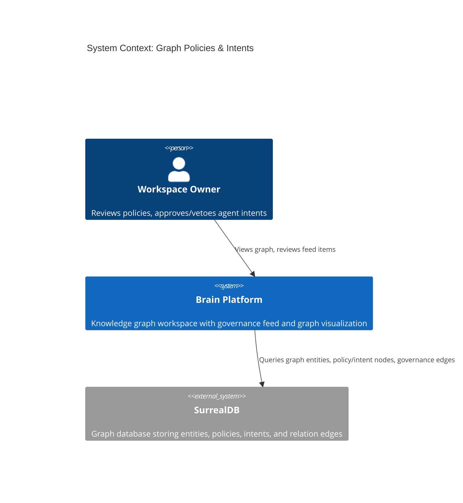
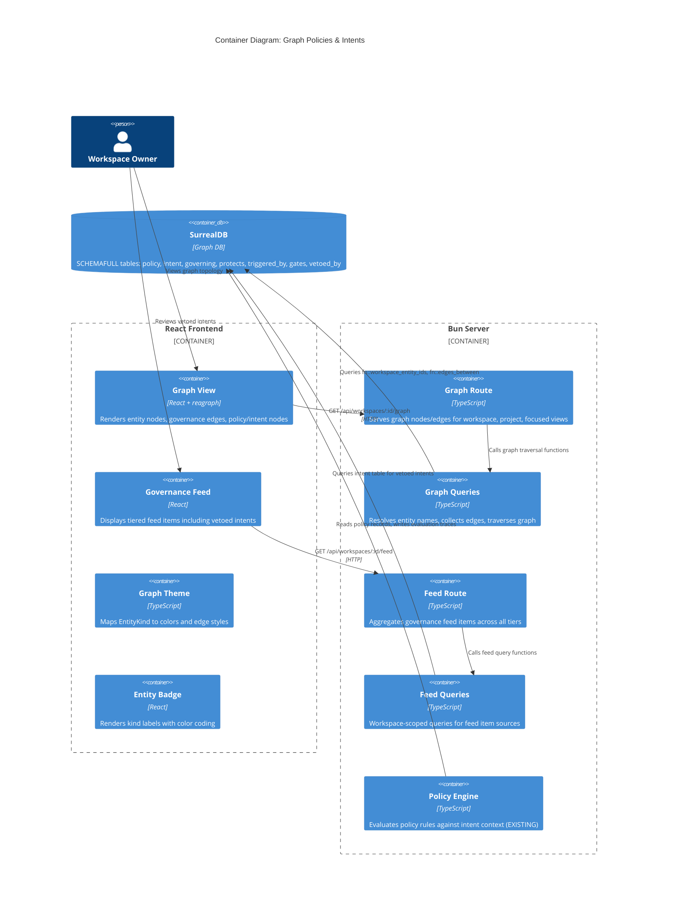

# Architecture Design: Graph Policies and Intents Visualization

## System Context

Brain is an AI-native business management platform with a knowledge graph backend (SurrealDB), a React frontend with a graph visualization (reagraph/WebGL), and a governance feed for human-in-the-loop oversight. Policy evaluation is already implemented server-side. This feature extends the **graph view** and **governance feed** to surface policy and intent nodes with their governance edges.

## C4 System Context (L1)



## C4 Container (L2)



## Integration Points Summary

| # | Artifact | File | Change Type | Risk |
|---|----------|------|-------------|------|
| 1 | `EntityKind` union | `shared/contracts.ts` | Add `"policy"` | HIGH - used everywhere |
| 2 | `GraphEntityTable` union | `server/graph/queries.ts` | Add `"intent"` and `"policy"` | HIGH - graph resolution |
| 3 | `fn::workspace_entity_ids` | `schema/surreal-schema.surql` | Add policy/intent traversal | MEDIUM - SurrealQL function |
| 4 | `fn::edges_between` | `schema/surreal-schema.surql` | Add governance relation tables | MEDIUM - SurrealQL function |
| 5 | `fn::graph_neighbors` | `schema/surreal-schema.surql` | Add governance relation tables | MEDIUM - SurrealQL function |
| 6 | `readEntityName` | `server/graph/queries.ts` | Handle intent (goal) + policy (title) | LOW |
| 7 | `readEntityNameByTable` | `server/feed/feed-queries.ts` | Handle intent + policy | LOW |
| 8 | `entityColor` (CSS) | `client/graph/graph-theme.ts` | Add policy case | LOW |
| 9 | `entityColor` (hex) | `server/graph/transform.ts` | Add policy case | LOW |
| 10 | `entityMutedColor` | `client/graph/graph-theme.ts` | Add policy case | LOW |
| 11 | `edgeStyle` | `client/graph/graph-theme.ts` | Add governance edge styles | LOW |
| 12 | `KIND_LABELS` | `client/graph/EntityBadge.tsx` | Add intent + policy | LOW |
| 13 | Focused view allowlist | `server/graph/graph-route.ts` | Add `"intent"`, `"policy"` | LOW |
| 14 | Feed queries | `server/feed/feed-queries.ts` | New `listRecentlyVetoedIntents` | MEDIUM |
| 15 | Feed route | `server/feed/feed-route.ts` | Wire vetoed intents to awareness tier | LOW |

## Data Flow

### Graph View (Policy + Intent Nodes)

```
1. GET /api/workspaces/:id/graph
2. graph-route.ts -> calls getWorkspaceGraphOverview()
3. queries.ts -> surreal: fn::workspace_entity_ids($ws)
   - NEW: includes policy records (via protects edge) and intent records (via workspace field)
4. queries.ts -> resolveEntityNames() iterates records
   - NEW: handles policy.title and intent.goal for name resolution
5. queries.ts -> surreal: fn::edges_between($entityIds)
   - NEW: includes governing, protects, triggered_by, gates, vetoed_by relation tables
6. transform.ts -> transformToReagraph()
   - NEW: entityColor maps policy to governance color (e.g. #d946ef -- fuchsia)
7. Response: { nodes: [...policyNodes, ...intentNodes, ...existing], edges: [...governanceEdges, ...existing] }
```

### Feed (Vetoed Intents in Awareness Tier)

```
1. GET /api/workspaces/:id/feed
2. feed-route.ts -> Promise.all([...existing, listRecentlyVetoedIntents()])
3. feed-queries.ts -> SELECT from intent WHERE status = 'vetoed' AND updated_at > $cutoff
   - Joins vetoed_by edge to get veto reason
4. feed-route.ts -> maps to GovernanceFeedItem with tier = "awareness"
5. Response: { blocking: [...], review: [...], awareness: [...vetoedIntents, ...existing] }
```

## Architectural Decisions

See ADR-021 and ADR-022 in `docs/adrs/`.

## Quality Attribute Strategies

| Attribute | Strategy |
|-----------|----------|
| **Auditability** | Vetoed intents surface in feed with reason, 24h window; policy trace preserved on intent.evaluation |
| **Maintainability** | Extend existing union types and switch statements; no new modules or abstractions needed |
| **Testability** | Each integration point testable in isolation; SurrealQL functions testable via acceptance tests |
| **Performance** | Policy/intent nodes added to existing graph traversal functions (single query); no additional round-trips |

## Deployment Architecture

No deployment changes. All modifications are to existing server-side query functions, schema functions, and client-side theme/badge components. Single migration script extends SurrealQL functions.
