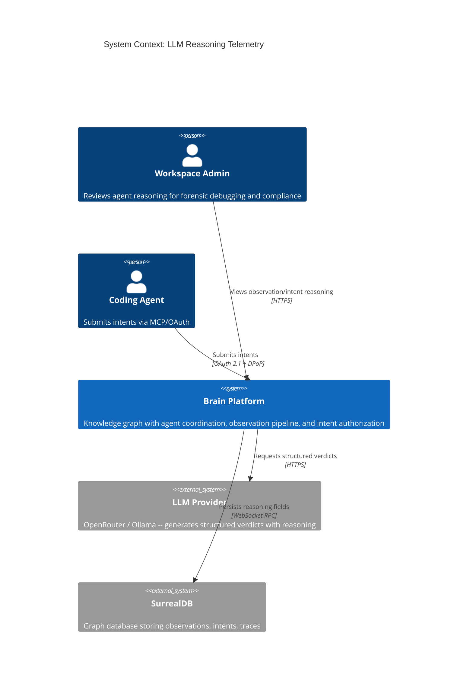
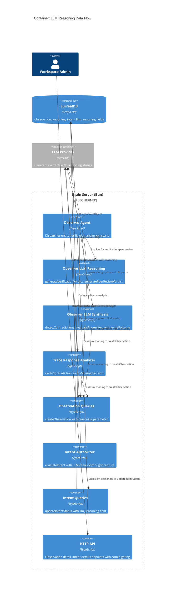
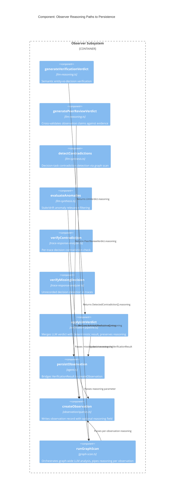

# Architecture Design: LLM Reasoning as Internal Telemetry

**Feature**: Store LLM reasoning on Intent and Observation nodes
**ADR**: [ADR-053](../../../adrs/ADR-053-llm-reasoning-as-internal-telemetry.md)
**Paradigm**: Functional
**Status**: Proposed

---

## System Context

This feature extends two existing subsystems (Observer pipeline, Intent authorization pipeline) to persist LLM chain-of-thought reasoning alongside the records those pipelines already create. No new services, no new external dependencies.

### C4 Level 1 -- System Context



### C4 Level 2 -- Container Diagram



### C4 Level 3 -- Component: Observer Reasoning Pipeline

The Observer subsystem has 6 distinct LLM reasoning paths that produce observations. This diagram shows how reasoning flows from each path through to persistence.



---

## Component Architecture

### Observation Reasoning -- Data Flow

**6 LLM paths** produce reasoning that must reach `createObservation`:

| # | Path | Source File | Reasoning Origin | Current Observation Creation Site |
|---|------|-----------|-----------------|----------------------------------|
| 1 | Verification verdict | `observer/llm-reasoning.ts` | `LlmVerdict.reasoning` | `agents/observer/agent.ts:persistObservation` |
| 2 | Peer review | `observer/llm-reasoning.ts` | `PeerReviewVerdict.reasoning` | `agents/observer/agent.ts:peerReviewObservation` |
| 3 | Contradiction detection | `observer/llm-synthesis.ts` | `DetectedContradiction.reasoning` | `observer/graph-scan.ts:runGraphScan` (contradiction loop) |
| 4 | Anomaly evaluation | `observer/llm-synthesis.ts` | `AnomalyEvaluation.reasoning` | `observer/graph-scan.ts:runGraphScan` (anomaly loop) |
| 5 | Trace contradiction | `observer/trace-response-analyzer.ts` | `ContradictionVerdict.reasoning` | `observer/trace-response-analyzer.ts:detectContradictions` |
| 6 | Trace missing decision | `observer/trace-response-analyzer.ts` | `verifyMissingDecision.summary` | `observer/trace-response-analyzer.ts:detectMissingDecisions` |

**Current state**: Paths 1-2 embed reasoning in `VerificationResult.text`. Paths 3-4 embed reasoning in the observation text string via template concatenation. Paths 5-6 embed reasoning directly in the `text` parameter of `createObservation`.

**Target state**: All 6 paths pass reasoning as a separate `reasoning` parameter to `createObservation`. The `text` field contains the human-readable observation summary. The `reasoning` field contains the raw LLM chain-of-thought.

### Intent Reasoning -- Data Flow

**1 LLM path** produces reasoning for intent authorization:

| # | Path | Source File | Reasoning Origin | Current Persistence Site |
|---|------|-----------|-----------------|-------------------------|
| 1 | Authorization evaluation | `intent/authorizer.ts` | `evaluationResultSchema.reason` | `intent/intent-queries.ts:updateIntentStatus` via `evaluation` object |

**Current state**: `createLlmEvaluator` returns `{ decision, risk_score, reason }`. The `reason` is a one-line summary constrained by the Zod schema description. The full chain-of-thought is not captured because the schema requests a "brief explanation."

**Target state**: The LLM evaluator schema is extended to include a `reasoning` field (full chain-of-thought) alongside the existing `reason` (summary). This `reasoning` value flows through `evaluateIntent` -> `updateIntentStatus` as `llm_reasoning` on the intent record. When evaluation is policy-only (no LLM call), `llm_reasoning` is omitted.

### Schema Changes

**observation table** -- add field:
- `reasoning`: `option<string>` -- LLM chain-of-thought, omitted for deterministic observations

**intent table** -- add field:
- `llm_reasoning`: `option<string>` -- Authorizer LLM chain-of-thought, omitted for policy-only evaluations

Migration: single versioned `.surql` script using `DEFINE FIELD OVERWRITE`.

### Access Control Boundary

LLM reasoning is internal telemetry. It may contain prompt fragments, entity references, and model-specific artifacts not suitable for all users.

- **API gating**: Observation detail and intent detail endpoints include `reasoning` / `llm_reasoning` only when the requester has admin role in the workspace
- **UI rendering**: Collapsible panel with three states:
  - **Reasoning available**: Show reasoning text with model identifier (from linked trace) and trace link
  - **Deterministic**: Show "No LLM reasoning -- deterministic observation" message
  - **Legacy/empty**: Show "Reasoning not available for this observation" message

### Integration with Existing Trace Table

No model statistics (tokens, cost, latency) are added to observation or intent records. The trace table already captures this per LLM call. Consumers that need model telemetry alongside reasoning follow existing linkage:

- **Observation -> Trace**: `observation.source_session` -> `agent_session` -> `invoked` -> `trace` (for Observer agent observations), or `observation` -> `observes` -> `trace` (for trace-analyzer observations that link the trace as a related record)
- **Intent -> Trace**: `intent.trace_id` -> `trace` (direct link, always present)

The UI reasoning panel includes a "View trace" link using these paths.

### Query Patterns for Programmatic Consumers

**US-04: listObservationsWithReasoning**

Workspace-scoped query returning observations where reasoning is present. Used by:
- **Observer self-calibration**: Compares past reasoning against current verdicts to detect drift
- **Behavior scorer**: Evaluates reasoning quality for scoring

Query shape:
```
SELECT id, text, reasoning, severity, confidence, source, observation_type, created_at
FROM observation
WHERE workspace = $ws
  AND reasoning IS NOT NONE
  AND created_at > $since
ORDER BY created_at DESC
LIMIT $limit
```

This avoids KNN (no embedding needed) and uses the existing `workspace` B-tree index.

---

## Technology Stack

No new dependencies. All changes use existing technology:

| Component | Technology | License | Rationale |
|-----------|-----------|---------|-----------|
| Schema migration | SurrealDB `.surql` | BSL 1.1 | Existing migration framework (`bun migrate`) |
| LLM structured output | Vercel AI SDK `generateObject` | Apache 2.0 | Already used in all 6 LLM paths |
| Schema validation | Zod | MIT | Already used for all observer/authorizer schemas |
| UI collapsible panel | React + shadcn/ui | MIT | Existing UI component library |

---

## Integration Patterns

### Observation Creation Contract

`createObservation` in `observation/queries.ts` gains an optional `reasoning` parameter:

```
input: {
  ...existing fields...
  reasoning?: string    // NEW: LLM chain-of-thought
}
```

All 6 LLM paths pipe their reasoning string through their respective call chains to this single persistence function.

### Intent Status Update Contract

`updateIntentStatus` in `intent/intent-queries.ts` gains `llm_reasoning` in the `StatusUpdateFields`:

```
StatusUpdateFields: {
  ...existing fields...
  llm_reasoning?: string    // NEW: Authorizer LLM chain-of-thought
}
```

The `evaluateIntent` pipeline returns `llm_reasoning` alongside the existing `EvaluationOutput`, and the caller passes it through `updateIntentStatus`.

### API Response Contract

Observation detail response (existing `EntityDetailResponse.entity.data`) and intent list/detail responses conditionally include reasoning fields based on requester role. This is a response-level filter, not a query-level filter -- the field is always persisted, only conditionally returned.

---

## Quality Attribute Strategies

### Auditability (Primary)

- Every LLM-generated observation stores the exact reasoning that produced it
- Reasoning is immutable once persisted (no updates to reasoning field)
- Trace linkage provides model, token count, cost, and latency for the generating call
- Admin-only access prevents reasoning leakage to non-privileged users

### Testability

- Each LLM path's reasoning threading is independently testable via unit tests (mock `generateObject`, verify reasoning reaches `createObservation`)
- Acceptance tests verify end-to-end: trigger observer scan -> observation created with reasoning field populated
- Query function `listObservationsWithReasoning` testable with seeded observations

### Maintainability

- Single schema migration, two new optional fields
- No changes to observation/intent creation flows beyond adding one parameter
- Backward compatible: existing observations/intents without reasoning continue to work
- `createObservation` contract change is additive (optional field)

### Time-to-Market

- Estimated 6.5 days across 4 user stories
- US-01 (observation reasoning) is the critical path -- unblocks US-03 and US-04
- US-02 (intent reasoning) is independent and can be parallelized

---

## Deployment Architecture

No deployment changes. Single Bun server process, single SurrealDB instance. Schema migration applied via `bun migrate` before server restart.

---

## Roadmap

### Step 01: Schema migration + observation reasoning persistence

**Description**: Add `reasoning` field to observation table. Extend `createObservation` to accept and persist reasoning. Pipe reasoning from all 6 Observer LLM paths.

**Acceptance Criteria**:
- Observation table has `reasoning` field (option string)
- LLM-generated observations include reasoning from generating verdict
- Deterministic observations omit reasoning field
- Existing observations without reasoning continue to load
- Graph-scan contradiction/anomaly observations include per-item LLM reasoning

**Architectural Constraints**:
- `createObservation` contract: additive optional parameter only
- Reasoning is the raw LLM string, not a processed/truncated version
- `persistObservation` in `agent.ts` threads reasoning from `VerificationResult` through to `createObservation`

### Step 02: Intent LLM reasoning persistence

**Description**: Add `llm_reasoning` field to intent table. Extend LLM evaluator to capture chain-of-thought. Pipe through `evaluateIntent` to `updateIntentStatus`.

**Acceptance Criteria**:
- Intent table has `llm_reasoning` field (option string)
- LLM-evaluated intents include full chain-of-thought reasoning
- Policy-only evaluations omit `llm_reasoning`
- Existing intents without `llm_reasoning` continue to load
- `llm_reasoning` distinct from existing `evaluation.reason` (summary)

**Architectural Constraints**:
- `createLlmEvaluator` Zod schema extended with `reasoning` field
- Existing `reason` field kept as-is for backward compatibility
- `StatusUpdateFields` type extended additively

### Step 03: Reasoning query function and API gating

**Description**: Add `listObservationsWithReasoning` query. Gate reasoning fields in observation/intent detail API responses to admin role.

**Acceptance Criteria**:
- Query returns observations with reasoning, filtered by workspace, time range, and limit
- Observation detail API includes reasoning only for admin-role requesters
- Intent detail API includes `llm_reasoning` only for admin-role requesters
- Non-admin responses omit reasoning fields entirely (not null)

**Architectural Constraints**:
- Query uses existing workspace B-tree index, no KNN
- Role check at API response layer, not query layer
- Omit field from response (per project convention: no null)

### Step 04: UI reasoning panel

**Description**: Collapsible panel on observation and intent detail views showing LLM reasoning with model identifier and trace link.

**Acceptance Criteria**:
- Panel shows reasoning text when available
- Panel shows "deterministic" message when observation has no reasoning and source is deterministic
- Panel shows "not available" for legacy observations
- Model name and trace link displayed from linked trace record
- Panel collapsed by default

**Architectural Constraints**:
- Model identifier resolved via trace linkage (observation -> trace path), not stored on observation
- Admin-only visibility enforced by API (UI receives no reasoning for non-admins)
