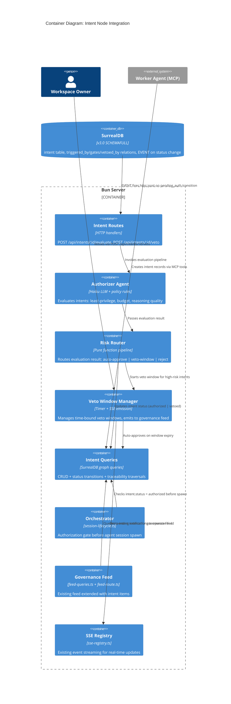
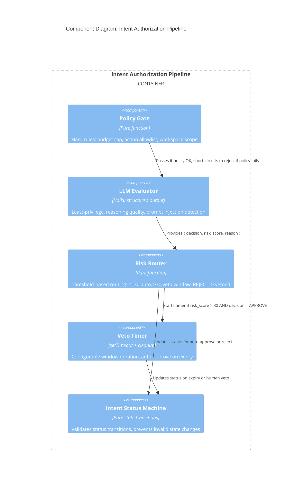

# Intent Node: Architecture Design

## System Context and Capabilities

The Intent Node introduces an authorization gate between task assignment and agent execution. It transforms implicit agent actions into explicit, auditable intent declarations that are evaluated by an LLM-based Authorizer Agent and optionally reviewed by humans through a passive veto window.

**Key capabilities:**
- Agents declare intents with goal, action_spec, reasoning, and budget_limit before executing consequential actions
- Authorizer Agent evaluates intents against least-privilege, budget, and reasoning quality
- Risk-based routing: low-risk auto-approves, high-risk enters human veto window
- Full graph traceability: task -> intent -> evaluation -> agent_session -> result
- Extends existing governance feed with intent lifecycle events

## Quality Attribute Priorities

| Attribute | Priority | Rationale |
|-----------|----------|-----------|
| Auditability | P0 | Core purpose: full authorization chain traceability |
| Reliability | P0 | Authorization gate must not silently fail; fallback to policy-only check |
| Maintainability | P1 | Solo dev + AI agents; modular integration into existing server |
| Security | P1 | Prevent privilege escalation; validate request origin |
| Performance | P2 | <5s for auto-approve; <30s for LLM evaluation |

## C4 System Context (L1)

```mermaid
C4Context
  title System Context: Osabio Platform with Intent Authorization

  Person(operator, "Workspace Owner", "Vetoes high-risk intents via governance feed")

  System(osabio, "Osabio Platform", "AI-native business management with knowledge graph and intent authorization")

  Boundary(agents, "AI Agents") {
    System_Ext(worker, "Worker Agent", "Declares intents before consequential actions")
  }

  System_Ext(llm, "LLM Provider", "Authorizer evaluation (Haiku), chat (Sonnet)")
  System_Ext(surreal, "SurrealDB", "Graph storage, event handler triggers")

  Rel(operator, osabio, "Reviews intents in feed, vetoes high-risk")
  Rel(worker, osabio, "Creates intents via MCP, receives authorization decisions")
  Rel(brain, llm, "Evaluates intent payloads")
  Rel(brain, surreal, "Stores intent graph, fires status-change events")
```

## C4 Container (L2)



## C4 Component (L3) -- Intent Authorization Pipeline



## Component Architecture

### Integration Strategy

The intent node integrates into the existing system at four points:

1. **MCP tools** -- Worker agents create/submit intents via new MCP tools (`create_intent`, `submit_intent`)
2. **SurrealQL EVENT** -- Database event fires HTTP POST to evaluation endpoint on `pending_auth` transition
3. **Orchestrator** -- Authorization gate in `session-lifecycle.ts` checks `intent.status = authorized` before spawning
4. **Governance Feed** -- Existing feed extended with intent items (veto-window intents in "blocking" tier)

### Data Flow (Happy Path)

```
Worker Agent
  |-- CREATE intent (status: draft) via MCP tool
  |-- UPDATE intent status -> pending_auth
  |
SurrealQL EVENT (on pending_auth)
  |-- http::post(/api/intents/{id}/evaluate)
  |
Evaluation Endpoint
  |-- Policy Gate (budget + allowlist)
  |-- LLM Evaluator (Haiku structured output)
  |-- Risk Router
  |     |-- risk_score <= 30: auto-approve -> status: authorized
  |     |-- risk_score > 30: start veto window -> emit SSE to feed
  |     |-- REJECT: status -> vetoed
  |
Veto Window (if started)
  |-- No veto within window: auto-approve -> status: authorized
  |-- Human vetoes: status -> vetoed
  |
Orchestrator (on next task assignment)
  |-- Check intent.status = authorized
  |-- Spawn agent_session with scoped action_spec
  |-- Update intent status -> executing
  |-- On session end: status -> completed | failed
```

### Functional Architecture (Pure Core / Effect Shell)

Following the project's functional paradigm:

**Pure Core (no side effects):**
- Intent status machine -- validates transitions, returns new status or error
- Policy gate -- evaluates budget/allowlist rules against intent payload
- Risk router -- determines routing from evaluation result
- Evaluation result parser -- validates LLM structured output

**Effect Shell (IO at boundaries):**
- Intent queries -- SurrealDB reads/writes
- LLM evaluator -- Haiku API call
- Veto timer -- setTimeout, SSE emission
- HTTP endpoint -- request parsing, response formatting

### Relation to Existing Patterns

| Existing Pattern | Intent Node Usage |
|-----------------|-------------------|
| `ToolLoopAgent` (PM agent) | Authorizer Agent uses same Vercel AI SDK structured output pattern |
| `GovernanceFeedItem` | Intent veto items use same feed item shape with new actions |
| `authority_scope` | Extended with intent-specific actions |
| `agent_session` orchestrator | Authorization gate added before spawn |
| SSE event streaming | Veto window notifications use existing `emitEvent` |
| `identity` hub | Intent `requester` links to `record<identity>` |

## Deployment Architecture

No new deployment units. All components are modules within the existing Bun server process:

- `app/src/server/intent/` -- new module directory
- Schema migration -- new `.surql` migration file
- Route registration -- added to `start-server.ts`

## Observability

### Structured Logging

All intent lifecycle transitions are logged via existing `logInfo`/`logWarn`/`logError` from `http/observability.ts`:

| Event | Level | Fields |
|-------|-------|--------|
| Intent created | info | intentId, requesterId, workspace, goal |
| Status transition | info | intentId, from, to, trigger (event/human/timer) |
| Policy gate result | info | intentId, passed, reason |
| LLM evaluation result | info | intentId, decision, risk_score, latencyMs |
| LLM evaluation fallback | warn | intentId, error, fallback_action |
| Veto window started | info | intentId, risk_score, expires_at |
| Veto window expired (auto-approve) | info | intentId, window_duration_ms |
| Human veto | info | intentId, vetoerId, reason |
| Recovery sweep triggered | info | stale_count, re_triggered_count |
| Stale intent detected | warn | intentId, stuck_since, status |

### Key Metrics (log-derived)

- **Evaluation latency**: time from `pending_auth` to `authorized`/`vetoed` (per-intent, from timestamps)
- **Auto-approve rate**: % of intents with risk_score <= threshold (from evaluation.risk_score)
- **Veto rate**: % of veto-window intents actually vetoed by humans
- **LLM fallback rate**: % of evaluations falling back to policy-only
- **Stale intent rate**: intents requiring recovery sweep intervention

### Health Check

The recovery sweep (every 60s) doubles as a health indicator. If stale intents accumulate, it signals SurrealQL EVENT or evaluation endpoint failure.

## Architectural Refinement: pending_veto Status

The requirements defined status enum: `draft, pending_auth, authorized, executing, completed, vetoed, failed`. The architecture introduces `pending_veto` as an additional status to distinguish between "evaluated, in veto window" and "fully authorized." This is necessary because:

1. The orchestrator must not spawn sessions for intents in veto window (only `authorized`)
2. The governance feed needs to query intents currently awaiting human review
3. The veto timer needs a clear state to track active windows
4. Recovery on server restart needs to identify which intents have active veto windows

Without `pending_veto`, the system would need secondary state (separate flag or timestamp check) to distinguish authorized-and-ready from authorized-but-in-veto-window.

## Error Handling

| Error | Strategy |
|-------|----------|
| LLM evaluation timeout (>30s) | Intent status -> failed, reason: evaluation_timeout |
| LLM evaluation error | Fall back to policy-only check; if policy passes -> veto window; if fails -> vetoed |
| SurrealQL EVENT http::post fails | Intent stays in pending_auth; stall detector picks up after configurable timeout |
| Veto after execution started | Abort agent session via existing `abortOrchestratorSession`, intent status -> failed |
| Invalid status transition | Status machine rejects; return error to caller |
