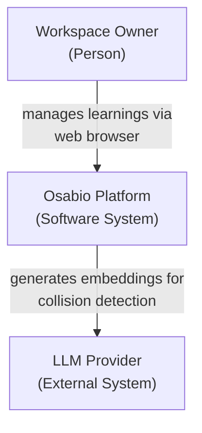
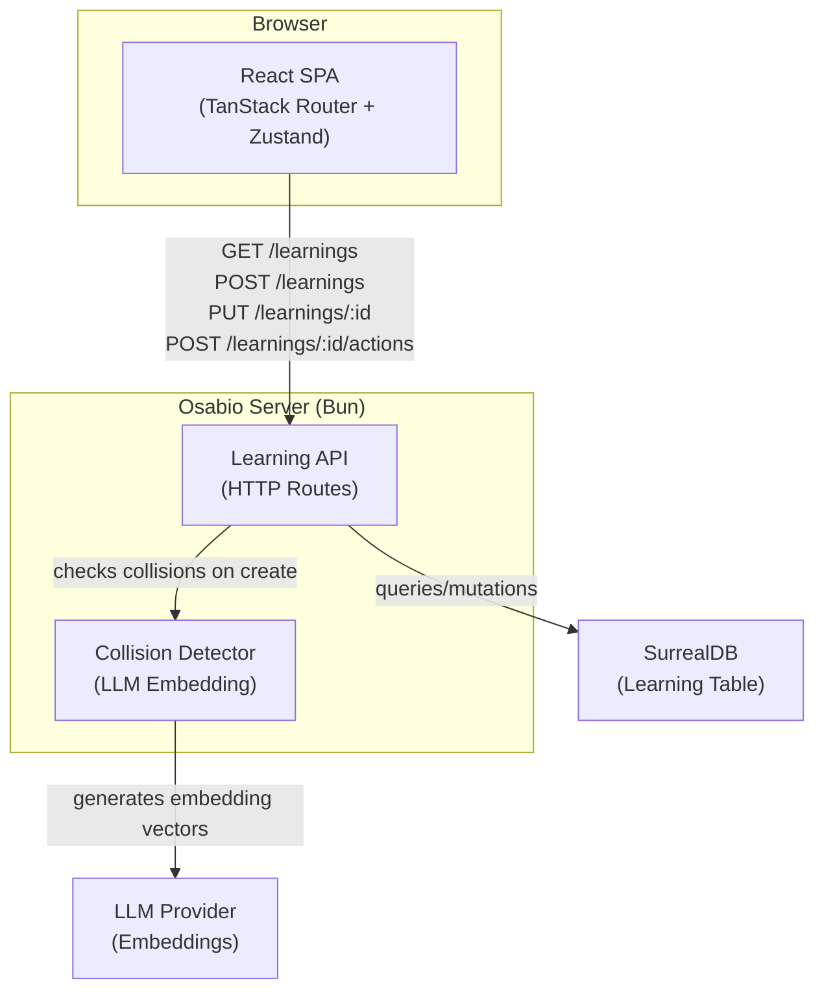
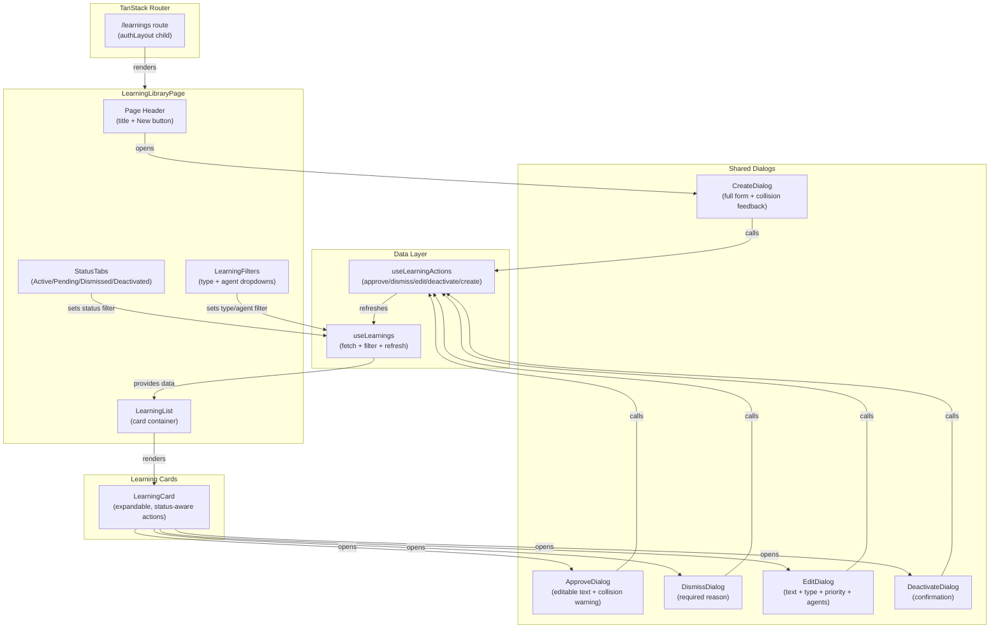

# Learning Library -- Architecture Document

## System Context

The Learning Library is a new UI page within the existing Osabio web application. It provides a management interface for agent behavioral rules (learnings). The backend API is 100% complete -- this feature is purely frontend with one backend gap (PUT endpoint for editing active learnings).

### Relationship to Existing System

- **Feed (GovernanceFeed)**: Push notification layer -- surfaces pending learnings as review items. Actions: approve/dismiss only.
- **Library (this feature)**: Pull management layer -- full CRUD, filtering, tabbed browsing. Actions: approve/dismiss/edit/deactivate/create.
- **Shared**: Both use the same API endpoints and should share dialog components for approve/dismiss flows.

## C4 System Context (L1)



## C4 Container (L2)



## C4 Component (L3) -- Learning Library Frontend



## Component Architecture

### New Files

| File | Responsibility |
|------|---------------|
| `app/src/client/routes/learnings-page.tsx` | Page component, composes hooks + child components |
| `app/src/client/hooks/use-learnings.ts` | Data fetching hook: list, filter params, refresh, tab counts |
| `app/src/client/hooks/use-learning-actions.ts` | Mutation hook: approve, dismiss, edit, deactivate, create |
| `app/src/client/components/learning/LearningList.tsx` | Renders filtered learning cards |
| `app/src/client/components/learning/LearningCard.tsx` | Expandable card with status-aware action buttons |
| `app/src/client/components/learning/LearningFilters.tsx` | Type + agent filter dropdowns |
| `app/src/client/components/learning/StatusTabs.tsx` | Tab bar with counts |
| `app/src/client/components/learning/ApproveDialog.tsx` | Approve with optional text edit + collision warning |
| `app/src/client/components/learning/DismissDialog.tsx` | Dismiss with required reason |
| `app/src/client/components/learning/EditDialog.tsx` | Edit text/type/priority/agents |
| `app/src/client/components/learning/DeactivateDialog.tsx` | Deactivation confirmation |
| `app/src/client/components/learning/CreateDialog.tsx` | Full creation form with collision feedback |
| `app/src/client/components/learning/AgentChips.tsx` | Render target agent badges (shared across cards + dialogs) |

### Modified Files

| File | Change |
|------|--------|
| `app/src/client/router.tsx` | Add `/learnings` route under `authLayout` |
| `app/src/client/components/layout/WorkspaceSidebar.tsx` | Add "Learnings" nav link with pending count badge |
| `app/src/shared/contracts.ts` | Add `KNOWN_AGENT_TYPES` constant, `LearningListItem` wire type |
| `app/src/server/learning/learning-route.ts` | Add PUT handler for editing active learnings |
| `app/src/server/runtime/start-server.ts` | Register PUT route |

### File Count: ~13 new, ~5 modified = ~18 production files

## Data Flow

```
User interaction
  --> Component (LearningCard / Dialog)
    --> useLearningActions (mutation)
      --> fetch() to API endpoint
        --> Server validates + persists
      <-- Response
    --> useLearnings.refresh() (re-fetch list)
  <-- UI updates with fresh data
```

### Filter State Flow

```
StatusTabs selection --> useLearnings sets `status` param
LearningFilters change --> useLearnings sets `type` / `agent` params
URL search params <--> filter state (bidirectional sync via TanStack Router)
Combined params --> GET /api/workspaces/:wsId/learnings?status=X&type=Y&agent=Z
```

## Integration Patterns

### Routing Integration

Add route as child of `authLayout` (same pattern as `graphRoute`, `reviewRoute`):

- Path: `/learnings`
- Component: `LearningsPage`
- No search params validation needed initially (filters can use component state; URL sync is enhancement)

### Sidebar Integration

Add "Learnings" link between "Feed" and "Graph" in `WorkspaceSidebar`:

- Uses `useMatchRoute` for active state (existing pattern)
- Pending count badge: derived from a lightweight fetch or piggybacked on the learnings hook when on the page. For other pages, the sidebar does NOT fetch counts independently (avoid extra API calls). Badge shows only when on the learnings page.

**Decision**: Sidebar badge fetches pending count independently via a small dedicated hook (`usePendingLearningCount`) that calls `GET /learnings?status=pending_approval` and reads `learnings.length`. This runs on a 60s poll (half the feed rate). This way the badge is always visible, not just on the learnings page.

### State Management

**No new Zustand store.** The learning library is a self-contained page. State lives in:

1. `useLearnings` hook: `{ learnings, isLoading, error, counts, refresh, filters, setFilters }`
2. `useLearningActions` hook: `{ approve, dismiss, edit, deactivate, create, isSubmitting }`
3. Component-local state for dialog open/close and form fields

This follows the existing pattern (HomePage uses `useGovernanceFeed`, not a store).

### Dialog Pattern

All dialogs use the native HTML `<dialog>` element or a simple modal div pattern (whichever the codebase already uses -- inspection shows no existing dialog/modal pattern, so introduce a minimal one).

**Dialog lifecycle**:
1. Card action button click sets `openDialog` state: `{ type: "approve" | "dismiss" | "edit" | "deactivate", learning: LearningListItem }`
2. Dialog renders conditionally based on state
3. Dialog calls `useLearningActions` method on confirm
4. On success: close dialog, trigger `refresh()`
5. On API failure: dialog stays open, shows inline error message, preserves form state, allows retry
6. On cancel: close dialog, no side effects

### Optimistic Updates

**Decision: No optimistic updates.** Rationale:
- Solo user, no concurrent writers
- API responses are fast (local SurrealDB)
- Optimistic updates add complexity (rollback logic, stale state reconciliation)
- Simple refetch-on-success is sufficient and matches the feed pattern (`GovernanceFeed` does `onRefresh()` after actions)

### Toast Notifications

No existing toast system found in codebase. Two options:
1. Add a minimal toast (CSS animation + setTimeout)
2. Use the existing feed pattern of just refreshing the list (visual feedback = item moves/changes)

**Decision**: Defer toast to a future enhancement. Visual feedback from the item changing status/moving tabs is sufficient for MVP. The card will show a brief loading state during mutation.

## Backend Gaps

### 1. PUT /api/workspaces/:workspaceId/learnings/:learningId (NEW)

Edit active learnings: update text, priority, target_agents. The existing `updateLearningText` query function handles text updates. Needs extension for priority and target_agents fields.

**Constraints**:
- Only `active` status learnings can be edited
- Workspace scope validation required
- Re-embed text if changed (collision detection NOT required on edit -- user is intentionally modifying)

### 2. KNOWN_AGENT_TYPES Shared Constant

Currently agent types are scattered:
- `AgentType` in `chat/tools/types.ts`: `"code_agent" | "architect" | "management" | "design_partner" | "observer"` (IAM types)
- Learnings use different labels: `"chat_agent" | "pm_agent" | "observer_agent" | "mcp"` (target agent types)

These are different concepts. The learning target agents are NOT the same as the IAM agent types. Add to `shared/contracts.ts`:

```
KNOWN_LEARNING_TARGET_AGENTS with display labels
```

### 3. Reactivation Transition (deactivated --> active)

The current `VALID_TRANSITIONS` map does not include a path from `deactivated` back to `active`. The edit/deactivate journey mentions "can be reactivated later" but no reactivation action exists.

**Decision**: Defer reactivation to a follow-up. The UX journeys do not include a reactivation scenario. The deactivated tab is view-only per the shared artifacts registry. When needed, add `reactivate` action to `VALID_TRANSITIONS`.

## Quality Attribute Strategies

| Attribute | Strategy |
|-----------|----------|
| **Maintainability** | Feature-scoped directory (`components/learning/`), hooks follow existing patterns, no new state management libraries |
| **Usability** | Tab-based navigation matches mental model (active/pending/dismissed/deactivated), keyboard accessible, expand-in-place for detail |
| **Performance** | Single API call per tab (server-side filtering), no polling on library page (manual refresh only), sidebar badge on 60s poll |
| **Testability** | Hooks are pure data-fetching functions, components receive data via props, dialogs are self-contained |
| **Consistency** | BEM CSS naming, same fetch pattern as `useGovernanceFeed`, same badge components (`EntityBadge`, `CategoryBadge`) |

## Deployment Architecture

No deployment changes. The learning library is:
- A new route in the existing React SPA (served by Bun)
- One new server endpoint (PUT) added to the existing route registration
- No new infrastructure, no new services, no new databases
