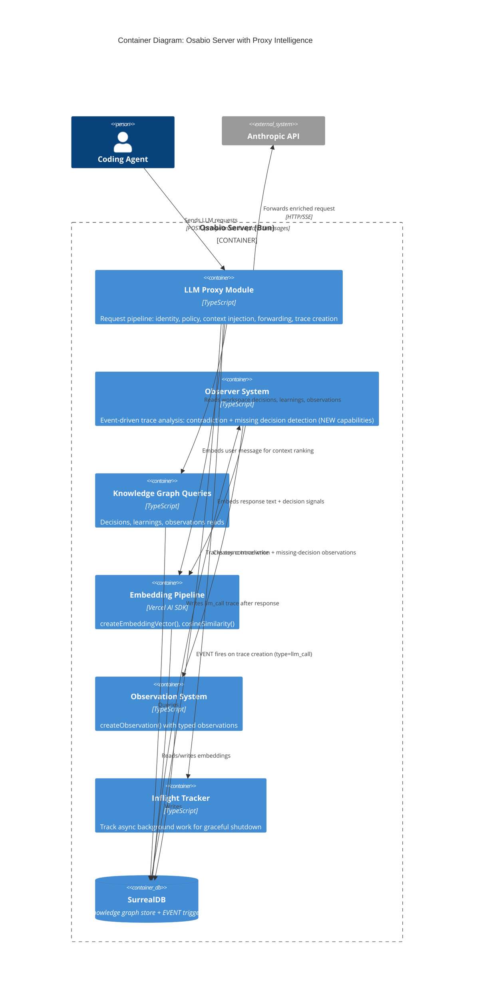
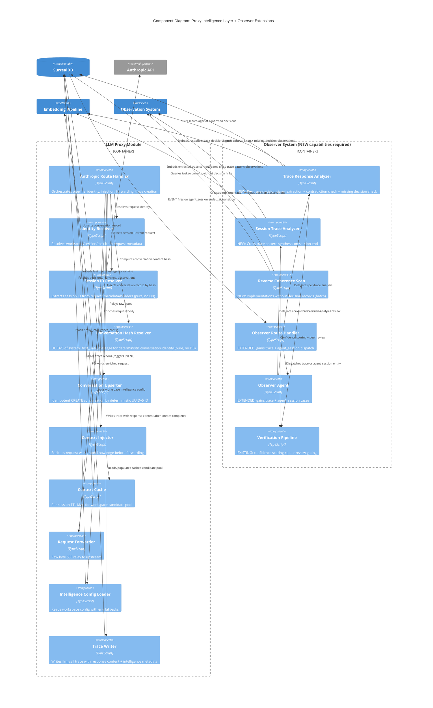
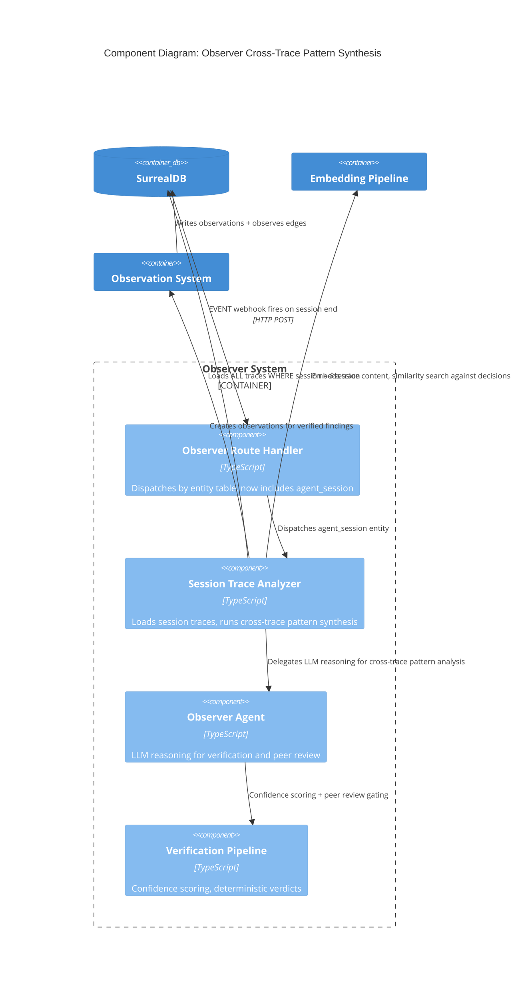

# LLM Proxy Intelligence -- Architecture Design

**Scope**: Context Injection (proxy-owned) + Trace Creation (proxy-owned) + Contradiction Detection (Observer-owned) + Missing Decision Detection (Observer-owned) capabilities layered onto the existing LLM proxy pipeline.
**Paradigm**: Functional (TypeScript)
**Depends on**: [Base proxy architecture](../../architecture/llm-proxy-architecture.md), [ADR-042](../../adrs/ADR-042-llm-trace-as-graph-entity.md)

> **Important: Observer Extension Required**
>
> The Observer today detects: orphaned decisions (confirmed, no implementation, >14 days), task-contradicts-decision (LLM verification on task entity events), and stale objectives (active, no intents, >14 days). It does **NOT** currently detect missing decisions, extract decision signals from LLM response content, analyze trace content, or run on trace entities at all. The capabilities described in Sections 7, 9, and 11 require **new Observer modules to be built**. The proxy's role is limited to (1) context injection pre-forward and (2) trace creation post-response. All detection and analysis is the Observer's responsibility, triggered by SurrealDB EVENTs on trace and agent_session tables.

---

## 1. System Context (C4 Level 1)

The intelligence layer does not introduce new external systems. It enriches the existing proxy pipeline with knowledge graph reads (context injection) and async post-response analysis (contradiction detection + missing decision detection).

```mermaid
C4Context
    title System Context: LLM Proxy Intelligence

    Person(agent, "Coding Agent", "Claude Code, Cursor, etc.")
    System(osabio, "Osabio Server", "LLM proxy with intelligence layer, knowledge graph, observation system")
    System_Ext(anthropic, "Anthropic API", "Claude model inference")

    Rel(agent, osabio, "Sends LLM requests via proxy", "HTTP/SSE")
    Rel(brain, anthropic, "Forwards enriched requests", "HTTP/SSE")
    Rel(brain, osabio, "Reads graph context, writes observations", "Internal")
```

---

## 2. Container Diagram (C4 Level 2)



---

## 3. Component Diagram (C4 Level 3) -- Proxy + Observer Intelligence



---

## 4. Session ID Resolution

The proxy does NOT manage session lifecycle. It reads session IDs from incoming requests and links traces to existing sessions. Session creation, updates, and end-of-session handling are the responsibility of the CLI (`osabio init` hooks) and the orchestrator (`endAgentSession()`).

### 4.1 Session ID Extraction

The proxy extracts a session ID from one of two sources. This is a pure function with no DB calls or side effects.

```
Proxy request arrives
  -> Parse session ID from one of two sources:
       Claude Code:     metadata.user_id field -> "session_{uuid}" (already implemented in walking skeleton)
       Osabio-managed:   X-Osabio-Session header value (set by orchestrator/CLI)
  -> No match from either source:
       -> No session ID -> trace linked to workspace only (session field omitted)
  -> Session ID resolved:
       -> Trace linked to agent_session record via external_session_id lookup
```

### 4.2 Session Lifecycle Ownership

| Concern | Owner | Mechanism |
|---|---|---|
| Session creation | CLI (`osabio init` hooks) / Orchestrator | `createAgentSession()` on agent start |
| Session activity tracking | CLI / Orchestrator | Updates via existing agent session API |
| Session end | CLI (`osabio init` SessionEnd hook) / Orchestrator | `endAgentSession()` sets `ended_at` |
| Observer trace analysis | SurrealDB EVENT | `session_ended` EVENT fires on `ended_at` transition (ADR-048) |

The SurrealDB EVENT on `ended_at` fires regardless of who sets it -- CLI, orchestrator, or any future mechanism. The Observer trace analysis pipeline (ADR-048) is triggered by this EVENT.

### 4.3 Error Handling

| Component | Failure Mode | Response |
|---|---|---|
| Session ID parsing | No recognizable session source | Trace created without session link, log info |
| Session ID lookup | No matching agent_session record | Trace created without session link, log info |

**Principle**: Session ID resolution failures NEVER block request forwarding. The proxy's primary obligation is transparent passthrough; session linking is best-effort.

---

## 5. Conversation Hash Correlation

The proxy derives a conversation identity from request content by hashing the system prompt + first user message. This groups traces into conversations without requiring Osabio integration -- any client using the proxy gets conversation grouping for free.

### 5.1 How It Works

LLMs send the full message history on every request. The system prompt and first user message are stable across all requests in the same conversation:

```
Request 1: [system, user_msg_1] -> hash(system + user_msg_1) -> conv_abc
Request 2: [system, user_msg_1, assistant, tool_result] -> hash(system + user_msg_1) -> conv_abc
Request 3: [system, user_msg_1, assistant, tool_result, ...] -> hash(system + user_msg_1) -> conv_abc
```

### 5.2 Pipeline Position

Conversation hash resolution runs after session ID resolution, before context injection. It is a two-phase operation:

1. **ID computation** (pure function, no DB): Extract system prompt content + first user message content from request body. `UUIDv5(OSABIO_PROXY_NAMESPACE, system_content + "\x00" + first_user_content)` produces a deterministic UUID.
2. **Conversation create** (single DB write, idempotent): `CREATE conversation:⟨$conv_id⟩` — if the record already exists, SurrealDB returns the existing record. No lookup query needed.

### 5.3 What This Enables

- **Unknown clients get conversation grouping for free** -- no `osabio init` needed, no session lifecycle
- **Observer can query all traces in a conversation**: `SELECT * FROM trace WHERE conversation = $conv`
- **Cost attribution per conversation** across all requests
- **Observer session-end analysis fallback**: When no agent_session exists, conversation grouping provides an alternative correlation boundary
- **Title derivation**: First user message (truncated) used as conversation title, same pattern as existing `deriveMessageTitle()`

### 5.4 Relationship to Session ID Resolution

| Concern | Session ID | Conversation Hash |
|---|---|---|
| Source | Request metadata/headers | Request body content |
| Requires integration | Yes (`osabio init` or X-Osabio-Session) | No (content-derived) |
| Lifecycle | Managed by CLI/orchestrator | None (idempotent upsert) |
| Scope | Agent session (may span conversations) | Single conversation thread |
| Client coverage | Integrated clients only | All clients |

Both are resolved independently. A trace may have both a session link AND a conversation link. Unknown clients without session IDs still get conversation grouping.

### 5.5 Error Handling

| Component | Failure Mode | Response |
|---|---|---|
| Hash computation | Malformed request body / missing system or user message | Skip conversation hash, trace created without conversation link, log info |
| Conversation upsert | SurrealDB error | Skip conversation link, trace created without it, log warning |

**Principle**: Conversation hash resolution failures NEVER block request forwarding. The upsert is best-effort -- identical to session ID resolution behavior.

### 5.6 Privacy

The conversation record ID is a UUIDv5 derived from the content — the full system prompt or message content is never stored. The UUID is a one-way deterministic fingerprint used solely for correlation.

---

## 6. Integration with Existing Proxy Pipeline

The intelligence capabilities integrate as two hooks in the existing request pipeline:

### Pre-forward hook: Context Injection
- **Position**: After identity resolution and policy evaluation, before forwarding
- **Blocking**: Yes (delays forward by 5-15ms cached, 50-100ms cold)
- **Fail-open**: On any error, forward the original request unmodified and log a warning

### Post-response hook: Trace Creation (triggers Observer analysis)
- **Position**: After stream completes, alongside usage extraction and cost computation
- **Blocking**: Never -- trace write is async via `deps.inflight.track()`
- **Fail-skip**: On trace write error, log error, do not retry
- **Scope**: The proxy writes the `llm_call` trace with response content in FLEXIBLE `output` field. A SurrealDB EVENT on the `trace` table fires on creation (when `type = "llm_call"`), which triggers the Observer's per-trace analysis pipeline. **The proxy performs NO detection or analysis itself.**

> **What the Observer does NOT have today**: The Observer currently has no handler for `trace` entities. The per-trace response analysis (decision signal extraction, contradiction check, missing decision check) is a **new Observer capability** that must be built. See Section 11 for the full list of new Observer modules required.

### Extended Pipeline (intelligence hooks marked)

```
Agent Request
  |-> Parse request body
  |-> Identity Resolution (existing)
  |-> **Session ID Resolution** (NEW -- extract session ID from metadata/headers, pure function)
  |-> **Conversation Hash Resolution** (NEW -- hash system+first_user_message, upsert conversation record)
  |-> Policy Evaluation (existing)
  |-> **Context Injection** (NEW -- pre-forward hook)
  |     |-> Load workspace intelligence config
  |     |-> If disabled or fast-path tier: skip
  |     |-> Build/retrieve cached candidate pool
  |     |-> Embed last user message
  |     |-> Rank candidates by cosine similarity within token budget
  |     |-> Append system block to request body
  |-> Forward to upstream (existing, now with enriched body)
  |-> Return Response to agent (existing SSE relay)

Post-Response (async, proxy-owned):
  |-> Extract usage (existing)
  |-> Compute cost (existing)
  |-> **Write llm_call trace** (NEW -- includes response content in FLEXIBLE output)
  |     |-> Trace includes: response text blocks, tool inputs, stop_reason, intelligence metadata
  |     |-> Trace linked to conversation record (if conversation hash resolved)
  |     |-> Trace creation fires SurrealDB EVENT (see Section 12)

Observer Pipeline (async, EVENT-driven, NEW -- does NOT exist today):
  |-> SurrealDB EVENT on trace table fires for type = "llm_call"
  |-> Observer route handler receives webhook, dispatches to trace response analyzer
  |-> **Trace Response Analyzer** (NEW Observer module):
  |     |-> Check stop_reason from trace (skip tool_use)
  |     |-> Extract analysis targets from trace output content
  |     |-> **Contradiction Detection**:
  |     |     |-> Tier 1: Embed response, KNN against decisions
  |     |     |-> Tier 2: Haiku verification on flagged candidates
  |     |     |-> Create contradiction observations if confirmed
  |     |-> **Missing Decision Detection**:
  |     |     |-> Extract decision signals from response text
  |     |     |-> Embed decision signals, KNN against existing decisions
  |     |     |-> No match above threshold = unrecorded decision
  |     |     |-> Tier 2: Haiku verification on unmatched candidates
  |     |     |-> Create missing-decision observations if confirmed
```

---

## 7. Data Flow: Context Injection

### Phase 1: Candidate Pool (cached, TTL 5min)

```
Identity(workspace) -> Check cache(session_id)
  |-> MISS: Query SurrealDB for:
  |     - Confirmed decisions (workspace-scoped, limit 50)
  |     - Active learnings (workspace-scoped, limit 30)
  |     - Open conflict/warning observations (workspace-scoped, limit 20)
  |     All with embeddings for in-memory ranking.
  |-> Store in Map<string, {pool, expires_at}>
  |-> HIT: Return cached pool
```

### Phase 2: Per-Turn Ranking (computed every request)

```
Last user message -> createEmbeddingVector()
  |-> For each candidate in pool:
  |     cosineSimilarity(candidate.embedding, userMessageEmbedding)
  |     * priorityWeight (decisions: 1.0, learnings: 0.8, observations: 0.7)
  |-> Sort by weighted score DESC
  |-> Take top N within token budget (default 1000 tokens)
  |-> Format as <osabio-context> XML block
```

### Phase 3: Request Mutation

```
Original system field (string | ContentBlock[])
  |-> Normalize to array form
  |-> Append <osabio-context> block at END
  |-> Preserve all existing blocks + cache_control markers
  |-> Re-serialize body for forwarding
```

---

## 8. Data Flow: Observer Per-Trace Analysis (Contradiction + Missing Decision Detection)

> **NEW Observer capability -- does not exist today.** The Observer currently handles `task`, `intent`, `git_commit`, `decision`, and `observation` entities. It has NO handler for `trace` entities. Everything in this section describes new modules that must be built in the Observer system.

The proxy creates an `llm_call` trace after stream completion. A SurrealDB EVENT on the `trace` table fires on creation, triggering the Observer's per-trace analysis pipeline. Both detection pipelines share the same trigger, stop_reason check, and content extraction step. They diverge at the analysis phase.

### 7.1 Trigger: SurrealDB EVENT on `trace` Table

```
Proxy writes llm_call trace (with response content in FLEXIBLE output field)
  -> SurrealDB EVENT trace_llm_call_created fires (ASYNC, RETRY 3)
    -> POST /api/observe/trace/:id with $after body
      -> Observer route handler dispatches to Trace Response Analyzer (NEW module)
```

The EVENT fires only on CREATE when `type = "llm_call"`. ASYNC ensures the trace write commits before the webhook fires.

### 7.2 Shared: Content Extraction from Trace

```
Observer receives trace record via EVENT webhook
  |-> Read stop_reason from trace output metadata
  |     tool_use -> skip (intermediate loop step, return 200)
  |     end_turn / max_tokens -> proceed
  |-> Extract text blocks + Edit/Write/Bash tool inputs from trace output FLEXIBLE field
  |-> Pass extracted content to both detection pipelines (parallel)
```

### 7.3 Contradiction Detection (NEW Observer module)

```
Extracted trace content
  |-> Tier 1: Embed extracted text
  |     Two-step KNN (SurrealDB v3.0 workaround):
  |       Step 1: KNN candidates from decision table (HNSW only)
  |       Step 2: Filter by workspace + confirmed + similarity > threshold
  |     No matches above threshold -> done
  |     Matches -> pass to Tier 2
  |-> Tier 2: For each flagged decision:
  |     Call Haiku-class model with verification prompt
  |     confidence < 0.6 -> discard (false positive gate)
  |     contradicts=true + confidence >= 0.6 -> create observation
  |-> Create observation via createObservation():
  |     severity: "conflict"
  |     observationType: "contradiction"
  |     sourceAgent: "observer_agent"
  |     relatedRecords: [contradicted_decision, trace]
  |     embedding: from Tier 1
```

### 7.4 Missing Decision Detection (NEW Observer module)

```
Extracted trace content
  |-> Extract decision signals from response text:
  |     - Architectural statements ("we should use X", "chose X over Y")
  |     - Approach selections ("decided to implement via...")
  |     - Technology choices ("using X for Y")
  |     - Rejection statements ("rejected X because...")
  |-> For each candidate decision signal:
  |     |-> Embed the decision text
  |     |-> Two-step KNN against existing decisions in workspace:
  |     |     Step 1: KNN candidates from decision table (HNSW only)
  |     |     Step 2: Filter by workspace + similarity threshold
  |     |-> Match above threshold -> skip (decision already recorded)
  |     |-> No match -> candidate for missing decision
  |-> Tier 2: For each unmatched candidate:
  |     Call Haiku-class model with verification prompt:
  |       "Is this a genuine decision that should be recorded?"
  |     confidence < threshold -> discard
  |     confidence >= threshold -> create observation
  |-> Create observation via createObservation():
  |     severity: "info"
  |     observationType: "validation"
  |     sourceAgent: "observer_agent"
  |     relatedRecords: [agent_session (if resolved), trace]
  |     embedding: candidate decision embedding
```

---

## 9. Error Handling Strategy

### 8.1 Proxy Errors (context injection + trace creation)

| Component | Failure Mode | Response |
|---|---|---|
| Context Injection -- config load | SurrealDB unreachable | Forward original request unmodified, log warning |
| Context Injection -- candidate query | Query timeout/error | Forward original request unmodified, log warning |
| Context Injection -- embedding | Embedding model error | Forward original request unmodified, log warning |
| Context Injection -- body mutation | Parse/serialize error | Forward original request unmodified, log warning |
| Trace write | SurrealDB error | Log error, do not retry. Observer analysis skipped (no trace = no EVENT) |

**Principle**: Proxy failures NEVER block request forwarding. The proxy's primary obligation is transparent passthrough; context injection and trace creation are best-effort enhancements.

### 8.2 Observer Errors (per-trace analysis -- NEW, does not exist today)

| Component | Failure Mode | Response |
|---|---|---|
| EVENT webhook | Observer route unreachable | SurrealDB retries up to 3 times (RETRY 3), then drops |
| Trace content extraction | Malformed/missing FLEXIBLE fields | Skip analysis, return 200 (prevent EVENT retry) |
| Embedding | Embedding model error | Skip both detection pipelines, log error, return 200 |
| KNN query | SurrealDB error | Skip affected pipeline, log error |
| Tier 2 LLM | Model error/timeout | Skip this candidate, continue with remaining |
| Observation write | SurrealDB error | Log error, do not retry |

**Principle**: Observer per-trace analysis is best-effort. Failures NEVER block proxy request forwarding (the EVENT is ASYNC and decoupled from the proxy pipeline). Handler returns 200 on non-transient errors to prevent EVENT retries.

---

## 10. Enhancement: Observer Session-End Cross-Trace Pattern Synthesis

### 9.1 Overview

**Note**: This is an enhancement for integrated clients (those with session lifecycle support), not a core detection mechanism. The core detection capabilities -- per-trace contradiction detection and missing decision detection (Section 7, Observer-owned, NEW) -- are triggered by trace creation EVENTs and work for all clients including unknown/unintegrated ones.

When a coding agent session ends, the Observer analyzes all traces from that session for:
- **Cross-Trace Pattern Synthesis**: Detect patterns that only emerge when the full session trace history is visible (e.g., trace #3 picks approach A, trace #47 implements approach B)

### 9.2 Trigger: SurrealDB EVENT on `agent_session`

```
endAgentSession() sets ended_at on agent_session record
  -> SurrealDB EVENT session_ended fires (ASYNC, RETRY 3)
    -> POST /api/observe/agent_session/:id with $after body
      -> Observer route handler dispatches to analyzeSessionTraces()
```

The EVENT fires only on UPDATE when `ended_at` transitions from NONE to a value. ASYNC ensures the session-ending write commits before the webhook fires and never blocks session end.

### 9.3 Component Diagram (C4 Level 3) -- Cross-Trace Pattern Synthesis



### 9.4 Data Flow: Cross-Trace Pattern Synthesis

Per-request detection (Section 7) handles contradiction detection and missing decision detection for individual responses. Session-end analysis focuses on patterns that only emerge across multiple traces.

```
Load all traces for session (all types)
  |-> Extract action content from traces:
  |     - tool_call: tool inputs/outputs for Write/Edit/Bash
  |     - message: assistant text blocks with reasoning
  |     - subagent_spawn: delegated instructions
  |     - bridge_exchange: inter-agent coordination content
  |
  |-> OBSERVER_MODEL cross-trace analysis:
  |     Full session context available -- can see patterns across
  |     multiple traces that per-request detection cannot:
  |     - Approach drift: trace #3 selects approach A, trace #47 implements approach B
  |     - Accumulated contradictions: individual traces look fine, but combined effect contradicts a decision
  |     - Decision evolution: an agent gradually shifts from one approach to another across traces
  |
  |-> Batch embed extracted text for pattern candidates
  |-> Two-step KNN against confirmed workspace decisions
  |
  |-> Confidence gate + peer review pipeline
  |-> Create conflict observations for confirmed cross-trace patterns
  |     linked to contradicted decision + agent_session
```

### 9.5 Relationship to Per-Trace Detection

| Aspect | Per-Trace (Section 7) | Session-End (Enhancement) |
|---|---|---|
| Trigger | EVENT on trace creation (type=llm_call) | EVENT on agent_session ended_at transition |
| Scope | Single trace: contradiction + missing decision | All session traces: cross-trace patterns |
| Model | Haiku-class (Tier 2 only) | OBSERVER_MODEL (same as all Observer analysis) |
| Detection depth | Fast, per-trace | Deep (batch, cross-trace patterns) |
| Latency | Seconds (async via EVENT) | Minutes (background, async via EVENT) |
| Pipeline | Observer Trace Response Analyzer (NEW) | Observer Session Trace Analyzer (NEW) |
| Owner | Observer (NOT proxy) | Observer |
| Client support | All clients (proxy creates traces for all requests) | Integrated clients with session lifecycle only |
| Exists today? | **No -- must be built** | **No -- must be built** |

Session-end cross-trace analysis catches edge cases invisible to per-trace detection:
- Approach drift across many traces (trace #3 picks A, trace #47 implements B)
- Accumulated contradictions where individual traces look fine but combined effect conflicts
- This is an enhancement -- the core detection mechanisms work per-trace for all clients

### 9.6 Error Handling

| Component | Failure Mode | Response |
|---|---|---|
| EVENT webhook | Observer route unreachable | SurrealDB retries up to 3 times (RETRY 3), then drops |
| Trace loading | SurrealDB query timeout | Log error, skip analysis, return 200 (prevent EVENT retry) |
| Trace content extraction | Malformed/missing FLEXIBLE fields | Skip individual trace, continue with remaining |
| Embedding | Embedding model error | Skip analysis, log error |
| OBSERVER_MODEL | LLM timeout/error | Skip analysis, log error |
| Peer review | LLM error on peer review | Skip peer review for that candidate, log error |
| Observation write | SurrealDB write error | Log error, do not retry |

**Principle**: Session-end trace analysis is best-effort. Failures NEVER block `endAgentSession()` (the EVENT is ASYNC). Failures NEVER trigger EVENT retries for non-transient errors (handler returns 200).

---

## 11. Quality Attribute Strategies

| Attribute | Strategy |
|---|---|
| **Performance** | Session-cached candidate pool avoids per-request DB queries. In-memory cosine ranking. All detection/analysis runs in the Observer via async EVENTs -- zero hot-path impact on the proxy. |
| **Reliability** | Fail-open for injection, fail-skip for trace creation. Observer analysis is fully decoupled via ASYNC EVENTs -- proxy failures never affect detection, detection failures never affect proxy. |
| **Maintainability** | Clean separation: proxy owns request enrichment + trace creation, Observer owns all detection/analysis. Each can evolve independently. New detection capabilities are Observer modules, not proxy changes. |
| **Security** | Context injection only reads from the knowledge graph (no write path). Observer detection writes observations (append-only, no mutations). |
| **Cost** | Context injection is zero LLM cost. Observer Tier 1 is zero LLM cost. Tier 2 uses cheapest available model, only on flagged candidates (both contradiction and missing decision checks). |
| **Observability** | All fail-open/fail-skip events logged via `logInfo`/`logError`. Intelligence metadata in trace FLEXIBLE fields enables analytics queries (injection rate, candidate hit rate, contradiction frequency). Observation creation provides feed-level visibility for confirmed findings. |
| **Completeness** | Per-trace Observer analysis handles both contradiction and missing decision detection for all clients. Reverse coherence scan catches implementations without decisions (batch). Session-end cross-trace synthesis (enhancement) provides full-session view for integrated clients. |
| **Session lifecycle** | Proxy reads session IDs only (pure function, no DB calls). Session lifecycle owned by CLI/orchestrator. SurrealDB EVENT on `ended_at` triggers Observer session-end analysis. SurrealDB EVENT on trace creation triggers Observer per-trace analysis. |
| **Conversation correlation** | Content-derived conversation hash groups traces for all clients (no integration required). Single idempotent upsert per request. Observer can use conversation grouping as fallback when no session exists. |

---

## 12. New Observer Capabilities Required

> **This section explicitly lists what must be built.** None of these capabilities exist in the Observer today. They are prerequisites for the detection features described in this design.

### 11.1 Capability 1: Per-Trace Response Analysis (event-driven, NEW)

**Trigger**: SurrealDB EVENT on `trace` table when `type = "llm_call"` record is created.

**New module**: `app/src/server/observer/trace-response-analyzer.ts`

**What it does**:
1. **Decision signal extraction**: Scans trace `output` content for decision-shaped statements (chose X over Y, architectural choices, technology selections, approach rejections)
2. **Missing decision check**: For each extracted signal, embedding similarity against existing workspace decisions. No match above threshold = candidate for "unrecorded decision" observation
3. **Contradiction check**: For each extracted signal + full response text, embedding similarity against confirmed decisions. High similarity + conflicting content = candidate for "contradiction" observation
4. Both go through existing confidence scoring + peer review pipeline (verification-pipeline.ts)

**Observer extensions required**:
- `SUPPORTED_TABLES` in `observer-route.ts` gains `"trace"`
- Observer agent's dispatch gains a `trace` case delegating to the trace response analyzer
- Trace workspace resolution: extract workspace from trace record (trace -> session -> workspace, or trace -> workspace direct field)

### 11.2 Capability 2: Reverse Coherence Scan (batch, NEW)

**Trigger**: Existing `runCoherenceScans()` in `graph-scan.ts` -- add a new scan phase.

**Extension to**: `app/src/server/observer/graph-scan.ts`

**What it does**:
- Query completed tasks and git commits that have NO linked decision records (no `implemented_by` or `belongs_to` edges connecting them to any decision)
- Flag as "implementation without recorded decision" (severity: `info`)
- This is the reverse of the existing orphaned decision check (which finds decisions without implementations)
- Deterministic, no LLM needed -- same pattern as existing coherence scans

**Changes to `CoherenceScanResult`**:
- Add `implementations_without_decisions_found: number` field

### 11.3 Capability 3: Cross-Trace Pattern Synthesis (session-end, already designed)

**Trigger**: SurrealDB EVENT on `agent_session` when `ended_at` transitions from NONE to a value (ADR-048).

**New module**: `app/src/server/observer/session-trace-analyzer.ts` (already described in Section 9)

**Prerequisite**: Capability 1 (per-trace analysis) should be built first, as session-end analysis builds on the same trace content extraction and decision signal patterns.

**Note**: This capability was already designed in ADR-048 and Section 9. No changes needed to its design -- it is listed here for completeness of the Observer extension inventory.
