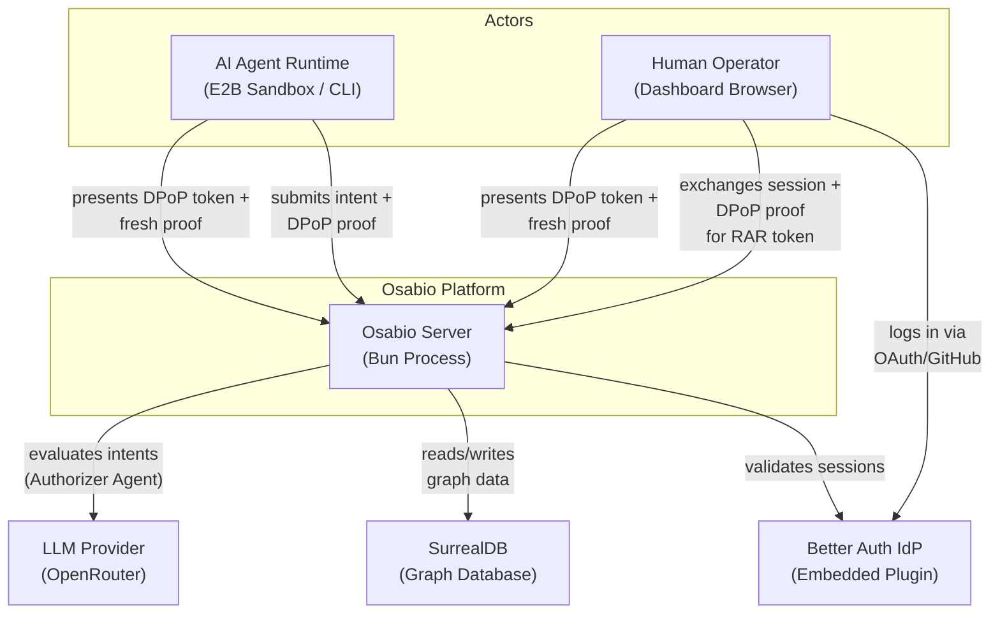
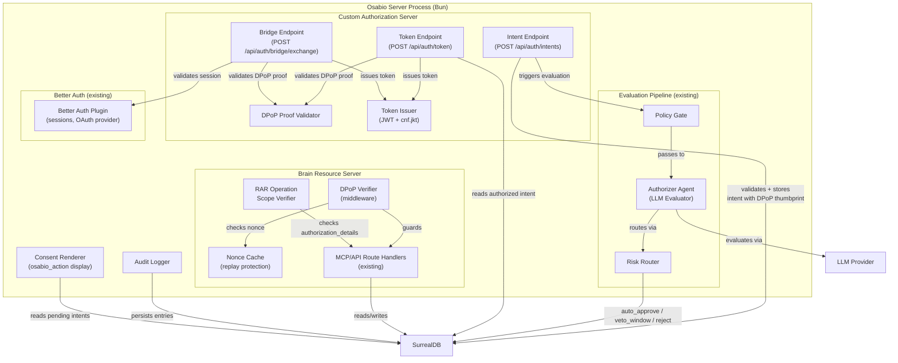
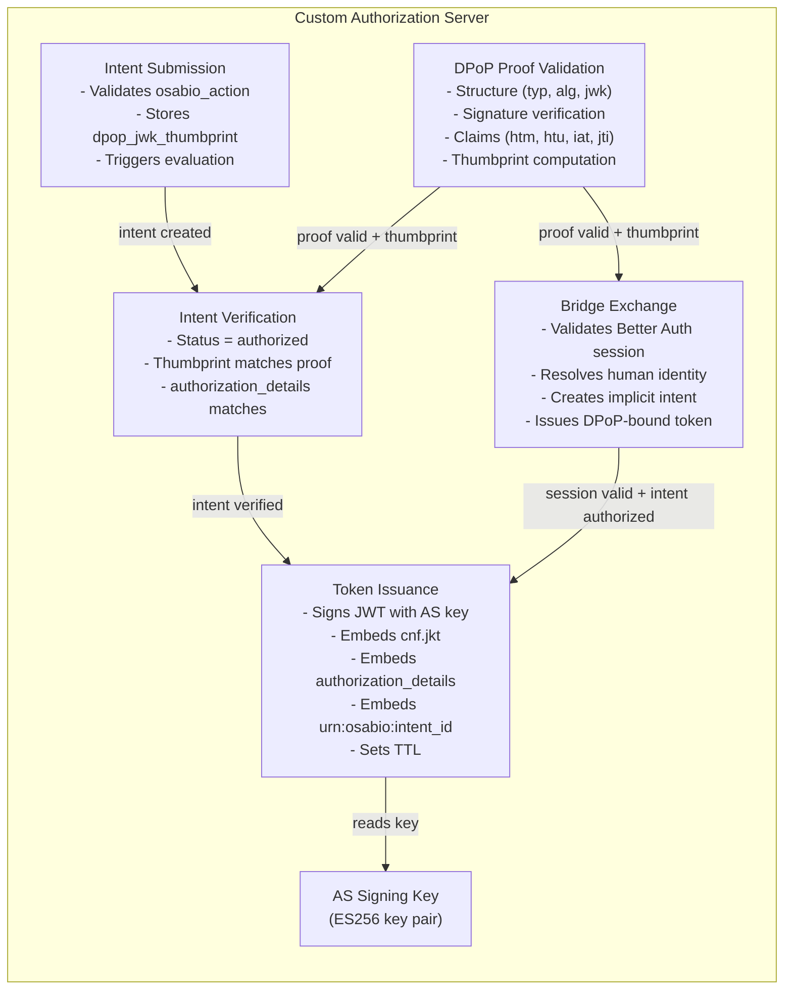
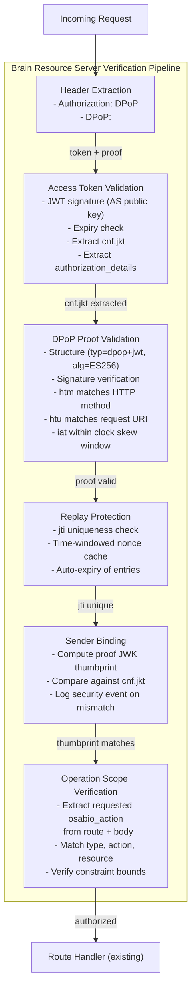

# Architecture Design: OAuth 2.1 RAR + DPoP Sovereign Auth Model

## System Overview

The Sovereign Hybrid Model replaces the Osabio platform's Bearer+scope authorization with a uniform DPoP-bound RAR authorization layer. Every Osabio operation -- reads, writes, integrations -- requires a DPoP-bound access token carrying `osabio_action` authorization_details. Better Auth remains the human identity provider (front door); a new Custom Authorization Server issues DPoP-bound tokens for all Osabio operations.

### Key Architectural Principles

- **One language of authority**: `osabio_action` authorization_details objects. No scopes at the Osabio boundary.
- **Sender constraining**: DPoP binds tokens to actor key pairs. Stolen tokens are unusable.
- **Session-Brain separation**: Better Auth sessions cannot access the Osabio. The Bridge exchanges sessions for DPoP tokens.
- **Human parity**: Agent and human tokens are identical at the Osabio boundary.
- **Classification is a vulnerability**: No consequential/non-consequential tiering. Uniform pipeline.

---

## C4 System Context (Level 1)



---

## C4 Container (Level 2)



---

## C4 Component (Level 3) -- Custom Authorization Server

The Custom AS has 5+ internal components, warranting L3 detail.



---

## C4 Component (Level 3) -- Osabio Resource Server DPoP Verification



---

## Integration Points with Existing System

### Modified Components

| Component | Current | After |
|---|---|---|
| `mcp/auth.ts` (`authenticateMcpRequest`) | Bearer token extraction, JWKS validation, scope extraction | Replaced by DPoP verification pipeline. Bearer requests rejected with 401 "dpop_required". |
| `auth/scopes.ts` (`requireScope`, `ACTION_SCOPE_MAP`) | Gates MCP operations by OAuth scope | Removed from Osabio boundary. Scopes remain for Better Auth UI only. |
| `mcp/mcp-route.ts` | Calls `authenticateMcpRequest` + `requireScope` per handler | Calls new DPoP+RAR verification middleware. Scope checks removed. |
| `intent/types.ts` (`IntentRecord`) | `action_spec` with provider/action/params | Extended with `authorization_details` (osabio_action), `dpop_jwk_thumbprint` |
| `intent/authorizer.ts` (`evaluateIntent`) | Evaluates action_spec | Evaluates osabio_action authorization_details (Rich Intent Objects) |
| `intent/intent-routes.ts` | Evaluation webhook handler, veto, list pending | Extended with consent rendering data |
| `mcp/token-validation.ts` | JWKS-based Bearer JWT validation | Repurposed for AS-issued DPoP-bound token validation |
| `runtime/types.ts` (`ServerDependencies`) | No nonce cache | Adds nonce cache and AS signing key |
| `start-server.ts` | Routes for MCP, intents | Adds Custom AS token endpoint, Bridge endpoint |

### New Components

| Component | Responsibility |
|---|---|
| `app/src/server/oauth/dpop.ts` | DPoP proof construction/validation, JWK thumbprint computation |
| `app/src/server/oauth/token-endpoint.ts` | Custom AS token endpoint (grant_type=urn:osabio:intent-authorization) |
| `app/src/server/oauth/bridge.ts` | Bridge exchange endpoint (session -> DPoP token) |
| `app/src/server/oauth/token-issuer.ts` | JWT signing with osabio_action claims, cnf.jkt |
| `app/src/server/oauth/nonce-cache.ts` | Time-windowed nonce set for replay protection |
| `app/src/server/oauth/rar-verifier.ts` | osabio_action matching (route -> requested action -> authorized action) |
| `app/src/server/oauth/dpop-middleware.ts` | Request verification pipeline (replaces authenticateMcpRequest) |
| `app/src/server/oauth/consent-renderer.ts` | osabio_action to human-readable display |
| `app/src/server/oauth/audit.ts` | Authorization event logging |
| `app/src/server/oauth/types.ts` | Shared types (OsabioAction, DPoP claims, token claims) |

### Preserved Components (No Changes)

- `auth/config.ts` -- Better Auth configuration (human login unchanged)
- `auth/adapter.ts` -- SurrealDB adapter for Better Auth
- `iam/authority.ts` -- Authority permission matrix (coexists, gates tool execution)
- `iam/identity.ts` -- Identity resolution (unchanged)
- `intent/risk-router.ts` -- Risk routing logic (unchanged)
- `intent/status-machine.ts` -- Intent state machine (unchanged)
- `intent/veto-manager.ts` -- Veto window recovery (unchanged)
- All chat, extraction, entity, graph, feed, observation modules -- unchanged

---

## Deployment Architecture

Single Bun process (modular monolith). The Custom AS is a new module within the existing server, not a separate service.

```
Osabio Server (Bun process)
  |
  +-- Better Auth Plugin (existing, human login)
  |     |-- /api/auth/* routes (sessions, OAuth provider, JWKS)
  |
  +-- Custom Authorization Server (NEW module)
  |     |-- POST /api/auth/intents (intent submission with DPoP binding)
  |     |-- POST /api/auth/token (RAR token issuance)
  |     |-- POST /api/auth/bridge/exchange (session-to-token Bridge)
  |     |-- GET  /api/auth/osabio/.well-known/jwks (AS public keys)
  |
  +-- Osabio Resource Server (MODIFIED middleware)
  |     |-- DPoP verification pipeline (replaces Bearer auth)
  |     |-- RAR operation scope verification
  |     |-- /api/mcp/* routes (existing, now DPoP-protected)
  |     |-- /api/workspaces/* routes (existing, now DPoP-protected)
  |
  +-- Intent Evaluation Pipeline (existing, extended)
  |     |-- Policy Gate -> Authorizer Agent -> Risk Router
  |     |-- Now evaluates osabio_action (not action_spec)
  |
  +-- SurrealDB (graph database)
```

---

## Data Flow: Agent Token Acquisition

```
1. Agent generates ES256 key pair (Web Crypto API, in-memory)
2. Agent computes JWK thumbprint (RFC 7638)
3. Agent constructs osabio_action authorization_details
4. Agent submits intent:
     POST /api/auth/intents
     { authorization_details, dpop_jwk_thumbprint, goal, reasoning }
5. Evaluation pipeline runs:
     Policy Gate -> Authorizer Agent (LLM) -> Risk Router
6. If auto_approve: intent.status = "authorized"
   If veto_window: human reviews, approves/constrains/vetoes
7. Agent requests token:
     POST /api/auth/token
     Headers: DPoP: <proof signed with agent's private key>
     Body: { grant_type: "urn:osabio:intent-authorization", intent_id, authorization_details }
8. Custom AS validates:
     - Intent exists, status = authorized
     - DPoP proof valid (structure, signature, freshness)
     - Proof key thumbprint matches intent.dpop_jwk_thumbprint
     - authorization_details matches intent
9. Custom AS issues DPoP-bound access token:
     { sub, cnf: { jkt: thumbprint }, authorization_details, urn:osabio:intent_id, exp }
10. Agent presents token to Osabio:
      Authorization: DPoP <token>
      DPoP: <fresh proof for this request>
```

## Data Flow: Human Bridge Exchange

```
1. Human logs into dashboard via Better Auth (session cookie)
2. Dashboard generates ES256 key pair (Web Crypto API, non-extractable)
3. Dashboard constructs osabio_action for the requested operation
4. Dashboard sends Bridge exchange:
     POST /api/auth/bridge/exchange
     Cookie: better-auth session
     Headers: DPoP: <proof signed with browser key>
     Body: { authorization_details }
5. Custom AS validates:
     - Better Auth session is active (API call)
     - DPoP proof valid
     - Resolves human identity from session
     - Authorizer Agent evaluates osabio_action
     - Low-risk reads auto-approve; high-risk triggers veto window
6. Custom AS issues DPoP-bound access token (same format as agent tokens)
7. Dashboard presents DPoP token to Osabio (same verification pipeline)
```

---

## Quality Attribute Strategies

### Security
- DPoP sender constraining eliminates stolen token replay
- Session cookies cannot access Osabio (enforced at middleware)
- Bearer tokens rejected at Osabio boundary
- Nonce cache prevents DPoP proof replay
- Short token TTL (300s default)
- osabio_action constraints enforce operation bounds
- AS signing key: ES256 key pair generated on first server start, persisted to SurrealDB (`as_signing_key` table), loaded from DB on subsequent starts. Key rotation via new key insertion + old key status = "rotated" (JWKS serves both during transition).
- Rate limiting on token/Bridge endpoints: deferred (opportunity score 8.0, overserved). The intent evaluation pipeline and DPoP proof validation provide natural rate control. Add per-identity rate limiting if operational data shows abuse.

### Auditability
- Every intent submission, evaluation, routing, consent, token issuance, and verification logged
- Audit entries link to intent_id + DPoP thumbprint
- Security events (mismatch, replay) at elevated severity
- Uniform osabio_action format for all actors

### Testability
- Evaluation pipeline uses injected LlmEvaluator port (existing pattern)
- DPoP proof validation is pure function (input: proof JWT, output: validation result)
- Nonce cache is dependency-injected (not module singleton)
- Token issuance uses injected signing key
- Osabio_action matching is pure function (requested vs authorized)

### Maintainability
- New `oauth/` module with clear boundaries
- Pure functions for validation, matching, thumbprint computation
- Effect boundary at endpoint handlers only
- Existing intent pipeline extended, not rewritten

### Time-to-Market
- Reuses existing intent table, evaluation pipeline, risk router, identity system
- `jose` library already in dependencies for JWT/JWK operations
- Web Crypto API available in Bun (no new dependencies for key generation)
- Single module addition, not architectural restructuring
