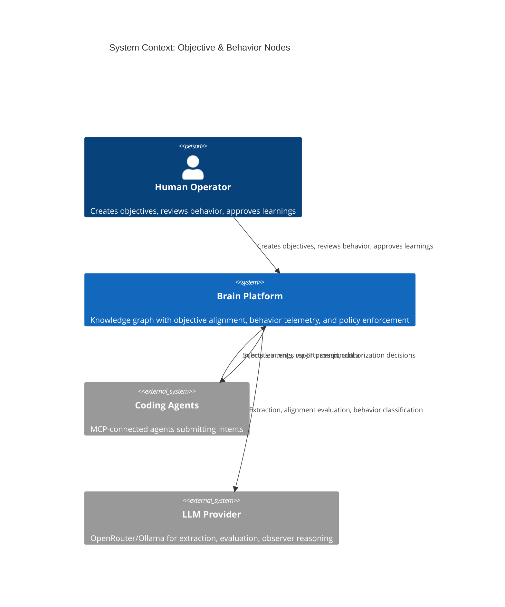
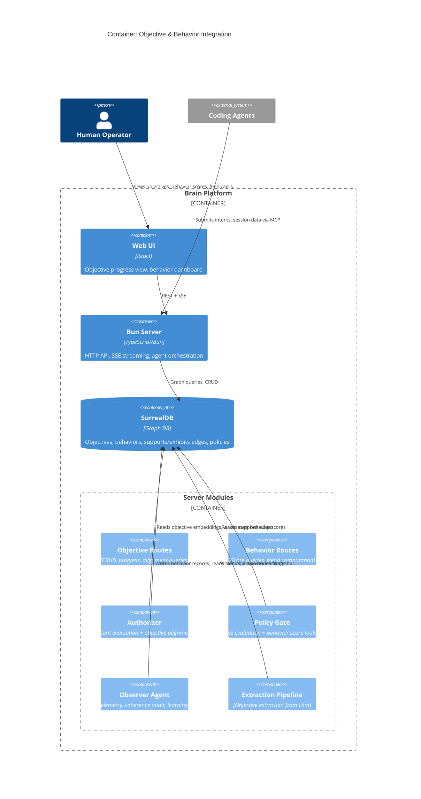
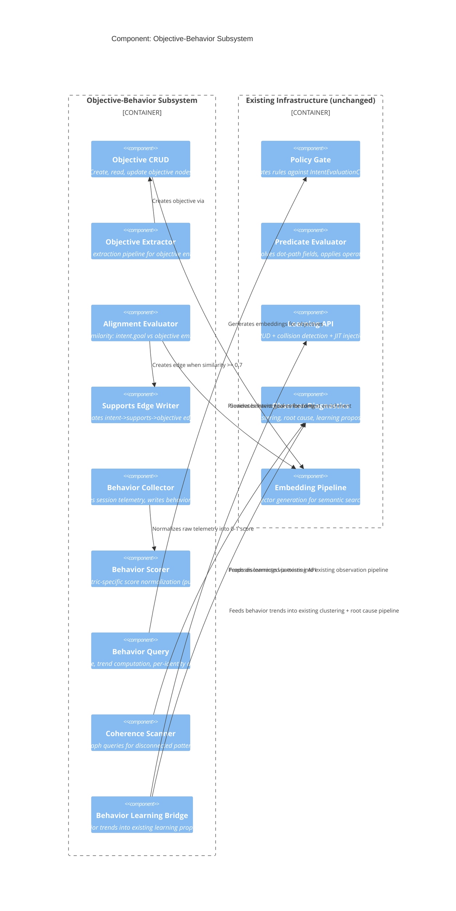

# Architecture Design: Objective & Behavior Nodes

## System Context

This feature extends the Brain knowledge graph with two new node types -- **Objective** (strategic goals) and **Behavior** (agent craftsmanship metrics) -- plus the relations and evaluation pipelines that connect them to existing intent authorization, policy enforcement, observer analysis, and learning systems.

### C4 System Context (L1)



### C4 Container (L2)



### C4 Component (L3) -- Objective-Behavior Subsystem



---

## Integration Points

### 1. Extraction Pipeline Extension (Objective Extraction)
- **Existing**: `app/src/server/extraction/` processes chat messages, extracts task/decision/question entities
- **Extension**: Add `objective` to extraction entity types. Reuse existing extraction schema pattern with confidence scoring and dedup
- **Dedup**: Semantic similarity check (>0.95) against active workspace objectives before creation

### 2. Authorizer Extension (Objective Alignment)
- **Existing**: `app/src/server/intent/authorizer.ts` runs policy gate then LLM evaluation
- **Extension**: After policy gate passes, run alignment evaluation: KNN query against active objective embeddings. Create `supports` edge on match (>=0.7), warning observation on no match (<0.5 for all)
- **Constraint**: Alignment evaluation must complete within 200ms. Use pre-loaded workspace objective embeddings (cache in memory per scan cycle, or two-step KNN)

### 3. Policy Gate Extension (Behavior Scores in Context)
- **Existing**: `app/src/server/policy/policy-gate.ts` evaluates rules against `IntentEvaluationContext`
- **Extension**: Enrich `IntentEvaluationContext` with `behavior_scores` object (keyed by metric_type) before policy evaluation. Predicate evaluator already supports dot-path resolution (`behavior_scores.Security_First` with operator `lt` and value `0.8`)
- **No schema change to policy rules needed**: The existing `RulePredicate` type already supports `field: "behavior_scores.Security_First", operator: "lt", value: 0.8` -- the predicate evaluator resolves dot paths

### 4. Observer Extension (Behavior Telemetry + Coherence)
- **Existing**: `app/src/server/observer/graph-scan.ts` runs contradiction/stale/drift scans. `learning-diagnosis.ts` clusters observations and proposes learnings
- **Extension A (Telemetry)**: New scan type in graph-scan that queries recent agent sessions and writes behavior records via behavior collector
- **Extension B (Coherence)**: New scan type that detects orphaned decisions (no implementing task after 14d), stale objectives (no supports edges after 14d)
- **Extension C (Behavior Learning)**: New input signal type for learning-diagnosis that feeds behavior trend data (3+ consecutive below-threshold) into existing clustering + root cause pipeline

### 5. Feed Integration
- **Existing**: SSE events via `app/src/server/streaming/sse-registry.ts`
- **Extension**: New feed card types for alignment warnings, behavior vetos, coherence alerts. Reuse existing observation + suggestion feed card patterns

---

## Data Flow Diagrams

### Intent Authorization with Objective Alignment

```
Intent Submitted
  |
  v
[Policy Gate] -- evaluates rules against context (now includes behavior_scores)
  |
  |-- DENY --> veto (existing flow)
  |
  v (PASS)
[Alignment Evaluator] -- KNN: intent.goal embedding vs active objective embeddings
  |
  |-- similarity >= 0.7 --> create supports edge, proceed
  |-- 0.5 <= similarity < 0.7 --> create supports edge (highest), surface for confirmation
  |-- similarity < 0.5 for all --> create warning observation, proceed (warning mode)
  |-- no objectives exist --> skip alignment, proceed with info feed card
  |
  v
[LLM Evaluator] -- existing flow (unchanged)
  |
  v
Authorization Result
```

### Behavior Telemetry Pipeline

```
Agent Session Completes
  |
  v
[Observer Graph Scan] -- queries recent sessions without behavior records
  |
  v
[Behavior Collector] -- for each session:
  |
  |-- extract session telemetry (files_changed, test files, etc.)
  |-- [Behavior Scorer] -- metric-specific normalization (pure function)
  |-- write behavior record to SurrealDB
  |-- create exhibits edge: identity ->exhibits-> behavior
  |
  v
[Behavior Trend Check] -- queries last N behavior records per identity+metric
  |
  |-- 3+ consecutive below threshold --> feed into learning proposal pipeline
  |-- improvement detected after learning --> create positive observation
  |-- no improvement after N sessions --> create warning observation
```

### Coherence Audit Pipeline

```
[Observer Graph Scan] -- periodic trigger (extends existing scan)
  |
  +-- [Query Orphaned Decisions] -- confirmed decisions with no implementing task after 14d
  |     |
  |     v create observation (severity: warning)
  |
  +-- [Query Stale Objectives] -- active objectives with no supports edge after 14d
  |     |
  |     v create observation (severity: warning)
  |
  +-- [Query Disconnected Tasks] -- tasks with no project/feature after 14d
  |     |
  |     v create observation (severity: info)
  |
  +-- [Compute Coherence Score] -- connected_nodes / total_nodes
        |
        v store on workspace or emit as feed event
```

---

## Quality Attribute Strategies

### Auditability
- Behavior records are append-only (no UPDATE, no retroactive modification)
- `supports` edges are immutable once created
- Objective status changes logged with timestamp (created_at/updated_at)
- Policy veto overrides create observation with identity reference
- All behavior-driven learnings linked to triggering behavior records via `learning_evidence`

### Maintainability
- New behavior metric types added by extending `metric_type` enum in schema migration -- no code changes needed beyond scorer function
- Policy behavior rules use existing predicate evaluator with dot-path resolution -- no policy schema changes
- Coherence queries are pure SurrealQL -- new disconnected patterns added as queries, not code

### Testability
- Behavior scorer is a pure function (input: session telemetry -> output: normalized score)
- Alignment evaluator is a pure function (input: intent embedding + objective embeddings -> output: alignment result)
- Coherence scanner is pure graph queries against test DB
- All existing acceptance test infrastructure (in-process server + isolated DB) applies

### Performance
- Alignment evaluation: two-step KNN pattern (HNSW index for candidates, then filter by workspace). Pre-limit to 20 candidates
- Behavior score lookup: indexed query on `workspace + identity + metric_type`, ORDER BY created_at DESC LIMIT 1
- Coherence scan: bounded by LIMIT clauses (50 per entity type), runs in background (not request path)

### Reliability
- Behavior scoring failure does NOT block agent sessions (fire-and-forget via inflight tracker)
- Alignment failure does NOT block intent authorization in warning mode (fallback: proceed without alignment)
- Coherence audit failures logged as observations (existing pattern from graph-scan.ts error handling)

---

## Deployment Architecture

No changes to deployment topology. Single Bun server process, single SurrealDB instance. New tables and indexes added via versioned migration scripts applied with `bun migrate`.

Migration sequence:
1. `0032_objective_table.surql` -- objective table + has_objective relation + supports relation + observes extension
2. `0033_behavior_table.surql` -- behavior table + exhibits relation
3. `0034_fulltext_objective.surql` -- fulltext search index for objectives (optional, if entity search needs it)

---

## Technology Stack

See `docs/feature/objective-behavior/design/technology-stack.md` for rationale.

## Component Boundaries

See `docs/feature/objective-behavior/design/component-boundaries.md` for module decomposition.

## Data Models

See `docs/feature/objective-behavior/design/data-models.md` for SurrealDB schema design.
