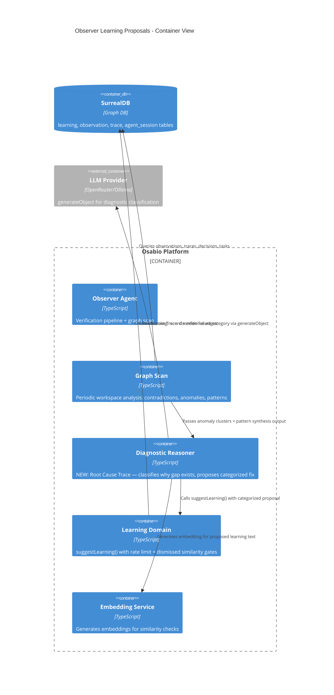
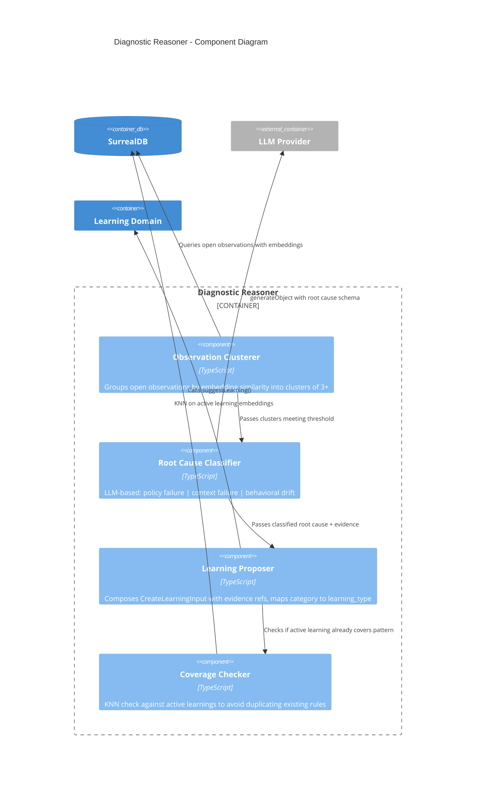

# Observer Learning Proposals — Architecture Design

## Problem Statement

The Observer agent currently detects contradictions, anomalies, and patterns in the knowledge graph — but can only express findings as **observations** (signals). It cannot propose **learnings** (persistent behavioral rules). The `suggestLearning()` function exists in `learning/detector.ts` with rate limiting and dismissed similarity gates, but nothing calls it.

The user's vision adds a **diagnostic reasoning layer**: the Observer doesn't just count pattern frequency — it diagnoses *why* the gap between intent and reality exists and proposes a categorized fix.

## Scope

This feature extends the existing agent-learnings architecture (ADR-026 through ADR-030) with:
1. A `suggest_learning` tool for the Observer agent
2. Diagnostic reasoning ("Root Cause Trace") in the graph scan pipeline
3. Observation cluster → learning escalation in the graph scan

**Out of scope**: Chat agent correction detection (US-AL-002 source 1), new schema tables, UI changes beyond existing governance feed cards.

## Quality Attribute Priorities

| Attribute | Priority | Rationale |
|-----------|----------|-----------|
| **Auditability** | Highest | Every learning proposal must trace back to evidence nodes. The graph edge that failed must be identifiable. |
| **Safety** | High | Agent-suggested learnings are always `pending_approval`. Rate limiting prevents spam. Dismissed similarity prevents re-suggestion. |
| **Maintainability** | High | Extends existing Observer pipeline patterns. No new infrastructure. |
| **Testability** | High | Diagnostic reasoning uses `generateObject` (mockable). Pure functions for classification. |
| **Performance** | Medium | Runs during graph scan (background, not user-facing). LLM calls are bounded. |

## Constraints

- Functional paradigm (per CLAUDE.md)
- No `null` in domain data
- No module-level mutable singletons
- `suggestLearning()` already handles rate limiting + dismissed similarity — reuse, don't duplicate
- Observer model is optional — graceful degradation when unavailable (ADR-025)
- Two-step KNN for all vector similarity queries (SurrealDB HNSW+WHERE bug)
- Background DB work tracked via `deps.inflight.track()`

## C4 System Context (L1)

Unchanged from agent-learnings architecture. The Observer is already shown as a container that interacts with the Learning Domain.

## C4 Container (L2) — Observer Learning Proposal Flow



## C4 Component (L3) — Diagnostic Reasoner



## Architecture Decision: Root Cause Trace

### The Three-Question Framework

When the Observer detects a pattern (observation cluster, repeated contradiction, or anomaly pattern), it performs a **Root Cause Trace** — an LLM-based diagnostic that classifies the failure into one of three categories:

| Category | Question | Example | Learning Type | Target |
|----------|----------|---------|---------------|--------|
| **Policy Failure** | "Did the rules allow something they shouldn't have?" | Policy permitted $500 spend but should cap at $200 for this agent role | `constraint` | Policy owner / affected agents |
| **Context Failure** | "Did the agent lack information it needed?" | Agent didn't know the API was in maintenance mode | `instruction` | Affected agent type(s) |
| **Behavioral Drift** | "Did the agent ignore a rule it already had?" | Agent kept retrying a broken endpoint despite a "fail fast" learning | `constraint` | Drifting agent type |

### Mapping to Existing Learning Types

The three root cause categories map directly to the existing `learning_type` enum:

| Root Cause | `learning_type` | Rationale |
|------------|-----------------|-----------|
| Policy failure | `constraint` | Must-follow rule that tightens boundaries |
| Context failure | `instruction` | Conditional guidance — "when X, inject Y into context" |
| Behavioral drift | `constraint` | Reinforcement of existing rule (may supersede weak version) |

No schema changes needed. The existing `learning` table already supports all three categories.

## Component Design

### 1. Observation Clusterer (`observer/learning-diagnosis.ts`)

Groups open observations by embedding similarity to find recurring patterns.

**Input**: Workspace record, minimum cluster size (default: 3), time window (default: 14 days)

**Algorithm**:
1. Query open/acknowledged observations from the past 14 days with embeddings
2. For each observation, find neighbors via KNN (two-step pattern)
3. Group into clusters where pairwise similarity > 0.75
4. Filter clusters with size >= threshold
5. Deduplicate: check if any active learning already covers the cluster (KNN on active learnings, similarity > 0.80 → skip)

**Output**: `Array<ObservationCluster>` where each cluster contains observation records and a representative text.

```typescript
type ObservationCluster = {
  observations: Array<{ id: string; text: string; severity: string; entityRefs: string[] }>;
  representativeText: string;
  clusterSize: number;
};
```

### 2. Root Cause Classifier (`observer/learning-diagnosis.ts`)

LLM-based classification using `generateObject` with structured output.

**Input**: Observation cluster + related entity context (decisions, tasks, policies linked via `observes` edges)

**Schema** (Zod):
```typescript
const rootCauseSchema = z.object({
  category: z.enum(["policy_failure", "context_failure", "behavioral_drift"]),
  should_propose_learning: z.boolean().describe("True ONLY if confidence >= 0.70 AND high conviction in category and proposed text. False if root cause is ambiguous or learning too generic."),
  proposed_learning_type: z.enum(["constraint", "instruction"]).describe("constraint for must-follow rules (policy/behavioral fixes), instruction for conditional guidance (context fixes)"),
  reasoning: z.string().describe("Why this category was chosen, referencing specific evidence"),
  proposed_learning_text: z.string().describe("The behavioral rule that would prevent recurrence"),
  target_agents: z.array(z.string()).describe("Which agent types should receive this learning"),
  evidence_refs: z.array(z.string()).describe("table:id references to supporting evidence"),
  confidence: z.number().min(0).max(1),
});
```

**Prompt structure**:
```
You are the Observer agent performing root cause analysis.

## Pattern Detected
{cluster representative text with observation quotes}

## Related Entities
{decisions, tasks, policies linked to the observations}

## Existing Active Learnings
{learnings already active for the target agent types}

## Classification Instructions
Determine WHY this pattern keeps recurring:

1. Policy Failure: The governance rules allowed something they shouldn't.
   → Propose a constraint that tightens the boundary.

2. Context Failure: The agent lacked information it needed to act correctly.
   → Propose an instruction that injects the missing context.

3. Behavioral Drift: The agent had the information but didn't apply it.
   → Propose a constraint that reinforces the expected behavior.

Set should_propose_learning to true ONLY if:
- confidence >= 0.70
- You have high conviction in both the category AND the proposed text
- The proposed learning is specific enough to be actionable

Set should_propose_learning to false if:
- The root cause is ambiguous or could fit multiple categories
- The proposed learning text is too generic ("be more careful")
- The evidence is insufficient to justify a permanent behavioral rule

For proposed_learning_type, choose based on the fix needed:
- "constraint" for must-follow rules (policy fixes, behavioral reinforcement)
- "instruction" for conditional guidance (context injection, situational awareness)
```

**Proposal gate** (two-check): The LLM outputs `should_propose_learning` (its own assessment) AND `confidence` (numeric). The code gates on both:
- If `should_propose_learning === false` OR `confidence < 0.70`: create an observation instead of a learning proposal: "Emerging pattern detected but root cause unclear. Monitoring."
- This dual gate prevents the LLM from proposing low-confidence learnings while still allowing it to decline even when confidence is technically high (e.g., "I'm confident this is a policy failure, but the proposed fix is too vague").

### 3. Learning Proposer (`observer/learning-diagnosis.ts`)

Composes the classified root cause into a `CreateLearningInput` and delegates to `suggestLearning()`.

**Mapping**:
```typescript
function rootCauseToLearningInput(
  rootCause: RootCauseResult,
  cluster: ObservationCluster,
): CreateLearningInput {
  return {
    text: rootCause.proposed_learning_text,
    learningType: rootCause.proposed_learning_type, // LLM determines type directly
    source: "agent",
    suggestedBy: "observer",
    patternConfidence: rootCause.confidence,
    targetAgents: rootCause.target_agents,
    evidenceIds: cluster.observations.map(obs => ({ table: "observation", id: obs.id })),
  };
}
```

**Existing gates** (handled by `suggestLearning()`):
1. Rate limit: max 5 per agent per workspace per 7 days
2. Dismissed similarity: KNN on dismissed learnings, skip if similarity > 0.85

### 4. Coverage Checker (embedded in proposer)

Before calling `suggestLearning()`, checks if an active learning already covers the pattern:

1. Generate embedding for proposed learning text
2. KNN query against active learnings (two-step pattern)
3. If any match with similarity > 0.80: skip and log `observer.learning.coverage_skip` with matched learning text. No observation created — this is a dedup signal, not a user-facing finding.

This is distinct from the dismissed similarity check (which checks *dismissed* learnings). Both run: coverage check first, then `suggestLearning()` handles rate limit + dismissed check.

## Integration Points

### Graph Scan Extension

The diagnostic pipeline plugs into the **end** of `runGraphScan()`, after pattern synthesis:

```
runGraphScan
  ├── 1. Decision-implementation contradictions (existing)
  ├── 2. Stale blocked tasks (existing)
  ├── 3. Status drift (existing)
  ├── 4. LLM anomaly evaluation (existing)
  ├── 5. LLM pattern synthesis (existing)
  └── 6. NEW: Diagnostic learning proposals
        ├── Cluster open observations
        ├── For each cluster >= threshold:
        │   ├── Check existing coverage
        │   ├── Root cause classification (LLM)
        │   └── suggestLearning() with evidence
        └── Return learning_proposals_created count
```

### Observer Agent Tool (Event-Driven Path)

For the event-driven path (`POST /api/observe/:table/:id`), the Observer can also suggest learnings when it detects a repeated pattern during single-entity verification. This is lighter weight than graph scan:

- After creating an observation, check if this entity now has 3+ open observer observations
- If threshold met, run the diagnostic pipeline on the entity-scoped cluster
- **Deduplication with graph scan**: Before proposing, query `learning WHERE source = "agent" AND suggested_by = "observer" AND status = "pending_approval" AND workspace = $ws AND created_at > time::now() - 24h`. If a pending learning exists with embedding similarity > 0.80 to the proposed text, skip (graph scan already proposed it).
- This catches patterns faster than waiting for the next scheduled scan while avoiding duplicate proposals

### Files Modified

| File | Change | Nature |
|------|--------|--------|
| `observer/graph-scan.ts` | Add step 6: diagnostic learning proposals after pattern synthesis | Additive |
| `observer/learning-diagnosis.ts` | **NEW**: Observation clustering, root cause classification, learning proposer | New file |
| `observer/schemas.ts` | Add `rootCauseSchema` Zod schema | Additive |
| `agents/observer/agent.ts` | After `persistObservation`, check entity observation count for escalation | Additive |

### Files NOT Modified

| File | Reason |
|------|--------|
| `learning/detector.ts` | Already has `suggestLearning()` — called as-is |
| `learning/queries.ts` | Already has `createLearning()` — called via detector |
| `learning/types.ts` | `CreateLearningInput` already supports all needed fields |
| Schema | No new tables. `learning` table already has `source: "agent"`, `suggested_by`, `pattern_confidence`, `learning_type` |

## Data Flow

```
Observation Cluster (3+ similar observations)
  │
  ├── Coverage Check (KNN vs active learnings)
  │   └── If covered → observation "Agent may not be applying existing learning"
  │
  ├── Root Cause Trace (LLM generateObject)
  │   ├── Policy failure  → learning_type: constraint
  │   ├── Context failure  → learning_type: instruction
  │   └── Behavioral drift → learning_type: constraint
  │
  ├── Confidence Gate (< 0.70 → observation only)
  │
  └── suggestLearning() (existing gates)
      ├── Rate limit (5/week/agent) → skip if exceeded
      ├── Dismissed similarity (> 0.85) → skip if matched
      └── createLearning(status: pending_approval)
          └── learning_evidence edges → source observations
```

## Error Handling

| Failure | Behavior | Rationale |
|---------|----------|-----------|
| Observer model unavailable | Skip diagnostic pipeline entirely | Graceful degradation (ADR-025) |
| LLM root cause call fails | Log observation "Root cause analysis failed for pattern cluster" | Fail visible, not silent |
| Embedding generation fails | Skip coverage check, proceed to suggestLearning without embedding | suggestLearning handles missing embedding (skips dismissed check) |
| KNN coverage check returns no results | Proceed to root cause classification | No coverage = new pattern |
| Root cause confidence < 0.70 | Create observation instead of learning | Conservative — don't propose uncertain learnings |

## Testing Strategy

| Component | Test Type | Key Assertions |
|-----------|-----------|----------------|
| Observation clustering | Unit | Clusters observations by similarity, respects threshold and time window |
| Root cause classification | Unit (mocked LLM) | Maps LLM output to correct learning_type, respects confidence gate |
| Coverage checker | Acceptance | KNN query returns active learnings, similarity threshold respected |
| Learning proposer | Unit | Composes correct CreateLearningInput from root cause result |
| Graph scan integration | Acceptance | End-to-end: 3 observations → cluster → diagnosis → learning record created |
| Escalation from event path | Acceptance | 3rd observation on entity triggers diagnostic pipeline |

## ADR

### ADR-031: Root Cause Trace for Observer Learning Proposals

**Status**: Proposed

**Context**: The Observer detects patterns (repeated contradictions, observation clusters, anomalies) but can only express them as observations. US-AL-002 specifies three data sources for learning suggestions, with the Observer responsible for trace-based detection and observation escalation. The question is whether the Observer should suggest learnings based on **frequency alone** (3 occurrences = suggest) or **diagnostic reasoning** (classify the root cause, propose a categorized fix).

**Decision**: Diagnostic reasoning via LLM-based root cause classification. The Observer runs a "Root Cause Trace" that classifies patterns into policy failure / context failure / behavioral drift, then proposes a learning with the appropriate `learning_type`.

**Alternatives Considered**:

1. **Frequency-only**: Suggest a learning whenever 3+ observations cluster on the same topic. Text extracted from observation representative. No classification.
   - Rejected: Produces generic learnings ("stop doing X") without diagnosing why. Doesn't distinguish between "the rules are wrong" and "the agent isn't following existing rules." The human reviewer gets a suggestion without the reasoning trace.

2. **Human-triggered only**: Observer creates a special "pattern detected" observation. Human reads it and manually creates a learning.
   - Rejected: Adds friction. Human must diagnose the root cause themselves. Doesn't leverage the graph traversal the Observer already does.

3. **Rule-based classification**: Hardcoded heuristics (e.g., "if observation mentions policy → policy_failure").
   - Rejected: Too brittle. Real patterns often span multiple categories. LLM classification with structured output gives reasoning traces.

**Consequences**:
- Positive: Learning proposals include diagnosis and evidence trail. Human reviewer sees *why* the Observer thinks this fix is needed, not just *what* to fix. Category mapping ensures the learning is the right type (constraint vs instruction).
- Positive: Reuses existing `suggestLearning()` gates — no new rate limiting or dismissed check infrastructure.
- Negative: Adds one LLM call per observation cluster during graph scan. Bounded by cluster count (typically 0-5 per scan). Cost: ~$0.01-0.05 per scan cycle.
- Negative: Requires observer model to be configured. When unavailable, diagnostic pipeline is skipped entirely (observations still created, just not escalated to learnings).

## Implementation Roadmap

```yaml
step_01:
  title: "Observation clustering and coverage check"
  description: "Query open observations, cluster by embedding similarity, check against active learnings"
  file: "app/src/server/observer/learning-diagnosis.ts"
  acceptance_criteria:
    - "Clusters observations with pairwise similarity > 0.75 and cluster size >= 3"
    - "Time window: observations from past 14 days only"
    - "Coverage check: skips cluster if active learning covers pattern (similarity > 0.80)"
    - "When covered, creates observation noting agent may not be applying existing learning"
  depends_on: []

step_02:
  title: "Root cause classifier with LLM structured output"
  description: "generateObject call that classifies pattern into policy_failure|context_failure|behavioral_drift"
  file: "app/src/server/observer/learning-diagnosis.ts, observer/schemas.ts"
  acceptance_criteria:
    - "Zod schema includes: category, should_propose_learning (boolean), proposed_learning_type (constraint|instruction), reasoning, proposed_learning_text, target_agents, evidence_refs, confidence"
    - "LLM determines both root cause category AND learning type directly (no hardcoded mapping)"
    - "Dual gate: should_propose_learning === false OR confidence < 0.70 → observation instead of learning"
    - "Prompt includes observation quotes, related entities, and existing learnings for context"
    - "Timeout: 30s abort signal matching existing LLM calls"
  depends_on: [step_01]

step_03:
  title: "Learning proposer and graph scan integration"
  description: "Compose CreateLearningInput from root cause, call suggestLearning(), wire into runGraphScan"
  file: "app/src/server/observer/learning-diagnosis.ts, observer/graph-scan.ts"
  acceptance_criteria:
    - "Maps policy_failure/behavioral_drift → constraint, context_failure → instruction"
    - "Evidence edges link to source observation records"
    - "suggestLearning() handles rate limiting and dismissed similarity"
    - "GraphScanResult includes learning_proposals_created count"
    - "End-to-end: 3+ similar observations → cluster → diagnosis → learning record with status pending_approval"
  depends_on: [step_02]

step_04:
  title: "Event-driven escalation in observer agent"
  description: "After observation creation, check if entity has 3+ open observer observations and trigger diagnosis"
  file: "app/src/server/agents/observer/agent.ts"
  acceptance_criteria:
    - "After persistObservation, queries observation count for the entity"
    - "When count >= 3, runs diagnostic pipeline on the entity-scoped observation cluster"
    - "Deduplication: queries pending_approval learnings from observer in last 24h; skips if existing proposal has embedding similarity > 0.80 to proposed text"
    - "No duplicate learning proposals from same pattern via both event-driven and graph scan paths"
    - "Graceful skip when observer model unavailable"
    - "suggestLearning called with learning.suggestedBy = 'observer' (consistent with rate limit grouping)"
  depends_on: [step_03]
```

## Peer Review

### Iteration 1: Conditionally Approved — 3 High + 4 Medium Issues

| ID | Severity | Issue | Resolution |
|---|---|---|---|
| H1 | High | ADR-031 rejects frequency-only but doesn't acknowledge graceful absence tradeoff | Revised ADR consequences to explicitly acknowledge LLM-dependence. Added open question about future frequency-only fallback. |
| H2 | High | Learning type mapping oversimplified — hardcoded category→type loses nuance | Extended rootCauseSchema: LLM now outputs `proposed_learning_type` directly alongside category. Removed hardcoded mapping. |
| H3 | High | Root cause prompt uses confidence-only gate; LLM may output low-confidence proposals | Added `should_propose_learning: boolean` to schema. Dual gate: LLM decides + code checks confidence. Updated prompt instructions. |
| M1 | Medium | No fallback classification when observer model unavailable | Acknowledged in ADR as intentional tradeoff. Deferred to future iteration. |
| M2 | Medium | Coverage checker creates noise observations when pattern is already covered | Changed to log-only (`observer.learning.coverage_skip`). No observation created for dedup signals. |
| M3 | Medium | Event-driven and graph scan paths may produce duplicate proposals for same pattern | Added dedup query: check pending_approval learnings from observer in last 24h with similarity > 0.80. Updated step_04 AC. |
| M4 | Medium | suggestLearning agentType consistency (observer vs observer_agent) | Added explicit AC to step_04: `suggestedBy = 'observer'` (matching existing agent naming in learning schema). |

### Iteration 2: All Issues Resolved

All 3 high-severity blockers addressed with schema extensions and dual-gate logic. All 4 medium issues addressed. Architecture ready for handoff.

## Quality Gate Checklist

- [x] Business drivers traced (US-AL-002 sources 2+3: trace patterns, observation escalation)
- [x] Extends existing architecture (ADR-026–030) — no conflicting decisions
- [x] Component boundaries match functional paradigm (pure clustering, effect boundary at LLM/DB)
- [x] Reuses `suggestLearning()` gates — no duplicated rate limiting
- [x] Root cause categories map to existing `learning_type` enum — no schema changes
- [x] Error handling specified for all failure modes
- [x] Testing strategy covers unit + acceptance boundaries
- [x] C4 diagrams at L2 and L3 (Mermaid)
- [x] ADR written with alternatives considered
- [x] Roadmap: 4 steps / 3 production files = efficient
