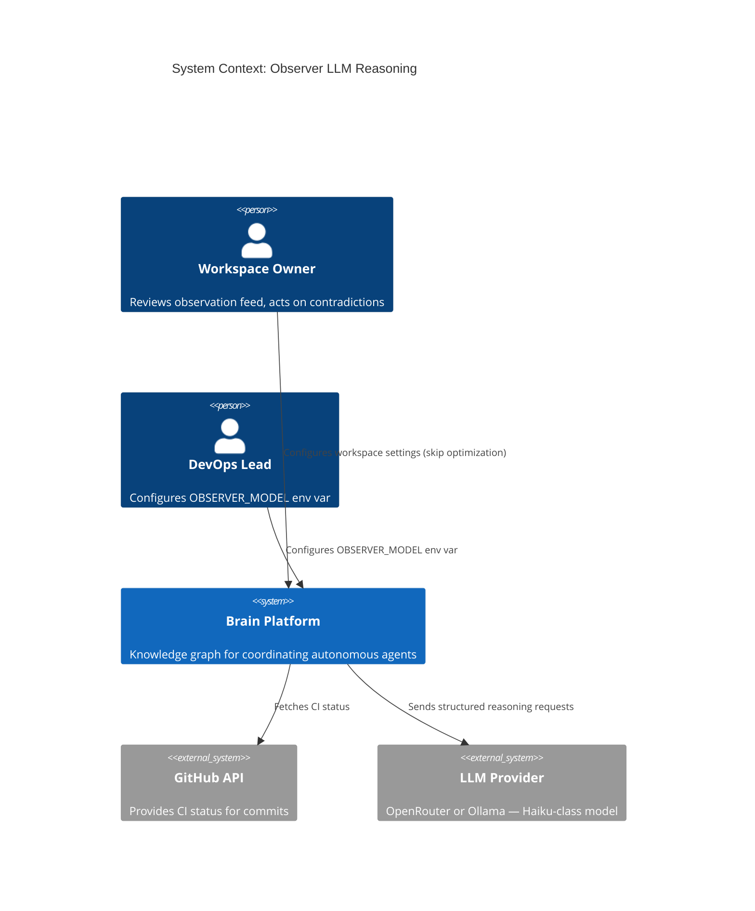
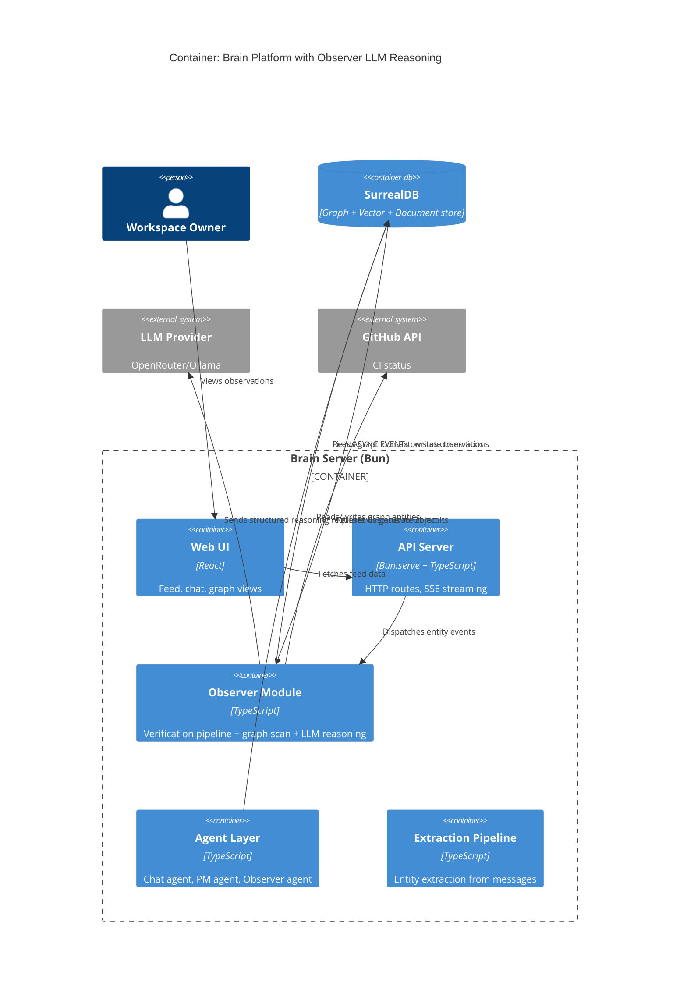
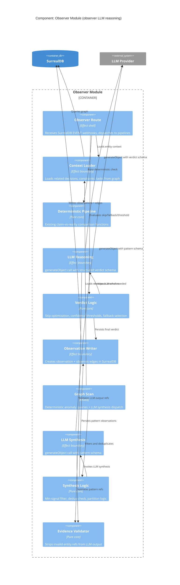

# Architecture Design: Observer LLM Reasoning

## Business Drivers and Quality Attributes

### Business Drivers (Priority Order)

1. **Signal accuracy** -- Catch semantic contradictions that deterministic string matching misses (~80% gap per opportunity scores)
2. **Cost efficiency** -- Haiku-class model with skip optimization; <$5/month per workspace
3. **Reliability** -- Deterministic fallback on every LLM failure path; zero user-facing latency impact
4. **Maintainability** -- Extend existing observer module; no new services or deployment units

### Quality Attributes (ISO 25010)

| Attribute | Priority | Strategy |
|-----------|:--------:|----------|
| Functional suitability | 1 | Structured LLM output validated against graph state |
| Reliability | 2 | Deterministic fallback on all LLM failure paths |
| Performance efficiency | 3 | Async events; 10s timeout; skip optimization |
| Maintainability | 4 | Pure core / effect shell; extend existing modules |
| Security | 5 | No new auth surfaces; workspace-scoped queries |

### Constraints

| Constraint | Impact |
|------------|--------|
| Team size: 1-2 developers | Must extend existing monolith, no new services |
| Functional paradigm | Types-first, composition pipelines, pure core / effect shell |
| Provider-agnostic LLM | Reuse OpenRouter/Ollama abstraction via Vercel AI SDK |
| SurrealDB SCHEMAFULL | All new fields require explicit schema migration |
| Async observer events | LLM reasoning never blocks user requests |

---

## Architecture Overview

The Observer LLM Reasoning feature extends the existing observer module with an optional LLM reasoning step in two pipelines:

1. **Semantic Verification Pipeline** -- Event-triggered. Extends `observer-route.ts` -> `verification-pipeline.ts` with LLM semantic analysis after deterministic checks.
2. **Pattern Synthesis Pipeline** -- Scan-triggered. Extends `graph-scan.ts` with LLM correlation of anomalies into named patterns.

Both pipelines follow the existing pure core / effect shell pattern:
- **Pure core**: Verdict comparison, context assembly, output validation (no IO)
- **Effect shell**: DB queries, LLM calls, observation persistence

The LLM is accessed via Vercel AI SDK `generateObject` with structured Zod schemas, matching the existing extraction/onboarding patterns.

---

## Requirements Traceability

| Requirement | Component | Roadmap Step |
|-------------|-----------|-------------|
| R1 — LLM verification pipeline | llm-reasoning.ts, verdict logic in verification-pipeline.ts | 02-02, 02-03 |
| R2 — Skip optimization | Verdict logic in verification-pipeline.ts | 02-03 |
| R3 — LLM fallback | Verdict logic in verification-pipeline.ts | 02-03 |
| R4 — Pattern synthesis | llm-synthesis.ts, synthesis logic in graph-scan.ts | 03-02 |
| R5 — Structured output | schemas.ts, evidence-validator.ts | 01-03 |
| R6 — Peer review | llm-reasoning.ts (peer review schema), observer-route.ts | 04-01 |
| R7 — Model configuration | config.ts, dependencies.ts, types.ts | 01-01 |
| R8 — Latency (NFR) | AbortSignal.timeout(10_000) in llm-reasoning.ts | 02-02 |
| R9 — Cost controls (NFR) | Skip optimization + Haiku default | 02-03 |
| R10 — Large workspace | Partition logic in graph-scan.ts | 03-02 |

---

## C4 Diagrams

### C4 Level 1: System Context



### C4 Level 2: Container



### C4 Level 3: Component — Observer Module



---

## Data Flow

### Semantic Verification (Event-Triggered)

```
SurrealDB EVENT (task/decision state change)
  |
  v
Observer Route (effect shell)
  |-- Validate table allowlist + UUID
  |-- Load entity record from DB
  |
  v
Context Loader (effect boundary)
  |-- Load related decisions (confirmed/provisional, max 20, by recency)
  |-- Load constraints for project
  |-- Gather external signals (GitHub CI)
  |
  v
Deterministic Pipeline (pure core)
  |-- Run existing claim-vs-reality comparison
  |-- Produce deterministic verdict
  |
  v
Verdict Logic (pure core)
  |-- IF OBSERVER_MODEL unset -> use deterministic verdict
  |-- IF workspace.settings.observer_skip_deterministic (default true) AND deterministic=match AND CI=passing -> skip LLM
  |-- ELSE -> invoke LLM
  |
  v
LLM Reasoning (effect boundary) [conditional]
  |-- generateObject with entity + decisions + signals + deterministic context
  |-- Structured output: { verdict, confidence, reasoning, evidence_refs, contradiction? }
  |-- ON FAILURE -> fall back to deterministic verdict (source: deterministic_fallback)
  |
  v
Evidence Validator (pure core)
  |-- Strip evidence_refs not resolving to real entities in workspace
  |
  v
Verdict Logic (pure core)
  |-- IF confidence < 0.5 -> downgrade to inconclusive, severity=info
  |-- IF verdict=mismatch AND confidence >= 0.5 -> severity=conflict, type=contradiction
  |-- IF verdict=match AND confidence >= 0.5 -> severity=info, verified=true
  |
  v
Observation Writer (effect boundary)
  |-- Create observation with verdict text, severity, source, observation_type
  |-- Create observes edges to entity + contradicted decision(s)
```

### Pattern Synthesis (Scan-Triggered)

```
POST /api/observe/scan/:workspaceId
  |
  v
Graph Scan (existing deterministic queries)
  |-- Query contradictions, stale blockers, status drift
  |-- Produce anomaly list
  |
  v
Synthesis Logic (pure core)
  |-- IF anomalies.length == 0 -> return empty, skip LLM
  |-- IF anomalies.length > 60 -> partition by type, top 20 per type
  |
  v
LLM Synthesis (effect boundary) [conditional]
  |-- generateObject with anomalies + workspace context
  |-- Structured output: Array<{ pattern_name, description, contributing_entities, severity, suggested_action }>
  |-- ON FAILURE -> return anomalies as individual observations (current behavior)
  |
  v
Synthesis Logic (pure core)
  |-- Filter patterns with < 2 contributing entities
  |-- Dedup against existing open pattern observations
  |
  v
Evidence Validator (pure core)
  |-- Strip contributing_entities not resolving to real entities
  |
  v
Observation Writer (effect boundary)
  |-- Create observation per pattern (observation_type=pattern)
  |-- Create observes edges to all contributing entities
```

### Peer Review (Event-Triggered)

```
SurrealDB EVENT observation_peer_review (non-observer observation created)
  |
  v
Observer Route -> handleObservationPeerReview
  |-- Load original observation + its observes targets
  |-- IF no observes edges -> skip LLM (no evidence to evaluate)
  |
  v
LLM Reasoning (effect boundary)
  |-- generateObject with original observation text + linked entity details
  |-- Structured output: { verdict: sound|questionable|unsupported, confidence, reasoning }
  |-- ON FAILURE -> fall back to existing deterministic peer review
  |
  v
Observation Writer (effect boundary)
  |-- Create review observation (observation_type=validation, source=llm)
  |-- Create observes edge to the reviewed observation
```

---

## Integration Points

| Integration | Existing Component | Change Required |
|-------------|-------------------|-----------------|
| SurrealDB EVENTs | 5 events in schema | No change — existing events already trigger observer route |
| Observer route | `observer-route.ts` | Extend handlers to pass LLM model + config to pipelines |
| Verification pipeline | `verification-pipeline.ts` | Add LLM reasoning step after deterministic check |
| Graph scan | `graph-scan.ts` | Add LLM synthesis step after anomaly collection |
| Observer agent | `agents/observer/agent.ts` | Extend to use LLM model when available |
| Runtime config | `runtime/config.ts` | Add `OBSERVER_MODEL` env var |
| Workspace settings | `workspace` table | Add `settings.observer_skip_deterministic` field |
| Runtime dependencies | `runtime/dependencies.ts` | Create observer model client when `OBSERVER_MODEL` set |
| Server dependencies | `runtime/types.ts` | Add optional `observerModel` to `ServerDependencies` |
| Observation schema | `surreal-schema.surql` | Add `confidence` and `evidence_refs` fields |
| Shared contracts | `shared/contracts.ts` | No change — `ObservationType` already includes needed values |

---

## Error Handling Strategy

All error handling follows Brain's fail-fast principle with one exception: LLM failures degrade gracefully to deterministic behavior (per R3).

| Error | Behavior | Rationale |
|-------|----------|-----------|
| LLM timeout (>10s) | Fall back to deterministic verdict, source=deterministic_fallback | Observer must never block on LLM |
| LLM rate limit | Fall back to deterministic verdict | Same as timeout |
| LLM returns invalid JSON | Fall back to deterministic verdict | Structured output reduces this risk |
| LLM hallucinates entity refs | Post-validation strips invalid refs | Observation still created with valid refs |
| LLM confidence < threshold | Downgrade to inconclusive, severity=info | Prevents false conflict alerts |
| OBSERVER_MODEL unset | Deterministic-only mode, zero LLM calls | Graceful opt-out |
| Graph query fails | Throw — fail fast | DB failures are not transient in same way |
| SurrealDB EVENT retry | EVENT RETRY 3 handles full pipeline retry | Existing infrastructure |

---

## Observability

| Metric | Log Key | Purpose |
|--------|---------|---------|
| LLM call count | `observer.llm.call` | Cost tracking per workspace |
| LLM skip count | `observer.llm.skip` | Skip optimization effectiveness |
| LLM latency (ms) | `observer.llm.latency_ms` | p95 monitoring |
| LLM fallback count | `observer.llm.fallback` | Reliability tracking |
| Verdict distribution | `observer.verdict.*` | Signal quality monitoring |
| Pattern count per scan | `observer.scan.patterns` | Synthesis effectiveness |
