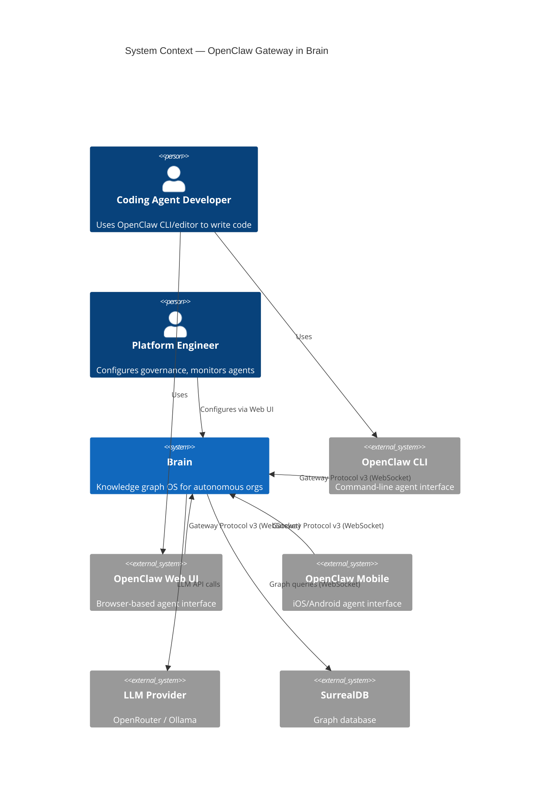
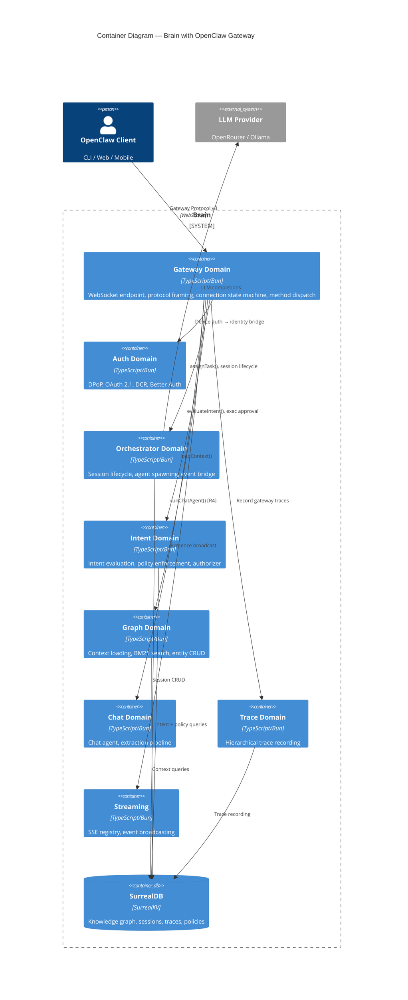

# Architecture Design — openclaw-gateway

## Business Drivers

| Driver | Quality Attribute | Priority |
|--------|-------------------|----------|
| OpenClaw ecosystem as distribution channel (300k+ GitHub stars) | Interoperability | Critical |
| Context injection into agent sessions | Maintainability, Correctness | Critical |
| Policy enforcement before agent execution | Security, Auditability | Critical |
| Real-time streaming of agent work | Performance, Responsiveness | High |
| Zero additional latency vs direct Brain API | Performance | High |
| Native trace recording (not reconstructed) | Auditability | High |
| Zero-config device onboarding | Usability | Medium |

## Constraints

| Constraint | Source | Impact |
|-----------|--------|--------|
| Bun runtime (native WebSocket support) | Existing stack | Enables zero-dependency WS transport |
| SurrealDB SCHEMAFULL mode | Existing schema policy | All new fields must be explicitly defined |
| Ports-and-adapters pattern | Existing codebase convention | Gateway must use dependency injection, not direct imports |
| Functional paradigm | Project CLAUDE.md | Pure functions, composition pipelines, effect boundaries |
| DPoP-bound tokens for auth | Existing auth system | Gateway bridges Ed25519 → DPoP identity model |
| No new SurrealDB tables | Issue #179 schema constraint | Only field additions to existing `agent` table |

## Team Structure

Single team, single codebase. No Conway's Law concerns. Gateway is a new domain module alongside existing domains (chat, orchestrator, proxy, mcp).

## Development Paradigm

Already set to **functional** in project CLAUDE.md. Architecture follows:
- Types-first: algebraic data types for protocol frames, connection state, method dispatch
- Composition pipelines: request → parse → authenticate → dispatch → respond
- Pure core / effect shell: protocol parsing and state transitions are pure; WS I/O lives at boundary
- Effect boundaries: function signatures serve as ports (existing Brain convention)

---

## C4 System Context Diagram



---

## C4 Container Diagram



---

## C4 Component Diagram — Gateway Domain

```mermaid
C4Component
  title Component Diagram — Gateway Domain

  Container_Boundary(gateway, "app/src/server/gateway/") {
    Component(route, "gateway-route.ts", "WebSocket upgrade handler + Bun WS callbacks")
    Component(protocol, "protocol.ts", "Frame types, method registry, parse/serialize")
    Component(connection, "connection.ts", "Per-connection state machine, auth context, seq counter")
    Component(device_auth, "device-auth.ts", "Ed25519 challenge-response, fingerprint computation")
    Component(identity_bridge, "identity-bridge.ts", "Device → Brain identity resolution, DCR auto-registration")
    Component(event_adapter, "event-adapter.ts", "StreamEvent → Gateway Protocol event mapping")
    Component(method_dispatch, "method-dispatch.ts", "Method name → handler routing table")

    Component_Boundary(handlers, "method-handlers/") {
      Component(h_connect, "connect.ts", "Device auth + workspace resolution")
      Component(h_agent, "agent.ts", "Orchestrator assignTask() delegation")
      Component(h_sessions, "sessions.ts", "sessions.list/history/send/patch")
      Component(h_chat, "chat.ts", "Chat agent delegation [R4]")
      Component(h_exec, "exec-approval.ts", "exec.approve/deny/approval.resolve")
      Component(h_device, "device.ts", "Device management [R4]")
      Component(h_models, "models.ts", "Provider model listing")
      Component(h_tools, "tools-catalog.ts", "MCP tool registry query")
      Component(h_config, "config.ts", "Read-only gateway config")
      Component(h_presence, "presence.ts", "Presence query + broadcast")
    }
  }

  Container_Ext(orchestrator, "Orchestrator Domain")
  Container_Ext(intent, "Intent Domain")
  Container_Ext(auth, "Auth Domain")
  Container_Ext(graph, "Graph Domain")

  Rel(route, protocol, "Parse incoming frames")
  Rel(route, connection, "Create/manage connection state")
  Rel(route, method_dispatch, "Dispatch parsed request")
  Rel(method_dispatch, h_connect, "method: connect")
  Rel(method_dispatch, h_agent, "method: agent")
  Rel(method_dispatch, h_sessions, "method: sessions.*")
  Rel(method_dispatch, h_exec, "method: exec.*")
  Rel(method_dispatch, h_models, "method: model.list")
  Rel(method_dispatch, h_tools, "method: tools.catalog")
  Rel(method_dispatch, h_config, "method: config.get")
  Rel(method_dispatch, h_presence, "method: presence")
  Rel(h_connect, device_auth, "Ed25519 verification")
  Rel(h_connect, identity_bridge, "Resolve/create identity")
  Rel(h_agent, orchestrator, "assignTask()")
  Rel(h_agent, event_adapter, "StreamEvent → WS events")
  Rel(h_exec, intent, "evaluateIntent()")
  Rel(identity_bridge, auth, "DCR registration")
  Rel(h_agent, graph, "Load context")
```

---

## Architecture Pattern: Modular Monolith with Ports

Brain is a modular monolith. The gateway is a new domain module that integrates via existing ports — no new architectural patterns introduced.

### Gateway as Thin Protocol Adapter

The gateway domain has **zero business logic**. It is a pure protocol adapter:

```
WebSocket frame (bytes)
  → parse (pure: bytes → GatewayFrame | ParseError)
  → authenticate (effect: verify signature, resolve identity)
  → dispatch (pure: method name → handler function)
  → execute (effect: delegate to existing Brain system)
  → respond (pure: result → GatewayFrame)
  → serialize (pure: GatewayFrame → bytes)
```

Each method handler is a thin delegate (30-60 lines) that:
1. Validates method-specific params
2. Calls an existing Brain system (orchestrator, intent evaluator, graph loader)
3. Maps the result to a Gateway Protocol response frame

### Connection State Machine

In the real protocol, the gateway sends `connect.challenge` immediately on WS open. The client signs the nonce and includes it in the `connect` request. Authentication is a single frame from the client's perspective (connect with device identity), not a two-step connect → connect.verify.

```
                    ┌─────────────┐
         WS open    │ CONNECTING  │  Gateway sends connect.challenge event
        ─────────▶  │             │  with nonce immediately
                    └──────┬──────┘
                           │ connect frame received (includes signed nonce)
                           ▼
                    ┌─────────────┐
                    │AUTHENTICATING│  Verify signature + resolve identity
                    │             │  (synchronous within connect handler)
                    └──────┬──────┘
                           │ verified → hello-ok response sent
                           ▼
                    ┌─────────────┐
                    │   ACTIVE    │  All methods available
                    │             │◀─── reconnect (new challenge issued)
                    └──────┬──────┘
                           │ close / error / timeout
                           ▼
                    ┌─────────────┐
                    │   CLOSED    │  Cleanup resources
                    │             │
                    └─────────────┘
```

State transitions are pure functions: `(currentState, event) → (newState, effects[])`.

### Event Adapter Pattern

The gateway does NOT create new event types. It maps existing `StreamEvent` variants to Gateway Protocol event frames:

```typescript
// Pure mapping function — no side effects
type GatewayEventMapper = (event: StreamEvent, seq: number) => GatewayEventFrame | undefined

// Mapping table:
// AgentTokenEvent      → { stream: "assistant", data: { delta: token } }
// AgentFileChangeEvent → { stream: "lifecycle", data: { phase: "file_change", ... } }
// AgentStatusEvent     → { stream: "lifecycle", data: { phase: status } }
// AgentStallWarning    → { stream: "lifecycle", data: { phase: "stall_warning", ... } }
// ErrorEvent           → { stream: "error", data: { error: message } }
// DoneEvent            → { stream: "lifecycle", data: { phase: "done" } }
```

Events that don't map (e.g., `ExtractionEvent`, `OnboardingStateEvent`) are silently dropped — they're Brain-internal.

### Integration Points

| Brain System | Gateway Integration | Port Used |
|-------------|--------------------|----|
| Orchestrator | `agent` method → `assignTask()` | `SessionDeps` |
| Event Bridge | Subscribe via `subscribeToSessionEvents(sessionId): AsyncIterable<StreamEvent>`. Gateway and SSE registry are independent consumers of the same broadcast. Backpressure: 1000-event buffer per connection, oldest dropped on overflow. | `GatewayDeps.subscribeToSessionEvents` |
| Intent Evaluator | `exec.approve/deny` → `evaluateIntent()` | `EvaluateIntentInput` |
| DPoP Auth | Ed25519 device auth → Brain identity resolution. No ES256 key pair generated; WS channel is the auth boundary. DCR creates OAuth client_id for audit trail only. | `GatewayDeps.lookupIdentity`, `device-auth.ts` |
| Graph Context | `agent` method loads context before orchestrator | `IntentContextInput` → `IntentContext` |
| Trace Recording | Gateway creates trace records for session lifecycle | `trace` table INSERT |
| SSE Registry | Presence broadcast for gateway connections | `SseRegistry.emitWorkspaceEvent` |
| Identity Lookup | Device fingerprint → identity resolution | `LookupIdentity`, `LookupWorkspace` |
| Session Queries | `sessions.list/history/patch` → `agent_session` table queries | `GatewayDeps.listSessions`, `getSessionHistory`, `patchSession` |
| Tool Registry | `tools.catalog` → agent's granted tools from MCP tool registry | `GatewayDeps.listGrantedTools` |

---

## Auth Architecture: Real Gateway Protocol v3 Connect Flow

The real protocol uses a single-roundtrip `connect` with device identity inline — not a separate `connect.verify` step. The gateway sends a `connect.challenge` event immediately on WebSocket open, and the client includes the signed nonce in the `connect` request.

```
OpenClaw Client                        Brain Gateway
───────────────                        ────────────────
  [WebSocket opens]               ──▶
                                  ◀──  { event: "connect.challenge", payload: { nonce, ts } }

  { method: "connect", params: {  ──▶  Verify Ed25519 signature
    minProtocol: 3,                    │
    maxProtocol: 3,                    ├─ Validate auth.token
    client: { id, version, ... },      ├─ Verify device.signature against device.publicKey + nonce
    role: "operator",                  ├─ Known device? → resolve identity
    scopes: ["operator.read", ...],    ├─ New device? → DCR + create identity
    auth: { token: "..." },            │
    device: {                     ◀──  { type: "res", ok: true, payload: {
      id, publicKey, signature,            type: "hello-ok",
      signedAt, nonce                      protocol: 3,
    }                                      policy: { tickIntervalMs: 15000 },
  }}                                       auth: { deviceToken, role, scopes },
                                           workspace, identity  // Brain extensions
                                       }}

  [WebSocket carries identity for session lifetime]
  [No per-request DPoP proofs needed]
```

### Key Difference from Existing DPoP

Brain's current DPoP uses **ES256 (EC P-256)**. OpenClaw devices use **Ed25519**. These are different curves. The gateway accepts Ed25519 for device authentication, then internally creates a Brain identity. The WebSocket connection carries the resolved identity.

### DCR Auto-Registration

For new devices, Brain performs internal DCR:

```typescript
// Internal OAuth client registration (no external HTTP call)
type DeviceRegistration = {
  client_name: `openclaw:device:${fingerprint}`
  grant_types: ['urn:ietf:params:oauth:grant-type:jwt-bearer']
  scope: 'mcp:read mcp:write'
  software_id: `openclaw-gateway:${deviceId}`
  dpop_bound_access_tokens: true
}
```

This creates an identity + agent record + member_of edge — the same artifacts `brain init` creates, but automated.

---

## Schema Changes

Minimal additions to existing `agent` table (per issue #179):

```sql
-- Migration: 00XX_gateway_device_fields.surql
BEGIN TRANSACTION;

ALTER FIELD agent_type ON agent TYPE string
  ASSERT $value IN ['code_agent', 'architect', 'management', 'design_partner',
                     'observer', 'chat_agent', 'mcp', 'openclaw'];

DEFINE FIELD OVERWRITE device_fingerprint ON agent TYPE option<string>;
DEFINE FIELD OVERWRITE device_public_key ON agent TYPE option<string>;
DEFINE FIELD OVERWRITE device_platform ON agent TYPE option<string>;
DEFINE FIELD OVERWRITE device_family ON agent TYPE option<string>;

DEFINE INDEX OVERWRITE agent_device_fingerprint ON agent FIELDS device_fingerprint;

COMMIT TRANSACTION;
```

Zero new tables. Zero new relations. The `agent` table already supports identity linking via `identity_agent` edge.

---

## Error Handling Strategy

Gateway errors follow Brain's fail-fast convention:

| Error Type | Gateway Behavior |
|-----------|-----------------|
| Malformed frame (missing type/id) | Response frame with `code: "invalid_frame"` — connection stays open |
| Unknown method | Response frame with `code: "unknown_method"` — connection stays open |
| Recognized but unimplemented method | Response frame with `code: "method_not_supported"` — connection stays open |
| Auth failure (bad signature, expired nonce) | Response frame with protocol-specific `DEVICE_AUTH_*` code — connection closed |
| Auth token mismatch | Response frame with `code: "AUTH_TOKEN_MISMATCH"` — connection closed |
| No workspace membership | Response frame with `code: "no_membership"` — connection closed |
| Policy violation | Response frame with policy detail — connection stays open |
| Budget exceeded | Response frame with spend detail — connection stays open |
| Internal error | Response frame with `code: "internal_error"` — connection stays open |
| WS transport error | Connection closed, session continues server-side |

Protocol errors (bad frames, unknown methods) keep the connection open. Auth errors close it. Business errors (policy, budget) are method-level responses.

---

## Observability

Gateway spans follow Brain's wide-event pattern:

| Span | Attributes |
|------|-----------|
| `brain.gateway.connection` | `gateway.connection_id`, `gateway.device_fingerprint`, `gateway.identity_id`, `gateway.workspace_id`, `gateway.state` |
| `brain.gateway.method` | `gateway.method`, `gateway.request_id`, `gateway.duration_ms` |
| `brain.gateway.auth` | `gateway.auth_result`, `gateway.device_known`, `gateway.dcr_triggered` |

Per-method attributes follow the existing `chat.*`, `mcp.*` naming convention → `gateway.*`.
