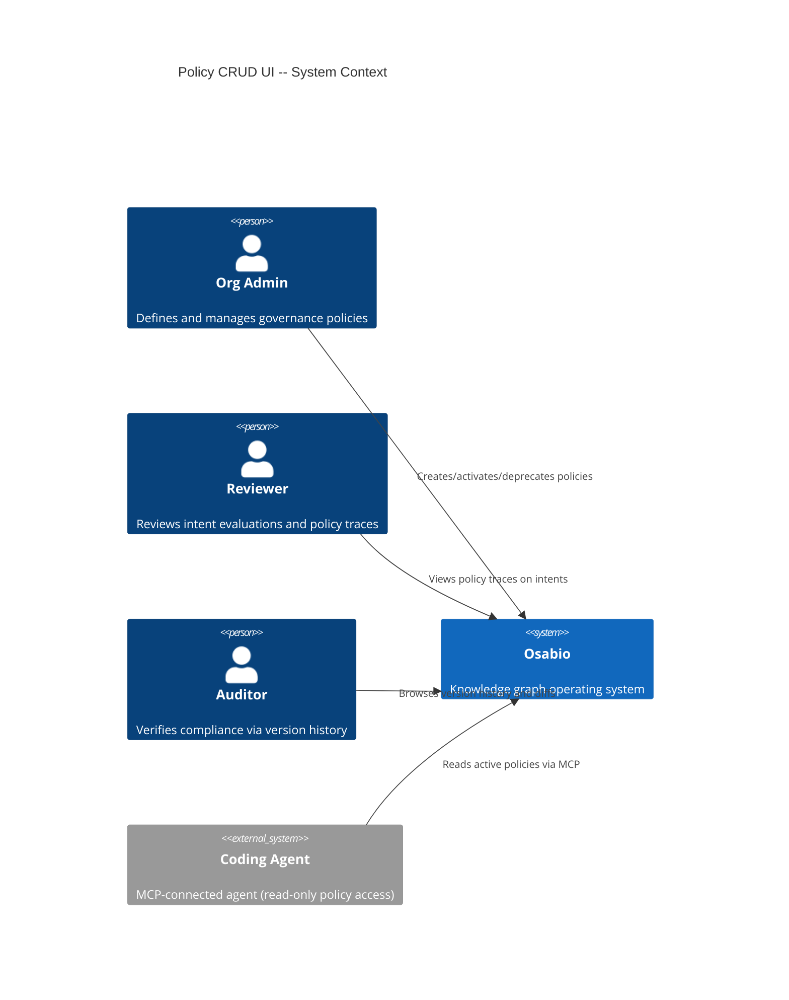
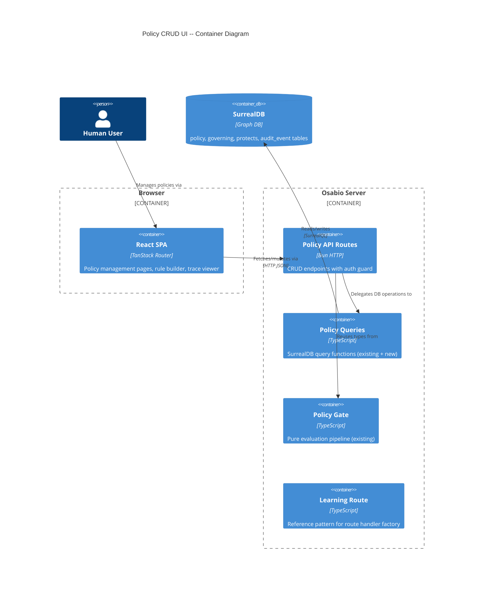
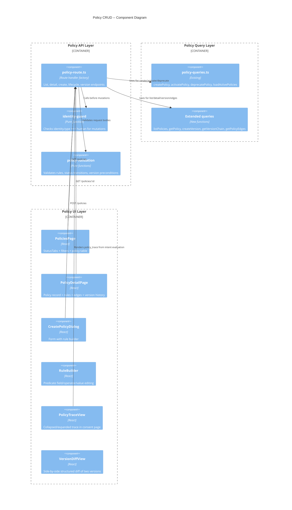

# Policy CRUD UI -- Architecture Design

## System Context

Policy CRUD UI exposes the existing policy infrastructure (SurrealDB schema, evaluation pipeline, graph relations, TypeScript types) through HTTP API endpoints and a React management UI. No new infrastructure or external dependencies required.

### Capabilities
- List, create, view, activate, deprecate, and version policies
- Rule builder with structured predicate editing
- Policy trace rendering in intent consent view
- Version history with structured diff
- Human-only mutation enforcement (agents read-only)

## C4 System Context (L1)



## C4 Container (L2)



## C4 Component (L3) -- Policy CRUD Subsystem



## Data Flow: Create and Activate Policy

```
User fills form + rule builder
  |
  v
POST /api/workspaces/:wsId/policies
  |-> identity guard (human check)
  |-> validate rules (>=1 rule, valid predicates)
  |-> createPolicy() (status: draft, version: 1)
  |-> createPolicyAuditEvent("policy_created")
  |-> 201 { policyId }

User clicks "Activate" on draft policy
  |
  v
PATCH /api/workspaces/:wsId/policies/:id/activate
  |-> identity guard
  |-> validate preconditions (draft|testing, >=1 rule)
  |-> activatePolicy() (atomic: status + governing + protects edges)
  |-> createPolicyAuditEvent("policy_activated")
  |-> 200 { status: "active" }
```

## Data Flow: Version Creation

```
User clicks "Create New Version" on active policy
  |
  v
POST /api/workspaces/:wsId/policies/:id/versions
  |-> identity guard
  |-> validate preconditions (active status)
  |-> read current policy record
  |-> createPolicy() with:
  |     title, description, selector, rules copied
  |     version: current.version + 1
  |     status: draft
  |     supersedes: current policy RecordId
  |-> createPolicyAuditEvent("policy_created")
  |-> 201 { policyId, version }

When new version activated:
  |-> activatePolicy() on new version
  |-> old version status -> "superseded" (atomic in same transaction)
```

## Data Flow: Policy Trace Rendering

```
Consent page loads intent with evaluation
  |-> intent.evaluation.policy_trace[] already persisted
  |-> Render PolicyTraceView component:
       collapsed: "N rules evaluated, M matched"
       expanded: table of rule_id, effect, matched, priority
       each row links to policy detail: /policies/:policyId
```

## Integration Points

| Integration | Direction | Mechanism | Notes |
|---|---|---|---|
| SurrealDB policy table | Read/Write | Existing queries + new | No schema changes |
| governing/protects relations | Write | activatePolicy() existing | Edge creation on activate |
| audit_event table | Write | createPolicyAuditEvent() existing | policy_created/activated/deprecated events |
| Identity table | Read | identity.type check | Authorization guard |
| Intent evaluation | Read | policy_trace on intent record | Trace rendering (read-only) |
| WorkspaceSidebar | Write | Add "Policies" nav link | UI integration |
| TanStack Router | Write | Add /policies routes | UI routing |

## Authorization Model

```
Identity Resolution (follows chat-ingress.ts pattern):
  1. Better Auth session: deps.auth.api.getSession({ headers: request.headers })
  2. Person record: new RecordId("person", session.user.id)
  3. Identity lookup: SELECT VALUE in FROM identity_person WHERE out = $person LIMIT 1
  4. Identity type check: SELECT type FROM $identity

Identity Types:
  human  -> full CRUD (create, activate, deprecate, version)
  agent  -> read-only (list, detail, version history)
  system -> read-only

Enforcement:
  Pure guard function: (identityType: string) => boolean
  Applied at route handler level before any mutation
  Returns 403 { error: "agents cannot modify policies" }

  Read endpoints (GET) -> no guard, all identity types
  Mutation endpoints (POST, PATCH) -> guard required

Identity resolution runs once per request in the route handler.
The resolved identity record is passed to both the guard and the query functions
(createPolicy needs created_by, activatePolicy needs creatorId).
```

## Quality Attribute Strategies

### Performance (NFR-1)
- List endpoint uses existing `policy_workspace_status` composite index
- Detail endpoint: single query for policy + separate query for edges (2 queries max)
- Version chain: recursive graph traversal via `supersedes` field (bounded by version count)
- Target: list <500ms for 100 policies, detail <1s with version chain

### Security (NFR-2)
- Session auth via existing Better Auth middleware
- Identity type check (pure guard function) on all mutations
- No raw DB errors exposed -- map to user-facing messages
- Workspace scoping on all queries

### Accessibility (NFR-3)
- Follow existing UI patterns (Learning Library CSS conventions)
- Keyboard-navigable tables and forms
- ARIA labels on interactive elements
- Contrast ratios per WCAG 2.2 AA

### Data Integrity (NFR-4)
- Versions are immutable once created (no UPDATE on content fields)
- Supersedes chain validated on version creation
- Lifecycle transitions enforced by status machine (pure function)
- Audit events created atomically with state changes

### Maintainability
- Route handler factory pattern (matches learning-route.ts)
- Pure validation/guard functions (testable without DB)
- Shared types in shared/contracts.ts for client/server
- Rule builder reuses existing RulePredicate/RuleCondition types

## Status Transition Machine

```
draft -----> active       (requires >=1 rule)
draft -----> testing      (no preconditions beyond draft status)
testing ---> active       (requires >=1 rule)
active ----> deprecated   (removes governing/protects edges)
active ----> superseded   (triggered when new version activated)
```

No backward transitions. No transitions from deprecated or superseded.
