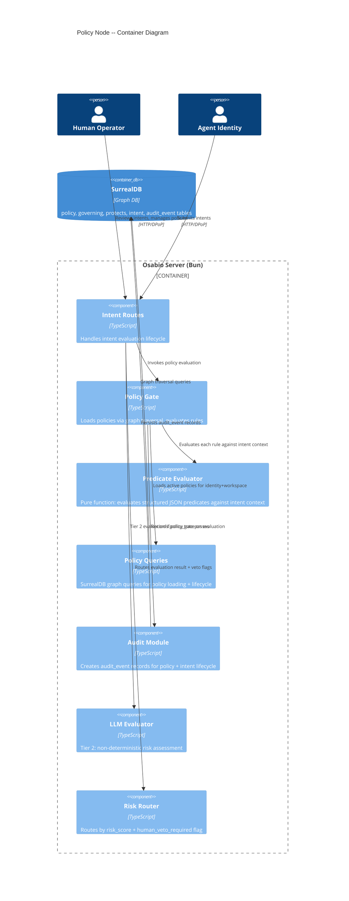
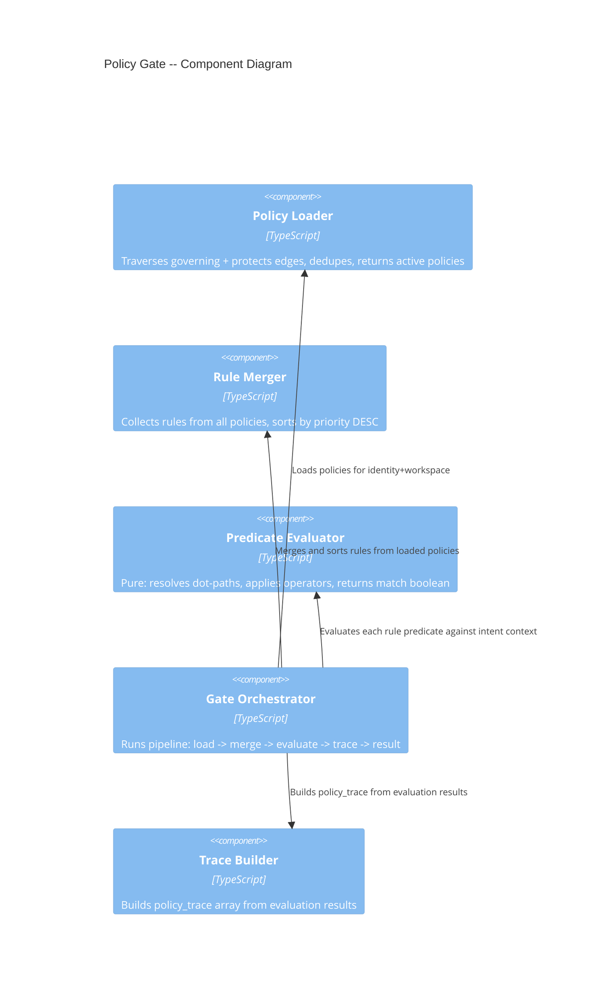

# Policy Node -- Architecture Design

## System Context

The policy node extends the existing intent authorization pipeline. Policies are persistent SurrealDB records connected to identities and workspaces via graph edges. The authorizer traverses the policy graph at intent evaluation time, applying structured predicate rules deterministically before the LLM tier runs.

### C4 System Context (L1)

```mermaid
C4Context
  title Policy Node -- System Context

  Person(human, "Human Operator", "Creates policies, reviews vetoed intents")
  Person(agent, "Agent Identity", "Submits intents, reads policies")

  System(osabio, "Osabio Server", "Modular monolith: intent auth, policy evaluation, audit trail")

  SystemDb(surreal, "SurrealDB", "Graph database: policies, intents, identities, audit events")

  Rel(human, osabio, "Creates/activates policies, reviews intents", "HTTP/DPoP")
  Rel(agent, osabio, "Submits intents for authorization", "HTTP/DPoP")
  Rel(brain, surreal, "Reads/writes policy graph, intents, audit events", "SurrealDB SDK")
```

### C4 Container (L2)



### C4 Component (L3) -- Policy Gate Subsystem



## Evaluation Pipeline (Updated)

The existing two-tier pipeline (ADR-013) is extended with graph-backed policy loading:

```
Intent submitted (status: pending_auth)
  |
  v
[1] Policy Loader -- graph traversal: identity->governing->policy + workspace<-protects<-policy
  |
  v
[2] Rule Merger -- dedupe policies, collect rules, sort by priority DESC
  |
  v
[3] Predicate Evaluator (pure) -- for each rule: resolve dot-paths, apply operator
  |                                first deny match -> REJECT (short-circuit)
  |                                human_veto_required on any policy -> flag
  |
  v
[4] Trace Builder -- record { policy_id, policy_version, rule_id, effect, matched, priority }
  |
  v
[5] Policy Gate Result:
     - REJECT (deny matched) -> skip LLM, return rejection with trace
     - PASS + veto_forced -> continue to LLM, force veto_window route
     - PASS -> continue to LLM tier
     - warnings[] -> missing-field warnings emitted as observations (AC-11)
  |
  v
[6] LLM Evaluator (Tier 2, unchanged from ADR-013)
  |
  v
[7] Risk Router (extended: respects human_veto_required flag)
  |
  v
[8] Status update + audit_event (includes policy_trace in payload)
```

## Integration Points

### Modified Files

| File | Change |
|------|--------|
| `app/src/server/intent/authorizer.ts` | Replace `WorkspacePolicy` type and `checkPolicyGate()` with graph-backed policy gate |
| `app/src/server/intent/intent-routes.ts` | Pass identity + workspace RecordIds instead of `policy: {}` |
| `app/src/server/intent/types.ts` | Add `PolicyTraceEntry` type, extend `EvaluationResult` with `policy_trace` |
| `app/src/server/intent/risk-router.ts` | Accept `human_veto_required` flag to force veto_window |
| `app/src/server/oauth/audit.ts` | Add policy-related `AuditEventType` values |
| `schema/surreal-schema.surql` | Add `policy`, `governing`, `protects` tables; extend `audit_event` ASSERT; add `policy_trace` fields on `intent.evaluation` |

### New Files

| File | Purpose |
|------|---------|
| `app/src/server/policy/types.ts` | Algebraic data types: PolicyRecord, RulePredicate, RuleCondition, PolicyGateResult, PolicyTraceEntry |
| `app/src/server/policy/predicate-evaluator.ts` | Pure function: evaluates structured predicates against intent context |
| `app/src/server/policy/policy-queries.ts` | SurrealDB graph queries: load active policies, lifecycle transitions |
| `app/src/server/policy/policy-gate.ts` | Composition pipeline: load -> merge -> evaluate -> trace -> result |
| `schema/migrations/0024_policy_node.surql` | Migration: policy table, relations, audit_event extension, intent.evaluation.policy_trace |

### Unchanged Components

- `status-machine.ts` -- no new intent status states needed
- `risk-router.ts` -- signature change only (accept veto flag), logic unchanged
- LLM evaluator -- receives same intent shape, unaware of policy layer
- VetoManager -- unchanged, still manages veto window timers

## Quality Attribute Strategies

| Attribute | Strategy |
|-----------|----------|
| **Auditability** | Every policy state transition -> audit_event; every intent evaluation includes policy_trace; immutable policy versions |
| **Testability** | Predicate evaluator is pure (no DB, no effects); policy gate composes pure functions; graph queries isolated in adapter |
| **Maintainability** | New `policy/` module follows existing `intent/` patterns; types-first design; composition pipelines |
| **Performance** | Graph traversal indexed on policy.status + relation edges; short-circuit on first deny; <50ms for <=10 policies |
| **Reliability** | Empty policy set = pass (backward compat); malformed predicates fail-safe (non-matching, not crashing) |
| **Security** | Structured predicates only (no eval); CRUD restricted to human identities; agents read-only |
| **Observability** | `logInfo` for policy gate timing (load, evaluate, total); policy count + rule count in log context; evaluation latency measurable via existing request logging |

## Deployment Architecture

No changes to deployment. The policy node is a module addition within the existing Bun monolith. Schema changes applied via versioned migration (`bun migrate`). No new services, no new infrastructure.
