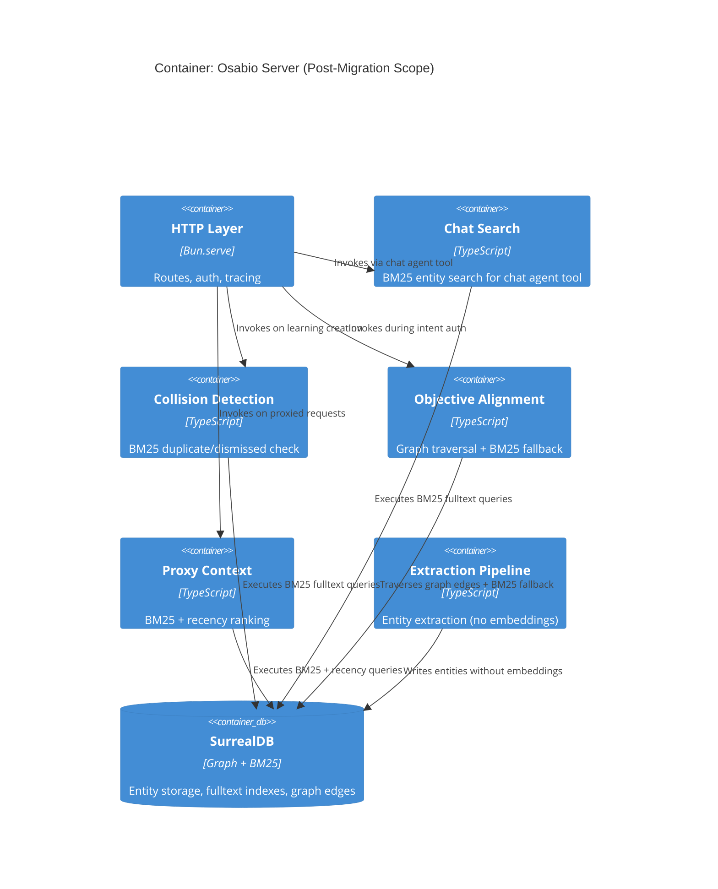
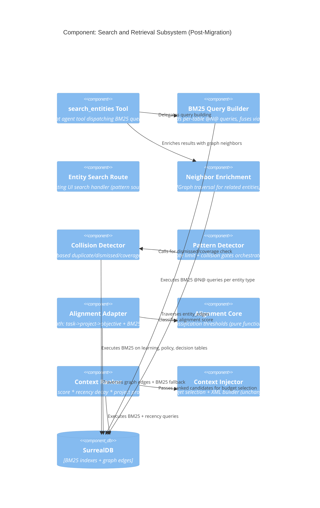

# Architecture Design: Remove Embeddings from Osabio Knowledge Graph

**Feature**: Cross-cutting embedding removal
**Paradigm**: Functional
**Status**: Accepted
**Date**: 2026-03-19
**Traces**: US-EMB-001, US-EMB-002, US-EMB-003, US-EMB-004, US-EMB-005

---

## 1. System Context and Capabilities

Osabio is a knowledge graph (SurrealDB) coordinating AI agents. Four use cases currently consume vector embeddings (1536-dim, HNSW indexes, external API). This design replaces all four with BM25 fulltext search and graph traversal, then removes the embedding infrastructure entirely.

**Quality attribute priorities** (from DISCUSS wave): reliability > latency > maintainability > testability

**Current state**: External embedding API (60s timeout) -> 1536-dim vector -> HNSW KNN (with SurrealDB v3.0 bug workaround) -> cosine similarity in JS memory

**Target state**: BM25 query (in-database, <200ms) + graph traversal (deterministic) -> scored/linked results. Zero external API dependency for search, alignment, or collision detection.

---

## 2. C4 System Context (L1)

### Before Migration

```mermaid
C4Context
    title System Context: Osabio Knowledge Graph (Current -- With Embeddings)

    Person(user, "Workspace User", "Interacts via chat UI")
    Person(agent, "Coding Agent", "Interacts via LLM proxy")

    System(osabio, "Osabio", "Knowledge graph coordinating AI agents")

    System_Ext(llm, "LLM Provider", "Chat, extraction, scoring")
    System_Ext(embed_api, "Embedding API", "Vector generation for search/alignment/collision")
    System_Ext(surrealdb, "SurrealDB", "Graph DB with HNSW indexes")

    Rel(user, osabio, "Sends messages")
    Rel(agent, osabio, "Proxied requests")
    Rel(brain, llm, "Generates responses")
    Rel(brain, embed_api, "Generates 1536-dim embeddings")
    Rel(brain, surrealdb, "KNN + graph queries")
```

### After Migration

```mermaid
C4Context
    title System Context: Osabio Knowledge Graph (Target -- No Embeddings)

    Person(user, "Workspace User", "Interacts via chat UI")
    Person(agent, "Coding Agent", "Interacts via LLM proxy")

    System(osabio, "Osabio", "Knowledge graph coordinating AI agents")

    System_Ext(llm, "LLM Provider", "Chat, extraction, scoring")
    System_Ext(surrealdb, "SurrealDB", "Graph DB with BM25 fulltext indexes")

    Rel(user, osabio, "Sends messages")
    Rel(agent, osabio, "Proxied requests")
    Rel(brain, llm, "Generates responses")
    Rel(brain, surrealdb, "BM25 + graph traversal queries")
```

**Key difference**: Embedding API dependency removed. LLM Provider used only for chat/extraction/scoring -- not for search, alignment, or collision detection.

---

## 3. C4 Container (L2)



---

## 4. C4 Component (L3) -- Search and Retrieval Subsystem



---

## 5. Component Architecture

### 5.1 Use Case Mapping

| Use Case | Before | After | Confidence |
|----------|--------|-------|------------|
| Entity search (chat agent) | Embedding API + in-JS cosine on 120+ candidates | BM25 `@N@` queries (in-database) | High |
| Collision detection (learnings) | Embedding API + KNN + brute-force fallback | BM25 on learning/policy/decision tables | High |
| Objective-intent alignment | Embedding API + KNN on objectives | Graph edge traversal + BM25 fallback | High |
| Proxy context ranking | Embedding API + cosine * weight | BM25 score * recency decay | Medium |

### 5.2 Chat Agent BM25 Search (US-EMB-001)

**Affected modules**: `chat/tools/search-entities.ts`, `chat/tools/suggest-work-items.ts`, `chat/context.ts`, `mcp/mcp-route.ts`, `mcp/intent-context.ts`, `graph/queries.ts`, `chat/tools/types.ts`

**Current flow**:
1. `createEmbeddingVector()` -> external API call (60s timeout)
2. `listScopedEntityCandidates()` -> loads 120+ entities with full embedding arrays
3. `cosineSimilarity()` in JS for each candidate -> sort -> top K

**Target flow**:
1. `buildBm25SearchSQL()` -> build BM25 SQL per entity type
2. Single SurrealDB round-trip with `@N@` operator -> `search::score()` per table
3. Reciprocal Rank Fusion (RRF, k=60) merges per-table ranked lists by rank position (ADR-063)
4. Enrich with `listEntityNeighbors()` (unchanged)

**Callers to migrate** (all share same BM25 query pattern):
- `search_entities` tool (`chat/tools/search-entities.ts`)
- `suggest_work_items` tool (`chat/tools/suggest-work-items.ts`)
- `buildChatContext` (`chat/context.ts`)
- MCP context resolution (`mcp/mcp-route.ts`)
- MCP intent context (`mcp/intent-context.ts`)

**Constraint**: `@N@` uses SDK bound `$query` parameters (SurrealDB 3.0.4+). Cross-table results merged via RRF fusion (ADR-063).

### 5.3 Learning Collision Detection (US-EMB-002)

**Affected modules**: `learning/detector.ts`, `learning/learning-route.ts`, `observer/learning-diagnosis.ts`

**Current flow**:
1. `createEmbeddingVector()` -> external API call
2. KNN on learning table (two-step for HNSW+WHERE bug) -> cosine threshold
3. Brute-force fallback loading ALL dismissed learnings into memory
4. Cross-form cosine at 0.50 threshold (barely above random)

**Target flow**:
1. BM25 search on `learning.text` with status filter
2. Score threshold check (BM25 thresholds differ from cosine -- calibrate via acceptance tests)
3. No fallback needed (BM25 is deterministic, index-complete)

**New migration required**: `idx_learning_text_fulltext` on `learning.text`, `idx_policy_description_fulltext` on `policy.description`

**Signature changes**: `suggestLearning` loses `embedding` parameter. `checkDismissedSimilarity` takes `proposedText` instead of `proposedEmbedding`.

### 5.4 Graph-Based Objective-Intent Alignment (US-EMB-003)

**Affected modules**: `objective/alignment-adapter.ts`, `intent/authorizer.ts`

**Primary path** (graph traversal -- deterministic):
1. Receive resolved entity reference (task or project RecordId) from intent resolution pipeline
2. Graph traversal: `task -> belongs_to -> project <- has_objective <- objective`
3. Return linked active objectives with score = 1.0

**Fallback path** (BM25 -- for unresolved intents):
1. BM25 search on `objective.title` (index exists from migration 0034)
2. Return candidates with normalized BM25 scores
3. Classify as "ambiguous" (BM25 match is weaker signal than graph path)

**Port signature change**: `FindAlignedObjectives` receives entity reference + description text instead of embedding vector. `alignment_method` gains `"graph"` value alongside existing `"embedding"` (renamed) and `"manual"`.

**Supersedes ADR-032**: Graph traversal preferred for typed, linked data; embedding similarity inappropriate for structured graphs where explicit edges exist.

### 5.5 Proxy Context Injection (US-EMB-004)

**Affected modules**: `proxy/context-injector.ts`, proxy route handler

**Current flow**:
1. Generate embedding for proxied message -> external API call
2. `rankCandidates()` computes cosine * weight for each candidate
3. `classifyBySimilarity()` splits into urgent-context / context-update at 0.7/0.4 thresholds
4. `createSearchRecentChanges()` runs 3 parallel KNN queries

**Target flow**:
1. BM25 search on decision/learning/observation tables with workspace filter
2. `rankCandidates()` uses BM25 score * recency decay * project proximity boost
3. `classifyByRecency()` replaces similarity classification: < 30min = urgent, < 24h = update
4. Recent changes: time-based query (entities updated since last request) + BM25 relevance

**Unchanged modules**: `estimateTokenCount()`, `selectWithinBudget()`, `buildOsabioContextXml()`, `injectOsabioContext()`, `injectRecentChanges()`, `buildRecentChangesXml()` -- pure functions operating on scored/classified candidates.

**Recency decay**: `finalScore = bm25Score * decayFactor(updatedAt)` where decay = 1.0 for < 1h, 0.8 for < 24h, 0.5 for < 7d, 0.3 for older. Project proximity boost: * 1.5 if same project.

---

## 6. Technology Stack

### Removed

| Technology | Was Used For | License |
|-----------|-------------|---------|
| OpenRouter/Ollama `embed()` | Vector embedding generation | Apache 2.0 / MIT |
| HNSW indexes (18 total) | Approximate nearest neighbor | N/A (SurrealDB built-in) |
| `ai` SDK `embed()` function | Embedding API calls | Apache 2.0 |

### Leveraged (Existing, Now Primary)

| Technology | Current Use | Expanded Use | License |
|-----------|------------|--------------|---------|
| SurrealDB BM25 | UI entity search only | All search, collision, proxy context, alignment fallback | BSL 1.1 |
| SurrealDB `entity_search` analyzer | UI search tokenization | All fulltext search | BSL 1.1 |
| SurrealDB graph traversal | Entity neighbors, project status | Objective-intent alignment (primary path) | BSL 1.1 |

### New BM25 Indexes Required

| Index | Table.Field | Migration |
|-------|-------------|-----------|
| `idx_learning_text_fulltext` | `learning.text` | 0062 |
| `idx_policy_description_fulltext` | `policy.description` | 0062 |

### Existing BM25 Indexes (10 total, from migrations 0002/0008/0034)

`task.title`, `decision.summary`, `question.text`, `observation.text`, `feature.name`, `project.name`, `person.name`, `message.text`, `suggestion.text`, `objective.title`

### Configuration Removed

| Item | Location |
|------|----------|
| `EMBEDDING_MODEL` env var | `runtime/config.ts` |
| `EMBEDDING_DIMENSION` env var | `runtime/config.ts` |
| `embeddingModelId` field | `ServerConfig` |
| `embeddingDimension` field | `ServerConfig` |
| `embeddingModel` field | `ServerDependencies`, `ChatToolDeps` |

### SurrealDB BM25 Constraints (from CLAUDE.md)

1. ~~`@N@` operator does not work with SDK bound parameters~~ — Fixed in SurrealDB 3.0.4+, now uses `$query` bound params
2. `search::score()` does not work inside `DEFINE FUNCTION` -- queries must run from app layer
3. `BM25` without explicit parameters returns score=0 -- always use `BM25(1.2, 0.75)`

---

## 7. Integration Patterns

### BM25 Query Pattern (shared by all use cases)

All BM25 queries follow the pattern proven in `bm25-search.ts`:
1. Per-table `SELECT ... WHERE field @1@ $query AND workspace = $ws ORDER BY score DESC LIMIT $limit`
2. SDK bound parameters (`$query`) for all search terms (SurrealDB 3.0.4+)
3. Reciprocal Rank Fusion (RRF, k=60) merges per-table ranked lists by rank position — eliminates cross-table BM25 score incomparability (ADR-063)

### Graph Traversal Pattern (alignment)

```
task -> belongs_to -> project <- has_objective <- objective
```

Uses existing edge tables (`belongs_to`, `has_objective`). No new graph edges required.

### Score Normalization

BM25 scores are unbounded (not 0-1 like cosine). RRF (ADR-063) handles cross-table normalization for entity search and UI search. Other components:
- Alignment fallback: use rank position or min-max within result set
- Context ranking: relative ordering sufficient (budget selection is positional)
- Collision detection: BM25 score thresholds calibrated via acceptance tests (distinct from cosine thresholds)

---

## 8. Quality Attribute Strategies

### Reliability
- **Eliminates**: External embedding API dependency (60s timeout, CI failures)
- **Deterministic**: BM25 and graph traversal produce reproducible results (no model variance)
- **No fallbacks needed**: BM25 is index-complete (unlike HNSW which required brute-force fallback)

### Latency
- **Search**: <200ms (BM25 in-database) vs 1-60s (embedding API + in-JS cosine)
- **Alignment**: <50ms (graph traversal) vs 1-60s (embedding API + KNN)
- **Writes**: Faster (no HNSW index update per entity)

### Maintainability
- **Removes**: ~200 lines embedding infrastructure, 18 HNSW index definitions, 24 file imports
- **Simpler**: No two-step KNN workaround, no brute-force fallbacks, no cross-form cosine comparisons
- **Config**: 2 fewer env vars, narrower `ServerDependencies`/`ChatToolDeps`

### Testability
- **CI stability**: No embedding timeout failures
- **Deterministic**: BM25 results are repeatable without external API
- **No model config**: Tests don't require `EMBEDDING_MODEL` / `EMBEDDING_DIMENSION`

---

## 9. Migration Strategy

### Phase Dependency Graph

```
Phase 1A (Search) ----+
Phase 1B (Collision) --+--> Phase 2 (Proxy Context) --> Phase 3 (Cleanup)
Phase 1C (Alignment) --+
```

- Phase 1 stories (A/B/C) can execute in parallel
- Phase 2 depends on Phase 1 (BM25 pattern proven)
- Phase 3 depends on ALL previous stories

### Phase 1 Migration (0062)

New BM25 indexes + application code changes for search, collision, alignment. Embedding infrastructure remains functional (no breaking intermediate state).

### Phase 3 Migration (0063)

Single migration script:
- Drop 18 HNSW indexes
- Remove embedding fields from 18 tables
- Clean embedding data from existing records
- Application code: delete `embeddings.ts`, remove config, update 24 importing files

### Phase 3 Blocker: Observation Clustering

`clusterObservationsBySimilarity` in `learning-diagnosis.ts` uses `cosineSimilarity` on pre-loaded observation embeddings. Must be replaced before Phase 3 can drop embedding fields.

**Architectural constraint**: Replacement must keep the diagnostic pipeline's IO boundary pattern -- pure clustering function receiving a similarity measure, not performing DB queries directly.

---

## 10. Risk Assessment

| Risk | Probability | Impact | Mitigation |
|------|-------------|--------|------------|
| BM25 misses semantically related entities with no shared vocabulary | Medium | Low | Domain vocabulary in structured KG is consistent. Stemmer handles morphological variants. |
| Proxy context quality degrades without semantic ranking | Low | Medium | Recency + project proximity are strong signals. Instrument and compare before/after. |
| BM25 threshold calibration for collision detection | Medium | Low | Calibrate via acceptance tests with known duplicate/non-duplicate pairs. |
| Graph alignment misses free-form intents | Low | Low | BM25 fallback covers unresolved intents. Intent resolution handles most cases. |
| Observation clustering breaks without embeddings | High | Medium | Must replace before Phase 3. Options: BM25 pairwise text similarity or LLM batch classification. |

### Conditions for Revisiting

Re-introduce embeddings if:
1. Cross-workspace search becomes a product requirement
2. `search.result_count == 0` rates exceed 15% post-migration
3. Data volume exceeds ~10,000 entities per workspace
4. ~~SurrealDB adds native hybrid search (RRF fusion)~~ — Addressed by ADR-063: app-layer RRF fusion

---

## 11. Deployment Architecture

No deployment changes. Osabio remains a modular monolith (Bun.serve + SurrealDB). The migration is application-code + schema only:

- **Phase 1**: `bun migrate` (0062) + deploy updated application code
- **Phase 2**: Deploy updated proxy context code (no migration)
- **Phase 3**: `bun migrate` (0063) + deploy with embedding code removed

Each phase is independently deployable. No rollback concerns -- schema changes are breaking per project policy.

---

## 12. Files Affected (Complete Inventory)

### Phase 1A: Chat Agent BM25 Search

| File | Change |
|------|--------|
| `chat/tools/search-entities.ts` | Replace embedding call with BM25 query |
| `chat/tools/suggest-work-items.ts` | Replace embedding search with BM25 |
| `chat/context.ts` | Replace embedding search with BM25 |
| `mcp/mcp-route.ts` | Replace embedding search with BM25 |
| `mcp/intent-context.ts` | Replace embedding search with BM25 |
| `graph/queries.ts` | Remove `searchEntitiesByEmbedding`, `listScopedEntityCandidates` |
| `chat/tools/types.ts` | Remove `embeddingModel`, `embeddingDimension` from `ChatToolDeps` |

### Phase 1B: Collision Detection BM25

| File | Change |
|------|--------|
| `learning/detector.ts` | Replace KNN+brute-force with BM25; remove `embedding` param |
| `learning/learning-route.ts` | Remove embedding generation before collision check |
| `observer/learning-diagnosis.ts` | Replace coverage check with BM25 |

### Phase 1C: Graph Alignment

| File | Change |
|------|--------|
| `objective/alignment-adapter.ts` | Replace KNN with graph traversal + BM25 fallback |
| `intent/authorizer.ts` | Update `FindAlignedObjectives` port signature |

### Phase 2: Proxy Context

| File | Change |
|------|--------|
| `proxy/context-injector.ts` | Replace cosine ranking with BM25+recency; replace similarity classification with time-based |
| Proxy route handler | Remove embedding generation call |

### Phase 3: Infrastructure Cleanup

| File | Change |
|------|--------|
| `graph/embeddings.ts` | **Delete** |
| `runtime/config.ts` | Remove embedding config fields |
| `runtime/dependencies.ts` | Remove embedding model factory |
| `runtime/types.ts` | Remove from `ServerDependencies` |
| `extraction/entity-upsert.ts` | Remove embedding threading |
| `chat/tools/create-observation.ts` | Remove embedding generation |
| `chat/tools/create-suggestion.ts` | Remove embedding generation |
| `chat/tools/create-work-item.ts` | Remove embedding generation |
| `chat/tools/get-conversation-history.ts` | Remove embedding generation |
| `chat/tools/resolve-decision.ts` | Remove embedding generation |
| `chat/tools/check-constraints.ts` | Remove embedding generation |
| `suggestion/queries.ts` | Remove embedding parameter |
| `observation/queries.ts` | Remove embedding parameter |
| `entities/work-item-accept-route.ts` | Remove embedding generation |
| `observer/trace-response-analyzer.ts` | Remove embedding generation |
| `observer/learning-diagnosis.ts` | Replace observation clustering |
| `schema/surreal-schema.surql` | Remove all embedding fields + HNSW indexes |

---

## 13. ADRs

- **ADR-062**: Replace Embeddings with BM25 and Graph Traversal (see `docs/adrs/ADR-062-replace-embeddings-with-bm25-and-graph-traversal.md`)
- **ADR-063**: RRF Fusion for Cross-Table BM25 Result Merging (see `docs/adrs/ADR-063-rrf-fusion-for-cross-table-bm25-merging.md`)
- **Supersedes ADR-032**: Embedding Similarity for Intent-Objective Alignment

---

## 14. Quality Gates

- [x] Requirements traced to components (US-EMB-001 through 005 mapped to phases)
- [x] Component boundaries with clear responsibilities (Section 5)
- [x] Technology choices in ADRs with alternatives (ADR-062)
- [x] Quality attributes addressed: reliability, latency, maintainability, testability (Section 8)
- [x] Dependency-inversion compliance: port signatures updated, pure functions preserved
- [x] C4 diagrams: L1 (before/after), L2, L3 (Mermaid)
- [x] Integration patterns specified (Section 7)
- [x] OSS preference validated: SurrealDB BM25 (BSL 1.1), no new proprietary dependencies
- [x] AC behavioral, not implementation-coupled (see user stories)

---

## 15. Handoff to Acceptance Designer

### Architecture Deliverables
- Architecture document (this file)
- Component boundaries (`component-boundaries.md`)
- Technology stack (`technology-stack.md`)
- Data models (`data-models.md`)
- ADR-062 (supersedes ADR-032)

### Development Paradigm
- **Functional** (per CLAUDE.md)
- Pure core / effect shell pattern already in place (e.g., `alignment.ts` pure classification, `context-injector.ts` pure XML building)
- Port signatures use function types, not classes
- Composition over inheritance throughout

### Key Constraints for Acceptance Tests
1. BM25 `@1@` operator uses SDK bound `$query` parameters (SurrealDB 3.0.4+)
2. Cross-table results are merged via RRF (rank-based, not raw BM25 scores) — ADR-063
3. Graph alignment produces deterministic results (score = 1.0 for graph matches)
4. Phase 3 blocked until observation clustering migrated
5. No backwards compatibility needed -- schema changes are breaking
