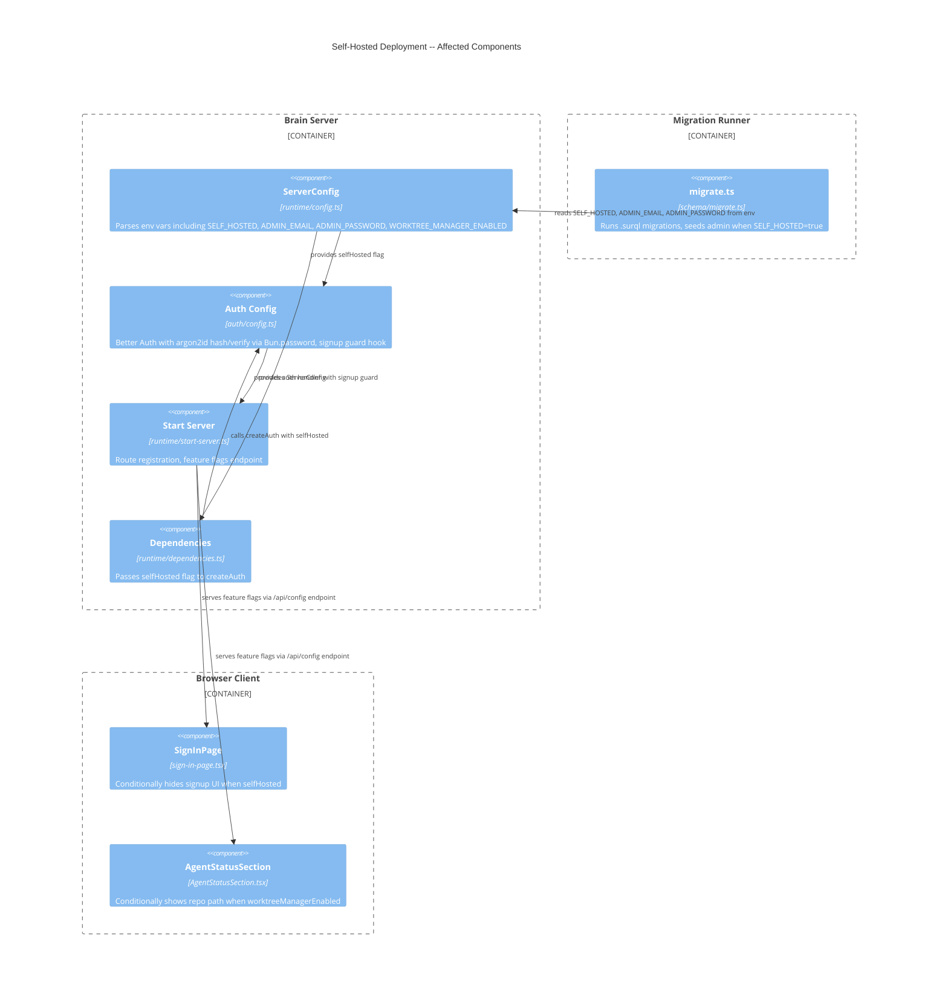

# Self-Hosted Deployment -- Architecture Design

## Feature Overview

Add environment-variable-driven self-hosted deployment configuration to Brain. Four user stories, all brownfield changes to existing components.

## User Story to Component Mapping

| Story | Primary Component | Secondary Components |
|-------|------------------|---------------------|
| US-001: Env Config | `runtime/config.ts` | `auth/config.ts` |
| US-002: Admin Seed | `schema/migrate.ts` | - |
| US-003: Disable Registration | `auth/config.ts` | `client/routes/sign-in-page.tsx`, `runtime/start-server.ts` |
| US-004: Worktree Flag | `client/components/graph/AgentStatusSection.tsx` | `runtime/start-server.ts` |

## C4 Component Diagram (L3) -- Self-Hosted Deployment



## Integration Design

### 1. Config Flow (US-001)

**Existing**: `loadServerConfig()` in `runtime/config.ts` parses env vars into `ServerConfig` type using `requireEnv()`/`optionalEnv()` helpers.

**Change**: Add four fields to `ServerConfig`:
- `selfHosted: boolean` -- parsed from `SELF_HOSTED` env var (default `false`)
- `adminEmail?: string` -- required when `selfHosted=true`, ignored otherwise
- `adminPassword?: string` -- required when `selfHosted=true`, ignored otherwise, never logged
- `worktreeManagerEnabled: boolean` -- parsed from `WORKTREE_MANAGER_ENABLED` (default `false`)

**Validation**: When `selfHosted=true`, fail fast if `ADMIN_EMAIL` or `ADMIN_PASSWORD` missing. Use existing `requireEnv()` pattern with conditional call.

### 2. Better Auth Argon2id Hashing (US-001)

**Existing**: `emailAndPassword: { enabled: true }` in `auth/config.ts` line 70-72. Better Auth uses bcrypt by default.

**Change**: Add custom `password.hash` and `password.verify` using `Bun.password.hash()`/`Bun.password.verify()` (defaults to argon2id). This ensures the migration seed and Better Auth login use the same algorithm.

**Why in US-001**: The hash config must exist before the seed runs (US-002). If the seed hashes with argon2id but Better Auth verifies with bcrypt, login fails.

### 3. Admin Seed During Migration (US-002)

**Existing**: `schema/migrate.ts` runs `.surql` files, tracks applied in `_migration` table, uses its own `requireEnv()`.

**Change**: After all `.surql` migrations complete, if `SELF_HOSTED=true`:
1. Read `ADMIN_EMAIL` and `ADMIN_PASSWORD` from env
2. Check if user exists: `SELECT * FROM person WHERE contact_email = $email`
3. If not found: hash password with `Bun.password.hash()`, create `person` record + `account` record matching Better Auth's expected schema (see migration `0010_better_auth_tables.surql`)
4. Log "Admin user seeded: {email}" or "Admin user already exists, skipping seed"
5. Never log the password

**Better Auth user schema** (from migration 0010):
- `person` table: `name`, `contact_email`, `email_verified`, `image`, `created_at`, `updated_at`
- `account` table: `person_id` (record<person>), `account_id` (= person id), `provider_id` = "credential", `password` (hashed), `created_at`, `updated_at`

**Idempotency**: Check by email before insert. Do not overwrite existing password hash on re-run.

### 4. Registration Disable (US-003)

**Existing**: Better Auth handles all `/api/auth/*` via catch-all route in `start-server.ts` (line 728). Signup goes to Better Auth's built-in `/api/auth/sign-up/email` endpoint. No custom signup route exists in Brain's server code.

**Change -- Server side**: Intercept signup requests at the Better Auth configuration level. When `selfHosted=true`, signup attempts must return HTTP 403 with `"Registration is disabled"` before any user record is created. The crafter decides the exact interception mechanism (Better Auth hooks, middleware, or route guard).

**Change -- Client side**: The `SignInPage` component (sign-in-page.tsx) has a toggle between "signin" and "signup" modes with a "No account? Create one" link. When self-hosted, hide the signup toggle and "Create one" link. The client needs the `selfHosted` flag.

### 5. Feature Flags Endpoint (US-003 + US-004)

**Existing**: No feature flags endpoint exists. The client has no mechanism to read server-side config.

**Change**: Add `GET /api/config` endpoint in `start-server.ts` that returns public (non-secret) feature flags:
```json
{
  "selfHosted": true,
  "worktreeManagerEnabled": false
}
```

This serves both US-003 (hide signup UI) and US-004 (hide repo path UI). Single endpoint, two consumers.

### 6. Worktree Manager Feature Flag (US-004)

**Existing**: `AgentStatusSection.tsx` renders a repo path banner unconditionally when `repoPath === undefined`. The workspace `repo_path` field already exists (migration 0016).

**Change**: Fetch `worktreeManagerEnabled` from `/api/config`. When `false`, hide the repo path banner entirely. When `true`, show existing behavior. UI-only change -- backend repo path endpoints remain functional regardless.

## Data Flow: Admin Seeding

```
bun migrate
  |
  v
migrate.ts reads SELF_HOSTED, ADMIN_EMAIL, ADMIN_PASSWORD from env
  |
  v
Runs all pending .surql migrations (existing behavior)
  |
  v
[if SELF_HOSTED=true]
  |
  v
SELECT person WHERE contact_email = $email
  |
  +-- exists --> log "already exists", skip
  |
  +-- not found -->
        |
        v
      Bun.password.hash(ADMIN_PASSWORD)  [argon2id]
        |
        v
      CREATE person { name: "Admin", contact_email, email_verified: true, ... }
        |
        v
      CREATE account { person_id, provider_id: "credential", password: hash, ... }
        |
        v
      log "Admin user seeded: {email}"
```

## Data Flow: Registration Guard

```
POST /api/auth/sign-up/email
  |
  v
Signup guard (hook or middleware)
  |
  +-- selfHosted=false --> proceed to Better Auth handler normally
  |
  +-- selfHosted=true --> return 403 "Registration is disabled"
```

## Data Flow: Client Feature Flags

```
Client app loads
  |
  v
GET /api/config
  |
  v
{ selfHosted: true, worktreeManagerEnabled: false }
  |
  +-- SignInPage: hides signup toggle when selfHosted=true
  |
  +-- AgentStatusSection: hides repo path when worktreeManagerEnabled=false
```

## Technology Decisions

| Component | Technology | Rationale |
|-----------|-----------|-----------|
| Password hashing | `Bun.password.hash()` (argon2id) | Built into Bun runtime, zero dependencies, argon2id default. MIT license (Bun). |
| Signup guard | Better Auth hook or route guard | Intercepts at auth layer before user creation. Crafter chooses mechanism. |
| Feature flags delivery | `GET /api/config` endpoint | Simple, cacheable, no SSR needed. Reusable for future flags. |
| Admin seed | Inline in `migrate.ts` | Runs at deployment time, idempotent, no runtime dependency. |

## Quality Attribute Strategies

| Attribute | Strategy |
|-----------|---------|
| Security | Argon2id hashing; password never logged; signup blocked at auth hook level (before user creation) |
| Reliability | Idempotent seed; fail-fast config validation; graceful default (non-self-hosted = open registration) |
| Maintainability | Single config source (`ServerConfig`); single feature flags endpoint; no new tables/migrations needed |
| Operability | Clear error messages for missing env vars; seed confirmation in migration output |

## Files Changed (Estimated)

| File | Change Type | Story |
|------|------------|-------|
| `app/src/server/runtime/config.ts` | Modify | US-001 |
| `app/src/server/auth/config.ts` | Modify | US-001, US-003 |
| `app/src/server/runtime/dependencies.ts` | Modify | US-001 |
| `schema/migrate.ts` | Modify | US-002 |
| `app/src/server/runtime/start-server.ts` | Modify | US-003, US-004 |
| `app/src/client/routes/sign-in-page.tsx` | Modify | US-003 |
| `app/src/client/lib/auth-client.ts` | Modify (or new hook) | US-003, US-004 |
| `app/src/client/components/graph/AgentStatusSection.tsx` | Modify | US-004 |

**Total: ~8 production files modified, 0 new files** (excluding tests)

## Rejected Simpler Alternatives

### Alternative 1: Hard-code signup disable via env-only (no auth hook)
- **What**: Add middleware in `start-server.ts` that blocks `/api/auth/sign-up/*` before it reaches Better Auth
- **Expected Impact**: 100% of signup blocking solved
- **Why Insufficient**: Fragile -- depends on knowing Better Auth's internal route paths. Better Auth's hook API is the supported extension point and survives version upgrades.

### Alternative 2: Inline feature flags in HTML template (no API endpoint)
- **What**: Server-render feature flags into `index.html` as a `<script>` tag with `window.__BRAIN_CONFIG__`
- **Expected Impact**: 100% of client flag delivery solved
- **Why Insufficient**: The app serves a static `index.html` (imported as `appHtml` in start-server.ts). Adding server-side templating requires changing the HTML serving pipeline. A simple JSON endpoint is less invasive and more testable.
