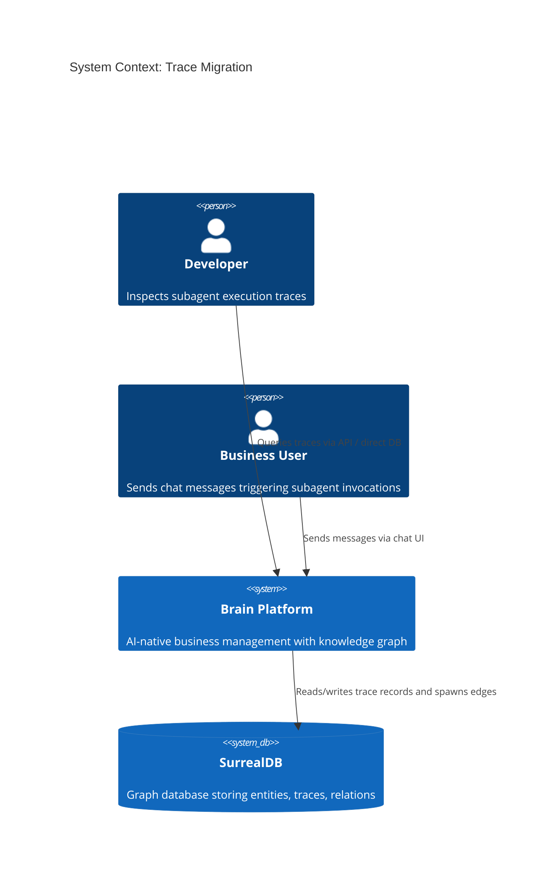
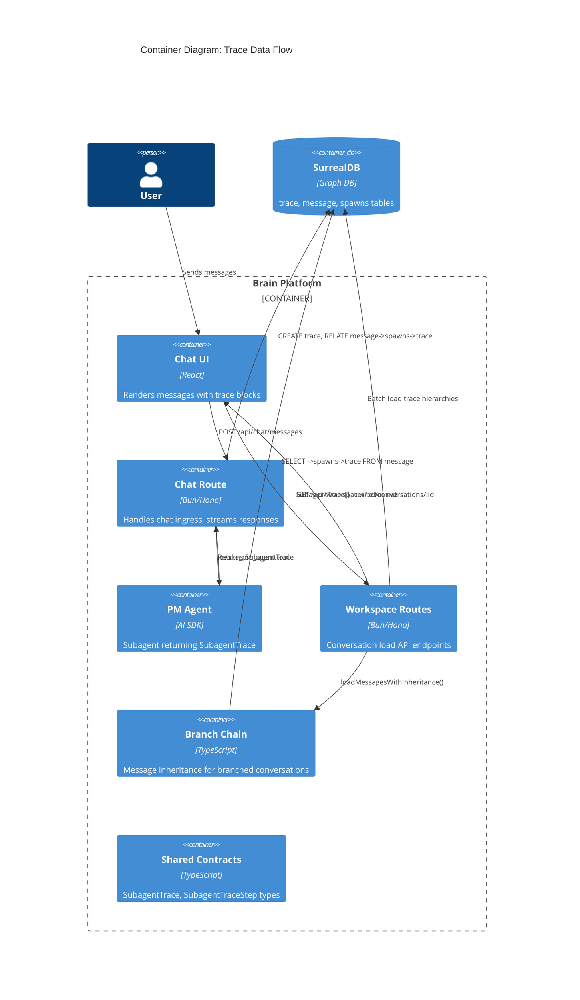
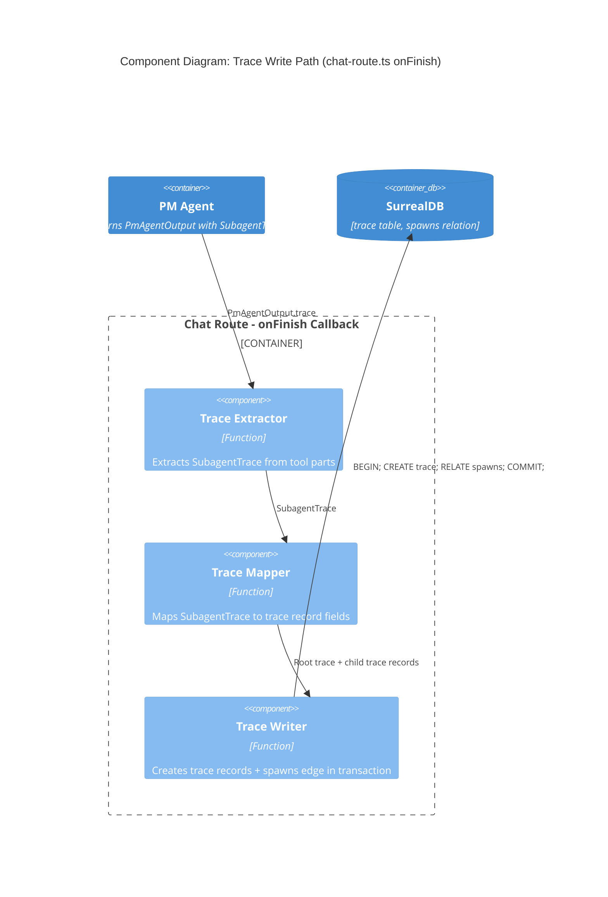
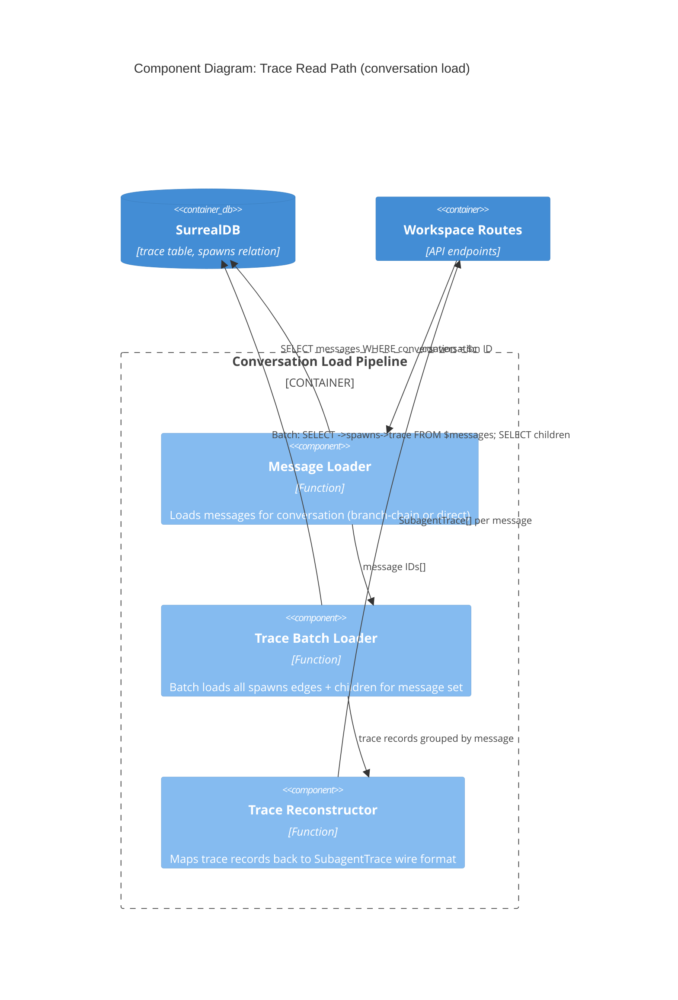

# Architecture Design: Trace Migration

**Feature**: Migrate subagent_traces from embedded arrays to normalized trace table
**GitHub Issue**: #126
**Wave**: DESIGN

## Business Drivers

1. **Forensic queryability** — Embedded arrays on `message` records are invisible to SurrealDB graph traversal. Developers cannot run `SELECT ->spawns->trace FROM message:xyz` to inspect execution trees.
2. **Trace unification** — Two parallel trace systems exist (embedded on message, graph-native trace table from intent flow). No correlation possible between them.
3. **Auditability** — Independent trace records enable compliance queries, temporal analysis, and cross-agent correlation that opaque blobs prevent.

## Quality Attribute Priorities

| Attribute | Priority | Rationale |
|-----------|----------|-----------|
| Maintainability | P0 | Single source of truth for all trace data |
| Auditability | P0 | Graph-traversable call trees for forensics |
| Testability | P1 | Independent records are directly queryable in tests |
| Performance | P2 | Batch loading pattern prevents N+1 regression |
| Backward Compatibility | N/A | Project policy: no backward compat, no data migration |

## Architecture Strategy

**Type**: Horizontal refactoring within existing modular monolith.

No new components, services, or abstractions are introduced. The change is a **persistence mapping migration** — the same data that was embedded as JSON blobs on message records is instead written as independent trace records with graph edges.

The system already has the target schema (trace table from migration 0023). The work is:
1. Define the `spawns` relation edge (schema)
2. Remap the write path (chat-route onFinish)
3. Remap the read paths (workspace-routes, branch-chain)
4. Update the acceptance test

## C4 System Context Diagram



## C4 Container Diagram



## C4 Component Diagram: Trace Write Path



## C4 Component Diagram: Trace Read Path



## Data Flow: Before vs After

### Before (Embedded)
```
PM Agent → SubagentTrace → chat-route → message.subagent_traces (embedded blob)
                                              ↓
workspace-routes ← SELECT subagent_traces FROM message ← SurrealDB
```

### After (Normalized)
```
PM Agent → SubagentTrace → chat-route → trace records (root + children)
                                       → spawns edge (message → root trace)
                                              ↓
workspace-routes ← SELECT →spawns→trace ← SurrealDB
                 ← SELECT children WHERE parent_trace = root
                 → reconstruct SubagentTrace wire format
```

## Key Design Decisions

### 1. Spawns relation edge over trace_id field on message

**Decision**: Use `RELATE message ->spawns-> trace` instead of adding a `trace_id` field to message.

**Rationale**: Graph traversal (`->spawns->trace`) is idiomatic SurrealDB, enables bidirectional queries, and doesn't require modifying the message schema (which already has many fields). The spawns edge can also carry metadata in the future (e.g., spawn order).

### 2. Batch trace loading (2-query pattern)

**Decision**: Load all traces for a conversation in 2 queries, not per-message.

**Pattern**:
```sql
-- Query 1: All root traces for message batch
LET $roots = SELECT *, <-spawns<-message AS source_message
  FROM trace WHERE <-spawns<-message INSIDE $message_ids;

-- Query 2: All children of those roots
SELECT * FROM trace WHERE parent_trace INSIDE $root_ids ORDER BY created_at ASC;
```

**Rationale**: Prevents N+1 query degradation on conversations with many messages. Two queries regardless of conversation size.

### 3. Transaction for trace creation

**Decision**: Wrap root trace creation + child traces + spawns edge in a single transaction.

**Rationale**: Atomic commit ensures no orphaned traces or edges. The transaction runs in onFinish (post-message), so it doesn't affect user-facing latency.

### 4. Graceful degradation on trace write failure

**Decision**: Catch and log trace creation errors without failing the message.

**Rationale**: The assistant message (with text content) is already persisted before onFinish runs. Trace data is supplementary — losing it is acceptable; losing the message is not. The inflight tracker ensures cleanup happens before connection close.

### 5. Wire format preservation

**Decision**: The API response shape (`SubagentTrace`, `SubagentTraceStep`) stays identical.

**Rationale**: Frontend renders from `subagentTraces` on the message response. Changing the wire format would require coordinated frontend changes with zero user benefit. The read path reconstructs the same shape from normalized records.

## Integration Points

| Component | Change Type | Risk |
|-----------|------------|------|
| `schema/migrations/0024_*.surql` | New file | Low — additive schema change |
| `schema/surreal-schema.surql` | Edit | Low — remove fields, add relation |
| `chat-route.ts` (onFinish) | Edit | Medium — hot path, must handle failures |
| `workspace-routes.ts` (2 endpoints) | Edit | Medium — API contract must be preserved |
| `branch-chain.ts` | Edit | Medium — inheritance must include traces |
| `subagent-traces.test.ts` | Rewrite | Low — test-only change |
| `contracts.ts` | No change | N/A — types preserved |
| `agents/pm/agent.ts` | No change | N/A — output type preserved |

## Non-Goals

- No changes to the PM agent's trace output format
- No changes to the frontend rendering logic
- No data migration of existing embedded traces (project policy)
- No changes to intent-related trace records (already in trace table)
- No new API endpoints — same conversation load endpoints, same wire format
