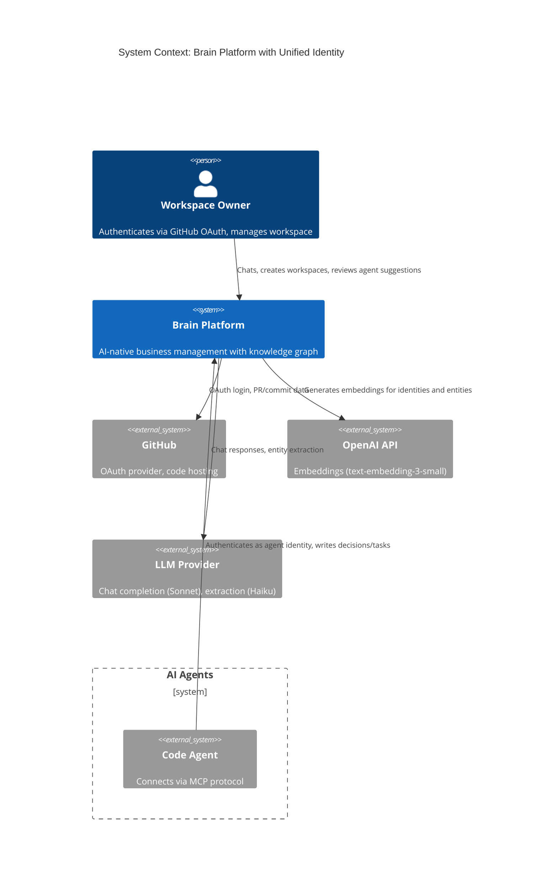
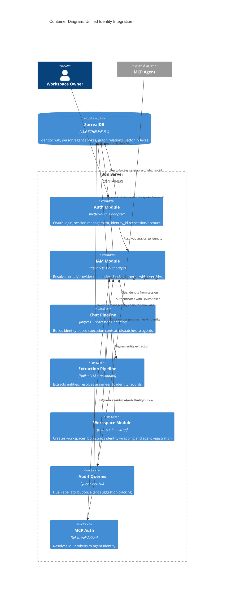
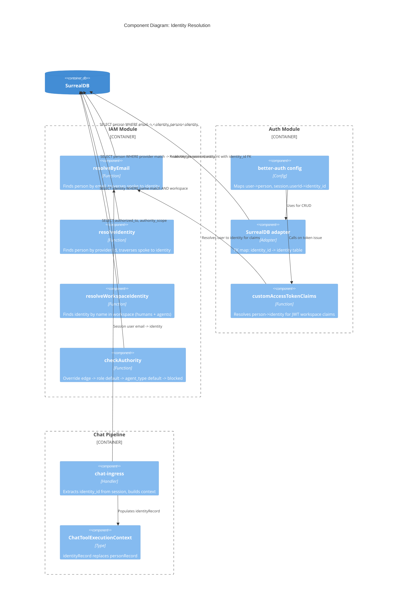

# Unified Identity Hub-and-Spoke: Architecture Design

## System Context and Capabilities

The unified identity feature introduces a hub-and-spoke identity model where both humans and agents are first-class citizens in the knowledge graph. This enables:

- **Unified audit trail**: Every graph mutation is attributed to an identity (human or agent)
- **Dual-label attribution**: Agent actions show both the agent actor and the accountable human via managed_by chain
- **Scoped authorization**: Per-identity permission overrides on top of role-based defaults
- **Agent mention resolution**: Extraction pipeline recognizes agent references in conversation

## C4 System Context (L1)



## C4 Container (L2)



## C4 Component (L3) -- Identity Resolution Subsystem

The identity resolution path is the most complex subsystem due to the spoke traversal, so it warrants L3 detail.



## Architecture Decisions

### Decision: Sequential story implementation (not parallel)

Stories US-UI-001 through US-UI-005 have strict sequential dependencies. The schema must exist (001) before identities can be created (002), identities must exist before edges migrate (003), edges must migrate before auth rewires (004), and all must be complete before audit queries work (005). This is inherently serial.

US-UI-006 (authorization) can begin after US-UI-002 but should follow US-UI-005 for integration simplicity.
US-UI-007 (extraction) depends on US-UI-003 and can follow US-UI-005.

### Decision: Identity bootstrap in workspace creation transaction

The identity wrapping and agent registration (US-UI-002) runs inside the workspace creation transaction. This ensures atomicity: a workspace always has at least one identity (the owner) and its template agent identities.

For existing workspaces, the bootstrap is idempotent and can run on next workspace load.

### Decision: better-auth user model stays mapped to person

The better-auth `user` model continues mapping to the `person` table. Email-based signup creates `person` records. The identity wrapping happens as a post-creation hook: after person is created, the bootstrap creates the identity hub and spoke edge.

This avoids modifying better-auth's internal user model, which assumes email/password fields on the user table.

### Decision: ChatToolExecutionContext carries identityRecord, not personRecord

The primary actor reference in tool execution context changes from `personRecord: RecordId<"person">` to `identityRecord: RecordId<"identity">`. This is a clean break (not an addition) because:

- All downstream consumers need identity, not person
- Carrying both creates ambiguity about which to use
- The person spoke can always be reached via graph traversal from identity when needed

### Decision: Extraction resolution searches identity table first

Post-migration, `resolveWorkspaceIdentity()` searches `identity.name` in the workspace directly, rather than searching person then traversing to identity. This:

- Handles both human and agent name resolution in one path
- Eliminates the extra spoke traversal for the common case
- Falls back to email-based person lookup only when direct name match fails

## Quality Attribute Strategies

### Auditability (primary driver)

- Every ownership field references `identity`, enabling single-table audit queries
- `managed_by` chain provides human accountability for all agent actions
- Dual-label format: actor identity + accountable human in query results

### Maintainability

- Hub-spoke pattern isolates type-specific fields in spoke tables
- New actor types (e.g., "system" for cron jobs) require only: new spoke table + spoke edge, no ownership field changes
- Authority system extensible via relation edges, no code changes for new permissions

### Security

- `humanPresent` flag derived from `identity.type = 'human'`, not assumed from session existence
- Authority override edges are workspace-scoped
- Fail-safe: no authority_scope match = blocked

### Performance

- Identity resolution adds 1 spoke traversal hop for email-based auth (negligible for auth-frequency operations)
- Direct identity.name search avoids the extra hop for extraction resolution
- HNSW index on identity.embedding enables vector search without additional infrastructure

## Deployment Architecture

No changes to deployment. The feature is entirely schema + application code:

1. Schema migration applied via `bun migrate` (creates tables, modifies fields, updates functions)
2. Application restart picks up new TypeScript types and resolution logic
3. Workspace bootstrap creates identity records on first load

## Implementation Roadmap

### Phase 1: MVP Foundation (US-UI-001 through US-UI-005)

```yaml
step_01:
  title: "Identity hub-spoke schema migration"
  story: US-UI-001
  description: "Create identity, agent, identity_person, identity_agent tables with indexes"
  acceptance_criteria:
    - "identity table accepts human, agent, system types; rejects invalid"
    - "agent table enforces managed_by as record<identity>"
    - "spoke edges traverse bidirectionally"
    - "HNSW index on identity.embedding"
    - "person.identities field removed"
  files_touched: 2  # migration script, surreal-schema.surql

step_02:
  title: "Identity wrapping and agent registration bootstrap"
  story: US-UI-002
  description: "Bootstrap logic: wrap persons in identity hubs, register template agents, idempotent"
  acceptance_criteria:
    - "Every person gets identity hub with spoke edge on workspace creation"
    - "Template agents created for management, code_agent, observer types"
    - "Each agent managed_by workspace owner identity"
    - "Running bootstrap twice produces no duplicates"
    - "New workspace creation includes identity bootstrap"
  files_touched: 3  # bootstrap module, workspace-routes.ts, tests

step_03:
  title: "Edge migration -- ownership and attribution fields"
  story: US-UI-003
  description: "Migrate record<person> fields to record<identity>, update relation constraints and graph functions"
  acceptance_criteria:
    - "All ownership fields accept record<identity>"
    - "owns and member_of relations use IN identity"
    - "Graph functions updated for identity traversals"
    - "TypeScript RecordId<'person'> in ownership contexts changed to RecordId<'identity'>"
    - "No remaining record<person> in ownership fields"
  files_touched: 8  # migration, schema, graph queries, extraction/person, entity-upsert, persist-extraction, entity-text, types

step_04:
  title: "Auth rewiring -- session and account to identity"
  story: US-UI-004
  description: "Rename person_id to identity_id on session/account/OAuth tables, update resolution and chat context"
  acceptance_criteria:
    - "Session and account use identity_id of type record<identity>"
    - "OAuth tables (oauthClient, oauthAccessToken, oauthRefreshToken, oauthConsent) userId references identity"
    - "resolveByEmail returns RecordId<'identity'>"
    - "Chat ingress builds context with identityRecord"
    - "humanPresent derived from identity.type"
  files_touched: 10  # migration, schema, iam/identity, auth/config, auth/adapter, chat-ingress, chat-processor, handler, tools/types, mcp/auth

step_05:
  title: "Dual-label audit trail queries"
  story: US-UI-005
  description: "Implement managed_by chain resolution and dual-label attribution in entity detail"
  acceptance_criteria:
    - "Agent suggestions query returns actor + accountable human"
    - "Human actions show self as accountable"
    - "Entity detail tool returns identity type context"
    - "Mixed human/agent results handled correctly"
  files_touched: 3  # graph query module, get-entity-detail tool, types
```

### Phase 2: Authorization (US-UI-006)

```yaml
step_06:
  title: "Role-based authority with per-identity overrides"
  story: US-UI-006
  description: "Add role field to authority_scope, authorized_to override edges, updated checkAuthority"
  acceptance_criteria:
    - "Authority resolves: override -> role default -> blocked"
    - "Human identity bypasses authority"
    - "Per-identity override takes precedence over role"
    - "No role and no override returns blocked"
  files_touched: 3  # migration, authority.ts, types
```

### Phase 3: Extraction Enhancement (US-UI-007)

```yaml
step_07:
  title: "Agent mention resolution in extraction pipeline"
  story: US-UI-007
  description: "Extend extraction to recognize agent role/name mentions, resolve to identity with confidence threshold"
  acceptance_criteria:
    - "Role mentions ('the PM agent') resolve to identity"
    - "Name mentions ('Code Agent') resolve to identity"
    - "Ambiguous mentions produce no false positives"
    - "Resolution scoped to current workspace"
  files_touched: 3  # extraction/identity-resolution, extraction/prompt (optional), extraction/persist
```

### Roadmap Efficiency Check

- Total steps: 7
- Estimated production files: 20 unique files
- Step ratio: 7/20 = 0.35 (well under 2.5 threshold)
- No identical-pattern steps detected

## Rejected Simpler Alternatives

### Alternative 1: Add agent_type field to person table

- **What**: Add `type: 'human' | 'agent'`, `agent_type`, `managed_by` directly to person table.
- **Expected impact**: 70% -- enables agent ownership but pollutes person semantics.
- **Why insufficient**: `person` has UNIQUE email index, email-based resolution, and better-auth user model mapping. Agents don't have emails. Would require making contact_email optional (breaking existing constraints) and adding conditional logic everywhere.

### Alternative 2: Use agent_session as the agent identity

- **What**: Promote existing `agent_session` records to serve as identity references.
- **Expected impact**: 40% -- agent_session is per-session, not per-agent. Multiple sessions per agent type.
- **Why insufficient**: An agent's identity persists across sessions. `agent_session` represents a single work session, not an enduring identity. Ownership should survive session termination.

### Why the hub-spoke solution is necessary

1. Simple alternatives fail because SurrealDB SCHEMAFULL cannot enforce conditional field requirements on a single table, and the person table has semantic/structural constraints (UNIQUE email, better-auth model mapping) incompatible with agent records.
2. Complexity justified by: single traversal point for all attribution queries, clean type-specific schema enforcement via spoke tables, and extensibility for future actor types without ownership field changes.

## Peer Review

```yaml
review_id: "arch_rev_20260309_001"
reviewer: "solution-architect-reviewer"
iteration: 2
approval_status: "approved"
critical_issues_count: 0
high_issues_count: 0

revisions_applied:
  - issue: "OAuth table migration not covered in step_04 AC"
    severity: "high"
    fix: "Added OAuth tables (4 tables) to step_04 acceptance criteria"
  - issue: "ADR-010 missing quality attribute trade-off matrix"
    severity: "medium"
    fix: "Added Quality Attribute Impact table and Observability Note to ADR-010"

quality_gates:
  requirements_traced: PASS  # all 7 stories mapped to components
  component_boundaries: PASS  # 10 components with clear responsibilities
  technology_adrs: PASS  # ADR-010 with 3 alternatives
  quality_attributes: PASS  # auditability, maintainability, security, performance, testability, observability
  dependency_inversion: PASS  # identity resolution is a port; auth adapter wraps better-auth
  c4_diagrams: PASS  # L1 + L2 + L3 (identity resolution)
  integration_patterns: PASS  # spoke traversal, managed_by chain, bootstrap hook
  oss_preference: PASS  # no new dependencies
  roadmap_efficiency: PASS  # 7 steps / 20 files = 0.35
  ac_behavioral: PASS  # no implementation coupling
  peer_review: PASS  # iteration 2 approved
```

## Cross-Reference: Requirements to Components

| Story | Components Affected |
|-------|-------------------|
| US-UI-001 | Schema Layer |
| US-UI-002 | Identity Bootstrap, Workspace Module |
| US-UI-003 | Schema Layer, Extraction Pipeline, Graph Functions, Chat Pipeline (types) |
| US-UI-004 | IAM, Auth Adapter/Config, Chat Pipeline, MCP Auth, Schema Layer |
| US-UI-005 | Audit Queries, Chat Tools |
| US-UI-006 | Authority System, Schema Layer |
| US-UI-007 | Extraction Pipeline |
