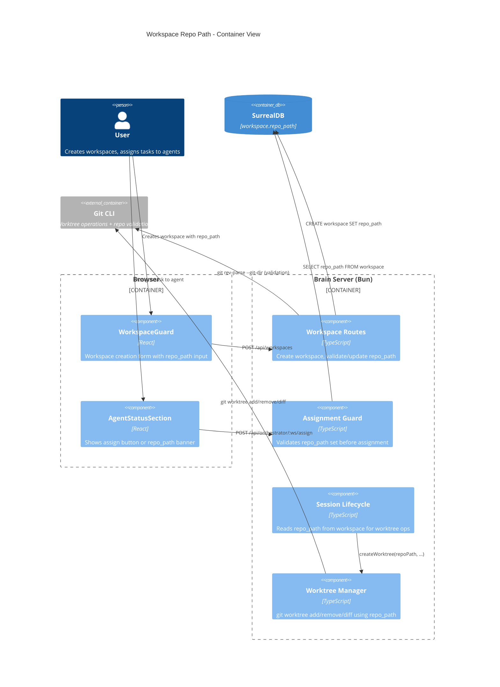
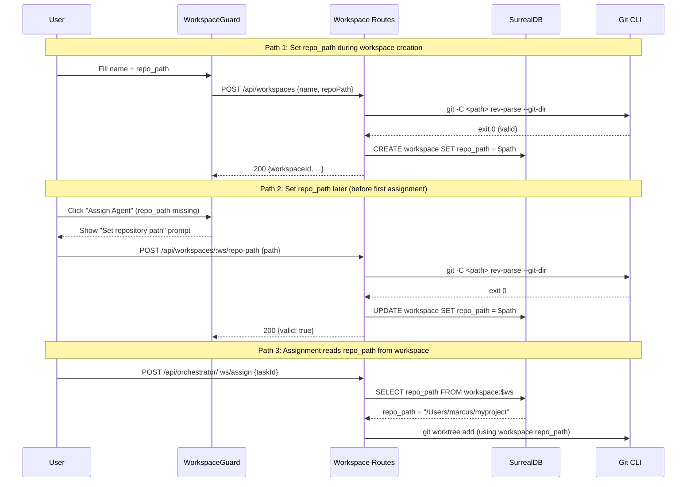

# Architecture Design: Workspace Repository Path

## Problem

The coding agent orchestrator creates git worktrees for task isolation, but `repoRoot` is hardcoded to `process.cwd()` in `start-server.ts:71`. This means:
- Every workspace assumes the same repo (the server's working directory)
- Multi-workspace setups pointing at different repos are impossible
- There's no UI for the user to specify which repo a workspace operates on

## Decision: Per-Workspace `repo_path`

Store `repo_path` as an optional field on the workspace entity. Resolve it at assignment time instead of at server startup.

### Quality Attributes

| Attribute | Priority | How addressed |
|-----------|----------|---------------|
| Correctness | High | Each workspace targets the right repo |
| Simplicity | High | Single field addition, follows existing patterns |
| Fail-fast | High | Assignment guard rejects early if repo_path missing or invalid |

## Component Boundaries

This feature touches 6 existing layers. No new components are introduced.

```
┌─────────────────────────────────────────────────────────┐
│ Client                                                   │
│                                                          │
│  WorkspaceGuard.tsx ── repo_path text input (creation)   │
│  use-workspace.ts  ── pass repo_path in create request   │
│  AgentStatusSection ── show banner if repo_path missing  │
│                                                          │
├─────────────────────────────────────────────────────────┤
│ Shared Contracts                                         │
│                                                          │
│  CreateWorkspaceRequest  ── add repoPath?: string        │
│  WorkspaceBootstrapResponse ── add repoPath?: string     │
│                                                          │
├─────────────────────────────────────────────────────────┤
│ Server: Workspace                                        │
│                                                          │
│  parsing.ts          ── validate repoPath in parser      │
│  workspace-routes.ts ── persist repo_path on CREATE      │
│                      ── new: validate-repo-path endpoint │
│                      ── new: update-repo-path endpoint   │
│                                                          │
├─────────────────────────────────────────────────────────┤
│ Server: Orchestrator                                     │
│                                                          │
│  assignment-guard.ts ── add REPO_PATH_REQUIRED check     │
│  session-lifecycle.ts ── read repo_path from workspace   │
│  routes.ts / wiring  ── remove static repoRoot, resolve  │
│                         per-workspace from DB             │
│                                                          │
├─────────────────────────────────────────────────────────┤
│ Schema                                                   │
│                                                          │
│  Migration 0018: DEFINE FIELD repo_path ON workspace     │
│                  TYPE option<string>                      │
│                                                          │
├─────────────────────────────────────────────────────────┤
│ Runtime                                                  │
│                                                          │
│  start-server.ts ── keep process.cwd() as fallback for   │
│                     non-orchestrator routes only          │
│                                                          │
└─────────────────────────────────────────────────────────┘
```

## C4 Container Diagram



## C4 Component Diagram: Data Flow



## Change Inventory

### 1. Schema Migration (`0018_workspace_repo_path.surql`)

```sql
BEGIN TRANSACTION;
DEFINE FIELD OVERWRITE repo_path ON workspace TYPE option<string>;
COMMIT TRANSACTION;
```

### 2. Shared Contracts (`contracts.ts`)

```typescript
// Add to CreateWorkspaceRequest
export type CreateWorkspaceRequest = {
  name: string;
  description?: string;
  repoPath?: string;       // <-- new
};

// Add to WorkspaceBootstrapResponse
export type WorkspaceBootstrapResponse = {
  // ... existing fields ...
  repoPath?: string;        // <-- new
};
```

### 3. Server: Repo Path Validation

New function in `workspace-routes.ts`:

```typescript
async function validateRepoPath(path: string, shellExec: ShellExec): Promise<boolean> {
  const result = await shellExec("git", ["-C", path, "rev-parse", "--git-dir"], path);
  return result.exitCode === 0;
}
```

### 4. Server: New Endpoints

| Method | Path | Purpose |
|--------|------|---------|
| `POST` | `/api/workspaces/:workspaceId/repo-path` | Set/update repo_path with validation |

Request: `{ path: string }`
Response: `{ valid: true }` or `400 { error: "..." }`

### 5. Assignment Guard: New Check

Add between step 3 (workspace membership) and step 4 (status eligibility):

```
3.5. Repo path configured — workspace.repo_path must be a non-empty string
     Error: REPO_PATH_REQUIRED (400)
```

### 6. Orchestrator Wiring: Per-Workspace Resolution

`wireOrchestratorRoutes` currently takes a static `repoRoot: string`. Change `createSession` to:
1. Read `repo_path` from workspace record (already fetched in assignment guard)
2. Pass it as `repoRoot` to session lifecycle
3. Remove static `repoRoot` from `OrchestratorWiringDeps`

### 7. UI: WorkspaceGuard Form

Add text input for "Repository path" below description textarea. Optional, with placeholder showing example path format.

### 8. UI: AgentStatusSection Banner

When task is assignable but workspace has no `repo_path`, show:
> "Set a repository path for this workspace before assigning tasks to agents."
> [Set Repository Path] button

## Risks

| Risk | Mitigation |
|------|------------|
| Path becomes stale (repo moved/deleted) | Validate at assignment time, not just at save time |
| Path traversal / injection | Validate path is absolute, exists, and passes `git rev-parse` |
| Active sessions during path change | Block repo_path updates while any orchestrator session is active |
